# Architecture Advanced

## 架构师岗位职责

负责产品及项目的整体架构设计，开发系统核心模块

规划业务架构的合理演进，能够制定合理的开发工作计划并实施

制定相关技术开发规范，对通用技术进行整理，提高技术复用

优化现有架构，提出合理可行的重构方案

对新技术保持非常高的敏感度，同时有能力进行评估并合理引入


## 讲师：李智慧

前阿里 & Intel 架构师，《大型网站技术架构》作者

李智慧老师现任某大厂首席架构师，他是 Apache Spark 源码贡献者，长期从事大型网站架构、大数据的研发工作，曾担任阿里巴巴技术专家、Intel 亚太研发中心架构师、WiFi 万能钥匙 CTO ，著有畅销书《大型网站技术架构：核心原理与案例分析》。

李智慧老师不仅实战经验丰富，并且还很会讲课，有超过 6 年的线下咨询、企业架构内训经验，曾经作为外聘教师为浙江大学硕士研究生开展《面向对象高级编程》课程，备受好评。老师出品了极客时间《从 0 开始学大数据》《后端技术面试 38 讲》，目前已有 2w+ 学员加入。


## 课程大纲

### **Week 1：架构方法：架构师如何做架**

#### **教学目标：**

1. 了解架构训练营的课程设计思路及内容综述。
2. 对架构师以及架构工作有一个深入透彻的理解。
3. 学习软件架构建模的一般方法和工具
4. 学习软件架构设计文档的写作模式

#### **架构工作中的痛点：**

1. 缺乏全局性思维能力
2. 缺乏超越普通开发者的视野和格局
3. 缺乏知识的全面性
4. 对软件开发本质和挑战缺乏理解
5. 缺乏做一个完整的软件架构的方法，不知道该从何下手做架构设计。
6. 缺乏软件建模的能力与技巧，不会灵活应用 UML 进行软件设计。
7. 无法通过设计文档清晰阐述自己的设计思想和方案。
8. 不清楚技术架构和技术团队管理的关系。

#### **通过学习掌握的核心能力：**

1. 对架构工作有一个正确、透彻的理解，开拓视野。
2. 使用UML进行软件设计与建模的能力。
3. 软件设计文档的写法与应用。

#### **详细内容：**

1. 架构师职责：架构工作中都要面临哪些方面的难题？

- 1. 架构师不同的职责划分，以及它们之间的联系。
  2. 训练营的课程内容综述
  3. 形形色色的架构师们

2. 架构师面试：大厂Offer该如何获取？

- 1. 互联网大厂JD解读
  2. 职责要求
  3. 技能要求
  4. 软实力要求
  5. 训练营内容与大厂JD对应关系以及学习重点
  6. 架构师技术面试套路分析

3. 架构概论：你能描述清楚软件架构与架构吗？

- 1. 对软件架构与架构师的一般误解有哪些？
  2. 什么是架构？什么是软件架构？
  3. 架构的一般方法是什么？
  4. 如何做架构？

4. 4+1视图模型：软件开发的本质是什么？如何进行软件架构设计？

- 1. 什么是软件建模？
  2. 为什么要进行软件建模？
  3. 软件建模的方法论
  4. 软件架构设计的成果和产出是什么？

5. 软件建模语言：如何使用UML进行软件架构设计与建模？

- 1. UML建模方法概述
  2. UML静态建模
  3. UML动态建模

6. 软件设计文档：架构师应该如何输出自己的架构设计？

- 1. 如何输出一份有干货的软件设计文档？
  2. 软件设计文档模板

7. 案例：我如何利用UML成为软件架构师？


### **Week 2：框架设计：开发框架是架构师实现自己架构目标的主要手段**

#### **教学目标：**

1. 掌握软件设计的基本原则。
2. 了解框架、工具、组件等概念的区别于应用方式。
3. 掌握开发框架的一般思路与方法。

#### **架构工作中的痛点：**

1. 架构师如何建立自己的技术威信，让技术人员都听他的。
2. 架构师如何掌控软件的架构，保证几十、数百人共同开发的软件不会陷入混乱。

#### **通过学习掌握的核心能力：**

1. 开发一个软件框架的方法、思想、步骤和技巧。
2. 软件设计原则的理解与应用能力。

#### **详细内容：**

1. 软件开发简史：你还在用面向对象编程语言写面向过程的代码吗？

- 1. 计算机与软件编程的历史
  2. 面向对象编程范式的本质分析

2. 框架概述：什么是软件框架，如何开发一个软件框架？

- 1. 软件框架的基本概念，框架与工具的区别。
  2. 如何通过框架掌控软件开发过程。
  3. 开发软件框架的基本方法和原则。

3. 开闭原则：如何不修改代码却能实现需求变更？

- 1. 什么是开闭原则？
  2. 违反开闭原则的代码分析
  3. 策略模式实现开闭原则
  4. 适配器模式实现开闭原则
  5. 观察者模式实现开闭原则

4. 依赖倒置原则：如何不调用代码却能复用代码的功能？

- 1. 什么是依赖倒置原则
  2. 为什么说框架必须遵循依赖倒置原则
  3. 实现依赖倒置原则的代码案例分析

5. 其他软件设计原则：如何用好多态特性设计优雅的软件架构？

- 1. 里氏替换原则
  2. 单一职责原则
  3. 接口隔离原则

6. 案例：反应式编程框架Flower的设计案例分析

- 1. 什么是反应式编程，反应式编程解决什么问题
  2. 反应式编程框架Flower的设计原理分析


### **Week 3：代码重构：代码重构能力是架构师最基本的能力**

#### **教学目标：**

1. 掌握常用软件设计模式
2. 了解常用开源软件中的设计模式

#### **架构工作中的痛点：**

1. 架构师应该写什么样的代码？
2. 架构师如何指导工程师开发优雅的代码？
3. 什么样的情况下该进行代码重构了？
4. 架构师如何如何组织研发团队进行代码重构？

#### **通过学习掌握的核心能力：**

1. 灵活应用设计模式的能力
2. 利用设计模式重构代码的能力

#### **详细内容：**

1. 代码腐坏：糟糕的代码会带来什么样的烦恼？

- 1. 一个代码因需求变更而逐渐腐坏的例子
  2. 糟糕的代码有哪些特点？
  3. 优雅的代码应该是什么样子？

2. 设计模式基础：如何使用设计模式优化代码？

- 1. 设计模式在软件开发中的地位
  2. 用工厂模式实现开闭原则
  3. 建造模式
  4. 原型模式
  5. 单例模式
  6. 适配器模式

3. 案例：JUnit 的设计模式分析：为什么说 JUnit 是设计模式样本？

- 1. 单元测试需求分析
  2. JUnit 中的模板方法模式
  3. JUnit 中的策略模式
  4. JUnit 中的装饰器模式
  5. JUnit 中的组合模式
  6. 实现依赖倒置原则的代码案例分析

4. 案例：我在Intel开发的大数据仓库引擎Panthera设计模式分析：设计模式如何拯救我的工作？

- 1. 大数据仓库架构设计分析
  2. Panthera中的组合模式分析
  3. Panthera中的装饰器模式分析

 

 

### **Week 4：系统架构：系统架构知识是架构师的常识而不是能力**

#### **教学目标：**

1. 理解高并发系统的历史演化过程
2. 理解高并发系统的架构模式
3. 理解高并发系统架构的常用技术解决方案

#### **架构工作中的痛点：**

1. 对大规模高并发系统的整体架构缺乏宏观的认知
2. 对大规模高并发系统的技术挑战缺乏直观认知和知识背景

#### **通过学习掌握的核心能力：**

1. 使高并发系统架构知识成为自己的常识，并本能地应用到自己的架构实践中。
2. 训练系统架构设计时平衡选择技术方案的能力。

#### **详细内容：**

1. 系统架构概述：高并发系统架构面临怎样的挑战？

- 1. 高并发挑战
  2. 高可用挑战
  3. 安全性挑战
  4. 快速迭代的挑战
  5. 垂直伸缩与水平伸缩的策略选择

2. 系统架构体系：高并发系统经历了怎样的演化历程？

- 1. 早期互联网系统架构
  2. 高并发系统架构的演化历程
  3. 互联网企业的技术思想是如何形成的

3. 系统架构模式概述：系统架构设计需要关注哪些方面？

- 1. 高性能架构模式
  2. 高可用架构模式
  3. 可伸缩架构模式
  4. 可扩展架构模式
  5. 安全架构模式

4. 分布式技术体系：一个大规模分布式系统架构包含了哪些技术？

- 1. 前端架构技术体系
  2. 服务端架构技术体系
  3. 存储架构技术体系
  4. 监控与运维技术体系
  5. 大数据技术体系

5. 案例：维基百科架构设计案例分析：20人团队如何开发、运维全球第六大互联网站？

- 1. 维基百科业务背景与技术特点分析
  2. 维基百科的整体系统架构分析
  3. 维基百科的高性能架构分析

6. 案例：淘宝架构演化案例分析：为什么说淘宝最初也很low？

- 1. 淘宝业务变迁历史分析
  2. 淘宝早期的几次重要技术架构重构分析

 

 

### **Week 5-6：技术选型：技术选型能力反映了架构师的综合水平**

#### **教学目标：**

1. 掌握常用分布式技术的架构原理
2. 理解各种分布式技术的优缺点
3. 理解常用分布式技术的产品特点与选型依据

#### **架构工作中的痛点：**

1. 对于常用的分布式技术只知道怎么用，却不理解其内部技术原理
2. 每种分布式技术都有很多产品技术方案，不知道该如何选型

#### **通过学习掌握的核心能力：**

1. 针对不同业务场景，选择合适技术方案的能力，以及在技术方案之中，选择合适产品的能力
2. 超越缓存、消息队列、负载均衡、数据分库分片、NoSQL、搜索引擎等各种分布式技术会用的阶段，理解其内部原理，达到可以优化、修改其代码的能力，必要时，可自己开发同类产品的能力

#### **详细内容：**

1. 分布式缓存架构：为什么说缓存是改善性能的杀手锏？

- 1. 缓存的核心原理与应用场景分析
  2. 缓存的分类
  3. CDN缓存原理分析
  4. 反向代理缓存原理分析
  5. 对象缓存原理分析
  6. 分布式对象缓存的访问模型
  7. 分布式对象缓存的应用场景与注意事项
  8. 缓存失效LRU算法分析
  9. 分布式对象缓存集群扩容的挑战与一致性Hash算法
  10. Memcached与Redis对比与技术选型分析

2. 消息队列架构：如何避免系统故障传递？

- 1. 消息队列的应用场景分析
  2. 消息队列的架构方案
  3. 消息队列架构优缺点分析
  4. Kafka、ActiveMQ等常用消息队列产品选型分析

3. 负载均衡架构：如何用十行代码写一个负载均衡服务器？

- 1. 负载均衡架构的技术原理
  2. 负载均衡的HTTP重定向实现技术
  3. 负载均衡的DNS解析实现技术
  4. 负载均衡的反向代理实现技术
  5. 负载均衡的IP路由实现技术
  6. 负载均衡的链路层路由实现技术
  7. 负载均衡的常用路由算法分析

4. 分布式关系数据库架构？数据库分库、分片有什么区别？

- 1. MySQL主从复制实现分布式架构的技术原理
  2. 数据库分库设计
  3. 关系数据库分片技术实现方案
  4. 分布式数据库中间件MyCat实现原理
  5. 分布式数据库复制、分片混合部署架构方案
  6. 分布式数据库集群扩容技术方案

5. NoSQL数据库架构？NoSQL数据库当初是怎么火起来的？

- 1. CAP原理分析
  2. 分布式系统的数据一致性挑战
  3. 应对数据一致性挑战的几种策略
  4. Cassandra实现数据的技术方案
  5. HBase技术架构与应用分析

6. 分布式锁架构：ZooKeeper是如何实现分布式强一致性的？

- 1. 什么是分布式系统脑裂？
  2. CAP原理再分析
  3. ZooKeeper分布式强一致性原理
  4. ZooKeeper应用场景分析

7. 搜索引擎架构：为什么说成功的架构必须要把握住细节？

- 1. 互联网爬虫系统技术原理
  2. 倒排索引技术原理
  3. Elasticsearch技术原理分析

8. 案例：我在阿里巴巴开发NoSQL系统Doris的设计案例分析：在互联网大厂开发基础技术产品是什么体验？

- 1. 开发 Doris 的背景
  2. Doris 架构设计分析


### **Week 7-9：性能优化：性能优化是架构师展现自己技术全面性的时刻**

#### **教学目标：**

1. 理解主要性能指标的意义
2. 了解性能测试的关键过程
3. 掌握一般性能分析方法和性能优化的思考策略
4. 理解基础技术背后的原理及其对性能的影响

#### **架构工作中的痛点：**

1. 遇到性能问题无从下手，无法量化性能问题的严重程度，也无法衡量优化后的效果
2. 解决性能问题没有系统、全面的解决办法，8只能刻舟求剑套用别人有限的技术方案，解决问题主要靠运气
3. 基本功不扎实，操作系统、文件系统、网络通信、数据库各种基础设施对性能的影响一知半解，解决问题的时候各种混乱

#### **通过学习掌握的核心能力：**

1. 全面掌握系统性能度量标准，性能测试方法的能力
2. 全面分析系统性能以及解决对策的能力
3. 融会贯通各种基础技术对性能影响的能力

#### **详细内容：**

1. 系统性能的主要技术指标：什么情况下性能指标好的系统反而感觉更慢？

- 1. 主观性能指标与客观性能指标
  2. 响应时间
  3. 吞吐量
  4. 并发数
  5. 性能计数器

2. 系统性能测试与分析：架构师如何在省钱与不出事之间走钢丝？

- 1. 性能测试的主要方式
  2. 性能测试
  3. 负载测试
  4. 压力测试
  5. 稳定性测试

3. 操作系统与程序运行时性能分析：程序是如何运行又是如何崩溃的？

- 1. 操作系统架构原理
  2. 操作系统多任务运行机制
  3. 操作系统资源消耗与性能相关性分析

4. 数据结构与内存对象访问性能分析：程序中如何选择合适的数据结构？

- 1. 常用数据结构以及内存存储访问原理
  2. Hash表原理与性能分析
  3. 红黑树原理与性能特性

5. 文件 I/O 性能优化与分析：什么办法可以把硬盘的读写速度提高十万倍？

- 1. 机械硬盘与SSD硬盘性能分析
  2. Linux文件系统架构
  3. 独立硬盘冗余阵列 RAID 如何实现文件高性能读写
  4. 分布式文件系统架构原理

6. TCP/IP协议分析与网络 I/O 优化：互联网应用一次请求响应涉及哪些网络通信？

- 1. TCP/IP协议分析
  2. HTTP协议分析
  3. 异步网络 I/O 及 epool 实现原理

7. 数据库原理与SQL性能分析：应用程序提交SQL为什么要用预编译？

- 1. 数据库架构原理
  2. 数据库连接与SQL提交方式对性能的影响
  3. 数据库文件存储原理与索引的性能影响
  4. 常见SQL性能问题分析

8. JVM虚拟机原理与垃圾回收性能分析：Java垃圾回收为什么那么慢？

- 1. JVM组成架构
  2. JVM程序运行机制
  3. JVM垃圾回收机制与不同回收算法性能分析
  4. JVM常用命令与性能分析方法

9. 大规模分布式系统性能优化的7层协议及案例分析：性能优化该从何着手？

- 1. 数据中心性能优化
  2. 硬件性能优化
  3. 操作系统性能优化
  4. 虚拟机性能优化
  5. 中间件性能优化
  6. 系统架构性能优化
  7. 代码性能优化

10. 案例：阿里巴巴秒杀系统架构设计案例分析：架构师如何应对突发的访问高峰？

- 1. 电商秒杀系统的性能挑战
  2. 秒杀架构设计分析
  3. 秒杀系统性能分析与结果验证

 

### **Week 10 模块分解：模块分解能力是架构师最核心的经验与优势**

#### **教学目标：**

1. 了解微服务架构的核心关键和挑战
2. 掌握微服务架构最佳实践方案
3. 掌握微服务框架及RCP框架设计方法
4. 了解领域模型设计方法

#### **架构工作中的痛点：**

1. 想要上微服务，却不知该从何下手
2. 上了微服务，系统变得更加难以维护，不知道哪里出了问题
3. 实现业务就是CRUD，一点技术含量没有，不知道该如何突破和提高

#### **通过学习掌握的核心能力：**

1. 真正掌控微服务架构的设计能力
2. 领域分析和设计的能力
3. 微服务框架、RPC框架设计、开发能力

#### **详细内容：**

1. 微服务架构：为什么现在微服务架构现在遇到这么多的失败和困难

- 1. 我在阿里巴巴经历的微服务架构重构
  2. 微服务架构设计最困难的是模块分解
  3. 微服务架构落地的最佳实践

2. 模块分解的设计原则：模块的边界在哪里？

- 1. 模块化设计的历史溯源
  2. 模块设计的聚合性原则
  3. 模块设计的依赖性原则

3. 微服务框架Dubbo设计原理与RPC实现分析：如何开发自己的微服务框架？

- 1. WebService架构分析
  2. Dubbo架构设计分析
  3. RPC框架分析

4. 领域驱动设计：架构师如何才能越老越吃香？

- 1. 领域模型模式
  2. 充血模型与贫血模型
  3. 领域驱动设计最佳实践

5. ServiceMesh架构、中台架构、事件驱动架构与网关架构：如何实现系统可扩展？

- 1. ServiceMesh架构分析分析
  2. 中台架构分析
  3. 事件驱动架构分析
  4. 网关架构分析


### **Week 11：安全稳定：系统安全稳定高可用是架构师最主要的KPI**

#### **教学目标：**

1. 了解系统高可用的度量标准及故障管理方法
2. 掌握高可用设计的主要方法与实现原理
3. 掌握常见系统攻击手段与防护策略

#### **架构工作中的痛点：**

1. 系统经常出故障、不稳定，不知道是哪里的问题
2. 解决系统可用性问题，东一下、西一下，没有完整的解决思路和方案
3. 不知道该如何保障系统安全性

#### **通过学习掌握的核心能力：**

1. 系统设计时，全面考虑实现高可用的架构能力
2. 系统故障时，全面分析故障原因，并解决可用性问题的能力
3. 安全性架构原理与思路

#### **详细内容：**

1. 高可用系统的度量标准：如何通过KPI提高系统可用性？

- 1. 可用性度量标准
  2. 系统故障响应流程
  3. 技术团队故障考核方案

2. 系统高可用架构方案：架构师如何避免因为系统崩溃而半夜加班？

- 1. 冗余设计与失效转移
  2. 限流、降级
  3. 服务熔断设计
  4. 高可用的事务
  5. 异步架构实现故障隔离
  6. 异地多活多机房架构

3. 系统高可用运维：如何避免系统发布引起故障？

- 1. 代码分支管理
  2. 发布管理
  3. 预发布管理

4. 系统安全架构：架构师如何避免因数据泄密而背锅？

- 1. 网络攻击与防护
  2. 数据加密与解密
  3. 系统安全防火墙


### **Week 12-13：数据应用：会用数据的架构师可以超越开发及架构**

#### **教学目标：**

1. 掌握Hadoop大数据技术原理与应用
2. 掌握Spark技术原理与应用
3. 掌握Flink等大数据流计算原理与应用
4. 掌握Hive等大数据仓库原理与应用的能力
5. 掌握数据分析的原理与应用
6. 掌握数据挖掘与机器学习的原理与应用

#### **架构工作中的痛点：**

1. 对大数据略知一二，不成体系也无法在实践中应用
2. 技术架构成熟的公司环境中，如何寻找个人新的成长点与职业发展机会

#### **通过学习掌握的核心能力：**

1. 大数据开发与应用的能力
2. 利用数据，发现新商业价值的能力

#### **详细内容：**

1. 大数据原理概述：大数据有什么用？

- 1. 大数据技术的核心思想
  2. 大数据技术体系与发展历史
  3. 大数据主要的应用场景分析

2. 分布式文件系统HDFS：如何存储数百T的数据？

- 1. HDFS架构分析
  2. HDFS高可用设计

3. 大数据计算框架MapReduce：架构师应该有能力自己实现MapReduce计算框架

- 1. MapReduce编程模型与案例分析
  2. Hadoop1架构与执行过程分析
  3. 操作系统资源消耗与性能相关性分析

4. 大数据集群资源管理系统Yarn：为什么说Yarn也是一个框架？

- 1. 大数据集群管理和应用的挑战
  2. Yarn架构分析

5. 大数据仓库Hive：SQL如何转化为MapReduce计算？

- 1. SQL生成MapReduce计算逻辑分析
  2. SQL生成MapReduce处理过程分析
  3. Hive架构分析

6. 快速大数据引擎Spark：Spark为什么比MapReduce快那么多？

- 1. Spark生态体系
  2. Spark为什么更快
  3. Spark编程模型案例分析
  4. Spark架构分析

7. 流式大数据Flink、Storm、Spark Streaming：大数据技术是一脉相承的

- 1. Storm架构原理
  2. Flink架构原理
  3. Spark Streaming架构原理

8. 大数据分析：产品运营好不好，数据全知道

- 1. 数据分析常用指标
  2. 数据可视化
  3. AB测试与数据驱动运营

9. 数据挖掘：如何从数据中发现规律？

- 1. 数据分类预测
  2. 数据关联分析
  3. 推荐引擎算法

10. 机器学习：机器学习和数学的关系是什么？

- 1. 机器学习算法原理
  2. 神经网络算法分析

11. 案例：一个利用数据分析发现运营异常的案例分析

- 1. 数据异常监控
  2. 异常原因分析

12. 案例：Spark 源码性能优化分析案例分析

- 1. 性能优化步骤
  2. Spark 源码性能分析与优化

 

 

 

### **Week 14：技术创新：创新让架构师保持职业发展之路长盛不衰**

#### **教学目标：**

1. 了解创新在架构师职业生涯中的重要作用
2. 理解区块链技术架构原理与典型应用场景
3. 理解物联网技术架构原理与典型应用场景
4. 掌握基于大数据的AI平台架构设计方案
5. 了解5G技术原理与应用场景

#### **架构工作中的痛点：**

1. 多年架构师遇到职业发展瓶颈，如何成长与突破
2. 如何在自己的工作中应用区块链、AI、物联网、5G这些新技术，在未来的技术发展中引领潮流

#### **通过学习掌握的核心能力：**

1. 培养自己对新技术的技术敏感性，获得快速学习新技术的技巧和方法论
2. 应用区块链、AI、物联网、5G这些新技术的能力

#### **详细内容：**

1. 大数据与AI平台：大数据的计算结果如何响应给用户？

- 1. 大数据应用在技术架构方面的挑战
  2. 大数据与AI平台架构方案
  3. 案例：BAT大数据平台架构案例分析

2. 云计算：未来只有云计算

- 1. 公有云与私有云
  2. 虚拟化与容器

3. 区块链技术：为什么说区块链将颠覆生产关系？

- 1. 传统金融货币系统的弊端与缺陷
  2. 比特币的技术架构
  3. 以太坊技术架构
  4. 区块链应用场景分析

4. 物联网技术：无限可能的物联网

- 1. 物联网应用场景分析
  2. 物联网技术架构方案

5. 5G技术：5G真的有那么大价值吗？

- 1. 无线通信与5G技术原理
  2. 5G应用场景分析

6. 案例：我在区块链、大数据等方面的一些技术创新案例分享

 

### **Week 15：技术管理：管理也是架构师的职责**

#### **教学目标：**

1. 掌握管理学与组织行为学的一般原理
2. 掌握架构师解决问题的思路和技巧
3. 了解技术成长的一般规律和最佳实践

#### **架构工作中的痛点：**

1. 架构师也需要带团队，但是对管理发憷，心里没底
2. 架构师要跟很多人打交道，协调很多的关系，自己不善沟通，很多事情搞得事与愿违

#### **通过学习掌握的核心能力：**

1. 技术管理的基本技能
2. 人际沟通的核心技巧

#### **详细内容：**

1. 如何成为优秀的架构师：架构师的职业发展路径是什么？

- 1. 技术进化的金字塔结构
  2. 成为技术专家的发展瓶颈
  3. 成为技术专家的方法与最佳实践

2. 成为技术管理者：技术管理者和传统管理者有什么区别？

- 1. 管理的4要素
  2. 组织行为的特点与规律
  3. 德鲁克的管理学经验

3. 技术沟通之道：你真的知道自己要解决的问题是什么吗？

- 1. 发现问题的真正所在
  2. 如何达成自己的任务目标
  3. 不要掉进解决问题的陷阱

4. 案例：我做CTO的一些经验和心得


## 架构基础

### 架构方法： 架构师如何做架构 

#### 如何成为架构师？ 

- JD（简历）
- 架构师面试
- 大厂 Offer 该如何获取？
- 重新思考过往项目经历，重新设计，提高设计能力，包装简历
- 后端架构师
  - SaaS应用等后台业务的产品调研/讨论以及整体的架构设计
  - 业内难点的技术攻坚，主导核心组件/服务的编码和上线
  - 定位系统瓶颈，提高系统性能/稳定性以及业务扩展性
  - 主导扩部门协作和复杂功能的调研、设计、协调、实施和落地
  - 具备海量数据和大规模分布式系统的设计和开发经验
  - 从设计到实现始终对齐业内一流产品水准
- Java 架构师
- Java 架构师（中间件）
- 架构师


#### 架构师面试题？

- 面试题
- 自我介绍；讲一个最有技术含量的项目，面对的难题，解决方案，关键技术，技术点，沟通表达，手绘流程图，手写代码能力。

**如何写一个架构设计文档，文档中应该包含哪些方面的内容？**


**子类 override 父类的方法后，想要修改抛出的异常，那么子类方法抛出的异常类应该是父类方法抛出异常类的子类还是父类？**

答：子类。


**Spring 是如何实现单例的？和设计模式中单例实现方式有什么不同？**

答：在Spring中，bean可以被定义为两种模式：prototype（多例）和singleton（单例）

singleton（单例）：只有一个共享的实例存在，所有对这个bean的请求都会返回这个唯一的实例。

prototype（多例）：对这个bean的每次请求都会创建一个新的bean实例，类似于new。

Spring bean 默认是单例模式。

简单来说，**spring中的单例是通过单例注册表实现的。**

link：https://blog.csdn.net/w1014074794/article/details/88403568


**淘宝这样的大规模分布式互联网应用系统使用了哪些技术方案和手段，主要解决什么问题？**


**什么是 CAP 原理？请描述某个你熟悉的 NoSQL 产品是如何解决CAP问题的。**


**如何进行性能测试，性能测试的流程是什么?性能测试的主要关注指标有哪些?**


**为什么在系统性能测试的时候，随着并发请求数的逐渐增加，错误响应（或者响应超时）的比例快速增加?请从操作系统的线程与进程调度原理以及计算机内部资源使用角度进行分析。**


**为什么支持异步I/O的Web服务器（比如Nginx）要比阻塞式的Web 服务器（比如Apache)性能好很多，前者要比后者可以处理的并发连接请求多几十甚至数百倍?请从异步I/O的线程阻塞特性进行分析。**


**给定一个key，为什么可以在Hash表中快速查找到value?**


**数据库索引是如何存储的?**


**Java虚拟机的垃圾回收原理是什么?**


**你怎么理解领域驱动设计 DDD？**


**DDD 的优缺点是什么？**


**导致系统故障无法正常访问的原因有哪些?保障系统稳定高可用的方案有哪些?请列举并简述。**


**为什么单向散列加密可以保护用户密码安全，请细化 week2的时序图设计，使用单向散列加密保护用户密码。**


**Spark 为什么比 MapReduce快?**

答：Spark 的出现，就是以快著称。使用DAG，有向无环图数据结构，充分利用内存和硬盘的存储，自动根据内存使用情况，动态选择。


**淘宝，头条这些应用会针对不同用户推荐不同的商品和内容，他们是如何做到的?用了哪些算法?**


**Google 搜索结果页面是如何排序的，正好使用户最想看到的页面排在前面?**


**区块链是如何保证数据无法被篡改的?**

答：区块链加密算法，椭圆加密算法。


**什么是边缘计算?**

答：类似于网关进行简单计算，将算力下沉到用户侧。


**如果你觉得系统需要进行重构，但是老板和团队成员都觉得没必要，你如何说服大家?**


**成为架构师以后，如何承担起架构师的职责，如何开展架构设计工作?**


#### 架构师的主要职责

- 编写架构设计文档（week1)
- 开发编程框架（week2)
- 重构软件代码（week3)
- 设计系统架构（week4)
- 进行技术选型，解决技术应用中的问题（ week5-6)
- 优化系统性能（week7-9)
- 模块分解与微服务架构重构（week10)
- 保障系统安全与高可用（ week11)
- 大数据应用（ week12-13)
- 技术创新（week14)
- 沟通管理（week15)


#### 架构师主要能力

- 编程能力
- 基础技术掌握能力
- 常用技术产品的理解与应用能力
- 性能优化与分析故障的能力
- 常用架构模式和框架的理解与应用能力
- 建模以及设计文档的方法和能力
- 业务理解与功能模块及非功能模块拆解能力
- 快速学习能力
- 沟通与领导能力


#### 什么是软件架构?

软件架构，是有关软件整体结构与组件的抽象描述，用于指导大型软件系统各个方面的设计。——维基百科

**架构**表达元素间的关系，动态关系 + 静态关系。

**架构文档**是给人（老板，工程师，业务）做的，给谁看的，给的相关方的是谁？


#### 关于软件开发的几个事实

软件技术的进步使得程序员不需要了解技术细节和原理就能开发出能用的软件。让程序员关注更少的事情有助于提高软件开发效率和质量。


#### 什么是架构师?

架构师是做架构设计、对系统架构负责的那个人。

架构师是一顶帽子，而不是一把椅子;架构师是一个角色而不是一个职位。


#### 如何做软件架构

- 编写架构设计文档（week1)
- 开发编程框架（week2)
- 重构软件代码（week3)
- 设计系统架构（week4)
- 进行技术选型，解决技术应用中的问题（ week5-6)
- 优化系统性能（week7-9)
- 模块分解与微服务架构重构（week10)
- 保障系统安全与高可用（ week11)
- 大数据应用（ week12-13)
- 技术创新（week14)
- 沟通管理（week15)


#### 大家关心的一些问题

架构师与全栈工程师的区别是什么?两者之间是否有联系?

架构师应该怎么成长?哪些人适合做架构师?

技术的广度和深度怎么去选择和平衡?

当您面对一个陌生领域，或者复杂问题时，这种情况就好比您的工作经验比较少的领域，您是如何突破自我，做到驾轻就熟的?

有没有什么好的方式沉淀领域（行业）知识，以便构建个人中台?

学完之后，怎么应聘架构师?

感觉单单靠老师讲课还不够，希望老师推荐一些必备技能的书单，让我们在跟着老师学习过程中还可以有目标的去看一些书。


#### 如何通过训练营提高自己

- 架构师训练营，而不是架构训练营。
  - 架构方法、架构模式、关键知识点可以训练，但是架构一定要实践，一定要关注场景。
- 课程中所有的技术都只是例子，通过学习例子训练架构思维，构建知识体系。
  - 通过例子，总结模式，通过模式，构建知识体系。


### 4+1视图模型：软件开发的本质是什么？如何进行软件架构设计？ 

#### 4+1 架构视图

- 软件架构={元素，形式，关系/约束}
- 单一的视图无法完整的表达架构，因此需要具备完整的视图集。
  - 逻辑视图(Logical View)，设计的对象模型。
  - 过程视图（Process View)，捕捉设计的并发和同步特征。
  - 物理视图（Physical View)，描述了软件到硬件的映射，反映了部署特性。
  - 开发视图（Development View），描述了在开发环境中软件的静态组织结构。
  - 场景视图(scenarios)，描述用例场景。


#### 逻辑视图

相关方:客户，用户，开发组织管理者。

视角:系统的功能元素，以及它们接口，职责，交互。

主要元素:系统，子系统，功能模块，子功能模块，接口。

用途:开发组织划分，成本/进度的评估。


#### 开发视图

相关者:开发相关人员，测试人员。

视角:系统如何开发实现。

主要元素:描述系统的层，分区，包，框架，系统通用服务，业务通用服务，类和接口，系统平台和相关基础框架。

用途:指导开发组织设计和开发实现。


#### 物理视图

相关者:系统集成商，系统运维人员。

视角:系统逻辑组件到物理节点的物理部署和节点之间的物理网络配置。

主要元素:物理节点以及节点的通信。


#### 过程视图

相关者:性能优化，开发相关人员。

视角:系统运行时线程，进程的情况。

主要元素:系统进程，线程以及处理队列等。


#### 场景视图

相关者:用户，设计和开发人员。

视角:概括了架构上最重要的场景（最典型或者最有风险）及其非功能性需求，通过这些场景的实现，阐明了架构的广度或众多架构元素运行的方式。


### 软件建模语言 ~ 如何使用 UML 进行软件架构设计与建模？

#### 什么是模型?

模型是一个系统的完整的**抽象**。人们对某个领域特定问题的求解及解决方案，对它们的理解和认识都蕴涵在模型中。

通常，开发一个计算机系统是为了解决某个领域特定问题，问题的求解过程，就是从领域问题到计算机系统的映射。


#### 为什么要建造模型?

- 建造传统模型的目的
  - 为了证明某件事物能否工作
  - 前提:建造模型的成本远远低于建造实物的成本
    - 造飞机
    - 造高楼
- 建造软件模型的目的
  - 为了与它人沟通
  - 为了保存软件设计的最终成果
  - 前提:除非模型比代码更说明问题


#### 何时、何处画图?

- 何时画图?
  - 讨论、交流时
  - 最终设计文档
    - 只保留少量的、重要的图
    - 避免涉及过多内容和实现细节
- 何处画图?
  - 白板
  - 绘图工具，如: Visio、Aastah、亿图图示(win)、edrawmax(mac)
  - draw.io


#### UML 简介

- 什么是 UML?
  - Unified Modeling Language，或统一建模语言
  - 以图形方式描述软件的概念
- UML可用来描述:
  - 某个问题领域
  - 构思中的软件设计
  - 描述已经完成的软件实现


#### UML 图的分类-静态图

静态图 – 通过描述类、对象和数据结构以及它们之间存在的关系，来描述软件要素中不变的逻辑结构。

- 用例图（Use Case Diagrams)
- 对象图(Object Diagrams)
- 类图(Class Diagrams)
- 组件图（Component Diagrams)
- 包图(Package Diagrams)
- 部署图（Deployment Diagrams)


#### UML 图的分类-动态图

动态图 – 通过描绘执行流程或者实体状态变化的方式，来展示软件实体在执行过程中的变化过程。

- 时序图(Sequence Diagrams)
- 活动图(Activity Diagrams)
- 状态图(State Diagrams)
- 合作图（Collaboration Diagrams)


#### 通用模型元素

可以在图中使用的概念统称为模型元素。

模型元素在图中用其相应的**视图元素**（符号)表示，下图给出了常用的元素符号:类、对象、结点、包和组件等。


模型元素与模型元素之间的**连接关系**也是模型元素，常见的关系有关联（association）、泛化( generalization)、依赖(dependency）和聚合（aggregation)。

- 关联: 连接（connect）模型元素及链接（ link）实例。
- 依赖: 表示一个元素以某种方式依赖于另一种元素。
- 泛化: 表示一般与特殊的关系，即“一般”元素是“特殊”关系的泛化。
- 聚合:表示整体与部分的关系。（每一个小整体组合在一起成为一个大的整体，拆开之后还是一个整体）
- 组合：（每一个零部件组合在一起成为一个新的物品，拆开之后就不是一个整体）
- 继承（继承方法和属性）
- 实现（实现接口，子类 override 父类的方法）

这些关系的图示符号如图所示。


#### 用例建模(用例图)

用例建模技术，用于描述系统的功能需求。在宏观上给出模型的总体轮廓。通过对典型用例的分析，使开发者能够有效地**了解用户的需求**。


用例模型描述的是外部执行者(Actor）所理解的系统功能。它描述了待开发系统的功能需求。

它驱动了需求分析之后各阶段的开发工作,不仅在开发过程中保证了系统所有功能的实现，而且被用于验证和检测所开发的系统，从而影响到开发工作的各个阶段和 UML 的各个模型。

用例模型由若干个用例图构成，用例图中主要描述执行者和用例之间的关系。在UML中，构成用例图的主要元素是用例和执行者及其它们之间的联系。

创建用例模型的工作包括:定义系统、确定执行者和用例、描述用例、定义用例间的关系、确认模型。


##### 执行者(Actor)

执行者是指用户在系统中所扮演的角色。执行者在用例图中是用类似人的图形来表示，但执行者可以是人，也可以是一个外界系统。

注意:用例总是由执行者启动的。

如何确定执行者:

- 谁使用系统的主要功能(主执行者)?
- 谁需要从系统获得对日常工作的支持和服务?
- 需要谁维护管理系统的日常运行（副执行者）?
- 系统需要控制哪些硬件设备?
- 系统需要与其它哪些系统交互?
- 谁需要使用系统产生的结果（值)?


##### 《使用》和《扩展》关系

用例图描述了系统的功能需求，它是从执行者的角度来理解系统，用于捕获系统的需求，规划和控制项目;描述了系统外部的执行者与系统提供的用例之间的某种联系。

图中还有另外两种类型的连接，即《使用》和《扩展》关系，是两种不同形式的泛化关系。

《Use》表示一个用例使用另一个用例。

《Extend》通过向被扩展的用例添加动作来扩展用例。


##### 项目与资源管理系统的Use case图 示例

系统的主要功能是:项目管理，资源管理和系统管理。

项目管理包括项目的增加、删除、更新。资源管理包括对资源和技能的添加、删除和更新。系统管理包括系统的启动和关闭，数据的存储和备份等功能。

- 分析确定系统的执行者（角色)
  - 项目管理员、资源管理员、系统管理员、备份数据系统。
- 确定用例
  - 项目管理，资源管理和系统管理。
- 对用例进行分解，画出下层的Use case图
  - 对上层的用例进行分解,并将执行者分配到各层次的Use case图中。


#### 静态建模

任何建模语言都以静态建模机制为基础,标准建模语言UML也不例外。所谓静态建模是指对象之间通过属性互相联系，而这些关系不随时间而转移。

类和对象的建模，是 UML建模的基础。UML 的静态建模机制包括:

- 用例图(Use case diagram)
- 对象图(Object diagram )
- 类图(Class diagram)
- 包图(Package diagram)
- 组件图(Component diagram)
- 部署图(Deployment diagram)


#### 类与对象(类图与对象图)

面向对象的开发方法的基本任务是建立对象模型，是软件系统开发的基础。

UML 中的类图(Class Diagram）与对象图（Object Diagram）表达了对象模型的静态结构，能够有效地建立专业领域的计算机系统对象模型。


##### 属性（attribute)

属性用来描述类的特征，表示需要处理的数据。

属性定义:

- visibility attribute-name : type = initial-value {property-string}
- 可见性 属性名: 类型=缺省值{约束特性}

其中: 可见性（visibility）表示该属性对类外的元素是否可见。

分为:

- public (+)公有的。
- private (-)私有的。
- protected (#)受保护的。
- 默认（未声明)


##### 操作

对数据的具体处理方法的描述则放在操作部分，操作说明了该类能做些什么工作。操作通常称为函数，它是类的一个组成部分，只能作用于该类的对象上。

操作定义:

- visibility operating-name(parameter-list): return-type {property- string)
- 可见性 操作名（参数表）;返回类型{约束特性}


##### 一个使用 Visio 绘制的类图


#### 包图(包图)

一个最古老的软件方法问题是:怎样将大系统拆分成小系统。解决该问题的思路之一是将许多类集合成一个更高层次的单位，形成一个高内聚、低耦合的类的集合。

UML 中这种分组机制叫包（Package)。引入包是为了降低系统的复杂性。

·


#### 动态建模

动态模型主要描述系统的动态行为和控制结构。动态行为包括系统中对象生存期内可能的状态以及事件发生时状态的转移，对象之间动态合作关系，显示对象之间的交互过程以及交互顺序，同时描述了为满足用例要求所进行的活动以及活动间的约束关系。

在动态模型中,对象间的交互是通过对象间消息的传递来完成的。对象通过相互间的通信(消息传递）进行合作，并在其生命周期中根据通信的结果不断改变自身的状态。


#### 动态模型

动态模型主要描述系统的动态行为和控制结构。

包括四类图:状态图、活动图、时序图、合作图。

- 时序图（sequence diagram)):是一种交互图，主要描述对象之间的动态合作关系以及合作过程中的行为次序，常用来描述一个用例的行为。
- 活动图（activity diagram):着重描述操作实现中完成的工作以及用例实例或对象中的活动，
  活动图是状态图的一个变种。
- 状态图（state diagram):状态图用来描述对象，子系统，系统的生命周期。
- 合作图(collaboration diagram):用于描述相互合作的对象间的交互关系，它描述的交互
  关系是对象间的消息连接关系。


#### UML中的消息

- 简单消息(simple)
  - 表示控制流，描述控制如何从一个对象传递到另一个对象，但不描述通信的细节。
- 同步消息(synchronous)
  - 是一种嵌套的控制流，用操作调用实现。操作的执行者要到消息相应操作执行完并回送一个简单消息后，再继续执行。
- 异步消息（ asynchronous)
  - 是一种异步的控制流，消息的发送者在消息发送后就继续执行，不等待消息的处理。


#### 时序图(时序图)

时序图(Sequence Diagram）用来描述对象之间动态的交互行为,着重体现对象间消息传递的时间顺序。

时序图存在两个轴:

- 水平轴表示一组对象
- 垂直轴表示时间

时序图中的对象用一个带有垂直虚线的矩形框表示，并标有对象名和类名。垂直虚线是对象的生命线,用于表示在某段时间内对象是存在的。

对象间的通信通过在对象的生命线之间消息来表示，消息的箭头类型指明消息的类型。


##### 时序图的形式

有两种使用时序图的方式:一般格式和实例格式。

实例格式详细描述一次可能的交互。没有任何条件和分支或循环，它仅仅显示选定情节(场景)的交互。

而一般格式则描述所有的情节。因此，包括了分支，条件和循环。


#### 活动图(活动图)

活动图（Activity Diagram)的应用非常广泛,它既可用来描述操作（类的方法）的行为，也可以描述用例和对象内部的工作过程,并可用于表示并行过程。

活动图描述了系统中各种活动的执行的顺序。刻化一个方法中所要进行的各项活动的执行流程。

活动图中一个活动结束后将立即进入下一个活动（在状态图中状态的变迁可能需要事件的触发)。


##### 活动图的模型元素

构成活动图的模型元素有: 活动、转移、对象、信号、泳道等。


##### 活动

- 是构成活动图的核心元素，是具有内部动作的状态，由隐含的事件触发活动的转移。
- 活动的解释依赖于作图的目的和抽象层次，在概念层描述中，活动表示要完成的一些任务
- 在说明层和实现层中，活动表示类中的方法。
- 活动用圆角框表示，标注活动名。
- 模型元素有:活动、转移、对象、信号、泳道等。
- 活动还有其它的图符：初态、终态、判断、同步。


##### 转移

- 转移描述活动之间的关系，描述由于隐含事件引起的活动变迁，即转移可以连接各活动及特殊活动（初态、终态、判断、同步线）。
- 转移用带箭头的直线表示，可标注执行该转移的条件，无标注表示顺序执行。


##### 泳道

- 泳道进一步描述完成活动的对象，并聚合一组活动。活动图是另一种描述交互的方式，描述采取何种动作，做什么（对象状态改变)，何时发生（动作序列)，以及在何处发生（泳道)。
- 泳道也是一种分组机制。


##### 对象流

- 活动图中可以出现对象，对象作为活动的输入/输出，用虚箭头表示。


##### 控制图符

- 活动图中可发送和接收信号，发送符号对应于与转移联系在一起的发送短句。接收符号也同转移联系在一起。


#### 状态图(状态图)

状态图(State Diagram）用来描述一个特定对象的所有可能的状态及其引起状态转移的事件。一个状态图包括一系列的状态以及状态之间的转移。

所有对象都具有状态，状态是对象执行了一系列活动的结果。当某个事件发生后,对象的状态将发生变化。状态图中定义的状态有:

- 初态-状态图的起始点，一个状态图只能有一个初态。
- 终态–是状态图的终点，而终态则可以有多个。
- 中间状态–可包括三个区域:名字域、状态变量与活动域。
- 复合状态–可以进一步细化的状态称作复合状态。


#### 合作图(合作图)

合作图（Collaboration Diagram)，也称为协作图，用于描述相互合作的对象间的交互关系和链接（Link）关系。

虽然时序图和合作图都用来描述对象间的交互关系，但侧重点不一样。时序图着重体现交互的时间顺序，合作图则着重体现交互对象间的静态链接关系。


#### 实现模型

实现模型描述了系统实现时的一些特性，又称为物理体系结构建模。包括源代码的静态结构和运行时刻的实现结构。

实现模型包括:

- 组件图(Component diagram）显示代码本身的逻辑结构，它描述系统中存在的软构件以及
  它们之间的依赖关系。
- 部署图(Deployment diagram）描述了系统中硬件和软件的物理配置情况和系统体系结构。
  显示系统运行时刻的结构，部署图中的简单结点是指实际的物理设备以及在该结点上运行构件或对象。部署图还描述结点之间的连接以及通信类型。


#### 组件图(组件图)

组件(component)

组件定义:系统中遵从一组接口且提供其实现的物理的、可替换的部分。对系统的物理方面建模时，它是一个重要的构造块。

组件可以看作包与类对应的物理代码模块，逻辑上与包，类对应，实际上是一个文件，可以有下列几种类型的构件:

- 源代码构件
- 二进制构件
- 可执行构件


组件之间的依赖关系是指结构之间在编译，连接或执行时的依赖关系。用虚线箭头表示组件图符:


#### 部署图(部署图)

部署图用来描述系统硬件的物理拓扑结构以及在此结构上执行的软件，即系统运行时刻的结构。

部署图可以显示计算机结点的拓扑结构和通信路径，结点上执行的组件，特别对于分布式系统，部署图可以清楚的描述系统中硬件设备的配置，通信以及在各硬件设备上各种软构件和对象的配置。

因此，部署图是描述任何基于计算机的应用系统的物理配置或逻辑配置的有力工具，部署图的元素有结点和连接。

部署图中的结点代表某种计算机，通常是某种硬件。同时结点还包括在其上运行的软组件，软件组件代表可执行的物理代码模块。如一个可执行程序。结点的图符是一个立方体。


部署图各结点之间进行交互的通信路径称为连接，连接表示系统中的结点存在着联系，用结点之间的的连线表示连接，在连接的连线上标注通信类型。


#### 产品生命周期 UML 图绘制时机


### 架构设计⽂档模板 

[架构设计⽂档模板.md](./SoftwareDesignDemo.md) 

[架构设计⽂档模板 pdf](./SoftwareDesignDemo.pdf)


### UML 练习 1

食堂就餐卡系统设计

- 系统中每个消费者都有一张卡，在管理中心注册缴费，卡内记着消费者的身份、余额。
- 使用时将卡插入收款机则显示卡上金额，服务员按收款机上数字键，收款机自动计算并显示消费额及余额。
- 管理中心的管理员监视每一笔消费，可打印出消费情况的相关统计数据。

请设计系统用例图，组件图，组件时序图，部署图。


**基于UML的食堂就餐卡系统的设计**：http://www.uml.org.cn/appCase/200701244.asp

用例图：


部署图：


### 架构之美：如何遵循康威定律做出优秀架构？

#### 康威定律

设计系统的架构受限制于产生这些设计的组织的沟通结构。


#### 第一定律

Communication dictates design。

组织沟通方式决定系统设计。

启示：

- 架构设计不仅仅是关于系统的设计，也是关于开发组织方式的设计
- 架构师要关注公司的组织结构，公司的运行方式
- 架构师要关注团队的成员构成，技术水平
- 架构师要对项目计划负责


#### 第二定律

There is never enough time to do something right, but there is always enough time to do it over。

时间再多一件事情也不可能做的完美，但总有时间做完一件事情。

启示：

- 架构是权衡的艺术，没有正确的架构，只有合适的架构;没有完美的架构，但是有灵活的架构。
- 架构师如何面对压力，保守还是激进，目光长远还是只看眼前，将反映在他的架构设计中。
- 真真正正重要的事，只有一件:完成任务。


#### 第三定律

There is a homomorphism from the linear graph of a system to the linear graph of its design organization。

线型系统和线型组织架构间有潜在的异质同态特性。

启示：

- 如果你的团队成员职责混乱，那么你将会设计出一个混乱的系统。
- 每个设计混乱、故障不断的系统背后，都有一个混乱、没有战斗力的团队。重构这样的系统，首先要重构开发团队。
- 架构师不是救世主，在拯救项目之前，先拯救自己。


#### 第四定律

The structures of large systems tend to disintegrate during development, qualitatively more so than with small systems。

大的系统总是比小系统更倾向于分解。

启示

- 随着系统变得更大、更复杂，系统重构拆分是一种必然的冲动。
- 所有能持续发展的系统，都必然变得更大、更复杂。
- 架构师将在系统重构拆分中奠定（失去）自己的技术威望。
- 随着系统发展，微服务架构是一种必然的架构选择，但并不一定是一开始最好的选择。


#### 一个创业公司的技术团队组织结构变迁


#### GPS


#### 都江堰


### 形形色色的架构师

#### 按作用划分架构师

- 设计型架构师
  - 也就是一般意义上的架构师，负责系统架构设计，同时也要负责架构的实施落地、演化发展、推广重构。
- 救火型架构师
  - 充当救火队员的角色，系统出现故障或者“灵异现象”，会请他们出马解决，有时重要而紧急的项目也会
    由此类架构师主持。
  - 他们通常是公司的元老，对系统有全局性的认识，知道“水有多深”。
- 布道型架构师
  - 对某一领域有较深刻的认识，有时候甚至是坚定的技术信仰，乐于同他人分享自己的知识，希望能够推广自己的技术主张，此类架构师通常有较好的个人影响力。
  - 但有时，由于自身的局限或者不能跟上技术潮流的发展，会成为忽悠型的“大师”、偶像派的专家。
- Geek 型架构师
  - 架构师中的Geek，对某些技术问题的研究达到疯狂偏执的境地，精益求精追求完美。
  - 通常由于知识技能不够全面，不符合许多企业对架构师“高大全”的要求，此类架构师常有怀才不遇之惑。


#### 按效果划分架构师

- 夏尔巴人架构师
  - 夏尔巴人生活在喜马拉雅山麓，协助探险队或者登山爱好者攀登那些8000米以上被称为“生命的禁区”的雪山，帮助他们运送给养到突击队营地，以及作为向导带领登山队员登顶。每一次成功对于登山队员是一次自我的超越，而对于夏尔巴人，不过是完成了一个工作。
  - 夏尔巴人架构师通常会开发项目中最具技术难度和挑战性的模块，从而为整个项目的顺利进行铺平道路。
- 斯巴达人架构师
  - 传说在古希腊，城邦之间发生战争，如果有城邦向斯巴达人求援，斯巴达人只会派出一个人去协助，但只要这一个人就可以扭转战局。
  - 不管项目有多么艰难复杂，只要有斯巴达人架构师，大家就会坚信，项目一定能顺利完成。斯巴达人架构师带给项目组的，不只是技术和方法，更重要的是必胜的信念。这种信念是架构师自己积累起来的气场和影响力。
- 达官贵人架构师
  - 此类架构师或者有傲人的学历，或者有辉煌的履历，或仪表堂堂，或口吐莲花，但是公司里如果有个吃人的怪兽，悄悄地把此类架构师都吃光了，也没人会发现。


#### 按职责角色划分架构师

- 产品架构师
  - 负责具体互联网产品的技术架构。当产品业务规划确定后，产品架构师就要开始产品的架构设计了，和运营团队确定PV数、用户数、商品数等产品运营目标、发展规划、非功能指标;和产品经理确定功能需求、模块划分等功能目标;和项目经理确定各种开发资源。获得必要的信息后进行整体架构设计，参与项目开发。产品架构师一般会参与产品的整个生命周期。
- 基础服务架构师
  - 有时候也被称为平台架构师，负责开发基础框架、公共组件、通用服务等平台类产品。
  - 在大型互联网应用中，基础服务承担着海量的数据存储和核心业务处理服务，有许多挑战性的工作。
- 基础设施架构师
  - 负责网络、存储、数据库运维管理的架构师，此类架构师一般有专门的称呼(如DBA等)。
  - 此外，根据具体的职责，在数据挖掘、搜索技术、安全诚信、运维监控等领域也有专门的架构师。


#### 按关注层次划分架构师

- 只关注功能的架构师
  - 架构目标只是完成功能，通常，这不叫架构。
- 关注非功能的架构师
  - 除了产品功能，架构设计也关注性能、伸缩性、安全性、可用性、系统未来的扩展性，以及上线后易于运维管理、监控报警、故障修复等非功能目标。
- 关注团队组织与管理的架构师
  - 架构设计不但关注功能目标和非功能目标，同时还考虑开发团队的成员特点、进度安排、开发过程等，使架构设计和项目管理完美融合。
- 关注产品运营的架构师
  - 架构设计不但关注产品的各项功能、非功能指标和开发过程的可实现性，还关注产品运营是否合理方便，能否达到运营目标，技术架构兼顾产品业务架构。也就是关注技术最终价值的架构师。
- 关注产品和团队未来的架构师
  - 不但关注前面提到的所有方面，还会结合技术发展趋势、公司战略目标、个人及团队发展方向，去思考产品未来的发展前景。
  - 为产品的发展演化符合历史发展趋势而设计并为其奠定一个坚实的基础。


#### 按口碑划分架构师

- 最好的架构师
  - 和团队相处日久，通常情况下团队成员感觉不出他的存在，貌似没有他工作也可以完成得很好，但是如果他真的离开了，大家就会觉得心里空荡荡，没了主心骨。
- 好的架构师
  - 深得团队成员的敬重和信任，承担项目中的重要设计开发工作，团队几乎离不开他。
  - 一般架构师承担了项目中大部分的技术工作，却常常因为团队成员不符合自己的期望而经常雷霆大发。
- 差的架构师
  - 既无技术实力也不善于处理人际关系，常被团队成员鄙视，主要工作是给大家添乱、制造笑话和八卦的谈资。
- 最差的架构师
  - 通过制造压力驱使团队成员努力去完成一些无价值的工作，让每个人都忙碌不堪以使大家都没有注意到他自己其实并不能胜任工作。
  - 这种架构师对组织整体和团队成员的伤害无以复加，却常常因为敬业和努力的形象而得到老板的肯定。


#### 非主流方式划分架构师

- 普通架构师
  - 从问题和需求出发，结合个人经验、组织资源、业界模式进行架构设计，中规中矩，能够切实可行地解决问题满足需求，是架构师中的普通青年。
- 文艺架构师
  - 除了像普通架构师那样在架构设计中解决问题，文艺架构师还会在架构设计中进行一些更前瞻的思考和别出心裁的设计。
  - 此类架构师的设计文档通常会透着文艺青年的小清新范儿，喜欢在文档的开头描述他们与众不同的设计理念和风格。
- 1+1架构师
  - 不包括那些完全不能胜任架构设计工作的架构师，此类架构师喜欢在架构设计中堆砌概念和模式，设计文档宏大而不着调，面面俱到却不解决具体问题，说起来头头是道却不知如何落地。
  - 其根源不是不了解真正的问题就是不掌握正确的方法。有时候也不排除这样一种可能性:做架构设计的目的是为了炫耀自己知道这么多术语。


## 软件开发基础

### 软件开发简史：你还在用面向对象编程语言写面向过程的代码吗？

### 莱布尼茨的奇思怪想

计算机软件编程是个非常新兴的行业，程序员这一职业的出现不过半个多世纪，但是人类从事软件编程的探索却要久远的多，在计算机出现之前，甚至蒸汽机出现之前，人类就开始探索软件编程了。

最早开始编程探索的人是德国人莱布尼兹，早在1700年代，莱布尼兹就期望将各种事物都通过一种逻辑语言进行描述，然后用一种可执行演算规则的机器进行计算，就可以计算出事物的各种结果。这种思想其实和我们现代的软件编程与计算机已经差不多了，莱布尼兹为了实现这个想法，进行了大量的工作，获得了丰硕的成果，其中就包括了微积分和二进制。


### 人类第一位程序媛

莱布尼兹制造可编程计算机的梦想没有成功。又过了100年，法国人雅卡尔发明了一台可编程的织布机，这种织布机读取纸带上的打孔，进而控制织布机织出不同的图案。

于是人们开始尝将打孔纸带用于计算机编程，19世纪中叶，当英国人Ada利用打孔纸带写出人类第一个软件程序的时候，距能够运行这个程序的计算机的发明还有100年的时间，而这个程序已经包含了循环和子程序。

Ada因此被认为是人类第一个程序员，准确的说，是程序媛。科技发明受时代的限制，天才们的想象力和聪明才智却可以超越时代。


### 什么是计算机?什么是程序?

人类发明制造计算机器有非常悠久的历史，但是这些计算机器都是专门进行数值计算的，加减乘除、微分积分等等。

而从莱布尼兹、Ada，到图灵、冯诺依曼，这些现代计算机的开创者们试图创造的是一种通用的计算机，这种计算机不是读取数值进行计算，而是读取数据进行计算，这些数据本身包含着计算的逻辑，这个数据就是程序。


### 现代计算机与现代的程序

当冯诺依曼在 ENIAC 计算机上输入第一个程序的时候，标志着现代计算机的诞生，也意味着软件编程这一新兴的行业即将出现。

最早的计算机编程非常麻烦，程序员需要将电线编来编去，作为输入数据，以控制计算机的执行，这也是编程这个词的由来。不过很快人们就将打孔纸带应用到计算机上，编程的效率极大提升。


### 形形色色的编程语言

#### 汇编语言（以下为6502汇编)

```sh
2000: BMI $2009  ;结果为负数,那么转地址2009
2002: BEQ $200c  ;若=0,转地址200c
2004: CLC        ;这里说明>0
2005: ADC #$01
2007: TAY
2008: RTS
2009: LDY #$01
200B: RTS
200C: LDY #$00
200E: RTS
```

每一种CPU都有独特的机器语言，因而需要不同的汇编语言


#### 早期Basic语言

```sh
10 CLS:J=1:TROFF:KEY OFE:DIM
Z(30),B$ (20,20),c(30),BS (22):BS=0:BS$ (1)="YES":BS$(0)="NO":DIM BU$ (11)，PL(11),DI$ (11),cH (11),sc (11),CH$ (11),P2(11):P2(11)=3

11 FORI=0 TO 7:READ B$(I,10):NEXT I
12 FORI=1 TO4:READ B$(I,8):NEXT I
13 FORI=0 To 7:READ B$(I,12):NEXT I
14 FORI=1 TO 4:READ B$ (I,14) :NEXT I
15 P1=3:QF=1:L$="A":R$="D":U$="w":D$="S":P$="P":Q$="Q":M$="o"
16 FORI=1 TO2:READ B$(I,18） :NEXT I
17 FOR I=1 TO 2:READ B$(I,20):NEXT I:FOR I=1 TO 30:C(I)=2:NEXT I:C(20)=1
20 COLOR 7,0,0 :CLS:DIM NA$ (11):DIM NAM$(40)
21 FOR I=1 TO 11
23 READ P2(I),BU$(I),DI$(I),CH(10), SC (I),NA$(I)
25 NEXTI:PLAY "T500"
```

早期Basic语言虽然号称为“高级语言”，但是保留了汇编语言的特征――地址（即行号)。


#### 结构化的 Basic语言(Quick Basic、Visual Basic等)

```sh
DO
	SCREEN 7, ,APage%, VPage% ' Draw to the active page
							' while showing the visual page.
	CLS 1					' Clear the active page.

	' Rotate the cube "Angle%" degrees :
	DRAw "TA" +STR$(Angle%) + Plot$

	' Angle% is some multiple of 15 degrees:
	Angle% = (Angle% + 15)MOD 360
	
	' Drawing is complete,so make the cube visible in its
	' new position by switching the active and visual pages:
	SWAP APage%, VPage%
	
LOOP WHILE INKEYS = ""		' A keystroke ends the program.
```

结构化的Basic语言仍然兼容传统的Basic，而且提供了更好的集成开发环境。

结构化的编程取消了“地址”和Goto语句，代之以几种程序控制“结构”，如:循环、条件等


#### Perl语言

```perl
package Horse;
@ISA = qw (Animal) ;

sub sound { "neigh" }
sub name {
	my $self = shift;
	$$self;
}
sub named {
	my $class = shift;
	my $name = shift;
	bless \$name,$class;
}

my $talking = Horse->named ( "Mr. Ed");
print $talking->name ;
```

Perl是一种脚本语言，最强大的功能是正则表达式。但Perl的语法比较晦涩难懂。

Perl是一种“伪”的面向对象语言。


#### C语言

```c
#include <stdio.h>
#include <stdlib.h>

int main (void){
	puts ( "Hello world ! ");
    return EXIT_sUCCESS;
}
```

C语言是一个结构化的语言


#### C++语言

```c++
#include <iostream>
using namespace std;

int main ()
{
	cout <<"Hello, world ! " <<endl;
    return 0;
}
```

C++向后兼容C的所有功能，并且提供了面向对象的编程机制。


#### Java语言

```java
package my.test;

public class TestMain {
    public static void main (string[ ] args){
    	system.out.println ("Hello world ! ");
}
```

Java是一个完全面向对象的语言，尤其是在当今的Internet编程领域，占领了绝对的市场。


### 编程语言的实质

编程的目的是:用计算机来解决现实世界的问题。

编程的过程即:在计算机所能理解的“模型”（解空间）和现实世界（问题空间）之间，建立一种联系。

编程语言是一种“抽象”的机制，问题是对“谁”来抽象:


### 问题领域(Problem Domain)

包含与系统所要解决的问题相关的实物和概念的空间。


### 抽象的种类

#### 机器代码和汇编语言

- 对基础机器进行抽象


#### 非结构化的高级语言（如Basic, Fortran 等)

- 对计算处理逻辑抽象


#### 结构化的程序设计

- 开始对问题领域进行一定程度的抽象


#### 面象对象的程序设计

- 直接表达问题空间内的元素


### 编程方法的演进


### 编程的核心要素

- 人
- 客观业务领域
- 计算机


### 什么是面向对象编程?

第一个成功的面向对象的语言Smalltalk描述:

- 万物皆为对象
- 程序是对象的集合，它们通过发送消息来告知彼此所要做的。
- 每个对象都有自己的由其他对象所构成的存储。
- 每个对象都拥有其类型。
- 某一特定类型的所有对象都可以接收同样的消息。

C++和Java等后期的面向对象语言，都是在这个定义的基础上设计的。


### 什么是对象?

Booch 对于对象的描述: 对象具有状态、行为和标识。

- 状态:表明每个对象可以有自己的数据。
- 行为:表明每个对象可以产生行为。
- 标识:表明每个对象都区别于其它的对象。（唯一的地址)


### 面向对象编程(OOP)的三要素（特征)

- 封装性（Encapsulation)
  - 隐藏实现细节（访问控制)
  - 定义接口
- 继承性(Inheritance)
  - IS-A关系
  - HAS-A关系（组合)
- 多态性（Polymorphism)
  - 后期绑定（虚函数)
  - 向上转形（up Casting)


#### No.1:封装性 - 隐藏实现

封装并不是面向对象编程语言独有的。

面向过程的编程语言，比如C语言，也可以实现封装特性，在头文件.h里面定义方法，而在实现文件.c文件里定义具体的结构体和方法实现，从而使依赖.h头文件的外部程序只能够访问头文件里定义过的方法，这样同样实现了变量和函数的封装，以及访问权限的控制。


#### No.2:继承性 - 接口的重用

继承也不是面向对象独有的。

语言也可以实现继承。如果A结构体包含B结构体的定义，那么就可以理解成A继承了B，定义在B结构上的方法可以直接（通过强制类型转换）执行A结构体的数据。


#### No.3:多态性 - 对象互换的魔法

多态也不是面向对象独有的。因为有指向函数的指针，多态事实上在C语言中也可以实现。

但是使用指向函数的指针实现多态是非常危险的，因为这种多态没有语法和编译方面的约束，只能靠程序员之间约定，一旦出现 bug，调试非常痛苦。因此在面向过程语言的开发中，这种多态并不能频繁使用。

而在面向对象的编程语言中，多态非常简单:子类实现父类或者接口的抽象方法，程序使用抽象父类或者接口编程，运行期注入不同的子类，程序就表现出不同的形态，是为多态。


### 面向对象编程与面向对象分析

面向对象编程不是使用面向对象的编程语言进行编程，而是利用多态特性进行编程。

面向对象分析是将客观世界，即编程的业务领域进行对象分析。

- 充血模型与贫血模型
- 领域驱动设计DDD


### 面向对象设计的目的和原则

面向对象设计的目的

- 强内聚、低耦合，从而使系统
  - 易扩展 - 易于增加新的功能
  - 更强壮 - 不容易被粗心的程序员破坏
  - 可移植 - 能够在多样的环境下运行
  - 更简单 - 容易理解、容易维护

面向对象设计的原则

- 为了达到上述设计目标，有人总结出了多种指导原则
- “原则”是独立于编程语言的，甚至也可以用于非面向对象的编程语言中。


### 设计模式(design patterns)

设计模式是用于解决某一种问题的通用的解决方案。

设计模式也是语言中立的。

设计模式贯彻了设计原则。

Gang of Four ,(Erich Gamma, Richard Helm, Ralph Johnson and John Vlissides）提出了三大类23种基本的设计模式:

- 创建模式
- 行为模式
- 结构模式

在更细分的领域当中还可以总结出许多设计模式:

- 并发编程模式
- Java EE模式 
- etc.


### 框架(frameworks)

框架是用来实现某一类应用的结构性的程序，是对某一类架构方案可复用的设计与实现

- 如同框架结构的大厦的框架
- 简化应用开发者的工作
- 实现了多种设计模式，使应用开发者不需要花太大的力气，就能设计出结构良好的程序来

不同领域的框架

- 微软公司为Windows编程开发了MFC框架。
- Java为它的GUI(图形用户界面）开发了AWT框架。
- 还有许多开源的框架:MyBatis,Spring等。
- Web服务器也有框架:Tomcat


### 框架VS工具

- 框架调用应用程序代码
- 应用程序代码调用工具

- 架构师用框架保证架构的落地
- 架构师用工具提高开发效率


## 软件设计原则

### UML 练习 2

设计一个控制电话拨号的软件。

下面是一个“拨打电话”的Use Case描述:

- 我们按下数字按钮，屏幕上显示号码，扬声器发出按键音。
- 我们按下Send 按钮，系统接通无线网络，同时屏幕上显示正在拨号。


#### 类图


#### 合作图


#### 根据 UML 想象程序代码 Button

```java
public class Button {
    public final static int SEND_BUTTON = -99;

    private Dialer dialer;
    private int token;

    public Button(int token, Dialer dialer) {
        this.token = token;
        this.dialer = dialer;
    }
}
```


#### 根据 UML 想象程序代码 press

```java
    public void press() {
        switch (token) {
            case 0:
            case 1:
            case 2:
            case 3:
            case 4:
            case 5:
            case 6:
            case 7:
            case 8:
            case 9:
                dialer.dial();
                break;

            case SEND_BUTTON:
                dialer.dial();
                break;

            default:
                throw new UnsupportedOperationException("unknown button pressed: token =" + token)
        }
    }
```


#### 根据 UML 想象程序代码 Dialer

```java
public class Dialer {
    public void enterDigit(int digit) {
        screen.display(digit);
        speeker.beep(digit);
    }

    public void dial() {
        screen.display("dialing...");
        radio.connect();
    }
}

```


### 软件设计的臭味

软件设计的**最终目的**，是使软件达到“强内聚，松耦合”，从而使软件：

- 易扩展，易于增加新的功能
- 更强壮，不容易被粗心的程序员破坏
- 可移植，能够在多样的环境下运行
- 更简单，容易理解，容易维护

与之相反，一个“不好的”软件，会发出如下**臭味**：

- 僵硬，不易改变
- 脆弱，指向该A，结果B被意外破坏
- 不可抑制，不能适应环境的变化
- 导致误用的陷阱，做错误的事比做正确的事更容易，引诱程序员破坏原有的设计
- 晦涩，代码难以理解
- 过度设计，copy-paste 代码

**僵化性（ Rigidity）** ：很难对系统进行改动，因为每个改动都会迫使许多对系统其他部分的改动。

- 如果单一的改动会导致依赖关系的模块中的连锁改动，那么设计就是僵化的，必须要改动的模块越多，设计就越僵化。

**脆弱性（Fragility）** ：对系统的改动会导致系统中和改动的地方无关的许多地方出现问题。

- 出现新问题的地方与改动的地方没有概念上的关联。要修正这些问题又会引出更多的问题，从而使开发团队就像一只不停追逐自己尾巴的狗一样。

**牢固性（Immobility）** ： 很难解开系统的纠结，使之成为一些可在其他系统中重用的组件。

- 设计中包含了对其他系统有用的部分，而把这些部分从系统中分离出来所需的努力和风险是巨大的。

**粘滞性（Viscosity）** ：做正确的事情比做错误的事情要困难。

- 面临一个改动的时候，开发人员常常会发现会有多种改动的方法。有的方法会保持系统原来的设计，而另外一些则会破坏设计，当那些可以保持系统设计的方法比那些破坏设计的方法更难应用时，就表明设计具有高的粘滞性，作错误的事情就很容易。

**不必要的复杂性（Needless Complexity）** ：设计中包含有不具任何直接好处的基础结构

- 如果设计中包含有当前没有用的组成部分，他就含有不必要的复杂性。当开发人员预测需求的变化，并在软件中放置了处理那些潜在变化的代码时，常常会出现这种情况。

**不必要的重复（ Needless Repetition）** ：设计中包含有重复的结构，而该重复的结构本可以使用单一的抽象进行统-。

- 当copy， cut， paste 编程的时候，这种情况就会发生。

**晦涩性（Opacity）** ：很难阅读、理解。没有很好的表现出意图。

- 代码可以用清晰、富有表现力的方式编写，也可以用晦涩、费解的方式编写。一般说来，随着时间的推移，代码会变得越来越晦涩。


### 一个设计腐化过程的例子

- 编一个从键盘读入字符并输出到打印机的程序


#### copy 程序结构图


#### copy 程序

```java
void copy() {
    int c;
    while ((c = RdKbd()) != EOF) {
        WrtPrt(c);
    }
}
```


#### copy 程序的第一次修改

几个月以后，老板来找你，说希望 copy 程序能从纸带机中读入信息。

```java
boolean ptFlag = false;
// remember to reset this flag

void copy() {
    int c;
    while ((c = (ptFlag ? Rdpt() : RdKbd())) != EOF) {
        WrtPrt(c);
    }
}
```


#### copy 程序的第二次修改

几个月以后，老板来找你，说客户有时候需要输出纸带打印机上。

```java
boolean ptFlag = false;
boolean punchFlag = false;
// remember to reset these flag

void copy() {
    int c;
    while ((c = (ptFlag ? Rdpt() : RdKbd())) != EOF) {
        punchFlag ? WrtPunch(c) : WrtPrt(c);
    }
}
```


#### 一个遵循 OOD 原则的设计

```java
public interface Reader {
    public int read();
}

public class KeyboardReader implements Reader {

    @Override
    public int read() {
        return readKeyboard();
    }
}

Reader reader = new KeyboardReader();
Writer writer = new Printer();

public void copy() {
  int c;
  while ((c = reader.read()) != EOF) {
    writer.write();
  }
}
```


### 回顾 buttone/ Dialer

有什么臭味吗？


- 僵硬 不易增加、修改：
  - 增加一种Button类型，就需要对Button类进行修改；
  - 修改Dialer，可能会影响Button。
- 脆弱- switch case/if else语句是相当脆弱的。
  - 当我想修改Send按钮的功能时，有可能不小心破坏数字按钮；
  - 当这种函数很多时，我很有可能会漏掉某个函数，或其中的某个条件分支。
- 不可移植-设想我们要设计密码锁的按钮，它只需要数字按键，但Button的设计使它必须"附带”一个"Send"类型的按钮。


### OOD原则一：开/闭原则（OCP）

OCP - Open/Closed Principle

- 对于扩展是开放的（Open for extension ）
- 对于更改是封闭的（Closed for modification）
- 简言之：不需要修改软件实体（类、模块、函数等） ，就应该能实现功能的扩展。

传统的扩展模块的方式就是修改模块的源代码。如何实现不修改而扩展呢？

- 关键是抽象！


#### 改进 Button: 方法一 简单继承

- 接口继承出两个类，一个实现 数字按钮，另一个实现发送按钮


#### 改进 Button: 方法二 策略模式 

- 防止过多的重复代码，使用一个 按钮接口


#### 改进 Button: 方法三 适配器模式

- 将写死的按钮匹配，进行动态的分发，可以实现多个Adapter


#### 改进 Button: 方法四：观察者模式

- 当添加按键的声音事件的时候，可以使用 listener 接口实现


#### 想像代码（ButtonListener 接口）

```java
public interface ButtonListener {
    void buttonPressed();
}
```


#### 想像代码（Button 类）

```java
public class Button {
    private List<ButtonListener> listeners;

    public Button() {
        this.listeners = new LinkedList<ButtonListener>();
    }

    public void addListener(ButtonListener listener) {
        assert listener != null;
        listeners.add(listener);
    }

    public void press() {
        for (ButtonListener listener : listeners) {
            listener.buttonPressed();
        }
    }
}
```


#### 想像代码（Phone 类-用来组装）

```java
public class Phone {
    private Dialer dialer;
    private Button[] digitButtons;
    private Button sendButton;

    public Phone() {
        dialer = new Dialer();
        digitButtons = new Button[10];  // 数字按钮

        for (int i = 0; i < digitButtons.length; i++) {
            digitButtons[i] = new Button();

            final int digit = i;

            digitButtons[i].addListener(new ButtonListener() {

                @Override
                public void buttonPressed() {
                    dialer.enterDigit(digit);
                }
            });
        }

        sendButton = new Button();  // 发送按钮
        sendButton.addListener(new ButtonListener() {

            @Override
            public void buttonPressed() {
                dialer.dial();
            }
        });
    }

    public static void main(String[] args) {
        Phone phone = new Phone();

        phone.digitButtons[9].press();
        phone.digitButtons[1].press();
        phone.digitButtons[1].press();

        phone.sendButton.press();

    }

}
```


### OOD原则二：依赖倒置原则(DIP)

DIP - Dependency Inversion Principle

- 高层模块不能依赖低层模块，而是大家都依赖于抽象;
- 抽象不能依赖实现，而是实现依赖抽象。

DIP倒置了什么?

- 模块或包的依赖关系
- 开发顺序和职责

软件的层次化

- 高层决定低层
- 高层被重用


#### 遵循 DIP 的层次依赖关系

- 顶层的策略，依赖于策略服务接口
- 原理层，依赖上层抽象


#### 违反 DIP 案例

- 按钮不应该依赖于灯的开关


- 按钮，应该依赖于按钮服务的接口，下层灯实现上层服务的接口


#### 架构的核心

好莱坞规则：

- Don't call me, I'll call you

倒转的层次依赖关系


#### 找出Button背后的抽象

Button的本质是什么?

- 检测用户的按键指令，并传递给目标对象

用什么机制检测用户的按键?

- 不重要

目标对象是什么?

- 不重要


### OOD原则三：Liskov替换原则(LSP)

在Java/C++这样的静态类型语言中，实现OCP 的关键在于抽象，而抽象的威力在于**多态和继承**。

- 一个正确的继承要符合什么要求呢?
- 答案:Liskov替换原则

1988年，Barbara Liskov描述这个原则:

- 若对每个类型T1的对象o1，都存在一个类型T2的对象 o2，使得在所有针对T2编写的程
  序P中，用o1替换o2后，程序Р的行为功能不变，则T1是T2的子类型。
- 简言之:子类型(subtype）必须能够替换掉它们的基类型(base type)。


#### 举例说明

假设: Horse是WhiteHorse和 BlackHorse的基类

在使用Horse对象的任何场合，我们可以把 WhiteHorse对象传进去，以取代 Horse对象，程序仍然正确。（但是小马 is 马，就不可以在任何场景下取代马了。）


#### LSP的反命题不成立

墨子曾经曰过:《墨子 小取》

- “娣，美人也，爱娣，非爱美人也...


#### 违反 LSP 的案例一

- 一旦在程序中使用if判断，多个的时候，就已经违反了里氏替换原则

```java
    void drawShape(Shape shape) {
        if (shape instanceof Circle) {
            drawCircle((Circle) shape);
        } else if (shape instanceof Square) {
            drawSquare((Square) shape);
        } else {
            // ....
        }
    }
```


#### 违反 LSP 的案例二

不符合IS-A关系的继承，一定不符合LSP

JDK中的错误设计:


#### 违反 LSP 的案例三

下面是一个 长方形 类，接着创建一个 正方形类。

```java
public class Rectangle {
    private double width;
    private double height;

    public void setWidth(double w) {
        width = w;
    }

    public void setHeight(double h) {
        height = h;
    }

    private double getWidth() {
        return this.width;
    }

    private double getHeight() {
        return this.height;
    }
}
```


#### 正方形 IS-A 长方形吗？

Rectangle 包含 width 和 height，但 Square 只需要 side 就可以了。

```java
public class Square extends Rectangle {
    @Override
    public void setWidth(double w) {
        width = height = w;
    }

    @Override
    public void setHeight(double h) {
        height = width = h;
    }
}
```

假如有一个方法：

```java
    void testArea(Rectangle rect) {
        rect.setWidth(3);
        rect.setHeight(4);

        assert 12 == rect.calculatedArea(); // 传入Square，正方形的时候将会断言失败
    }
```


#### 为什么正方形IS-NOT-A长方形呢?

IS-A关系是关于**行为**的。

- 从行为方式来看，正方形和长方形是不同的。

从对象的属性来证明这一论点，对于同一个类，所创建的不同对象，它们的:

- 标识 – 是不同的。
- 状态 – 是不同的。
- 行为 – 是相同的。
- 因此，设计和界定一个类，应该以其行为作为区分。


#### 从“契约”的角度来看LSP

LSP要求，凡是使用基类的地方，一定也适用于其子类。

从Java语法角度看，意味着:

- 子类一定得拥有基类的整个接口。
- 子类的访问控制不能比基类更严格。
  - 例如，Object类中有一个方法:
    - protected Object clone();
  - 子类中可以覆盖(override)之并放松其访问控制:
    - public Object clone();
  - 但反过来是不行的，例如:
    - 覆盖public String tostring()方法，并将其访问控制缩小成private，编译器不可能允许这样的代码通过编译。

从更广泛的意义来看，子类的“契约”不能比基类更“严格”

- 例如，正方形长宽相等，这个契约比长方形要严格，因此正方形不是长方形的子类。
- 例如，Properties的契约比 Hashtable更严格。


#### 如何重构代码，以解决LSP问题?

最简单的办法是，提取共性到基类:


#### 方法2 改成组合


#### 继承vs.组合

继承和组合是OOP的两种扩展手段

继承的优点:

- 比较容易，因为基类的大部分功能可以通过继承直接进入子类。

继承的缺点:

- 继承破坏了封装，因为继承将基类更多的细节暴露给子类。因而继承被称为“白盒复用”。
- 当基类发生改变时，可能会层层影响其下的子类。
- 继承是静态的，无法在运行时改变组合。
- 类数量的爆炸。

应该优先使用组合


#### 何时检测 LSP?

一个模型，如果孤立地看，并不具有真正意义上的有效性。

- 孤立地看，Rectangle和 Square并没有什么问题。

通过它的客户程序才能体现出来

- 从对基类做出合理假设的客户程序的角度来看，Rectangle和Square这个模型就是有问题
  的。

有谁知道设计的使用者会做出什么合理的假设呢?

- 大多数这样的假设都很难预测。
- 避免“过于复杂”或“过度设计”。
- 只预测明显的违反LSP的情况，而推迟其它的预测。


#### 可能违反LSP的征兆

- 派生类中的退化函数

```java
public class Base {
    public void func(){
        /*
        * do something.
        * */
    }
}

public class Derived extends Base{
    @Override
    public void func() {
        // .....
    }
}
```

- 派生类中抛出基类不会产生的异常

```java
public class Derived extends Base {
    @Override
    public void func() {
        throw new UnsupportedOperationException();
    }
}
```


### OOD原则四：单一职责原则(SRP)

SRP - Single Responsibility Principle

- 又被称为“内聚性原则(Cohesion) ”，意为:
  - 一个模块的组成元素之间的功能相关性。
- 将它与引起一个模块改变的作用力相联，就形成了如下描述:
  - 一个类，只能有一个引起它的变化的原因。

什么是职责?

- 单纯谈论职责，每个人都会得出不同的结论
- 因此我们下一个定义∶
  -  一个职责是一个变化的原因。


#### 违反 SRP原则的后果

举例说明:

- Rectangle类包含了两个职责:
  - draw()在GUI上画出自己;
  - area()用来计算自身的面积。
- 有两个应用分别依赖Rectangle:
  - 计算几何应用，利用Rectangle计算面积。
  - 图形应用，利用Rectangle绘制长方形，也需要计算面积。


- 后果
  - 脆弱性 – 把绘图和计算功能耦合在一起，当修改其中一个时，另一个功能可能会意外受损。
  - 不可移植性 – 计算几何应用只需要使用“计算面积”的功能，却不得不包含GUI的依赖。
- 改进


#### 区分类的方法：分清职责

职责 – 变化的原因

- 有时区分一个类包含了几个职责并不明显，例如:

  - ```java
    interface Modem{
        void dial(String pno);
        void hangup();
        
        void send(char c);
        void recv();
    }
    ```

- 假如应用程序连接Modem的方式会发生变化，例如: dial的参数会因此而变化，那么这个设
  计会导致“僵化性”的问题。此时，应该把连接和收发这两个职责分离:

何时分离职责?当变化发生时。


#### 一种常见的违反 SRP 情形

Employee包含了两个职责:

- 业务逻辑
- 持久化逻辑

这两个职责通常不应该混合在一起:

- 业务变化快，持久化逻辑变化慢
- 变化的原因也不同


### OOD原则五：接口分离原则（ISP)

ISP - Interface Segregation Principle

- 不应该强迫客户程序依赖它们不需要的方法。

ISP和 SRP的关系

- ISP和 SRP是相关的，都和“内聚性”有关。
- SRP指出应该如何设计一个类 -- 只能有一种原因才能促使类发生改变。
- ISP指出应该如何设计一个接口 -- 从客户的需要出发，强调不要让客户看到他们不需要的方法。


#### 以前面Modem为例

事实上，要完全做到SRP是困难的，例如在Modem例子中，“连接”环节和“收发数据”环节有内在的关系，可能必须写在一个类中。

但是我们仍然可以把接口分开，这样当“连接”的方法改变时，那些只关心“收发数据”的程序不会受到影响。


#### 胖接口 - 另一个例子

这是一个可定时关闭的门。

在这个例子中，Door类的接口中包含了timeout方法，然而这个方法对不需要timeout机制的门是没有用的。

```java
    interface TimerClient {
        void timeout();
    }

    interface Door extends TimerClient {
        void lock();

        void unlock();

        boolean isDoorOpen();
    }

    class Timer {
        void register(int timeout, TimerClient client) {
            // ....
        }
    }
```


#### 客户对接口的反作用

Timer是 Door的客户;另外还有一些不需要定时功能的Door客户。

当Timer 发生改变时:

```java
    class Timer {
        public void register(int timeout, int timeoutID, TimerClient client) {
            // ....
        }
    }
```

TimerClient 也被迫改变:

```java
    interface TimerClient {
        void timeout(int timeoutID);
    }
```

从而所有不需要定时功能的Door的客户程序都受到影响。


#### 改进：分离 Door 接口和 TimerClient 接口

- 适配器 方式（Adapter）


- 多继承 方法


#### 一个案例

- reBuild 方法，在所有的缓存中，不是必须要的方法，需要分离


### 推荐阅读


### 课后练习

- 请描述什么是依赖倒置原则，为什么有时候依赖倒置原则又被称为好莱坞原则？
- 请描述一个你熟悉的框架，是如何实现依赖倒置原则的。
- 请用接口隔离原则优化 Cache 类的设计，画出优化后的类图。
  - 将 Cache 中的 reBuild() 方法单另提出来，实现一个类 CacheManaged
  - 将两个类：Cache  和 CacheManaged 分别继承 BazzCache
  - 详细内容参见：


### 案例：反应式编程框架 Flower 的设计

#### 程序是如何运行又是如何崩溃的


#### Flower 反应式重构前后性能对比


#### 为什么 Flower  可以显著提升系统性能？


#### Flower 实现异步的基础是Akka的Actor


#### 5分钟上手 Flower  反应式编程


#### Flower 可视化流程编排


#### 兼容 Spring的 Flower Web 开发

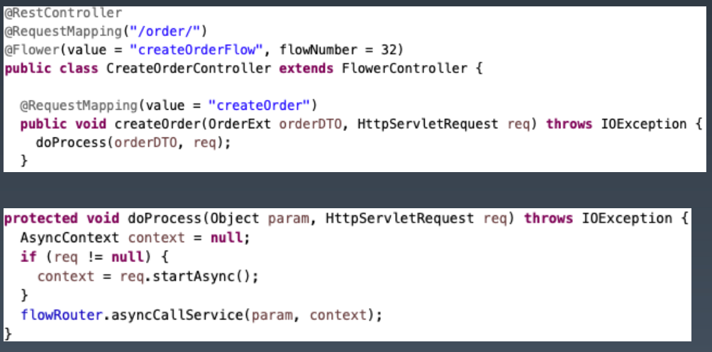


#### Flower 异步数据库访问

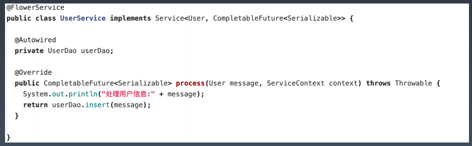


#### Flower 核心模块设计


#### Flower 的分布式异步微服务解决方案


#### 为什么选择Flower

Flower 与 WebFlux、RxJava的比较优势

- 开发工程师无需学习函数式编程即可开发反应式系统
- 纯消息驱动，可以实现更灵活的扩展（事件溯源、分布式事务，限流)

- 更好的性能与更低的成本
  - 更好的性能意味着用更少的机器就可以满足系统的并发压力
- 更高的可用性
  - 消息驱动天然限流特性使系统在过高并发和部分组件失效的情况下保障系统不会崩溃


#### Flower 开发

- link：https://github.com/zhihuili/flower


## 软件设计模式

### 面向对象的设计模式

#### 设计模式的作用

- 应用程序
- 框架
- 设计模式
  - 创建模式，结构模式，行为模式
- OOD的原则
  - OCP/DIP/LSP/SRP/ISP
- OOD的目标
- 强内聚，低耦合的程序


#### 设计模式的定义

什么是设计模式？

- 每一种模式都描述了一种问题的统一解决方案。这种问题在我们的环境中，不停地出现。
- 设计模式是一种可重复使用的解决方案。

一种设计模式的四个部分：

- 模式的名称 - 由少量的字组成的名称，有助于我们表达我们的设计
- 待解问题 - 描述了合适需要运用这种模式，以及运用模式的环境（上下文）
- 解决方案 - 描述了组成设计的元素（类和对象），它们的关系，职责以及合作，但这种解决方案是抽象的，它不代表具体的实现
- 结论 - 运用这种方案所带来的利与弊，主要是指它对系统的弹性，扩展性，和可移植性的影响


#### 设计模式的分类

从功能分

- 创建模式（Creational Patterns）
  - 对类的实例化过程的抽象
- 结构模式（Structural Patterns）
  - 将类或者对象结合在一起形成更大的结构
- 行为模式（Behavioral Patterns）
  - 对在不同的对象中间划分责任和算法的抽象

从方式分

- 类模式
  - 以继承的方式实现模式，静态的
- 对象模式
  - 以组合的方式实现模式，动态的


### 排序问题 - 如何创建一个对象？

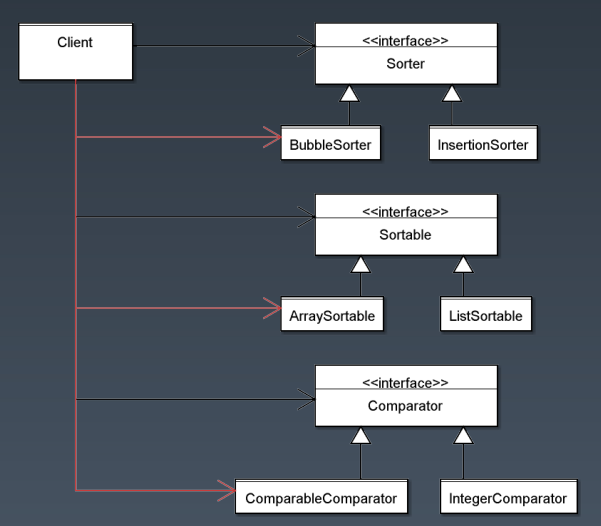


### 利用简单工厂模式

#### 利用简单工厂

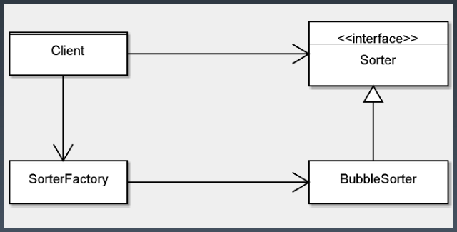


#### 简单工厂及Client 程序

```java
public class SorterFactory {
    public static <T> Sorter<T> getSorter() {
        return new BubbleSorter<T>();
    }
}

public class Client {
    public static void main(String[] args) {
        Integer[] array = {5, 4, 9, 7, 6, 3, 8, 1, 0, 2};

        Sorter<Integer> sorter = SorterFactory.getSorter();
        Sortable<Integer> sortable = SorterableFactory.getSortable(array);

        Comparator<Integer> comparator = ComparatorFactory.getComparator();

        sorter.sort(sortable, comparator);
        // ...

    }
}
```


#### 简单工厂的优缺点

优点：

- 使Client不再依赖Sorter的具体实现（如 BubbleSorter）
- 对Client实现OCP - 增加 Sorter 不影响 Client

缺点：

- 对 Factory 未实现 OCP - 增加 Sorter 需要修改 Factory


#### 对简单工厂的改进一

```java
public class SorterFactory_2 {
    @SuppressWarnings("unchecked")
    public static <T> Sorter<T> getSorter(String implClass) {
        try {
            Class impl = Class.forName(implClass);
            return (Sorter<T>) impl.newInstance();
        } catch (Exception e) {
            throw new IllegalArgumentException("Illegal class name: " + implClass, e);
        }
    }
}

public class Client_2 {
    public static void main(String[] args) {
        Integer[] array = {5, 4, 9, 7, 6, 3, 8, 1, 0, 2};

        Sorter<Integer> sorter = SorterFactory_2.getSorter("demo.sort.impl.BubbleSorter");
        Sortable<Integer> sortable = SorterableFactory.getSortable(array);

        Comparator<Integer> comparator = ComparatorFactory.getComparator();

        sorter.sort(sortable, comparator);
        // ...

    }
}
```


#### 改进一所存在的问题

解决了Factory的OCP问题吗？

- 增加 Sorter实现时，不需要修改Factory了
- 但是仍然需要修改 Client

其他问题

- 丧失了编译时的类型安全
  - Client 和 Factory 均类型不安全
- Client 仍然知道 Sorter的实现是什么
- 限制了 Sorter 的实现只能通过 默认构造函数 创建


#### 对简单工厂的改进二

```java
import java.io.IOException;
import java.util.Properties;

public class SorterFactory_3 {
    private final static Properties IMPLS = loadImpls();

    private static Properties loadImpls() {
        Properties defaultImpls = new Properties();
        Properties impls = new Properties(defaultImpls);

        defaultImpls.setProperty("sorter", "demo.sort.impl.BubbleSorter");

        try {
            impls.load(SorterFactory_3.class.getResourceAsStream("sort.properties"));
        } catch (IOException e) {
            throw new RuntimeException(e);
        }

        return impls;
    }

    @SuppressWarnings("unchecked")
    public static <T> Sorter<T> getSorter() {
        String implClassName = IMPLS.getProperty("sorter");

        try {
            Class implClass = Class.forName(implClassName);

            return (Sorter<T>) implClass.newInstance();
        } catch (Exception e) {
            throw new IllegalArgumentException("Illegal class name: " + implClassName, e);
        }
    }
}

public class Client_3 {
    public static void main(String[] args) {
        Integer[] array = {5, 4, 9, 7, 6, 3, 8, 1, 0, 2};

        Sorter<Integer> sorter = SorterFactory_3.getSorter();
        Sortable<Integer> sortable = SorterableFactory.getSortable(array);

        Comparator<Integer> comparator = ComparatorFactory.getComparator();

        sorter.sort(sortable, comparator);
        // ...

    }
}

// 创建 sorter.properties 文件：
sorter=demo.sort.impl.BubbleSorter
```


#### 改进二的优缺点

优点：

- 满足 OCP ？
  - 对 Client 和 Factory 均满足
  - 满足 OCP 方法
    - 抽象
    - 动态编程（即将编译时类型检查转变成运行时检查）

缺点：

- 缺少编译时类型安全
- 限制了 Sorter 的实现，只能通过 默认构造函数 创建
  - 假如需要传递参数？

这种做法其实相当重要

- 简单工厂非常重要，是许多其他模式的基础
- 而该机制解决了简单工厂模式最致命的问题


### Singleton 单例模式

#### 为什么要使用

Single 模式保证产生单一实例，就是说一个类只产生一个实例。

使用Singleton 有两个原因：

- 因为只有一个实例，可以减少实例频繁创建和销毁带来的资源消耗；
- 当多个用户使用这个实例的时候，便于进行统一控制（比如打印机对象）

前者是性能需求，后者是功能需求


#### Singleton实现有两种方式

- 方法一

```java
public class Singleton1 {
    private Singleton1() {

    }

    private static Singleton1 instance = new Singleton1();

    public static Singleton1 getInstance() {
        return instance;
    }

}
```

- 方法二

```java
public class Singleton2 {
    private Singleton2() {

    }

    private static Singleton2 instance = null;

    public static synchronized Singleton2 getInstance() {
        if (instance == null) {
            instance = new Singleton2();
        }
        return instance;
    }
}
```


#### 说明

- 一定要有私有的构造函数，保证类实例只能通过 getInstance() 方法获得。
- 方法2中 getInstance 的修饰符 synchronized 一定要加上，否则可能会穿绳多重实例
- 尽量使用方法1构造单例实例
- 单例中的成员变量是多线程重用的，可能会产生意想不到的结果，因此尽量将单例设计为无状态对象（只提供服务，不保存状态）


### 适配器模式（Adapter）

- 类的适配器
- 对象的适配器

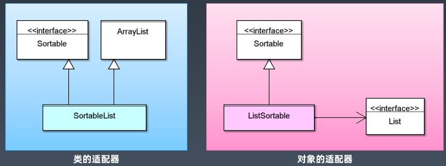


#### 代码示例 - 类的适配器

- 这是一个类的适配器
- 由于原 Sortable 接口 和 ArrayList 不兼容，治好定义一个 newSortable

```java
public class SortableList<T> extends ArrayList<T> implements NewSortable<T> {
    
    @Override
    public T getElement(int i) {
        return get(i);
    }

    @Override
    public void setElement(int i, T o) {
        set(i, o);
    }
}

public interface NewSortable<T> {
    int size();

    T getElement(int i);

    void setElement(int i, T o);
}
```


#### 代码示例 - 对象的适配器

- 这是一个对象的适配器

```java
import java.util.List;

public class ListSortable<T> implements NewSortable<T> {

    private final List<T> list;

    public ListSortable(List<T> list) {
        this.list = list;
    }

    @Override
    public int size() {
        return list.size();
    }

    @Override
    public T getElement(int i) {
        return list.get(i);
    }

    @Override
    public void setElement(int i, T o) {
        list.set(i, o);
    }
}

public interface NewSortable<T> {
    int size();

    T getElement(int i);

    void setElement(int i, T o);
}
```


#### 适配器的作用

系统需要使用现有的类，而这个类的接口与我们所需要的不同

- 例如：我们需要对 List 进行排序，但是我们需要一个 Sortable 接口，原有的 List 接口不能满足要求。


#### 适配器的应用

- Buton 类的适配器模式版本


JDBC Driver

- 是对具体数据库的适配器
- 例如，将Oracle 适配到 JDBC 中

JDBC-ODBC Bridge

- 是将 Windows ODBC 适配到 JDBC 接口中


### JUnit 中的设计模式

#### 如何写单元测试

```java
import junit.framework.TestCase;
import junit.runner.Sorter;

import java.util.Comparator;

public class BubbleSorterTests extends TestCase {
    private Integer[] array;
    private Sorter sorter;

    @Override
    protected void setUp() {
        array = new Integer[]{5, 4, 9, 7, 6, 3, 8, 1, 0, 2};
        sorter = new BubbleSorter();
    }

    public void testSort() {
        Sortable sortable = new ArraySortable(array);
        Comparator comparator = new IntegerComparator();

        sorter.sort(sortable, comparator);

        for (int i = 0; i < 10; i++) {
            assertEquals(i, array[i].intValue());
        }
    }
}
```


#### 实现一个单元测试的步骤

- 创建测试类，从TestCase 派生
- 初始化
  - 覆盖基类的方法： Protected void setUp()
- 清除环境
  - 覆盖基类的方法：Protected void tearDown()
- 书写测试方法
  - 命名规则：public void testXyz()


#### JUint 单元测试是如何执行的？

```java
public abstract class TestCase extends Assert implements Test {
  
    public void runBare() throws Throwable {
      Throwable exception= null;
      setUp();
      try {
        runTest();
      } catch (Throwable running) {
        exception= running;
      }
      finally {
        try {
          tearDown();
        } catch (Throwable tearingDown) {
          if (exception == null) exception= tearingDown;
        }
      }
      if (exception != null) throw exception;
    }
  
  	protected void runTest() throws Throwable {
      // 利用动态机制调用 testXyz()
		}
  
    protected void setUp() throws Exception {
    }

    protected void tearDown() throws Exception {
    }
}
```


#### 在 Eclipse 中运行测试的结果

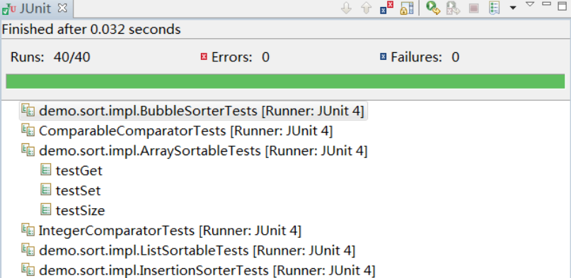


#### JUint 单元测试的执行

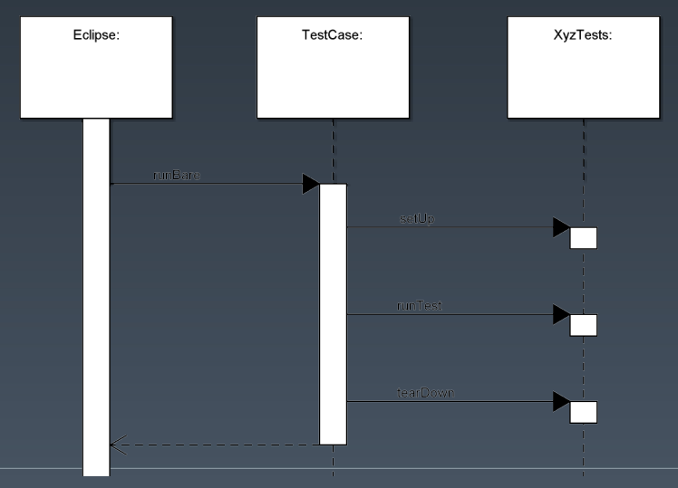

​                       

### 模板方法模式（Template Method）

模板方法模式是扩展功能的最基本模式之一

- 它是一种 类的行为模式

它通过继承的方法来实现扩展

- 基类负责算法的轮廓和骨架
- 子类负责算法的具体实现

组合 vs. 继承

- 基于 继承 的模板方法比组合更容易实现
- 在很多情况下，可以适当使用这种模式


#### 模板方法的形式

- 抽象方法
  - protected abstract void step1();
  - 轻质子类实现该步骤
- 具体方法
  - protected void doSomething(){ ... }
  - 子类不需要覆盖，但也可以覆盖之
  - 如果想明确告诉子类 不要覆盖它，最好标明 final
- 钩子方法
  - protected void setUp(){}
  - 空的实现（缺省适配器模式）
  - 子类可选择性的覆盖之，以便在特定的时机做些事


#### Java Servlet 中的模板方法

- init()  属于初始化模板方法
- service() 中的模板，属于处理不同请求方式的模板

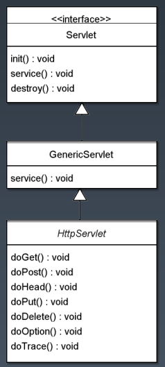


### 策略模式（Strategy）

策略模式是扩展功能的另一种最基本的模式

- 他是一种 对象的行为模式

它是通过组合的方式来实现扩展

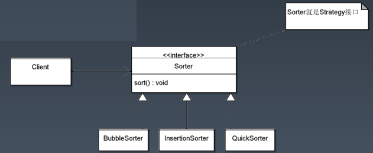


#### 什么时候使用策略模式？

- 系统需要在多种算法中选择一个的时候
- 重构系统时，
  - 将条件语句转换成对于策略的多态性调用
- 策略模式的优点（对比模板方法）
  - 将使用策略的人与策略的具体实现分离
  - 策略对象可以自由组合
- 策略模式可能存在的问题
  - 策略模式仅仅封装了 算法的具体实现，方便添加和替换算法
  - 但它并不关心何时使用何种算反，这个必须要游客户端来决定


#### 策略模式和模板方法的结合

- 何时请求调用什么方法，是不知道的

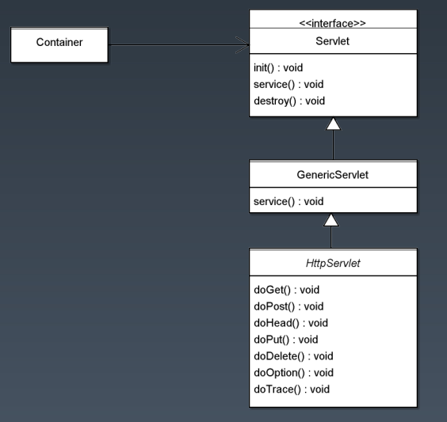


#### 测试 Sortable

```java
import junit.framework.TestCase;

public abstract class SortableTests extends TestCase {
    protected Sortable<Integer> sortable;

    @Override
    protected void setUp() throws Exception {
        Integer[] data = new Integer[10];

        for (int i = 0; i < 10; i++) {
            data[i] = i;
        }

        sortable = createSortable(data);

    }

    protected abstract Sortable<Integer> createSortable(Integer[] data);

    public final void testGet() {
        for (int i = 0; i < 10; i++) {
            assertEquals(i, sortable.get(i).intValue());
        }

        try {
            sortable.get(-1);
            fail();
        } catch (RuntimeException e) {

        }
        try {
            sortable.get(10);
            fail();
        } catch (RuntimeException e) {

        }
    }

    public final void testSet() {
        for (int i = 0; i < 10; i++) {
            sortable.set(i, 100);
            assertEquals(100, sortable.get(i).intValue());
        }

        try {
            sortable.set(-1, 999);
            fail();
        } catch (RuntimeException e) {

        }
        try {
            sortable.set(10, 999);
            fail();
        } catch (RuntimeException e) {

        }
    }

    public final void testSize() {
        assertEquals(10, sortable.size());
    }
}
```


#### 测试 ArraySortable

```java
import java.lang.reflect.Array;
import java.util.List;

public class ArraySortableTests extends SortableTests {

    @Override
    protected Sortable<Integer> createSortable(Integer[] data) {
        List<Integer> list = Array.asList(data);
        return new ListSortable<Integer>(list);
    }
}
```


#### 测试 ListSortable

```java
public class ListSortableTests extends SortableTests {
    @Override
    protected Sortable<Integer> createSortable(Integer[] data) {
        return new ArraySortableTests<Integer>(data);
    }
}
```


#### 测试排序程序

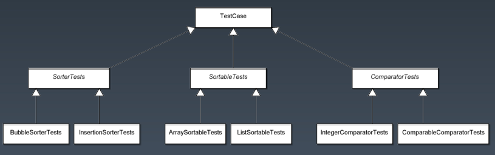


### 组合模式（Composite）

- 组合模式
  - 是一种 对象的结构模式

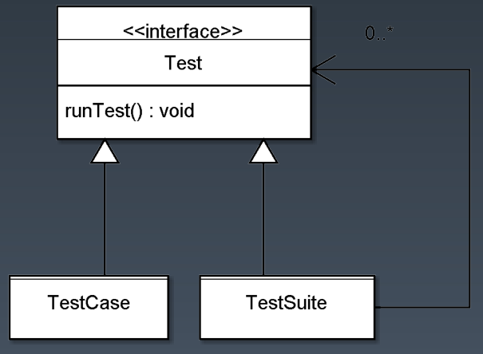


#### 组合模式的应用

- 文件系统
- AWT控件

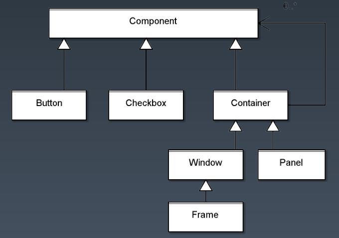


#### 参数化的单元测试

```java
import junit.framework.TestCase;

import java.util.Comparator;

public abstract class ComparatorTests<T> extends TestCase {
    protected T o1;
    protected T o2;
    protected boolean ascending;
    protected boolean isBefore;

    public ComparatorTests(T o1, T o2, boolean ascending, boolean isBefore) {
        super("testIsBefore");

        this.o1 = o1;
        this.o2 = o2;
        this.ascending = ascending;
        this.isBefore = isBefore;
    }

    public void testIsBefore() {
        assertEquals(isBefore, createComparator(ascending).isBefore(o1, o2));
    }

    protected abstract Comparator<T> createComparator(boolean ascending);

}

import junit.framework.Test;
import junit.framework.TestSuite;

import java.util.Comparator;

public class IntegerComparatorTests extends ComparatorTests<Integer> {

    public static Test suite() {
        TestSuite suite = new TestSuite("IntegerComparatorTests");

        suite.addTest(new IntegerComparatorTests(1, 1, true, false));
        suite.addTest(new IntegerComparatorTests(1, 2, true, true));
        suite.addTest(new IntegerComparatorTests(2, 1, true, false));

        suite.addTest(new IntegerComparatorTests(1, 1, false, false));
        suite.addTest(new IntegerComparatorTests(1, 2, false, false));
        suite.addTest(new IntegerComparatorTests(2, 1, false, true));

        return suite;
    }

    public IntegerComparatorTests(Integer o1, Integer o2, boolean ascending, boolean isBefore) {
        super(o1, o2, ascending, isBefore);
    }

    @Override
    protected Comparator<Integer> createComparator(boolean ascending) {
        return new IntegerCoparator(ascending);
    }
}
```


#### 测试包（Test Suite）

- 上述代码生成一个 测试包

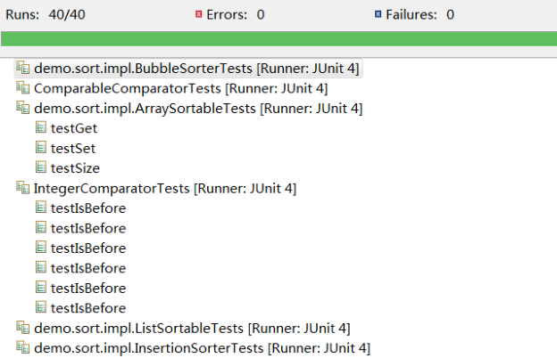


#### 生成更复杂的测试包

```java
import junit.framework.Test;
import junit.framework.TestSuite;

public class AllTests {
    public static Test suite() {
        TestSuite suite = new TestSuite("sort");

        suite.addTestSuite(BubbleSorterTests.class);
        suite.addTestSuite(InsertionSorterTests.class);

        suite.addTestSuite(ArraySortableTests.class);
        suite.addTestSuite(ListSortableTests.class);

        suite.addTest(IntegerComparatorTests.suite());
        suite.addTest(ComparableComparatorTests.suite());

        return suite;
    }
}
```

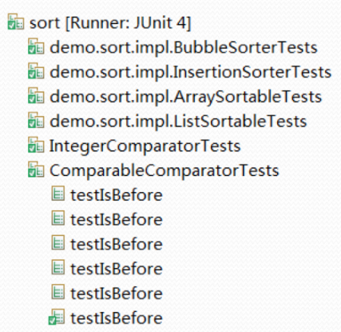


#### 从组合设计模式看Go语⾔的多态特性

Go语言没有关于对象的关键词，没有class，没有extends，没有implements，但是Go语言依然是一种完整的面向对象编程语言，拥有面向对象编程语言的三大特性：封装、继承、多态。

传统的面向对象编程语言通过override和overwrite实现多态，特别是对接口的override，使面向对象编程呈现出迷人的特性：针对接口编程，运行期注入实现，使程序呈现多态的特性。

面向对象设计模式中最让人困惑，最引人入胜的就是那些灵活应用对象多态特性的模式。

而Go语言的多态更加灵活，在传统的面向对象编程中，关于组合还是继承总有许多争论，不良继承又带来诸多问题。

Go语言中组合就是继承（extends），struct中包含另一个struct，就拥有了另一个 struct的成员和方法。

```go
//树的中间节点
type node struct {
   *list.List //（匿名）组合即继承，node拥有了list的特性
   name       string
}
```

Go语言定义就是实现（implements），go语言可以定义接口（interface），也可以定义struct上的方法，但是方法不需要显式实现接口，只要方法签名一致就可以，如果一个struct上定义的方法实现了interface上定义的所有方法，那么就认为该struct实现了该接口。

```go
//接⼝，关于树的遍历操作都在这⾥
type tree interface {
   do()
}

func (l leaf) do() { //定义即实现，leaf实现了tree接⼝
   fmt.Println(l.name + " leaf do something.")
}
```

一个完整的关于树的遍历的go语言实现如下，利用go的多态特性，不需要递归。

```go
package main

import (
   "container/list"
   "fmt"
)

//接⼝，关于树的遍历操作都在这⾥
type tree interface {
   do()
}

//树的中间节点
type node struct {
   *list.List //（匿名）组合即继承，node拥有了list的特性
   name       string
}

//树的叶⼦
type leaf struct {
   name string
}

func (n node) do() {                             //定义即实现,node实现了tree接⼝
   for e := n.Front(); e != nil; e = e.Next() { //node拥有了list的特性
      e.Value.(tree).do()
   }
   fmt.Println(n.name + " node do something.")  // 写下面是深度优先遍历
}
func (n node) addSub(sub tree) {
   n.PushBack(sub)
}
func (l leaf) do() { //定义即实现，leaf实现了tree接⼝
   fmt.Println(l.name + " leaf do something.")
}

func main() {
   //定义树的节点
   n1 := node{list.New(), "n1"}
   n2 := node{list.New(), "n2"}
   l1 := leaf{"l1"}
   l2 := leaf{"l2"}
   //构造树的结构
   n2.addSub(l2)
   n1.addSub(n2)
   n1.addSub(l1)
   //遍历树
   n1.do()
}
```

以上为树的深度优先遍历，如果想改为广度优先遍历，只需要调整一行代码

```go
package main

import (
   "container/list"
   "fmt"
)

//接⼝，关于树的遍历操作都在这⾥
type tree interface {
   do()
}

//树的中间节点
type node struct {
   *list.List //（匿名）组合即继承，node拥有了list的特性
   name       string
}

//树的叶⼦
type leaf struct {
   name string
}

func (n node) do() { //定义即实现，node实现了tree接⼝
   fmt.Println(n.name + " node do something.")  // 写上面是广度优先遍历
   for e := n.Front(); e != nil; e = e.Next() { //node拥有了list的特性
      e.Value.(tree).do()
   }
}

func (n node) addSub(sub tree) {
   n.PushBack(sub)
}
func (l leaf) do() { //定义即实现，leaf实现了tree接⼝
   fmt.Println(l.name + " leaf do something.")
}

func main() {
   //定义树的节点
   n1 := node{list.New(), "n1"}
   n2 := node{list.New(), "n2"}
   l1 := leaf{"l1"}
   l2 := leaf{"l2"}
   //构造树的结构
   n2.addSub(l2)
   n1.addSub(n2)
   n1.addSub(l1)
   //遍历树
   n1.do()
}
```

​	


### 装饰器模式（Decorator）

#### 测试排序程序的性能

冒泡排序和插入排序，谁更快？

- 这种测试必须重复多次（如10000次），才能比较准确的计算出性能
- 如何让 BubbleSorterTests 和 InsertionSorterTests 重复运行多次，而不需要修改他们的代码？
- 如何计算时间？

运用 JUnit 扩展包中的辅助类：

- junit.extensions.TestSetup
- Junit.extensions.RepeatedSetup


#### 性能测试程序

```java
import junit.extensions.RepeatedTest;
import junit.extensions.TestSetup;
import junit.framework.Test;
import junit.framework.TestSuite;
import org.copydays.rmliu.JUnit.BubbleSorterTests;

public class PerformanceTests extends TestSetup {

    private long start;
    private int repeat;

    public PerformanceTests(Test test, int repeat) {
        super(new RepeatedTest(test, repeat));

        this.repeat = repeat;
    }

    protected void setUp() {
        start = System.currentTimeMillis();
    }

    protected void tearDown() {
        long duration = System.currentTimeMillis() - start;

        System.out.printf("%s repeated , %d times, takes %d ms \n", getTest(), repeat, duration);
    }

    public static Test suite() {
        TestSuite suite = new TestSuite("performance");

        Test bubbleTests = new TestSuite(BubbleSorterTests.class);
        Test insertionTests = new TestSuite(InsertionSorterTests.class);

        suite.addTest(new PerformanceTests(bubbleTests, 10000));
        suite.addTest(new PerformanceTests(insertionTests, 10000));

        return suite;
    }
}

import junit.framework.Assert;
import junit.framework.Test;
import junit.framework.TestResult;

public class TestDecorator extends Assert implements Test {

    protected Test fTest;

    public TestDecorator(Test fTest) {
        this.fTest = fTest;
    }

    @Override
    public int countTestCases() {
        return 0;
    }

    @Override
    public void run(TestResult result) {
        for (int i = 0; i < fTimesRepeat; i++) {
            if (result.shouldStop()) {
                beak;
            }
            super.run(result);
        }
    }
}
```


#### 装饰器模式（Decorator）

装饰器模式

- 是一种 对象的结构模式

装饰器的作用

- 在不改变对客户端的接口的前提下（对客户端透明）
- 扩展现有对象的功能
- 思考 PerformanceTests 的客户端是指谁？

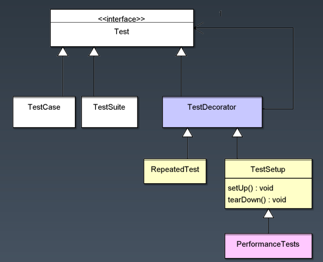


#### 装饰器模式示例

```java
public interface AnyThing {
    void exe();
}

public class Dream implements AnyThing {
    private AnyThing a;

    public Dream(AnyThing a) {
        this.a = a;
    }

    @Override
    public void exe() {
        System.out.print("梦装饰了");
        a.exe();
    }
}

public class Moon implements AnyThing {

    private AnyThing a;

    public Moon(AnyThing a) {
        this.a = a;
    }

    @Override
    public void exe() {
        System.out.print("明月装饰了");
        a.exe();
    }
}

public class You implements AnyThing{
    private AnyThing a;

    public You(AnyThing a) {
        this.a = a;
    }

    @Override
    public void exe() {
        System.out.print("你\n");
    }
}

public class DecoratorMain {
    public static void main(String[] args) {
        AnyThing t1 = new Moon(new Dream(new You(null)));
        t1.exe();
//        明月装饰了梦装饰了你

        AnyThing t2 = new Dream(new Moon(new You(null)));
        t2.exe();
//        梦装饰了明月装饰了你
    }
}
```


#### 装饰器模式

装饰器模式，也被笼统的称为 包装器（Wrapper）

- 适配器也被称作 包装器，区别在于适配器是转换成另一个接口，而装饰器是保持接口不变
- 包装器形成一条 链

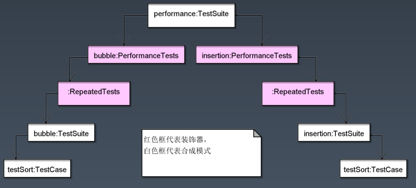


#### 装饰器的优缺点

装饰器和模板方法、策略模式的比较

- 装饰器保持对象的功能不变，扩展其外围的功能
- 模板方法和策略模式则保持算法的框架不变，而扩展其内部的实现

装饰器和继承的比较

- 都可以用来扩展对象的功能
- 但装饰器是动态的，继承是静态的
- 装饰器可以任意组合
  - 但这也使装饰器更复杂，有可能会组合出荒谬的结果


#### 装饰器的应用

- Java Servlet中的应用
  - HttpServletRequest/HttpServletRequestWrapper
  - HttpServletResponse/HttpServletResponseWrapper
- 同步化装饰器
  - Collections. synchronizedList（list）
  - 取代原先的Vector、Hashtable等同步类。
- Java I/O类库简介
  - 核心-流，即数据的有序排列，将数据从源送达目的地。
  - 流的种类
    - InputStream、 OutputStream -代表byte流（八位字节流）
    - Reader、Writer -代表char流（Unicode 字符流）
  - 流的对称性
    - 输入-输出对称
    - Byte-Char对称
    - 因此我们只要学习任意一种流，就可以基本了解其它所有的流。


### 作业实践

#### 作业题

请用组合设计模式编写程序，打印输出图1的窗口，窗口组件的树结构如图2所示。

打印输出示例参考图3。

- 图1: 窗口图例


- 图2：窗口组件树结构

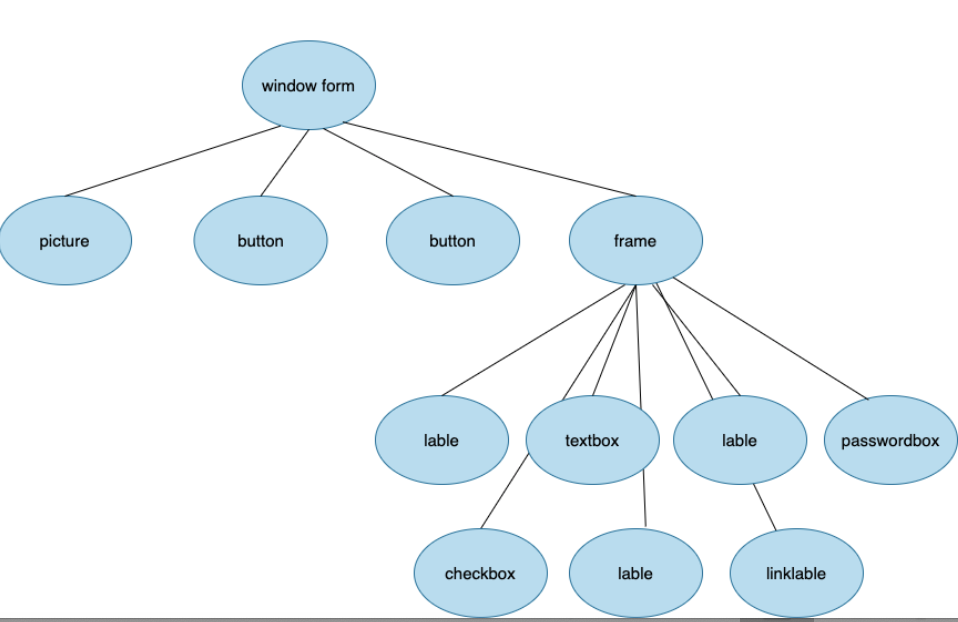

- 图3：程序输出示例

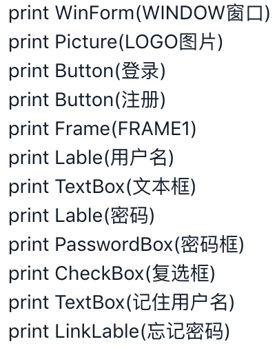


#### 答案

- [答案](DesignPatterns/src/main/java/org/copydays/rmliu/homework/Main.java)

```java
import org.copydays.rmliu.homework.component.*;

public class Main {
    public static void main(String[] args) {
        WinForm winForm = new WinForm("Window 窗口");

        winForm.addComponent(new PictureComponent("logo图片"));
        winForm.addComponent(new ButtonComponent("登录"));
        winForm.addComponent(new ButtonComponent("注册"));

        Container frame = new FrameComponent("frame1");
        frame.addComponent(new LableComponent("用户名"));
        frame.addComponent(new TextBoxComponent("文本框"));
        frame.addComponent(new LableComponent("密码"));
        frame.addComponent(new PasswordBoxComponent("密码框"));
        frame.addComponent(new CheckBoxComponent("复选框"));
        frame.addComponent(new TextBoxComponent("记住用户名"));
        frame.addComponent(new LinkLableComponent("记住密码"));
        winForm.addComponent(frame);

        winForm.print();
    }
}
```


### Spring 中的设计模式

#### 依赖注入 DI 与控制反转 IoC


#### Spring DI 示例

```java
public class Client {
    private UserService userService;

    public void setUserService(UserService userService) {
        this.userService = userService;
    }
}

<?xml version="1.0" encoding="UTF-8"?>
<beans
        xmlns="http://www.springframework.org/schema/beans"
        xmlns:context="http://www.springframework.org/schema/context"
        xmlns:xsi="http://www.w3.org/2001/XMLSchema-instance"
        xsi:schemaLocation="http://www.springframework.org/schema/beans
        https://www.springframework.org/schema/beans/spring-beans.xsd
        http://www.springframework.org/schema/context
        https://www.springframework.org/schema/context/spring-context.xsd">

    <bean id="userService" class="org.copydays.rmliu.UserDaoImpl">
        <property name="userDao" ref="userDao"/>
    </bean>

    <bean id="client" class="org.copydays.rmliu.Client">
        <property name="userService" ref="userService"/>
    </bean>

</beans>
```


#### Spring DI 示例-xm解析流程

- org.springframework.beans.factory.xml.BeanDefinitionParserDelegate#parseBeanDefinitionElement(org.w3c.dom.Element, org.springframework.beans.factory.config.BeanDefinition)

```java
private static void parseBeanElement(Element beanElement) throws Exception {
    String id = beanElement.getAttribute("id");
    String clsName = beanElement.getAttribute("class");

    // 获取 class 对象
    Class<?> cls = Class.forName(clsName);
    // 直接调用无参构造函数，实例化一个对象
    Object beanObj = cls.getDeclaredConstructor().newInstance();

    beanMap.put(id, beanObj);  // 使用 map 存储所有的beans

    // 获取属性结点，并调用 setter 方法设置属性
    List<Element> subElemList = beanElement.elements();

    for (Element subElem : subElemList) {
        // 获取属性名称
        String name = subElem.getAttribute("name");
        // 获取属性值
        String ref = subElem.getAttribute("ref");

        Object refObj = beanMap.get(ref);
        // 根据属性名称构造 setter 方法名：set + 属性首字母大写 + 属性其他字符，例：setUserDao
        String methodName = "set" + (char) (name.charAt(0) - 32) + name.substring(1);
        // 获取Method 对象
        Method method = cls.getDeclaredMethod(methodName, refObj.getClass().getInterfaces()[0]);
        // 调用setter 方法，设置对象属性
        method.invoke(beanObj, refObj);
    }
}
```


#### Spring 中的单例模式

```java
import java.util.HashMap;
import java.util.Map;

import static sun.tools.jconsole.inspector.XObject.NULL_OBJECT;

public class SingletonDemo {
    private final Map singletonObjects = new HashMap();

    protected Object getSingleton(String beanName) {
        Object singletinObjet = this.singletonObjects.get(beanName); // 检查缓存中是否存在实例

        if (singletinObjet == null) {
            synchronized (this.singletonObjects) {  // 如果为空，则锁定全局变量并进行处理
                singletinObjet = singletonFactory.getObjet(); // 调用工厂的 getObject 方法
                this.earlySingletonObjects.put(beanName, singletinObjet); // 纪录在缓存中
            }
        }
        return (singletinObjet != NULL_OBJECT ? singletinObjet : null);
    }
}
```


#### Spring MVC 模式

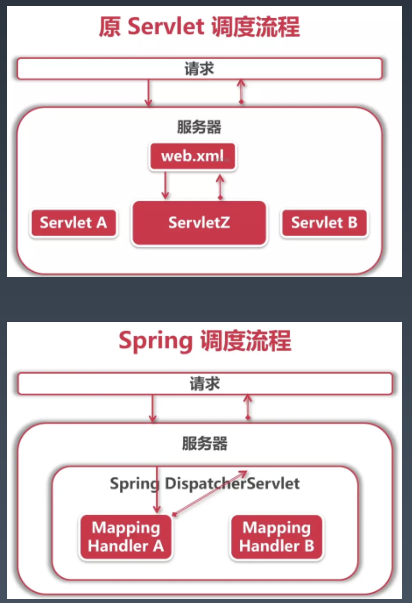

```java
import org.springframework.beans.factory.annotation.Autowired;
import org.springframework.web.bind.annotation.RequestMapping;
import org.springframework.web.bind.annotation.RestController;

import javax.servlet.ServletRequest;
import javax.servlet.http.HttpServletRequest;

@RestController
@RequestMapping("/user/")
public class QueryUserController extends FlowerController {

    @Autowired
    OrderNoService orderNoService;

    @RequestMapping(value = "query")
    public void hello(String userid) {
        logger.info("收到请求： {}", userid);
        doProcess(userid);
    }

    public boolean handler(ServletRequest req, ServlertResponse res) {
        String uri = ((HttpServletRequest) req).getRequestURI();

        Object[] parameters = new Object[args.length];

        for (int i = 0; i < args.length; i++) {
            parameters[i] = req.getParameter(args[i]);
        }

        Object ctl = controller.newInstance(uri);
        Object response = method.invoke(ctl, parameters);
        res.getWriter().println(response.toString());

        return true;
    }
}
```


### Panthera 代码解析

- link: https://github.com/zhihuili/project-panthera-ase
- 初始实验动态语法树代码(几千行代码)参见：[HiveASTGenerator.java](Data/HiveASTGenerator.java)
- 在Hadoop中实现标准SQL 运行的分享 PPT 参见，[Beyond Hive-Standard SQL on Hadoop.pdf](Data/Beyond Hive-Standard SQL on Hadoop.pdf)

阅读步骤

- 打开SQL代码页：https://github.com/zhihuili/project-panthera-ase/tree/master/ql/src/java/org/apache/hadoop/hive/ql/parse/sql

- 点击文件 SqlASTTranslator.java

  - https://github.com/zhihuili/project-panthera-ase/blob/master/ql/src/java/org/apache/hadoop/hive/ql/parse/sql/SqlASTTranslator.java

  - 重点代码：

  - ```java
    // ...    
    if (transformer == null) {
      transformer = TransformerBuilder.buildTransformer();
    }
    transformer.transformAST(sqlASTRoot, context);
    
    // ...
    HiveASTGenerator generator = GeneratorFactory.getGenerator(sqlASTRoot);
    ASTNode hiveTopNode = new ASTNode();
    
    // long b = System.currentTimeMillis();
    // for (int i = 0; i < 1000; i++) {
    generator.generateHiveAST(hiveTopNode, sqlASTRoot, hiveTopNode, sqlASTRoot, context);
    // }
    // long e = System.currentTimeMillis();
    // System.out.println("--------"+(e-b));
    
    ret = (ASTNode) hiveTopNode.getChild(0);
    
    // ...
    ```

- 进入文件夹 transformer

  - https://github.com/zhihuili/project-panthera-ase/tree/master/ql/src/java/org/apache/hadoop/hive/ql/parse/sql/transformer
  - 看到的全部是 各种转换器

- 进入文件 TransformerBuilder.java

  - https://github.com/zhihuili/project-panthera-ase/blob/master/ql/src/java/org/apache/hadoop/hive/ql/parse/sql/transformer/TransformerBuilder.java
  - 可以看到，这个 TransformerBuilder.java ，使用了装饰器模式，一个包一个，直接变成了大粽子

- 进入文件 SqlASTTransformer.java

  - https://github.com/zhihuili/project-panthera-ase/blob/master/ql/src/java/org/apache/hadoop/hive/ql/parse/sql/transformer/SqlASTTransformer.java
  - 可以看到，这个 SqlASTTransformer.java，是一个sql 抽象语法树 转换器 接口

- 进入文件 UnionTransformer.java

  - https://github.com/zhihuili/project-panthera-ase/blob/master/ql/src/java/org/apache/hadoop/hive/ql/parse/sql/transformer/UnionTransformer.java
  - 可以看到，UnionTransformer.java 内部，使用组合模式，使用 SqlASTTransformer tf; 作为一个注入对象

- 进入文件夹 generator

  - https://github.com/zhihuili/project-panthera-ase/tree/master/ql/src/java/org/apache/hadoop/hive/ql/parse/sql/generator
  - 可以看到，generator 全部是 生成器

- 进入文件 BaseHiveASTGenerator.java

  - https://github.com/zhihuili/project-panthera-ase/blob/master/ql/src/java/org/apache/hadoop/hive/ql/parse/sql/generator/BaseHiveASTGenerator.java
  - 内部实现了，HiveASTGenerator 接口，
    - https://github.com/zhihuili/project-panthera-ase/blob/master/ql/src/java/org/apache/hadoop/hive/ql/parse/sql/generator/HiveASTGenerator.java
  - generateHiveAST()方法 实现，在动态语法树中，对 Hive 的查询语句转换

- 进入文件 LikeGenerator.java

  - https://github.com/zhihuili/project-panthera-ase/blob/master/ql/src/java/org/apache/hadoop/hive/ql/parse/sql/generator/LikeGenerator.java
  - 实现 like 语法的 转换
  - 并且，继承了 BaseHiveASTGenerator，继承父类的 baseProcess() 方法

- 进入文件 HavingGenerator.java

  - https://github.com/zhihuili/project-panthera-ase/blob/master/ql/src/java/org/apache/hadoop/hive/ql/parse/sql/generator/HavingGenerator.java
  - 实现 have 语法的转换
  - 并且，使用装饰器模式。覆写与继承了 BaseHiveASTGenerator，继承父类的 generate() 方法

- 至此，整个实现思路就很明确了，

  - 通过将 SQL 语句 通过每一个 关键组，在抽象语法树中进行解析，替换为转换后的关键字与语法


## 互联网系统架构

### 系统架构概述：互联网系统面临怎么样的挑战？

#### 高并发，大流量

需要面对高并发用户，大流量访问。

- Google 日均 PV 数 35亿，日均 IP 访问数 3亿
- 微信在线用户数 10亿
- 天猫双十一活动一天交易额3000亿


#### 高可用

系统 7 x 24 小时不间断服务。

大型互联网站的宕机事件通常会成为新闻焦点。


#### 海量数据

需要存储、管理海量数据。

- Facebook 每周上传的照片数目接近10亿
- 百度收录的网页数目有数百亿
- Google 有近百万台服务器为全球用户提供服务（200万台左右）


#### 用户分布广泛，网络情况复杂

许多大型互联网都是为全球用户提供服务的，用户分布范围广，各地网络情况千差万别。

在国内，有各个运营商网络互通难的问题。

而中美光缆的数次故障，也让一些对国外用户依赖较大的网站不得不考虑在海外建立数据中心。


#### 安全环境恶劣

由于互联网的开放性，使得互联网更容易受到攻击，大型网站几乎每天都会遇到黑客攻击情况。

2011年国内多个重要网站泄漏用户密码，让普通用户也直面一次互联网安全问题。


#### 需求快速变更，发布频繁

和传统软件的版本发布频率不同，互联网产品为快速适应市场，满足用户需求，其产品发布频率也是极高的。

Office 的产品版本以年为单位发布，而一般大型网站的产品每周都有新版本发布上线，至于中小型网站的发布就更频繁了，有时候一天会发布几十次。


#### 渐进式发展

不同于传统软件产品或者企业应用系统，一开始就规划好全部的功能和非功能需求，几乎所有的大型互联网站都是从一个小网站开始，渐进的发展起来的。

- Facebook是伯克扎克同学在哈佛大学的宿舍里开发的；
- Google的第一台服务器部署在斯坦福大学的实验室里；
- 阿里巴巴则是在马云家的客厅里诞生的。

好的互联网产品都是慢慢运营出来的，不是一开始就开发好的。那些刚建立就投入巨资，有巨大背景的网站，后来发展都很惨淡。


### 应对高并发挑战的两个技术方向

#### 垂直伸缩

通过升级硬件和网络吞吐能力可以实现垂直伸缩。由于不需要改变应用架构，所以通常被认为是最简单的短期伸缩性方案。

- 通过使用RAID （独立冗余磁盘阵列）增加I/O吞吐能力。
- 通过切换到SSD （固态硬盘）改善I/O 访问速度。
- 通过增加内存减少I/O 操作
- 通过升级网络接口或者增加网络接口提高网络吞吐能力。
- 更新服务器使用更多处理器或者更多超线程。

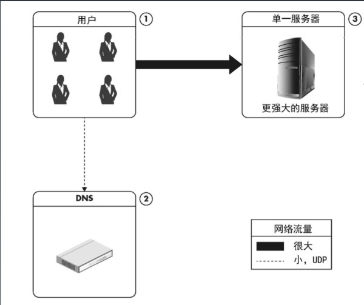


#### 垂直伸缩的缺点

- 达到某个程度后，增加计算能力需要的更多的花费
- 垂直伸缩有物理极限
- 操作系统的设计或者应用程序自身制约着垂直伸缩，最多只能达到某个点

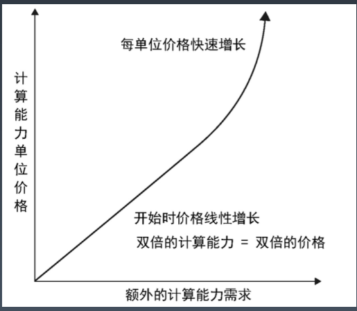


#### 水平伸缩

水平伸缩是指通过增加服务器提升计算能力的一类架构方法。

水平伸缩被认为是伸缩性的圣杯，水平伸缩可以克服垂直伸缩带来的单位计算成本随计算能力增加而迅速飙升的问题。

另外，水平伸缩总是可以增加更多服务器，这样，就不会像垂直伸缩那样遭遇到单台服务器的极限。

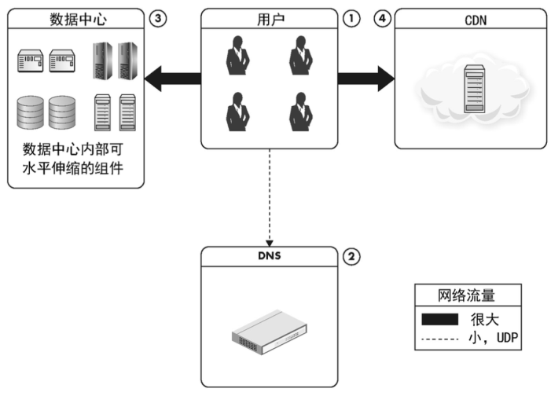


#### 水平伸缩的优点

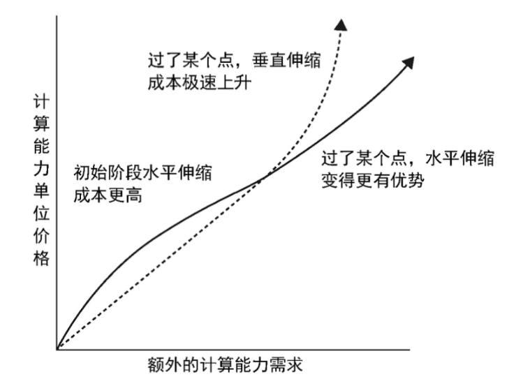


### 互联网架构演化

#### 第零阶段：最简单的互联网应用架构

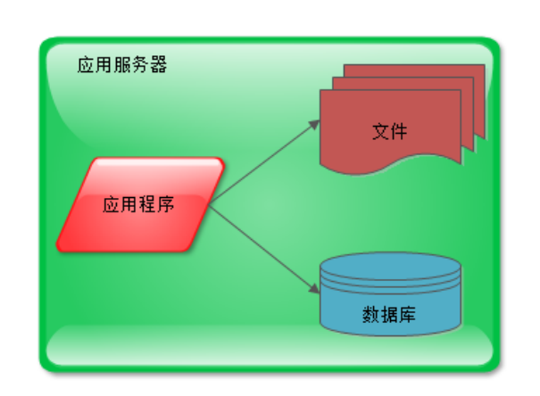


#### 第一阶段：应用与数据分离


#### 第二阶段：使用缓存改善系统性能

- 本地缓存
- 远程分布式缓存

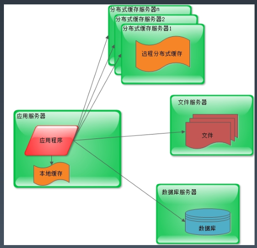


#### 第三阶段：使用应用服务器集群改善系统的并发处理能力

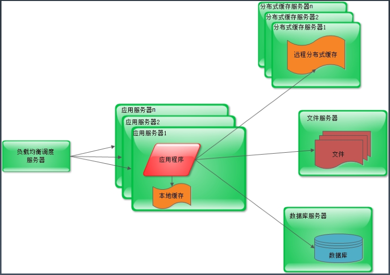


#### 第四阶段：数据库读写分离

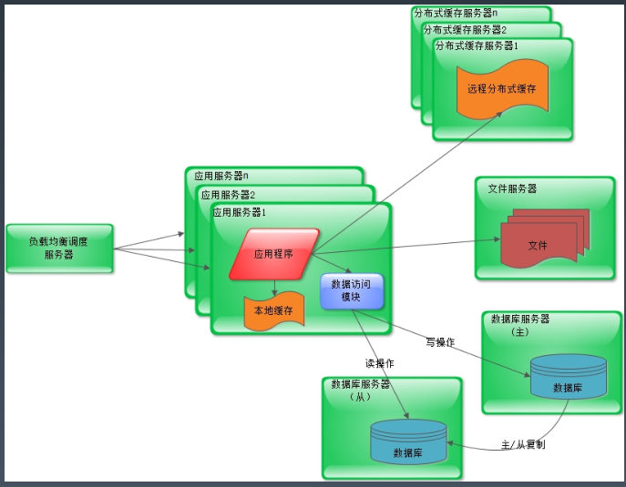


#### 第五阶段：使用反向代理和CDN加速网站响应

- 在网络运营商机房，本地部署CDN服务器
- 直接返回图片，文件等静态资源

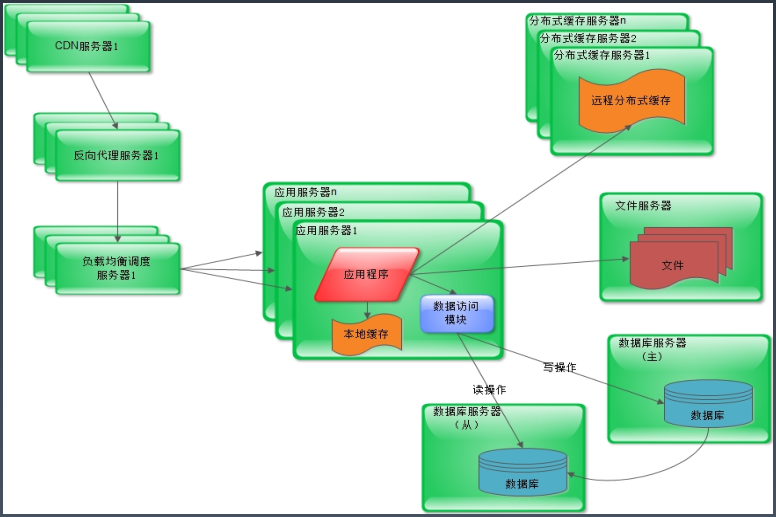


#### 第六阶段：使用分布式文件系统和分布式数据库系统

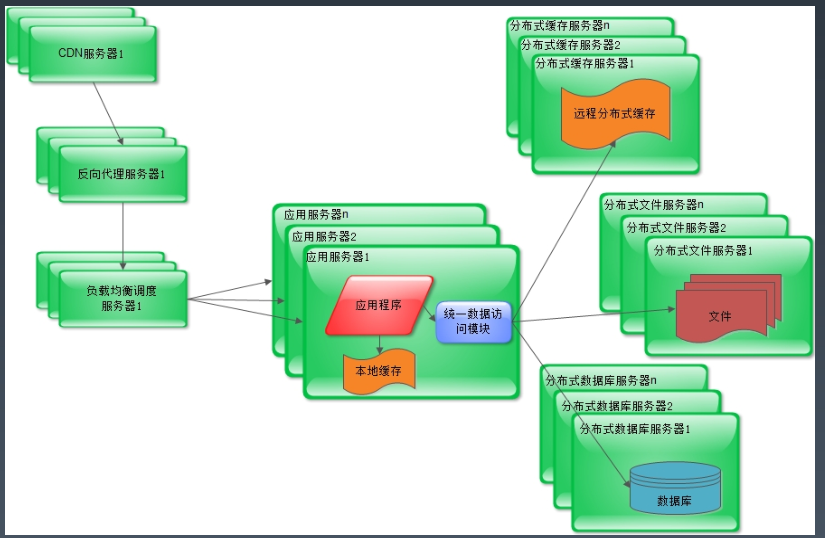


#### 第七阶段：使用NoSQL和搜索引擎

- 使用键值对方式缓存与存储数据，加速查找

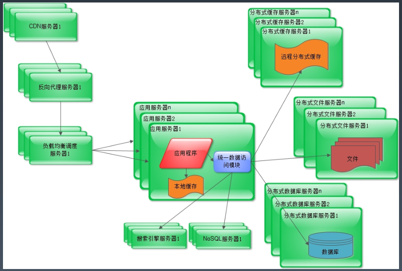


#### 第八阶段：业务拆分

- 垂直拆分数据表，根据业务领域划分多个服务

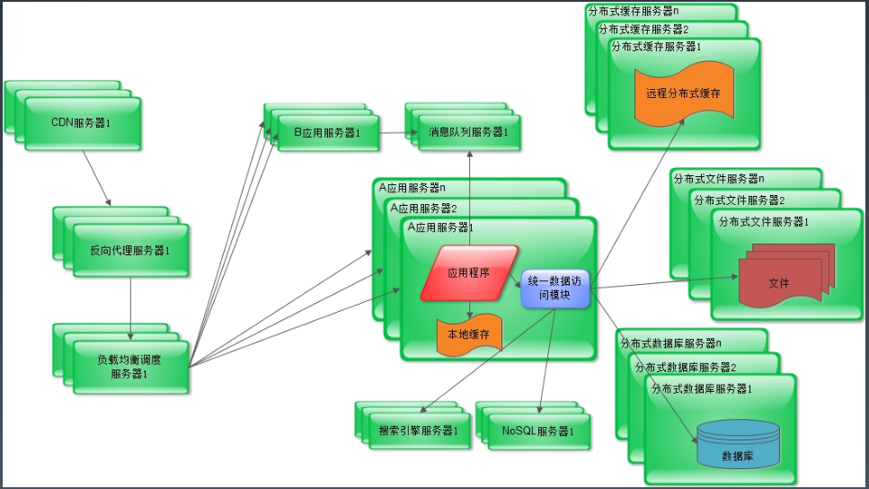


#### 第九阶段：微服务及中台化

- 数据库太大，水平拆分数据表，进行分片处理，sharding

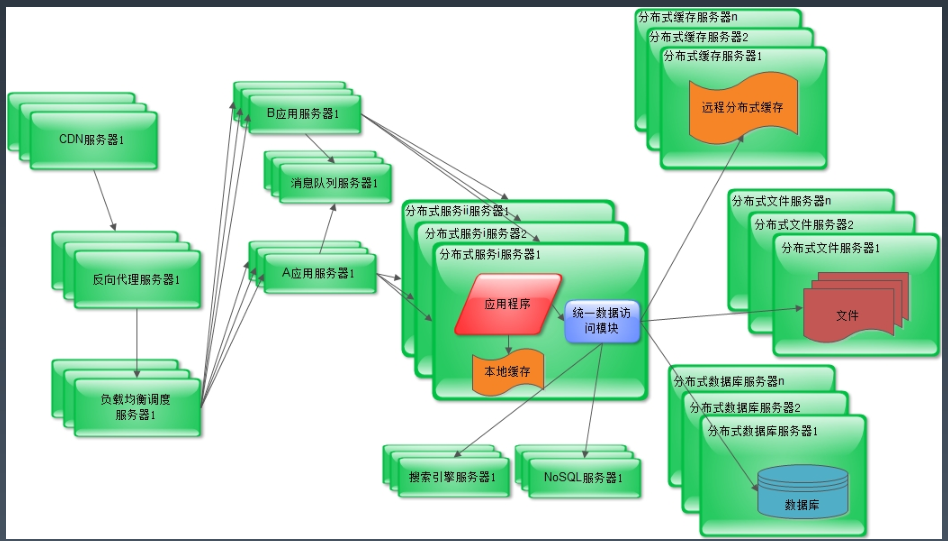


#### 第十阶段：大数据与智能化


### 互联网架构模式

#### 架构模式

每一个模式描述了一个在我们周围不断重复发生的问题以及该问题解决方案的核心。这样，你就能一次又一次的使用该方案而不必做重复工作。

模式的关键在于模式的可重复性，问题与场景的可重复性带来解决方案的可重复使用。

互联网架构模式就是试图去描述那些为解决互联网系统高性能、高可用、易扩展、可伸缩、安全等目标，被很多互联网应用重复使用的一些解决方案，这些解决方案是互联网软件系统的重要组成部分。


#### 分层

分层是企业应用系统中最常见的一种架构模式，将系统在横向维度上切分成几个部分，每一个部分负责一部分相对比较单一的职责，然后通过上层对下层依赖和调用组成一个完整的系统。


#### 分割

如果说分层是将软件在横向方面进行切分，那么分割就是在纵向方面对软件进行切分。

系统越大，功能越复杂，服务和数据处理的种类也越多，将这些不同的功能和服务分割开来，包装成高内聚，低耦合的模块单元。

一方面有助于软件的开发和维护，另一方面，便于不同模块的分布式部署，提高网站的并发处理能力和功能扩展能力。


#### 分布式

对于大型网站，分层和分割的一个主要目的是为了切分后的模块便于分布式部署，即将不同模块部署在不同的服务器上，通过远程调用协调工作。

分布式意味着解决同样的问题可以使用更多的计算机，计算机越多，CPU，内存，存储资源也就越多，能够处理的并发访问和数据库量就越大。

- 分布式应用和服务
- 分布式静态资源
- 分布式数据和存储
- 分布式计算


#### 集群

使用分布式虽然已经将分层和分割后的模块独立部署，但是对于用户访问集中的模块，比如网站的首页，还需要独立部署的服务器集群化，即多态服务器部署相同应用构成一个集群，通过负载均衡设备共同对外提供服务。


#### 缓存

缓存就是将数据存放在距离计算最近的位置以加快处理速度。

缓存是改善软件性能的第一手段，现代CPU越来越快的一个重要因素就是使用了更多的缓存，在复杂的软件设计中，缓存几乎无处不在。

大型网站架构设计在很多方面都使用了缓存设计。

- CDN
- 反向代理
- 本地缓存
- 远程缓存


#### 异步

计算机软件发展的一个重要目标和驱动力是降低软件耦合性。

事物之间越少直接关系，那么就越少被彼此影响，越可以独立发展。

大型网站架构中，系统解耦合的手段除了前面提到的分层、分割、分布等手段，还有一个重要手段是异步，就是将一一个业务操作分成多个阶段，每个阶段之间通过共享数据而不是直接调用的方法进行协作。

- 提高系统可用性
- 加快网站响应速度
- 消除并发访问高峰


#### 冗余

互联网应用需要 7x 24 小时连续运行，但是服务器总有可能会出现故障，特别是服务规模比较大的时候，服务器宕机是必然事件。

要想保证服务器宕机的情况下网站依然可以继续服务，数据不会丢失，就需要一定程度的服务器冗余运行，数据冗余备份。


#### 自动化

在无人值守的情况下，网站可以正常运行，一切都可以自动化是网站的理想状态。

目前互联网的自动化架构设计主要集中在运维方面。


#### 安全

互联网的开放特性使得其从诞生起就面对巨大的安全挑战，网站在安全架构方面也积累了许多模式：

- 通过密码和手机校验码进行身份认证；
- 登录、交易等操作需要对网络通讯进行加密，网站服务器上存储的敏感数据如用户信息等也进行加密处理；
- 为了防止机器人程序滥用网络资源供给网站，网站使用验证码进行识别；
- 对于常见的用于攻击网站的XSS攻击，SQL注入，进行编码转换等相应处理；
- 对于垃圾信息、敏感信息进行过滤；
- 对转账交易等重要操作根据交易模式和交易信息进行风险控制。


### 互联网系统架构核心要素：如何衡量一个系统的架构设计

#### 高性能

性能是互联网的一个重要指标,除非是没得选择,否则用户无法忍受一个响应缓慢的应 用。

一个打开缓慢应用会导致严重的用户流失,很多时候系统性能问题是系统架构升级优化的触发器。可以说性能是互联网系统架构设计的一个重要方面,任何架构设计方案都必须考虑可能会带来的性能问题。        

也正是因为性能问题几乎无处不在,所以优化网站性能的手段也非常多,从用户端到数据库,从代码到机房部署,影响用户请求的所有环节都可以进行性能优化。


#### 高可用

因为互联网分布式系统使用的服务器硬件通常是普通的商用服务器，这些服务器的设计目标本身并不保证高可用，也就是说，很有可能会出现服务器硬件故障，也就是俗称的服务器宕机。

大型互联网系统通常都会有上万台服务器，每天都必定会有一些服务器宕机，因此系统高可用架构设计的前提是必然会出现服务器宕机，而高可用设计的目标就是当服务器宕机的时候，服务或者应用依然可用。

系统高可用的主要手段是冗余，应用部署在多台服务器上同时提供访问，数据存储在多台服务器上互相备份，任何一台服务器宕机都不会影响应用的整体可用，也不会导致数据丢失。


#### 可伸缩

大型互联网应用通过集群的方式将多台服务器组成一个整体共同提供服务。

所谓伸缩性是指通过不断向集群中加入服务器的手段来缓解不断上升的用户并发访问压力和不断增长的数据存储需求。        

衡量架构伸缩性的主要标准就是是否可以用多台服务器构建集群,是否容易向集群中添加新的服务器。加入新的服务器后是否可以提供和原来的服务器无差别的服务。集群中可容纳的总的服务器数量是否有限制。


#### 可扩展

不同于其他架构要素主要关注非功能性需求，扩展性架构直接关注系统的功能需求。互联网应用快速发展，功能不断扩展，如何设计系统的架构使其能够快速响应需求变化，是系统可扩展架构主要的目的。

衡量系统架构扩展性好坏的主要标准就是在系统增加新的业务产品时，是否可以实现对现有产品透明无影响，不需要任何改动或者很少改动既有业务功能就可以上线新产品。不同产品之间是否很少耦合，一个产品改动对其他产品无影响，其他产品和功能不需要受牵连进行改动。

可扩展架构的主要手段是事件驱动架构和分布式服务。


#### 安全

互联网是开放的,任何人在任何地方都可以访问系统。系统的安全架构就是保护系统不受恶意访问和攻击,保护网站的重要数据不被窃取。        

衡量系统安全架构的标准就是针对现存和潜在的各种攻击与窃密手段,是否有可靠的应对策略。


### 互联网架构技术一览

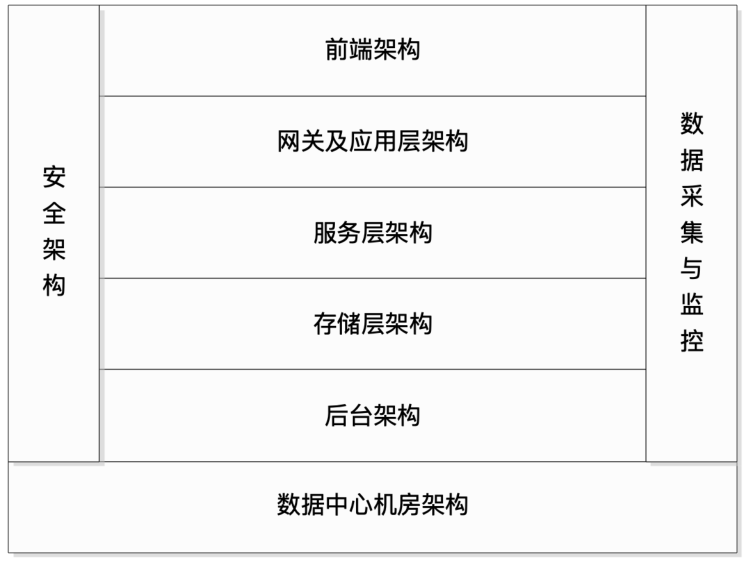


#### 前端架构

- App 及 Web 开发技术
- 浏览器及HTTP优化技术
- CDN
- 动静分离
- 图片服务
- 反向代理
- DNS


#### 网关及应用层架构

- 网关架构
- 负载均衡
- 动态页面静态化
- 业务拆分


#### 服务层架构

- 微服务框架
- 分布式消息队列
- 分布式缓存
- 分布式一致性（锁）服务


#### 存储层架构

- 分布式文件
- 分布式关系数据库
- NoSQL数据库


#### 后台架构

- 大数据平台
- 搜索引擎
- 推荐引擎
- 数据仓库


#### 运维与安全

- 数据采集与展示
- 数据监控与报警
- 攻击与防护
- 数据加密与解密


### 推荐书籍

- 大型网站技术架构


### 维基百科技术架构

- https://zh.wikipedia.org/wiki/Wikipedia:%E9%A6%96%E9%A1%B5
- https://en.wikipedia.org/wiki/Main_Page

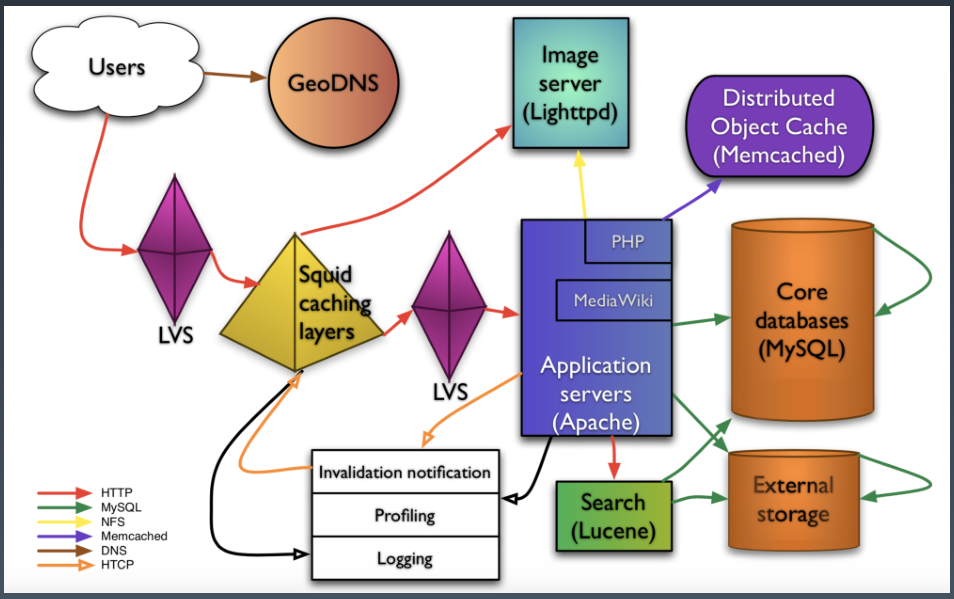


### 淘宝业务发展及技术架构

参考：[淘宝业务发展及技术架构](Data/taobao.pdf)


### 宅米网技术变迁 - 橱窗互联网公司的技术发展之路

参考：[宅米网技术变迁](Data/zhaimiNet.pdf)


### 微博架构与平台安全

参考：[微博架构与平台安全](Data/weibo.pdf)


### 课后练习

一个典型的大型互联网应用系统使用了哪些技术方案和手段，主要解决什么问题？请列举描述。


## 分布式技术选型

### 分布式缓存架构

#### 什么是缓存 Cache

缓存: 存储在计算机上的一个原始数据复制集,以便于访问  -- 维基百科        

缓存是介于数据访问者和数据源之间的一种高速存储, 当数据需要多次读取的时候,用于加快读取的速度。        

缓存( Cache)和缓冲(Buffer)的分别?

> 缓冲是两种数据传输速率不同的时候，防止高速率等待低速率的操作，一般使用缓冲保证总体传输速率的性能。


#### 无处不在的缓存        

- CPU缓存    
- 操作系统缓存    
- 数据库缓存    
- JVM编译缓存       

- CDN缓存    
- 代理与反向代理缓存    
- 前端缓存    
- 应用程序缓存    
- 分布式对象缓存


#### 缓存数据存储（Hash表）

- 哈希表，一般使用数组随机访问的时间复杂度为O(1)的特性，作为底层存储结构

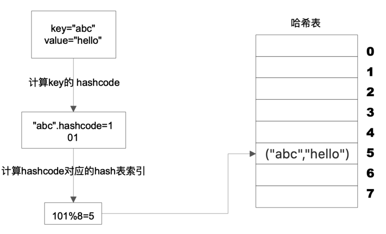


#### 缓存的关键指标        

##### 缓存命中率

- 缓存是否有效依赖于能多少次重用同一个缓存响应业务请求,这个度量指标被称作缓存命中率 。
- 如果查询一个缓存,十次查询九次能够得到正确结果,那么它的命中率是90%


#### 影响缓存命中率的主要指标

- 缓存键集合大小
- 缓存可使用内存空间
- 缓存对象生存时间


##### 缓存键集合大小        

缓存中的每个对象使用缓存键进行识别,定位一个对象的唯一方式就是对缓存键执行精确匹配。

例如,如果想为每个商品缓存在线商品信息,你需要使用商品ID作为缓存键。  

换句话说,缓存键空间是你的应用能够生成的所有键的数量。从统计数字上看,应用生成的唯一键越多,重用的机会越小。

例如,如果想基于客户IP地址缓存天气数据,则可能有多达40亿个键(这是所有可能的IP地址的数量)。如果要基于客户来源国家缓存天气数据,则可能仅需几百个缓存键(世界上所国家的数量)。

一定要想办法减少可能的缓存键数量。键数量越少,缓存的效率越高。


##### 缓存可使用内存空间        

缓存可使用内存空间直接决定了缓存对象的平均大小和缓存对象数量。

因为缓存通常存储在内存中,缓存对象可用空间受到严格限制且相对昂贵。如果想缓存更多的对象,就需要先删除老的对象,再添加新的对象。替换(清除)对象会降低缓存命中率,因为缓存对象被删除后,将来的请求就无法命中了。

物理上能缓存的对象越多,缓存命中率就越高。


##### 缓存对象生存时间        

缓存对象生存时间称为TTL( Time To Live)。

在某些场景中,例如,缓存天气预报数据15分钟没问题。在这个场景下,你可以设置缓存对象预定义TTL为15分钟。

在其他场景中,你可能不能冒险使用过于陈旧的数据。例如,在一个电子商务系统中,店铺管理员可能在任何时刻修改商品价格,如果这些价格需要准确地展示在整个网站中。在这个场景下,你需要在每次商品价格修改时让缓存失效。

简单讲,对象缓存的时间越长,  缓存对象被重用的可能性就越高。


#### 代理缓存

- 存在用户端

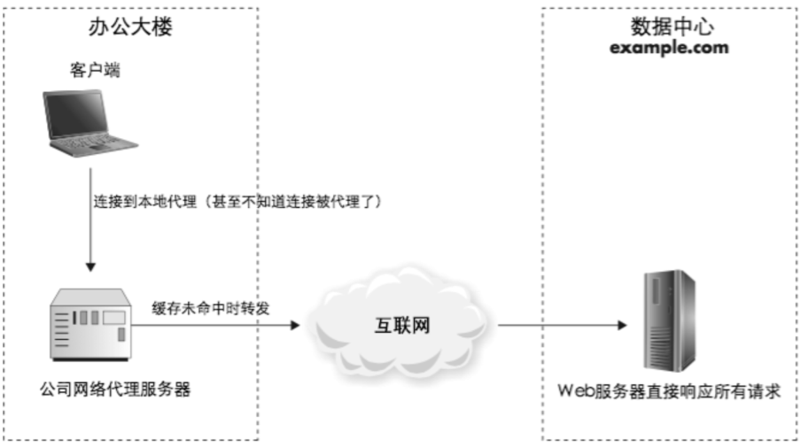


#### 反向代理缓存

- 存在服务端

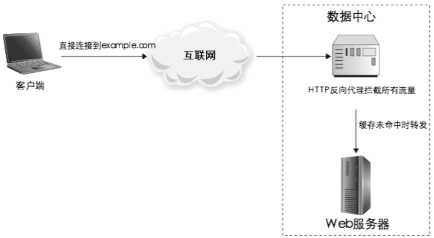


#### 多重反向代理缓存

- 添加前端 Web 缓存 和 Web服务缓存

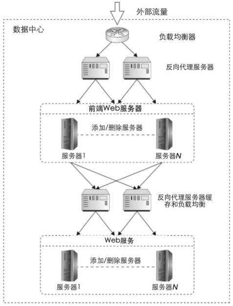


#### 内容分发网络（CDN）

- 缓存静态资源等内容
- 中国早期，蓝汛，CDN厂商，ChinaCache

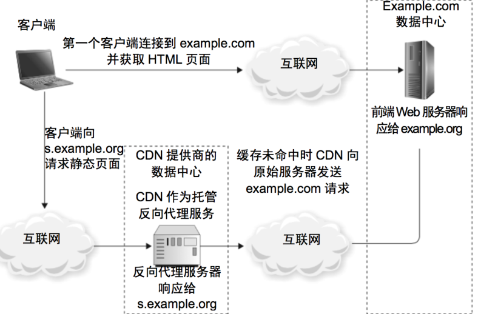


#### CDN同时配置静态文件和动态内容


#### 通读缓存（read-through)

- 代理缓存，反向代理缓存，CDN缓存都是通读缓存。
- 通读缓存给客户端返回缓存资源，并在请求未命中缓存时获取实际数据。
- 客户端连接的是通读缓存而不是生成响应的原始服务器。

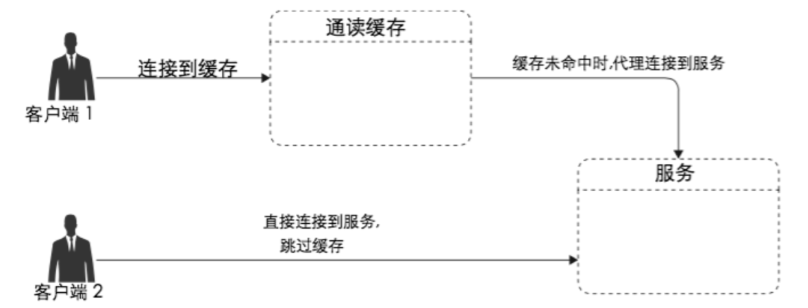


#### 旁路缓存（cache-aside）

- 对象缓存是一种旁路缓存,旁路缓存通常是一个独立的键值对(key- -value)存储。    
- 应用代码通常会询问对象缓存需要的对象是否存在,如果存在,它会获取并使用缓存的对象,如果不存在或已过期,应用会连接主数据源来组装对象,并将其保存回对象缓存中以便将来使用。

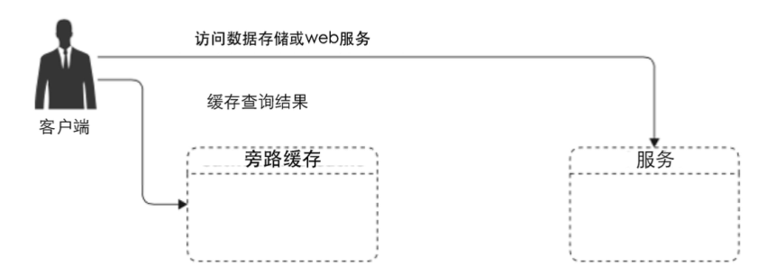


#### 浏览器对象缓存

```javascript
// 在 WebStorage 中缓存对象的 JavaScript 代码
var preferences = { /* data object to be stored */}
localStorage.setItem('preferences', JSON.stringify(preferences));

// 访问对象缓存对象的 JavaScript 代码
var cachedData = localStorage.getItem('preference');
var preferenced = JSPN.parse(cachedData);
```


#### 本地对象缓存

- 对象直接缓存在应用程序内存中。  
- 对象存储在共享内存,同一台机器的多个进程可以访问它们。    
- 缓存服务器作为独立应用和应用程序部署在同一个服务器上。


##### 本地对象缓存构建分布式集群

- 注意：这种方式构建的集群，由于会同步所有应用服务器之间的数据，必然会造成缓存的效率不高，并且应用服务器的性能也会受到影响。

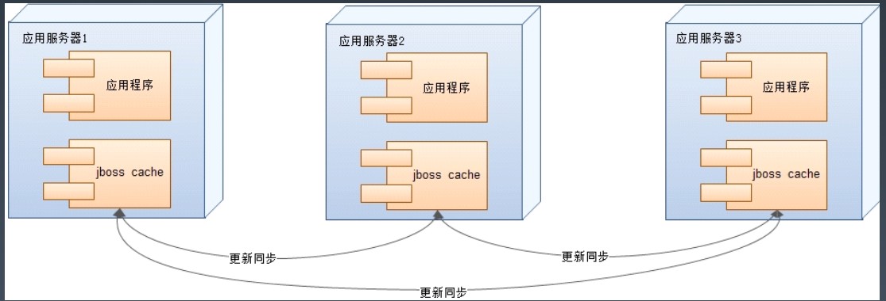


#### 远程分布式对象缓存

- 直接将缓存单另为一个服务器，不会影响应用服务器

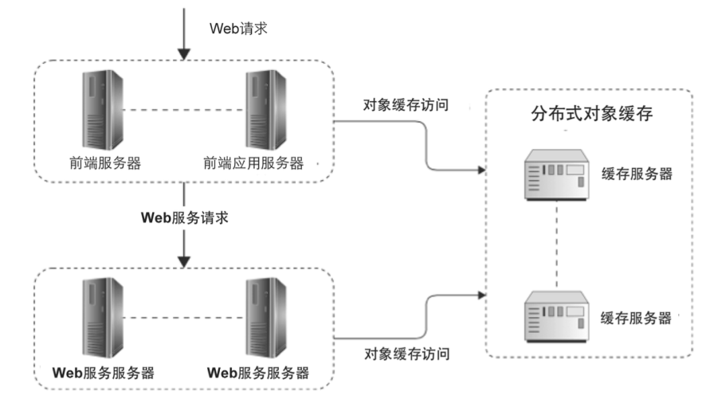


#### Memcached 分布式对象缓存

```php
// PHP客户端访问 Memcached集群    
$m = new Memcached();

// 添加服务器集群    
$cache -> add Servers(array(
  array(cache1.example.com, 11211),  
  array(cache2.example.com, 11211),
  array(cache3.example.com, 11211)
));
  
// 写缓存,失效时间5分钟    
$m -> set(userCount, 123, 600);
```

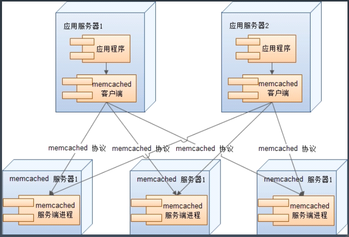


#### Memcached 分布式缓存访问模型

- Memcached 老一代的缓存技术
- 直接部署的是Memcached的服务器，会配有对应的客户端SDK
- 只需要调用SDK的API就可以，剩下的全部交给 Memcached 客户端和服务端完成

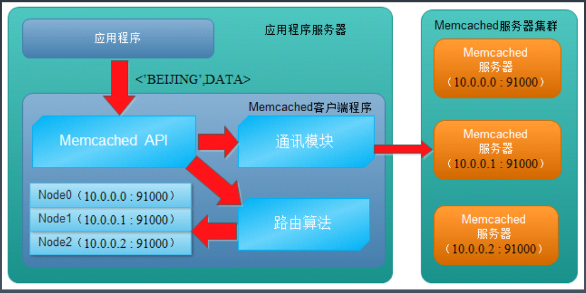


#### 一致性 hash 算法

##### 分布式对象缓存的一致性 hash 算法

- int 类型的正整数为 2^32-1个
- hash 的数值，也在这个int的范围内
- 可以避免直接进行取模，分片数据带来的，添加服务器，缓存失效问题


##### 一致性Hash节点扩容

- 扩容的时候，会出现影响范围较小的效果
- 但是，对于整个缓存的负载分担并不均匀，随机性太强

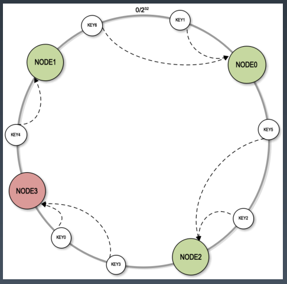


##### 基于虚拟节点的一致性 Hash 算法

- 将一个服务器虚拟成为固定数量的虚拟节点
- 将虚拟节点随机分配到整个hash链上，可以解决负载分担不均匀的问题

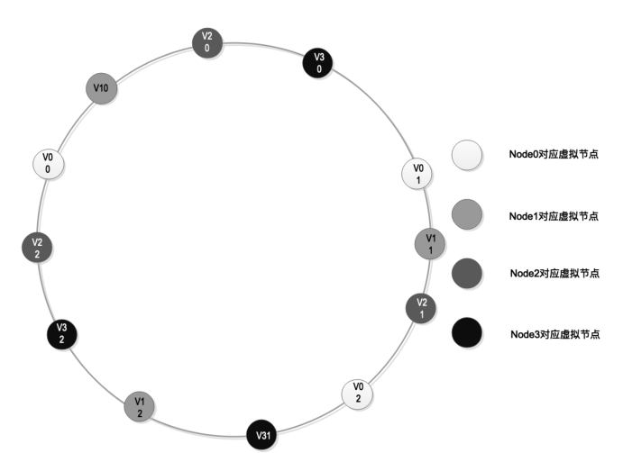


#### 各种介质数据访问延迟

- 跨越大西洋一来回需要 300 ms 的时候

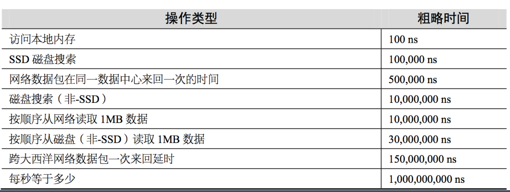


#### 技术栈各个层次的缓存

- 越靠近客户端效果越好
- 对于视频，直播类网站，CDN是不可或缺的缓存方案

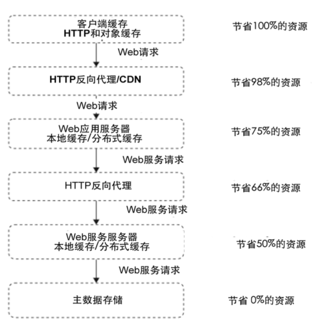


#### 缓存为什么能显著提升性能

- 缓存数据通常来自内存,比磁盘上的数据有更快的访问速度。        
- 缓存存储数据的最终结果形态,不需要中间计算,减少CPU资源的消耗。        
- 缓存降低数据库、磁盘、网络的负载压力,使这些设备获得更好的响应特性。


#### 缓存是系统性能优化的大杀器

- 技术简单
- 性能提升显著
- 应用场景多


#### 合理使用缓存

使用缓存对提高系统性能有很多好处,但是不合理的使用缓存可能非但不能提高系统的性能,还会成为系统的累赘,甚至风险。

实践中, 缓存滥用的情景屡见不鲜一一过分依赖缓存、不合适的数据访问特性等

- 频繁修改的数据:
  - 这种数据如果缓存起来,由于频繁修改,应用还来不及读取就已失效或更新,徒增系统负担。
  - 一般说来,数据的读写比在2:1以上,缓存才有意义。
- 没有热点的访问:
  - 缓存使用内存作为存储,内存资源宝贵而有限,不能将所有数据都缓存起来,如果应用系统访问数据没有热点,不遵循二八定律,
  - 即大部分数据访问不是集中在小部分数据上,那么缓存就没有意义,
  - 因为大部分数据还没有被再次访问就已经被挤出缓存了。
  - LRU 
    - Least Recently Used
    - 最近最少使用算法
    - 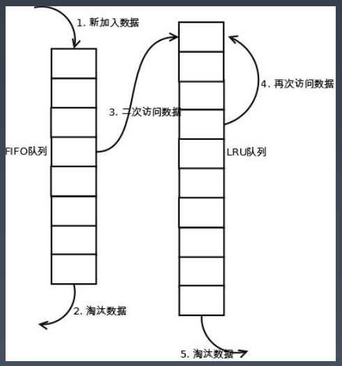
- 数据不一致与脏读:
  - 一般会对缓存的数据设置失效时间,一旦超过失效时间,就要从数据库中重新加载。
  - 因此应用要容忍一定时间的数据不一致,
  - 如卖家已经编辑了商品属性,  但是需要过一段时间才能被买家看到。在互联网应用中,这种延迟通常是可以接受的,  但是具体应用仍需慎重对待。
  - 还有一种策略是数据更新时立即更新缓存,不过也会带来更多系统开销和事务一致性的问题。
  - 因此数据更新时通知缓存失效,删除该缓存数据,  是一种更加稳妥的做法。
  - “计算机科学中只有三件事最困难：缓存失效,命名事物,计数错误。”    --Phil Karlton
- 缓存雪崩:
  - 缓存是为了提高数据读取性能的,缓存数据丢失或者缓存不可用不会影响到应用程序的处 一一 它可以从数据库直接获取数据。
  - 但是随着业务的发展,缓存会承担大部分的数据访问压力,数据库已经习惯了有缓存的日子,所以当缓存服务崩溃的时候,  数据库会因为完全不能承受如此大的压力而宕机,进而导致整个网站不可用。
  - 这种情况,  被称作缓存雪崩,发生这种故障,甚至不能简单的重启缓存服务器和数据库服务器来恢复网站访问。
- 缓存预热：
  - 缓存中存放的是热点数据，热点数据又是缓存系统利用LRU（最近最久未用）算法对不断访问的数据筛选淘汰出来的，这个过程需要花费较长的时间，
  - 在这段时间，系统的性能和数据库负载都不太好，那么最好在缓存系统启动的时候就把热点数据加载好，这个缓存预加载手段叫做缓存预热（warm up）。
  - 对于一些元数据如城市地名列表类目信息，可以启动时加载数据库中全部数据到缓存进行预热。
- 缓存穿透:
  - 如果不恰当的业务、或者恶意攻击持续高并发的请求某个不存在的数据,因为缓存没有保存该数据,所有的请求都会落到数据库上,会对数据库造成很大的压力,  甚至崩溃。
  - 一个简单的对策是将不存在的数据也缓存起来(其 value值为null),并设定一个较短的失效时间。


#### Redis vs Memcached

- Redis支持复杂的数据结构    
- Reds支持多路复用异步高性能  
- Redis支持主从复制高可用  
- Redis原生集群与 share nothing集群模式

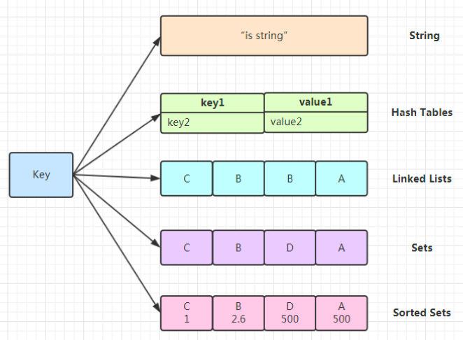


#### Redis集群

- Redis集群预分好16384个桶，当需要在Redis 集群中放置一个key-value时，根据CRC16(key)mod 16384的值，决定将一个key放到哪个桶中。
- redis-cluster 把所有的物理节点映射到[0-16383]slot上(不一定是平均分配），
- cluster 负责维护slot与服务器的映射关系。
- 客户端与Redis节点直连，客户端不需要连接集群所有节点，连接集群中任何一个可用节点即可。
- 所有的Redis 节点彼此互联。

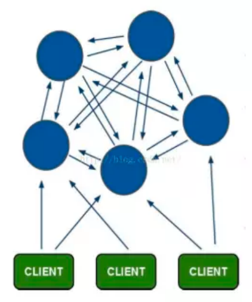


### 作业与实践

- 用你熟悉的编程语言实现一致性 hash 算法
- 编写测试用例测试这个算法，测试 100万 KV 数据，10个服务器节点的情况下，计算这些 KV 数据在服务器上分布数量的标准差，以评估算法的存储负载不均衡性。


### 消息队列与异步架构

#### 同步调用 vs 异步调用


