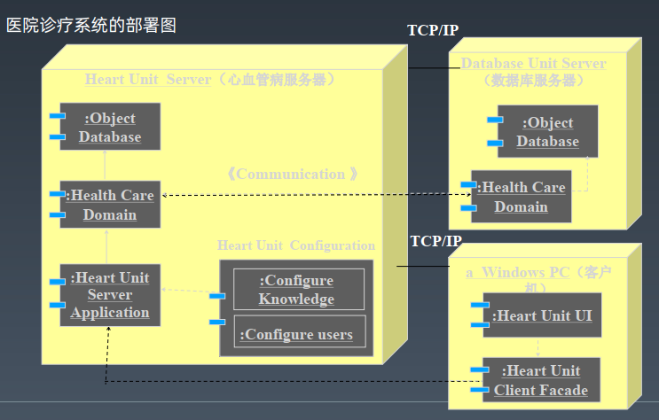
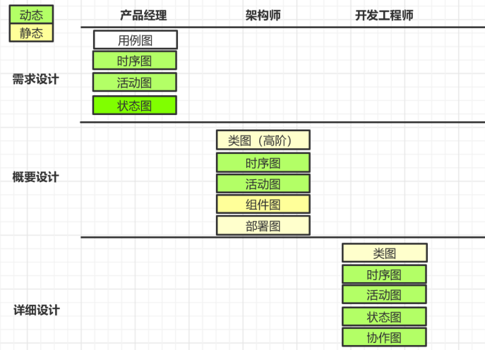
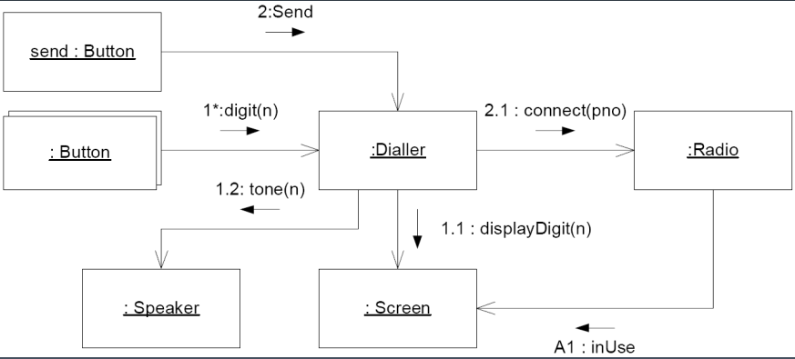

# Architecture Advanced

## 架构师岗位职责

负责产品及项目的整体架构设计，开发系统核心模块

规划业务架构的合理演进，能够制定合理的开发工作计划并实施

制定相关技术开发规范，对通用技术进行整理，提高技术复用

优化现有架构，提出合理可行的重构方案

对新技术保持非常高的敏感度，同时有能力进行评估并合理引入


## 讲师：李智慧

前阿里 & Intel 架构师，《大型网站技术架构》作者

李智慧老师现任某大厂首席架构师，他是 Apache Spark 源码贡献者，长期从事大型网站架构、大数据的研发工作，曾担任阿里巴巴技术专家、Intel 亚太研发中心架构师、WiFi 万能钥匙 CTO ，著有畅销书《大型网站技术架构：核心原理与案例分析》。

李智慧老师不仅实战经验丰富，并且还很会讲课，有超过 6 年的线下咨询、企业架构内训经验，曾经作为外聘教师为浙江大学硕士研究生开展《面向对象高级编程》课程，备受好评。老师出品了极客时间《从 0 开始学大数据》《后端技术面试 38 讲》，目前已有 2w+ 学员加入。


## 课程大纲

### **Week 1：架构方法：架构师如何做架**

#### **教学目标：**

1. 了解架构训练营的课程设计思路及内容综述。
2. 对架构师以及架构工作有一个深入透彻的理解。
3. 学习软件架构建模的一般方法和工具
4. 学习软件架构设计文档的写作模式

#### **架构工作中的痛点：**

1. 缺乏全局性思维能力
2. 缺乏超越普通开发者的视野和格局
3. 缺乏知识的全面性
4. 对软件开发本质和挑战缺乏理解
5. 缺乏做一个完整的软件架构的方法，不知道该从何下手做架构设计。
6. 缺乏软件建模的能力与技巧，不会灵活应用 UML 进行软件设计。
7. 无法通过设计文档清晰阐述自己的设计思想和方案。
8. 不清楚技术架构和技术团队管理的关系。

#### **通过学习掌握的核心能力：**

1. 对架构工作有一个正确、透彻的理解，开拓视野。
2. 使用UML进行软件设计与建模的能力。
3. 软件设计文档的写法与应用。

#### **详细内容：**

1. 架构师职责：架构工作中都要面临哪些方面的难题？

- 1. 架构师不同的职责划分，以及它们之间的联系。
  2. 训练营的课程内容综述
  3. 形形色色的架构师们

2. 架构师面试：大厂Offer该如何获取？

- 1. 互联网大厂JD解读
  2. 职责要求
  3. 技能要求
  4. 软实力要求
  5. 训练营内容与大厂JD对应关系以及学习重点
  6. 架构师技术面试套路分析

3. 架构概论：你能描述清楚软件架构与架构吗？

- 1. 对软件架构与架构师的一般误解有哪些？
  2. 什么是架构？什么是软件架构？
  3. 架构的一般方法是什么？
  4. 如何做架构？

4. 4+1视图模型：软件开发的本质是什么？如何进行软件架构设计？

- 1. 什么是软件建模？
  2. 为什么要进行软件建模？
  3. 软件建模的方法论
  4. 软件架构设计的成果和产出是什么？

5. 软件建模语言：如何使用UML进行软件架构设计与建模？

- 1. UML建模方法概述
  2. UML静态建模
  3. UML动态建模

6. 软件设计文档：架构师应该如何输出自己的架构设计？

- 1. 如何输出一份有干货的软件设计文档？
  2. 软件设计文档模板

7. 案例：我如何利用UML成为软件架构师？


### **Week 2：框架设计：开发框架是架构师实现自己架构目标的主要手段**

#### **教学目标：**

1. 掌握软件设计的基本原则。
2. 了解框架、工具、组件等概念的区别于应用方式。
3. 掌握开发框架的一般思路与方法。

#### **架构工作中的痛点：**

1. 架构师如何建立自己的技术威信，让技术人员都听他的。
2. 架构师如何掌控软件的架构，保证几十、数百人共同开发的软件不会陷入混乱。

#### **通过学习掌握的核心能力：**

1. 开发一个软件框架的方法、思想、步骤和技巧。
2. 软件设计原则的理解与应用能力。

#### **详细内容：**

1. 软件开发简史：你还在用面向对象编程语言写面向过程的代码吗？

- 1. 计算机与软件编程的历史
  2. 面向对象编程范式的本质分析

2. 框架概述：什么是软件框架，如何开发一个软件框架？

- 1. 软件框架的基本概念，框架与工具的区别。
  2. 如何通过框架掌控软件开发过程。
  3. 开发软件框架的基本方法和原则。

3. 开闭原则：如何不修改代码却能实现需求变更？

- 1. 什么是开闭原则？
  2. 违反开闭原则的代码分析
  3. 策略模式实现开闭原则
  4. 适配器模式实现开闭原则
  5. 观察者模式实现开闭原则

4. 依赖倒置原则：如何不调用代码却能复用代码的功能？

- 1. 什么是依赖倒置原则
  2. 为什么说框架必须遵循依赖倒置原则
  3. 实现依赖倒置原则的代码案例分析

5. 其他软件设计原则：如何用好多态特性设计优雅的软件架构？

- 1. 里氏替换原则
  2. 单一职责原则
  3. 接口隔离原则

6. 案例：反应式编程框架Flower的设计案例分析

- 1. 什么是反应式编程，反应式编程解决什么问题
  2. 反应式编程框架Flower的设计原理分析


### **Week 3：代码重构：代码重构能力是架构师最基本的能力**

#### **教学目标：**

1. 掌握常用软件设计模式
2. 了解常用开源软件中的设计模式

#### **架构工作中的痛点：**

1. 架构师应该写什么样的代码？
2. 架构师如何指导工程师开发优雅的代码？
3. 什么样的情况下该进行代码重构了？
4. 架构师如何如何组织研发团队进行代码重构？

#### **通过学习掌握的核心能力：**

1. 灵活应用设计模式的能力
2. 利用设计模式重构代码的能力

#### **详细内容：**

1. 代码腐坏：糟糕的代码会带来什么样的烦恼？

- 1. 一个代码因需求变更而逐渐腐坏的例子
  2. 糟糕的代码有哪些特点？
  3. 优雅的代码应该是什么样子？

2. 设计模式基础：如何使用设计模式优化代码？

- 1. 设计模式在软件开发中的地位
  2. 用工厂模式实现开闭原则
  3. 建造模式
  4. 原型模式
  5. 单例模式
  6. 适配器模式

3. 案例：JUnit 的设计模式分析：为什么说 JUnit 是设计模式样本？

- 1. 单元测试需求分析
  2. JUnit 中的模板方法模式
  3. JUnit 中的策略模式
  4. JUnit 中的装饰器模式
  5. JUnit 中的组合模式
  6. 实现依赖倒置原则的代码案例分析

4. 案例：我在Intel开发的大数据仓库引擎Panthera设计模式分析：设计模式如何拯救我的工作？

- 1. 大数据仓库架构设计分析
  2. Panthera中的组合模式分析
  3. Panthera中的装饰器模式分析

 

 

### **Week 4：系统架构：系统架构知识是架构师的常识而不是能力**

#### **教学目标：**

1. 理解高并发系统的历史演化过程
2. 理解高并发系统的架构模式
3. 理解高并发系统架构的常用技术解决方案

#### **架构工作中的痛点：**

1. 对大规模高并发系统的整体架构缺乏宏观的认知
2. 对大规模高并发系统的技术挑战缺乏直观认知和知识背景

#### **通过学习掌握的核心能力：**

1. 使高并发系统架构知识成为自己的常识，并本能地应用到自己的架构实践中。
2. 训练系统架构设计时平衡选择技术方案的能力。

#### **详细内容：**

1. 系统架构概述：高并发系统架构面临怎样的挑战？

- 1. 高并发挑战
  2. 高可用挑战
  3. 安全性挑战
  4. 快速迭代的挑战
  5. 垂直伸缩与水平伸缩的策略选择

2. 系统架构体系：高并发系统经历了怎样的演化历程？

- 1. 早期互联网系统架构
  2. 高并发系统架构的演化历程
  3. 互联网企业的技术思想是如何形成的

3. 系统架构模式概述：系统架构设计需要关注哪些方面？

- 1. 高性能架构模式
  2. 高可用架构模式
  3. 可伸缩架构模式
  4. 可扩展架构模式
  5. 安全架构模式

4. 分布式技术体系：一个大规模分布式系统架构包含了哪些技术？

- 1. 前端架构技术体系
  2. 服务端架构技术体系
  3. 存储架构技术体系
  4. 监控与运维技术体系
  5. 大数据技术体系

5. 案例：维基百科架构设计案例分析：20人团队如何开发、运维全球第六大互联网站？

- 1. 维基百科业务背景与技术特点分析
  2. 维基百科的整体系统架构分析
  3. 维基百科的高性能架构分析

6. 案例：淘宝架构演化案例分析：为什么说淘宝最初也很low？

- 1. 淘宝业务变迁历史分析
  2. 淘宝早期的几次重要技术架构重构分析

 

 

### **Week 5-6：技术选型：技术选型能力反映了架构师的综合水平**

#### **教学目标：**

1. 掌握常用分布式技术的架构原理
2. 理解各种分布式技术的优缺点
3. 理解常用分布式技术的产品特点与选型依据

#### **架构工作中的痛点：**

1. 对于常用的分布式技术只知道怎么用，却不理解其内部技术原理
2. 每种分布式技术都有很多产品技术方案，不知道该如何选型

#### **通过学习掌握的核心能力：**

1. 针对不同业务场景，选择合适技术方案的能力，以及在技术方案之中，选择合适产品的能力
2. 超越缓存、消息队列、负载均衡、数据分库分片、NoSQL、搜索引擎等各种分布式技术会用的阶段，理解其内部原理，达到可以优化、修改其代码的能力，必要时，可自己开发同类产品的能力

#### **详细内容：**

1. 分布式缓存架构：为什么说缓存是改善性能的杀手锏？

- 1. 缓存的核心原理与应用场景分析
  2. 缓存的分类
  3. CDN缓存原理分析
  4. 反向代理缓存原理分析
  5. 对象缓存原理分析
  6. 分布式对象缓存的访问模型
  7. 分布式对象缓存的应用场景与注意事项
  8. 缓存失效LRU算法分析
  9. 分布式对象缓存集群扩容的挑战与一致性Hash算法
  10. Memcached与Redis对比与技术选型分析

2. 消息队列架构：如何避免系统故障传递？

- 1. 消息队列的应用场景分析
  2. 消息队列的架构方案
  3. 消息队列架构优缺点分析
  4. Kafka、ActiveMQ等常用消息队列产品选型分析

3. 负载均衡架构：如何用十行代码写一个负载均衡服务器？

- 1. 负载均衡架构的技术原理
  2. 负载均衡的HTTP重定向实现技术
  3. 负载均衡的DNS解析实现技术
  4. 负载均衡的反向代理实现技术
  5. 负载均衡的IP路由实现技术
  6. 负载均衡的链路层路由实现技术
  7. 负载均衡的常用路由算法分析

4. 分布式关系数据库架构？数据库分库、分片有什么区别？

- 1. MySQL主从复制实现分布式架构的技术原理
  2. 数据库分库设计
  3. 关系数据库分片技术实现方案
  4. 分布式数据库中间件MyCat实现原理
  5. 分布式数据库复制、分片混合部署架构方案
  6. 分布式数据库集群扩容技术方案

5. NoSQL数据库架构？NoSQL数据库当初是怎么火起来的？

- 1. CAP原理分析
  2. 分布式系统的数据一致性挑战
  3. 应对数据一致性挑战的几种策略
  4. Cassandra实现数据的技术方案
  5. HBase技术架构与应用分析

6. 分布式锁架构：ZooKeeper是如何实现分布式强一致性的？

- 1. 什么是分布式系统脑裂？
  2. CAP原理再分析
  3. ZooKeeper分布式强一致性原理
  4. ZooKeeper应用场景分析

7. 搜索引擎架构：为什么说成功的架构必须要把握住细节？

- 1. 互联网爬虫系统技术原理
  2. 倒排索引技术原理
  3. Elasticsearch技术原理分析

8. 案例：我在阿里巴巴开发NoSQL系统Doris的设计案例分析：在互联网大厂开发基础技术产品是什么体验？

- 1. 开发 Doris 的背景
  2. Doris 架构设计分析


### **Week 7-9：性能优化：性能优化是架构师展现自己技术全面性的时刻**

#### **教学目标：**

1. 理解主要性能指标的意义
2. 了解性能测试的关键过程
3. 掌握一般性能分析方法和性能优化的思考策略
4. 理解基础技术背后的原理及其对性能的影响

#### **架构工作中的痛点：**

1. 遇到性能问题无从下手，无法量化性能问题的严重程度，也无法衡量优化后的效果
2. 解决性能问题没有系统、全面的解决办法，8只能刻舟求剑套用别人有限的技术方案，解决问题主要靠运气
3. 基本功不扎实，操作系统、文件系统、网络通信、数据库各种基础设施对性能的影响一知半解，解决问题的时候各种混乱

#### **通过学习掌握的核心能力：**

1. 全面掌握系统性能度量标准，性能测试方法的能力
2. 全面分析系统性能以及解决对策的能力
3. 融会贯通各种基础技术对性能影响的能力

#### **详细内容：**

1. 系统性能的主要技术指标：什么情况下性能指标好的系统反而感觉更慢？

- 1. 主观性能指标与客观性能指标
  2. 响应时间
  3. 吞吐量
  4. 并发数
  5. 性能计数器

2. 系统性能测试与分析：架构师如何在省钱与不出事之间走钢丝？

- 1. 性能测试的主要方式
  2. 性能测试
  3. 负载测试
  4. 压力测试
  5. 稳定性测试

3. 操作系统与程序运行时性能分析：程序是如何运行又是如何崩溃的？

- 1. 操作系统架构原理
  2. 操作系统多任务运行机制
  3. 操作系统资源消耗与性能相关性分析

4. 数据结构与内存对象访问性能分析：程序中如何选择合适的数据结构？

- 1. 常用数据结构以及内存存储访问原理
  2. Hash表原理与性能分析
  3. 红黑树原理与性能特性

5. 文件 I/O 性能优化与分析：什么办法可以把硬盘的读写速度提高十万倍？

- 1. 机械硬盘与SSD硬盘性能分析
  2. Linux文件系统架构
  3. 独立硬盘冗余阵列 RAID 如何实现文件高性能读写
  4. 分布式文件系统架构原理

6. TCP/IP协议分析与网络 I/O 优化：互联网应用一次请求响应涉及哪些网络通信？

- 1. TCP/IP协议分析
  2. HTTP协议分析
  3. 异步网络 I/O 及 epool 实现原理

7. 数据库原理与SQL性能分析：应用程序提交SQL为什么要用预编译？

- 1. 数据库架构原理
  2. 数据库连接与SQL提交方式对性能的影响
  3. 数据库文件存储原理与索引的性能影响
  4. 常见SQL性能问题分析

8. JVM虚拟机原理与垃圾回收性能分析：Java垃圾回收为什么那么慢？

- 1. JVM组成架构
  2. JVM程序运行机制
  3. JVM垃圾回收机制与不同回收算法性能分析
  4. JVM常用命令与性能分析方法

9. 大规模分布式系统性能优化的7层协议及案例分析：性能优化该从何着手？

- 1. 数据中心性能优化
  2. 硬件性能优化
  3. 操作系统性能优化
  4. 虚拟机性能优化
  5. 中间件性能优化
  6. 系统架构性能优化
  7. 代码性能优化

10. 案例：阿里巴巴秒杀系统架构设计案例分析：架构师如何应对突发的访问高峰？

- 1. 电商秒杀系统的性能挑战
  2. 秒杀架构设计分析
  3. 秒杀系统性能分析与结果验证

 

### **Week 10 模块分解：模块分解能力是架构师最核心的经验与优势**

#### **教学目标：**

1. 了解微服务架构的核心关键和挑战
2. 掌握微服务架构最佳实践方案
3. 掌握微服务框架及RCP框架设计方法
4. 了解领域模型设计方法

#### **架构工作中的痛点：**

1. 想要上微服务，却不知该从何下手
2. 上了微服务，系统变得更加难以维护，不知道哪里出了问题
3. 实现业务就是CRUD，一点技术含量没有，不知道该如何突破和提高

#### **通过学习掌握的核心能力：**

1. 真正掌控微服务架构的设计能力
2. 领域分析和设计的能力
3. 微服务框架、RPC框架设计、开发能力

#### **详细内容：**

1. 微服务架构：为什么现在微服务架构现在遇到这么多的失败和困难

- 1. 我在阿里巴巴经历的微服务架构重构
  2. 微服务架构设计最困难的是模块分解
  3. 微服务架构落地的最佳实践

2. 模块分解的设计原则：模块的边界在哪里？

- 1. 模块化设计的历史溯源
  2. 模块设计的聚合性原则
  3. 模块设计的依赖性原则

3. 微服务框架Dubbo设计原理与RPC实现分析：如何开发自己的微服务框架？

- 1. WebService架构分析
  2. Dubbo架构设计分析
  3. RPC框架分析

4. 领域驱动设计：架构师如何才能越老越吃香？

- 1. 领域模型模式
  2. 充血模型与贫血模型
  3. 领域驱动设计最佳实践

5. ServiceMesh架构、中台架构、事件驱动架构与网关架构：如何实现系统可扩展？

- 1. ServiceMesh架构分析分析
  2. 中台架构分析
  3. 事件驱动架构分析
  4. 网关架构分析


### **Week 11：安全稳定：系统安全稳定高可用是架构师最主要的KPI**

#### **教学目标：**

1. 了解系统高可用的度量标准及故障管理方法
2. 掌握高可用设计的主要方法与实现原理
3. 掌握常见系统攻击手段与防护策略

#### **架构工作中的痛点：**

1. 系统经常出故障、不稳定，不知道是哪里的问题
2. 解决系统可用性问题，东一下、西一下，没有完整的解决思路和方案
3. 不知道该如何保障系统安全性

#### **通过学习掌握的核心能力：**

1. 系统设计时，全面考虑实现高可用的架构能力
2. 系统故障时，全面分析故障原因，并解决可用性问题的能力
3. 安全性架构原理与思路

#### **详细内容：**

1. 高可用系统的度量标准：如何通过KPI提高系统可用性？

- 1. 可用性度量标准
  2. 系统故障响应流程
  3. 技术团队故障考核方案

2. 系统高可用架构方案：架构师如何避免因为系统崩溃而半夜加班？

- 1. 冗余设计与失效转移
  2. 限流、降级
  3. 服务熔断设计
  4. 高可用的事务
  5. 异步架构实现故障隔离
  6. 异地多活多机房架构

3. 系统高可用运维：如何避免系统发布引起故障？

- 1. 代码分支管理
  2. 发布管理
  3. 预发布管理

4. 系统安全架构：架构师如何避免因数据泄密而背锅？

- 1. 网络攻击与防护
  2. 数据加密与解密
  3. 系统安全防火墙


### **Week 12-13：数据应用：会用数据的架构师可以超越开发及架构**

#### **教学目标：**

1. 掌握Hadoop大数据技术原理与应用
2. 掌握Spark技术原理与应用
3. 掌握Flink等大数据流计算原理与应用
4. 掌握Hive等大数据仓库原理与应用的能力
5. 掌握数据分析的原理与应用
6. 掌握数据挖掘与机器学习的原理与应用

#### **架构工作中的痛点：**

1. 对大数据略知一二，不成体系也无法在实践中应用
2. 技术架构成熟的公司环境中，如何寻找个人新的成长点与职业发展机会

#### **通过学习掌握的核心能力：**

1. 大数据开发与应用的能力
2. 利用数据，发现新商业价值的能力

#### **详细内容：**

1. 大数据原理概述：大数据有什么用？

- 1. 大数据技术的核心思想
  2. 大数据技术体系与发展历史
  3. 大数据主要的应用场景分析

2. 分布式文件系统HDFS：如何存储数百T的数据？

- 1. HDFS架构分析
  2. HDFS高可用设计

3. 大数据计算框架MapReduce：架构师应该有能力自己实现MapReduce计算框架

- 1. MapReduce编程模型与案例分析
  2. Hadoop1架构与执行过程分析
  3. 操作系统资源消耗与性能相关性分析

4. 大数据集群资源管理系统Yarn：为什么说Yarn也是一个框架？

- 1. 大数据集群管理和应用的挑战
  2. Yarn架构分析

5. 大数据仓库Hive：SQL如何转化为MapReduce计算？

- 1. SQL生成MapReduce计算逻辑分析
  2. SQL生成MapReduce处理过程分析
  3. Hive架构分析

6. 快速大数据引擎Spark：Spark为什么比MapReduce快那么多？

- 1. Spark生态体系
  2. Spark为什么更快
  3. Spark编程模型案例分析
  4. Spark架构分析

7. 流式大数据Flink、Storm、Spark Streaming：大数据技术是一脉相承的

- 1. Storm架构原理
  2. Flink架构原理
  3. Spark Streaming架构原理

8. 大数据分析：产品运营好不好，数据全知道

- 1. 数据分析常用指标
  2. 数据可视化
  3. AB测试与数据驱动运营

9. 数据挖掘：如何从数据中发现规律？

- 1. 数据分类预测
  2. 数据关联分析
  3. 推荐引擎算法

10. 机器学习：机器学习和数学的关系是什么？

- 1. 机器学习算法原理
  2. 神经网络算法分析

11. 案例：一个利用数据分析发现运营异常的案例分析

- 1. 数据异常监控
  2. 异常原因分析

12. 案例：Spark 源码性能优化分析案例分析

- 1. 性能优化步骤
  2. Spark 源码性能分析与优化

 

 

 

### **Week 14：技术创新：创新让架构师保持职业发展之路长盛不衰**

#### **教学目标：**

1. 了解创新在架构师职业生涯中的重要作用
2. 理解区块链技术架构原理与典型应用场景
3. 理解物联网技术架构原理与典型应用场景
4. 掌握基于大数据的AI平台架构设计方案
5. 了解5G技术原理与应用场景

#### **架构工作中的痛点：**

1. 多年架构师遇到职业发展瓶颈，如何成长与突破
2. 如何在自己的工作中应用区块链、AI、物联网、5G这些新技术，在未来的技术发展中引领潮流

#### **通过学习掌握的核心能力：**

1. 培养自己对新技术的技术敏感性，获得快速学习新技术的技巧和方法论
2. 应用区块链、AI、物联网、5G这些新技术的能力

#### **详细内容：**

1. 大数据与AI平台：大数据的计算结果如何响应给用户？

- 1. 大数据应用在技术架构方面的挑战
  2. 大数据与AI平台架构方案
  3. 案例：BAT大数据平台架构案例分析

2. 云计算：未来只有云计算

- 1. 公有云与私有云
  2. 虚拟化与容器

3. 区块链技术：为什么说区块链将颠覆生产关系？

- 1. 传统金融货币系统的弊端与缺陷
  2. 比特币的技术架构
  3. 以太坊技术架构
  4. 区块链应用场景分析

4. 物联网技术：无限可能的物联网

- 1. 物联网应用场景分析
  2. 物联网技术架构方案

5. 5G技术：5G真的有那么大价值吗？

- 1. 无线通信与5G技术原理
  2. 5G应用场景分析

6. 案例：我在区块链、大数据等方面的一些技术创新案例分享

 

### **Week 15：技术管理：管理也是架构师的职责**

#### **教学目标：**

1. 掌握管理学与组织行为学的一般原理
2. 掌握架构师解决问题的思路和技巧
3. 了解技术成长的一般规律和最佳实践

#### **架构工作中的痛点：**

1. 架构师也需要带团队，但是对管理发憷，心里没底
2. 架构师要跟很多人打交道，协调很多的关系，自己不善沟通，很多事情搞得事与愿违

#### **通过学习掌握的核心能力：**

1. 技术管理的基本技能
2. 人际沟通的核心技巧

#### **详细内容：**

1. 如何成为优秀的架构师：架构师的职业发展路径是什么？

- 1. 技术进化的金字塔结构
  2. 成为技术专家的发展瓶颈
  3. 成为技术专家的方法与最佳实践

2. 成为技术管理者：技术管理者和传统管理者有什么区别？

- 1. 管理的4要素
  2. 组织行为的特点与规律
  3. 德鲁克的管理学经验

3. 技术沟通之道：你真的知道自己要解决的问题是什么吗？

- 1. 发现问题的真正所在
  2. 如何达成自己的任务目标
  3. 不要掉进解决问题的陷阱

4. 案例：我做CTO的一些经验和心得


## 架构方法： 架构师如何做架构 

### 如何成为架构师？ 

- JD（简历）
- 架构师面试
- 大厂 Offer 该如何获取？
- 重新思考过往项目经历，重新设计，提高设计能力，包装简历
- 后端架构师
  - SaaS应用等后台业务的产品调研/讨论以及整体的架构设计
  - 业内难点的技术攻坚，主导核心组件/服务的编码和上线
  - 定位系统瓶颈，提高系统性能/稳定性以及业务扩展性
  - 主导扩部门协作和复杂功能的调研、设计、协调、实施和落地
  - 具备海量数据和大规模分布式系统的设计和开发经验
  - 从设计到实现始终对齐业内一流产品水准
- Java 架构师
- Java 架构师（中间件）
- 架构师


### 架构师面试题？

- 面试题
- 自我介绍；讲一个最有技术含量的项目，面对的难题，解决方案，关键技术，技术点，沟通表达，手绘流程图，手写代码能力。

**如何写一个架构设计文档，文档中应该包含哪些方面的内容？**


**子类 override 父类的方法后，想要修改抛出的异常，那么子类方法抛出的异常类应该是父类方法抛出异常类的子类还是父类？**

答：子类。


**Spring 是如何实现单例的？和设计模式中单例实现方式有什么不同？**

答：在Spring中，bean可以被定义为两种模式：prototype（多例）和singleton（单例）

singleton（单例）：只有一个共享的实例存在，所有对这个bean的请求都会返回这个唯一的实例。

prototype（多例）：对这个bean的每次请求都会创建一个新的bean实例，类似于new。

Spring bean 默认是单例模式。

简单来说，**spring中的单例是通过单例注册表实现的。**

link：https://blog.csdn.net/w1014074794/article/details/88403568


**淘宝这样的大规模分布式互联网应用系统使用了哪些技术方案和手段，主要解决什么问题？**


**什么是 CAP 原理？请描述某个你熟悉的 NoSQL 产品是如何解决CAP问题的。**


**如何进行性能测试，性能测试的流程是什么?性能测试的主要关注指标有哪些?**


**为什么在系统性能测试的时候，随着并发请求数的逐渐增加，错误响应（或者响应超时）的比例快速增加?请从操作系统的线程与进程调度原理以及计算机内部资源使用角度进行分析。**


**为什么支持异步I/O的Web服务器（比如Nginx）要比阻塞式的Web 服务器（比如Apache)性能好很多，前者要比后者可以处理的并发连接请求多几十甚至数百倍?请从异步I/O的线程阻塞特性进行分析。**


**给定一个key，为什么可以在Hash表中快速查找到value?**


**数据库索引是如何存储的?**


**Java虚拟机的垃圾回收原理是什么?**


**你怎么理解领域驱动设计 DDD？**


**DDD 的优缺点是什么？**


**导致系统故障无法正常访问的原因有哪些?保障系统稳定高可用的方案有哪些?请列举并简述。**


**为什么单向散列加密可以保护用户密码安全，请细化 week2的时序图设计，使用单向散列加密保护用户密码。**


**Spark 为什么比 MapReduce快?**

答：Spark 的出现，就是以快著称。使用DAG，有向无环图数据结构，充分利用内存和硬盘的存储，自动根据内存使用情况，动态选择。


**淘宝，头条这些应用会针对不同用户推荐不同的商品和内容，他们是如何做到的?用了哪些算法?**


**Google 搜索结果页面是如何排序的，正好使用户最想看到的页面排在前面?**


**区块链是如何保证数据无法被篡改的?**

答：区块链加密算法，椭圆加密算法。


**什么是边缘计算?**

答：类似于网关进行简单计算，将算力下沉到用户侧。


**如果你觉得系统需要进行重构，但是老板和团队成员都觉得没必要，你如何说服大家?**


**成为架构师以后，如何承担起架构师的职责，如何开展架构设计工作?**


### 架构师的主要职责

- 编写架构设计文档（week1)
- 开发编程框架（week2)
- 重构软件代码（week3)
- 设计系统架构（week4)
- 进行技术选型，解决技术应用中的问题（ week5-6)
- 优化系统性能（week7-9)
- 模块分解与微服务架构重构（week10)
- 保障系统安全与高可用（ week11)
- 大数据应用（ week12-13)
- 技术创新（week14)
- 沟通管理（week15)


### 架构师主要能力

- 编程能力
- 基础技术掌握能力
- 常用技术产品的理解与应用能力
- 性能优化与分析故障的能力
- 常用架构模式和框架的理解与应用能力
- 建模以及设计文档的方法和能力
- 业务理解与功能模块及非功能模块拆解能力
- 快速学习能力
- 沟通与领导能力


### 什么是软件架构?

软件架构，是有关软件整体结构与组件的抽象描述，用于指导大型软件系统各个方面的设计。——维基百科

**架构**表达元素间的关系，动态关系 + 静态关系。

**架构文档**是给人（老板，工程师，业务）做的，给谁看的，给的相关方的是谁？


### 关于软件开发的几个事实

软件技术的进步使得程序员不需要了解技术细节和原理就能开发出能用的软件。让程序员关注更少的事情有助于提高软件开发效率和质量。


### 什么是架构师?

架构师是做架构设计、对系统架构负责的那个人。

架构师是一顶帽子，而不是一把椅子;架构师是一个角色而不是一个职位。


### 如何做软件架构

- 编写架构设计文档（week1)
- 开发编程框架（week2)
- 重构软件代码（week3)
- 设计系统架构（week4)
- 进行技术选型，解决技术应用中的问题（ week5-6)
- 优化系统性能（week7-9)
- 模块分解与微服务架构重构（week10)
- 保障系统安全与高可用（ week11)
- 大数据应用（ week12-13)
- 技术创新（week14)
- 沟通管理（week15)


### 大家关心的一些问题

架构师与全栈工程师的区别是什么?两者之间是否有联系?

架构师应该怎么成长?哪些人适合做架构师?

技术的广度和深度怎么去选择和平衡?

当您面对一个陌生领域，或者复杂问题时，这种情况就好比您的工作经验比较少的领域，您是如何突破自我，做到驾轻就熟的?

有没有什么好的方式沉淀领域（行业）知识，以便构建个人中台?

学完之后，怎么应聘架构师?

感觉单单靠老师讲课还不够，希望老师推荐一些必备技能的书单，让我们在跟着老师学习过程中还可以有目标的去看一些书。


### 如何通过训练营提高自己

- 架构师训练营，而不是架构训练营。
  - 架构方法、架构模式、关键知识点可以训练，但是架构一定要实践，一定要关注场景。
- 课程中所有的技术都只是例子，通过学习例子训练架构思维，构建知识体系。
  - 通过例子，总结模式，通过模式，构建知识体系。


## 4+1视图模型：软件开发的本质是什么？如何进行软件架构设计？ 

### 4+1 架构视图

- 软件架构={元素，形式，关系/约束}
- 单一的视图无法完整的表达架构，因此需要具备完整的视图集。
  - 逻辑视图(Logical View)，设计的对象模型。
  - 过程视图（Process View)，捕捉设计的并发和同步特征。
  - 物理视图（Physical View)，描述了软件到硬件的映射，反映了部署特性。
  - 开发视图（Development View），描述了在开发环境中软件的静态组织结构。
  - 场景视图(scenarios)，描述用例场景。


#### 逻辑视图

相关方:客户，用户，开发组织管理者。

视角:系统的功能元素，以及它们接口，职责，交互。

主要元素:系统，子系统，功能模块，子功能模块，接口。

用途:开发组织划分，成本/进度的评估。


#### 开发视图

相关者:开发相关人员，测试人员。

视角:系统如何开发实现。

主要元素:描述系统的层，分区，包，框架，系统通用服务，业务通用服务，类和接口，系统平台和相关基础框架。

用途:指导开发组织设计和开发实现。


#### 物理视图

相关者:系统集成商，系统运维人员。

视角:系统逻辑组件到物理节点的物理部署和节点之间的物理网络配置。

主要元素:物理节点以及节点的通信。


#### 过程视图

相关者:性能优化，开发相关人员。

视角:系统运行时线程，进程的情况。

主要元素:系统进程，线程以及处理队列等。


#### 场景视图

相关者:用户，设计和开发人员。

视角:概括了架构上最重要的场景（最典型或者最有风险）及其非功能性需求，通过这些场景的实现，阐明了架构的广度或众多架构元素运行的方式。


### 软件建模语言 ~ 如何使用 UML 进行软件架构设计与建模？

#### 什么是模型?

模型是一个系统的完整的**抽象**。人们对某个领域特定问题的求解及解决方案，对它们的理解和认识都蕴涵在模型中。

通常，开发一个计算机系统是为了解决某个领域特定问题，问题的求解过程，就是从领域问题到计算机系统的映射。


#### 为什么要建造模型?

- 建造传统模型的目的
  - 为了证明某件事物能否工作
  - 前提:建造模型的成本远远低于建造实物的成本
    - 造飞机
    - 造高楼
- 建造软件模型的目的
  - 为了与它人沟通
  - 为了保存软件设计的最终成果
  - 前提:除非模型比代码更说明问题


#### 何时、何处画图?

- 何时画图?
  - 讨论、交流时
  - 最终设计文档
    - 只保留少量的、重要的图
    - 避免涉及过多内容和实现细节
- 何处画图?
  - 白板
  - 绘图工具，如: Visio、Aastah、亿图图示(win)、edrawmax(mac)
  - draw.io


#### UML 简介

- 什么是 UML?
  - Unified Modeling Language，或统一建模语言
  - 以图形方式描述软件的概念
- UML可用来描述:
  - 某个问题领域
  - 构思中的软件设计
  - 描述已经完成的软件实现


#### UML 图的分类-静态图

静态图 – 通过描述类、对象和数据结构以及它们之间存在的关系，来描述软件要素中不变的逻辑结构。

- 用例图（Use Case Diagrams)
- 对象图(Object Diagrams)
- 类图(Class Diagrams)
- 组件图（Component Diagrams)
- 包图(Package Diagrams)
- 部署图（Deployment Diagrams)


#### UML 图的分类-动态图

动态图 – 通过描绘执行流程或者实体状态变化的方式，来展示软件实体在执行过程中的变化过程。

- 时序图(Sequence Diagrams)
- 活动图(Activity Diagrams)
- 状态图(State Diagrams)
- 合作图（Collaboration Diagrams)


#### 通用模型元素

可以在图中使用的概念统称为模型元素。

模型元素在图中用其相应的**视图元素**（符号)表示，下图给出了常用的元素符号:类、对象、结点、包和组件等。


模型元素与模型元素之间的**连接关系**也是模型元素，常见的关系有关联（association）、泛化( generalization)、依赖(dependency）和聚合（aggregation)。

- 关联: 连接（connect）模型元素及链接（ link）实例。
- 依赖: 表示一个元素以某种方式依赖于另一种元素。
- 泛化: 表示一般与特殊的关系，即“一般”元素是“特殊”关系的泛化。
- 聚合:表示整体与部分的关系。（每一个小整体组合在一起成为一个大的整体，拆开之后还是一个整体）
- 组合：（每一个零部件组合在一起成为一个新的物品，拆开之后就不是一个整体）
- 继承（继承方法和属性）
- 实现（实现接口，子类 override 父类的方法）

这些关系的图示符号如图所示。


#### 用例建模(用例图)

用例建模技术，用于描述系统的功能需求。在宏观上给出模型的总体轮廓。通过对典型用例的分析，使开发者能够有效地**了解用户的需求**。


用例模型描述的是外部执行者(Actor）所理解的系统功能。它描述了待开发系统的功能需求。

它驱动了需求分析之后各阶段的开发工作,不仅在开发过程中保证了系统所有功能的实现，而且被用于验证和检测所开发的系统，从而影响到开发工作的各个阶段和 UML 的各个模型。

用例模型由若干个用例图构成，用例图中主要描述执行者和用例之间的关系。在UML中，构成用例图的主要元素是用例和执行者及其它们之间的联系。

创建用例模型的工作包括:定义系统、确定执行者和用例、描述用例、定义用例间的关系、确认模型。


##### 执行者(Actor)

执行者是指用户在系统中所扮演的角色。执行者在用例图中是用类似人的图形来表示，但执行者可以是人，也可以是一个外界系统。

注意:用例总是由执行者启动的。

如何确定执行者:

- 谁使用系统的主要功能(主执行者)?
- 谁需要从系统获得对日常工作的支持和服务?
- 需要谁维护管理系统的日常运行（副执行者）?
- 系统需要控制哪些硬件设备?
- 系统需要与其它哪些系统交互?
- 谁需要使用系统产生的结果（值)?


##### 《使用》和《扩展》关系

用例图描述了系统的功能需求，它是从执行者的角度来理解系统，用于捕获系统的需求，规划和控制项目;描述了系统外部的执行者与系统提供的用例之间的某种联系。

图中还有另外两种类型的连接，即《使用》和《扩展》关系，是两种不同形式的泛化关系。

《Use》表示一个用例使用另一个用例。

《Extend》通过向被扩展的用例添加动作来扩展用例。


##### 项目与资源管理系统的Use case图 示例

系统的主要功能是:项目管理，资源管理和系统管理。

项目管理包括项目的增加、删除、更新。资源管理包括对资源和技能的添加、删除和更新。系统管理包括系统的启动和关闭，数据的存储和备份等功能。

- 分析确定系统的执行者（角色)
  - 项目管理员、资源管理员、系统管理员、备份数据系统。
- 确定用例
  - 项目管理，资源管理和系统管理。
- 对用例进行分解，画出下层的Use case图
  - 对上层的用例进行分解,并将执行者分配到各层次的Use case图中。


#### 静态建模

任何建模语言都以静态建模机制为基础,标准建模语言UML也不例外。所谓静态建模是指对象之间通过属性互相联系，而这些关系不随时间而转移。

类和对象的建模，是 UML建模的基础。UML 的静态建模机制包括:

- 用例图(Use case diagram)
- 对象图(Object diagram )
- 类图(Class diagram)
- 包图(Package diagram)
- 组件图(Component diagram)
- 部署图(Deployment diagram)


#### 类与对象(类图与对象图)

面向对象的开发方法的基本任务是建立对象模型，是软件系统开发的基础。

UML 中的类图(Class Diagram）与对象图（Object Diagram）表达了对象模型的静态结构，能够有效地建立专业领域的计算机系统对象模型。


##### 属性（attribute)

属性用来描述类的特征，表示需要处理的数据。

属性定义:

- visibility attribute-name : type = initial-value {property-string}
- 可见性 属性名: 类型=缺省值{约束特性}

其中: 可见性（visibility）表示该属性对类外的元素是否可见。

分为:

- public (+)公有的。
- private (-)私有的。
- protected (#)受保护的。
- 默认（未声明)


##### 操作

对数据的具体处理方法的描述则放在操作部分，操作说明了该类能做些什么工作。操作通常称为函数，它是类的一个组成部分，只能作用于该类的对象上。

操作定义:

- visibility operating-name(parameter-list): return-type {property- string)
- 可见性 操作名（参数表）;返回类型{约束特性}


##### 一个使用 Visio 绘制的类图


#### 包图(包图)

一个最古老的软件方法问题是:怎样将大系统拆分成小系统。解决该问题的思路之一是将许多类集合成一个更高层次的单位，形成一个高内聚、低耦合的类的集合。

UML 中这种分组机制叫包（Package)。引入包是为了降低系统的复杂性。

·


#### 动态建模

动态模型主要描述系统的动态行为和控制结构。动态行为包括系统中对象生存期内可能的状态以及事件发生时状态的转移，对象之间动态合作关系，显示对象之间的交互过程以及交互顺序，同时描述了为满足用例要求所进行的活动以及活动间的约束关系。

在动态模型中,对象间的交互是通过对象间消息的传递来完成的。对象通过相互间的通信(消息传递）进行合作，并在其生命周期中根据通信的结果不断改变自身的状态。


#### 动态模型

动态模型主要描述系统的动态行为和控制结构。

包括四类图:状态图、活动图、时序图、合作图。

- 时序图（sequence diagram)):是一种交互图，主要描述对象之间的动态合作关系以及合作过程中的行为次序，常用来描述一个用例的行为。
- 活动图（activity diagram):着重描述操作实现中完成的工作以及用例实例或对象中的活动，
  活动图是状态图的一个变种。
- 状态图（state diagram):状态图用来描述对象，子系统，系统的生命周期。
- 合作图(collaboration diagram):用于描述相互合作的对象间的交互关系，它描述的交互
  关系是对象间的消息连接关系。


#### UML中的消息

- 简单消息(simple)
  - 表示控制流，描述控制如何从一个对象传递到另一个对象，但不描述通信的细节。
- 同步消息(synchronous)
  - 是一种嵌套的控制流，用操作调用实现。操作的执行者要到消息相应操作执行完并回送一个简单消息后，再继续执行。
- 异步消息（ asynchronous)
  - 是一种异步的控制流，消息的发送者在消息发送后就继续执行，不等待消息的处理。


#### 时序图(时序图)

时序图(Sequence Diagram）用来描述对象之间动态的交互行为,着重体现对象间消息传递的时间顺序。

时序图存在两个轴:

- 水平轴表示一组对象
- 垂直轴表示时间

时序图中的对象用一个带有垂直虚线的矩形框表示，并标有对象名和类名。垂直虚线是对象的生命线,用于表示在某段时间内对象是存在的。

对象间的通信通过在对象的生命线之间消息来表示，消息的箭头类型指明消息的类型。


##### 时序图的形式

有两种使用时序图的方式:一般格式和实例格式。

实例格式详细描述一次可能的交互。没有任何条件和分支或循环，它仅仅显示选定情节(场景)的交互。

而一般格式则描述所有的情节。因此，包括了分支，条件和循环。


#### 活动图(活动图)

活动图（Activity Diagram)的应用非常广泛,它既可用来描述操作（类的方法）的行为，也可以描述用例和对象内部的工作过程,并可用于表示并行过程。

活动图描述了系统中各种活动的执行的顺序。刻化一个方法中所要进行的各项活动的执行流程。

活动图中一个活动结束后将立即进入下一个活动（在状态图中状态的变迁可能需要事件的触发)。


##### 活动图的模型元素

构成活动图的模型元素有: 活动、转移、对象、信号、泳道等。


##### 活动

- 是构成活动图的核心元素，是具有内部动作的状态，由隐含的事件触发活动的转移。
- 活动的解释依赖于作图的目的和抽象层次，在概念层描述中，活动表示要完成的一些任务
- 在说明层和实现层中，活动表示类中的方法。
- 活动用圆角框表示，标注活动名。
- 模型元素有:活动、转移、对象、信号、泳道等。
- 活动还有其它的图符：初态、终态、判断、同步。


##### 转移

- 转移描述活动之间的关系，描述由于隐含事件引起的活动变迁，即转移可以连接各活动及特殊活动（初态、终态、判断、同步线）。
- 转移用带箭头的直线表示，可标注执行该转移的条件，无标注表示顺序执行。


##### 泳道

- 泳道进一步描述完成活动的对象，并聚合一组活动。活动图是另一种描述交互的方式，描述采取何种动作，做什么（对象状态改变)，何时发生（动作序列)，以及在何处发生（泳道)。
- 泳道也是一种分组机制。


##### 对象流

- 活动图中可以出现对象，对象作为活动的输入/输出，用虚箭头表示。


##### 控制图符

- 活动图中可发送和接收信号，发送符号对应于与转移联系在一起的发送短句。接收符号也同转移联系在一起。


#### 状态图(状态图)

状态图(State Diagram）用来描述一个特定对象的所有可能的状态及其引起状态转移的事件。一个状态图包括一系列的状态以及状态之间的转移。

所有对象都具有状态，状态是对象执行了一系列活动的结果。当某个事件发生后,对象的状态将发生变化。状态图中定义的状态有:

- 初态-状态图的起始点，一个状态图只能有一个初态。
- 终态–是状态图的终点，而终态则可以有多个。
- 中间状态–可包括三个区域:名字域、状态变量与活动域。
- 复合状态–可以进一步细化的状态称作复合状态。


#### 合作图(合作图)

合作图（Collaboration Diagram)，也称为协作图，用于描述相互合作的对象间的交互关系和链接（Link）关系。

虽然时序图和合作图都用来描述对象间的交互关系，但侧重点不一样。时序图着重体现交互的时间顺序，合作图则着重体现交互对象间的静态链接关系。


#### 实现模型

实现模型描述了系统实现时的一些特性，又称为物理体系结构建模。包括源代码的静态结构和运行时刻的实现结构。

实现模型包括:

- 组件图(Component diagram）显示代码本身的逻辑结构，它描述系统中存在的软构件以及
  它们之间的依赖关系。
- 部署图(Deployment diagram）描述了系统中硬件和软件的物理配置情况和系统体系结构。
  显示系统运行时刻的结构，部署图中的简单结点是指实际的物理设备以及在该结点上运行构件或对象。部署图还描述结点之间的连接以及通信类型。


#### 组件图(组件图)

组件(component)

组件定义:系统中遵从一组接口且提供其实现的物理的、可替换的部分。对系统的物理方面建模时，它是一个重要的构造块。

组件可以看作包与类对应的物理代码模块，逻辑上与包，类对应，实际上是一个文件，可以有下列几种类型的构件:

- 源代码构件
- 二进制构件
- 可执行构件


组件之间的依赖关系是指结构之间在编译，连接或执行时的依赖关系。用虚线箭头表示组件图符:


#### 部署图(部署图)

部署图用来描述系统硬件的物理拓扑结构以及在此结构上执行的软件，即系统运行时刻的结构。

部署图可以显示计算机结点的拓扑结构和通信路径，结点上执行的组件，特别对于分布式系统，部署图可以清楚的描述系统中硬件设备的配置，通信以及在各硬件设备上各种软构件和对象的配置。

因此，部署图是描述任何基于计算机的应用系统的物理配置或逻辑配置的有力工具，部署图的元素有结点和连接。

部署图中的结点代表某种计算机，通常是某种硬件。同时结点还包括在其上运行的软组件，软件组件代表可执行的物理代码模块。如一个可执行程序。结点的图符是一个立方体。


部署图各结点之间进行交互的通信路径称为连接，连接表示系统中的结点存在着联系，用结点之间的的连线表示连接，在连接的连线上标注通信类型。




#### 产品生命周期 UML 图绘制时机




### 架构设计⽂档模板 

[架构设计⽂档模板.md](./SoftwareDesignDemo.md) 

[架构设计⽂档模板 pdf](./SoftwareDesignDemo.pdf)


### UML 练习 1

食堂就餐卡系统设计

- 系统中每个消费者都有一张卡，在管理中心注册缴费，卡内记着消费者的身份、余额。
- 使用时将卡插入收款机则显示卡上金额，服务员按收款机上数字键，收款机自动计算并显示消费额及余额。
- 管理中心的管理员监视每一笔消费，可打印出消费情况的相关统计数据。

请设计系统用例图，组件图，组件时序图，部署图。


**基于UML的食堂就餐卡系统的设计**：http://www.uml.org.cn/appCase/200701244.asp

用例图：


部署图：


## 架构之美：如何遵循康威定律做出优秀架构？

### 康威定律

设计系统的架构受限制于产生这些设计的组织的沟通结构。


### 第一定律

Communication dictates design。

组织沟通方式决定系统设计。

启示：

- 架构设计不仅仅是关于系统的设计，也是关于开发组织方式的设计
- 架构师要关注公司的组织结构，公司的运行方式
- 架构师要关注团队的成员构成，技术水平
- 架构师要对项目计划负责


### 第二定律

There is never enough time to do something right, but there is always enough time to do it over。

时间再多一件事情也不可能做的完美，但总有时间做完一件事情。

启示：

- 架构是权衡的艺术，没有正确的架构，只有合适的架构;没有完美的架构，但是有灵活的架构。
- 架构师如何面对压力，保守还是激进，目光长远还是只看眼前，将反映在他的架构设计中。
- 真真正正重要的事，只有一件:完成任务。


### 第三定律

There is a homomorphism from the linear graph of a system to the linear graph of its design organization。

线型系统和线型组织架构间有潜在的异质同态特性。

启示：

- 如果你的团队成员职责混乱，那么你将会设计出一个混乱的系统。
- 每个设计混乱、故障不断的系统背后，都有一个混乱、没有战斗力的团队。重构这样的系统，首先要重构开发团队。
- 架构师不是救世主，在拯救项目之前，先拯救自己。


### 第四定律

The structures of large systems tend to disintegrate during development, qualitatively more so than with small systems。

大的系统总是比小系统更倾向于分解。

启示

- 随着系统变得更大、更复杂，系统重构拆分是一种必然的冲动。
- 所有能持续发展的系统，都必然变得更大、更复杂。
- 架构师将在系统重构拆分中奠定（失去）自己的技术威望。
- 随着系统发展，微服务架构是一种必然的架构选择，但并不一定是一开始最好的选择。


### 一个创业公司的技术团队组织结构变迁


### GPS


### 都江堰


## 形形色色的架构师

### 按作用划分架构师

- 设计型架构师
  - 也就是一般意义上的架构师，负责系统架构设计，同时也要负责架构的实施落地、演化发展、推广重构。
- 救火型架构师
  - 充当救火队员的角色，系统出现故障或者“灵异现象”，会请他们出马解决，有时重要而紧急的项目也会
    由此类架构师主持。
  - 他们通常是公司的元老，对系统有全局性的认识，知道“水有多深”。
- 布道型架构师
  - 对某一领域有较深刻的认识，有时候甚至是坚定的技术信仰，乐于同他人分享自己的知识，希望能够推广自己的技术主张，此类架构师通常有较好的个人影响力。
  - 但有时，由于自身的局限或者不能跟上技术潮流的发展，会成为忽悠型的“大师”、偶像派的专家。
- Geek 型架构师
  - 架构师中的Geek，对某些技术问题的研究达到疯狂偏执的境地，精益求精追求完美。
  - 通常由于知识技能不够全面，不符合许多企业对架构师“高大全”的要求，此类架构师常有怀才不遇之惑。


### 按效果划分架构师

- 夏尔巴人架构师
  - 夏尔巴人生活在喜马拉雅山麓，协助探险队或者登山爱好者攀登那些8000米以上被称为“生命的禁区”的雪山，帮助他们运送给养到突击队营地，以及作为向导带领登山队员登顶。每一次成功对于登山队员是一次自我的超越，而对于夏尔巴人，不过是完成了一个工作。
  - 夏尔巴人架构师通常会开发项目中最具技术难度和挑战性的模块，从而为整个项目的顺利进行铺平道路。
- 斯巴达人架构师
  - 传说在古希腊，城邦之间发生战争，如果有城邦向斯巴达人求援，斯巴达人只会派出一个人去协助，但只要这一个人就可以扭转战局。
  - 不管项目有多么艰难复杂，只要有斯巴达人架构师，大家就会坚信，项目一定能顺利完成。斯巴达人架构师带给项目组的，不只是技术和方法，更重要的是必胜的信念。这种信念是架构师自己积累起来的气场和影响力。
- 达官贵人架构师
  - 此类架构师或者有傲人的学历，或者有辉煌的履历，或仪表堂堂，或口吐莲花，但是公司里如果有个吃人的怪兽，悄悄地把此类架构师都吃光了，也没人会发现。


### 按职责角色划分架构师

- 产品架构师
  - 负责具体互联网产品的技术架构。当产品业务规划确定后，产品架构师就要开始产品的架构设计了，和运营团队确定PV数、用户数、商品数等产品运营目标、发展规划、非功能指标;和产品经理确定功能需求、模块划分等功能目标;和项目经理确定各种开发资源。获得必要的信息后进行整体架构设计，参与项目开发。产品架构师一般会参与产品的整个生命周期。
- 基础服务架构师
  - 有时候也被称为平台架构师，负责开发基础框架、公共组件、通用服务等平台类产品。
  - 在大型互联网应用中，基础服务承担着海量的数据存储和核心业务处理服务，有许多挑战性的工作。
- 基础设施架构师
  - 负责网络、存储、数据库运维管理的架构师，此类架构师一般有专门的称呼(如DBA等)。
  - 此外，根据具体的职责，在数据挖掘、搜索技术、安全诚信、运维监控等领域也有专门的架构师。


### 按关注层次划分架构师

- 只关注功能的架构师
  - 架构目标只是完成功能，通常，这不叫架构。
- 关注非功能的架构师
  - 除了产品功能，架构设计也关注性能、伸缩性、安全性、可用性、系统未来的扩展性，以及上线后易于运维管理、监控报警、故障修复等非功能目标。
- 关注团队组织与管理的架构师
  - 架构设计不但关注功能目标和非功能目标，同时还考虑开发团队的成员特点、进度安排、开发过程等，使架构设计和项目管理完美融合。
- 关注产品运营的架构师
  - 架构设计不但关注产品的各项功能、非功能指标和开发过程的可实现性，还关注产品运营是否合理方便，能否达到运营目标，技术架构兼顾产品业务架构。也就是关注技术最终价值的架构师。
- 关注产品和团队未来的架构师
  - 不但关注前面提到的所有方面，还会结合技术发展趋势、公司战略目标、个人及团队发展方向，去思考产品未来的发展前景。
  - 为产品的发展演化符合历史发展趋势而设计并为其奠定一个坚实的基础。


### 按口碑划分架构师

- 最好的架构师
  - 和团队相处日久，通常情况下团队成员感觉不出他的存在，貌似没有他工作也可以完成得很好，但是如果他真的离开了，大家就会觉得心里空荡荡，没了主心骨。
- 好的架构师
  - 深得团队成员的敬重和信任，承担项目中的重要设计开发工作，团队几乎离不开他。
  - 一般架构师承担了项目中大部分的技术工作，却常常因为团队成员不符合自己的期望而经常雷霆大发。
- 差的架构师
  - 既无技术实力也不善于处理人际关系，常被团队成员鄙视，主要工作是给大家添乱、制造笑话和八卦的谈资。
- 最差的架构师
  - 通过制造压力驱使团队成员努力去完成一些无价值的工作，让每个人都忙碌不堪以使大家都没有注意到他自己其实并不能胜任工作。
  - 这种架构师对组织整体和团队成员的伤害无以复加，却常常因为敬业和努力的形象而得到老板的肯定。


### 非主流方式划分架构师

- 普通架构师
  - 从问题和需求出发，结合个人经验、组织资源、业界模式进行架构设计，中规中矩，能够切实可行地解决问题满足需求，是架构师中的普通青年。
- 文艺架构师
  - 除了像普通架构师那样在架构设计中解决问题，文艺架构师还会在架构设计中进行一些更前瞻的思考和别出心裁的设计。
  - 此类架构师的设计文档通常会透着文艺青年的小清新范儿，喜欢在文档的开头描述他们与众不同的设计理念和风格。
- 1+1架构师
  - 不包括那些完全不能胜任架构设计工作的架构师，此类架构师喜欢在架构设计中堆砌概念和模式，设计文档宏大而不着调，面面俱到却不解决具体问题，说起来头头是道却不知如何落地。
  - 其根源不是不了解真正的问题就是不掌握正确的方法。有时候也不排除这样一种可能性:做架构设计的目的是为了炫耀自己知道这么多术语。


## 软件开发简史：你还在用面向对象编程语言写面向过程的代码吗？

### 莱布尼茨的奇思怪想

计算机软件编程是个非常新兴的行业，程序员这一职业的出现不过半个多世纪，但是人类从事软件编程的探索却要久远的多，在计算机出现之前，甚至蒸汽机出现之前，人类就开始探索软件编程了。

最早开始编程探索的人是德国人莱布尼兹，早在1700年代，莱布尼兹就期望将各种事物都通过一种逻辑语言进行描述，然后用一种可执行演算规则的机器进行计算，就可以计算出事物的各种结果。这种思想其实和我们现代的软件编程与计算机已经差不多了，莱布尼兹为了实现这个想法，进行了大量的工作，获得了丰硕的成果，其中就包括了微积分和二进制。


### 人类第一位程序媛

莱布尼兹制造可编程计算机的梦想没有成功。又过了100年，法国人雅卡尔发明了一台可编程的织布机，这种织布机读取纸带上的打孔，进而控制织布机织出不同的图案。

于是人们开始尝将打孔纸带用于计算机编程，19世纪中叶，当英国人Ada利用打孔纸带写出人类第一个软件程序的时候，距能够运行这个程序的计算机的发明还有100年的时间，而这个程序已经包含了循环和子程序。

Ada因此被认为是人类第一个程序员，准确的说，是程序媛。科技发明受时代的限制，天才们的想象力和聪明才智却可以超越时代。


### 什么是计算机?什么是程序?

人类发明制造计算机器有非常悠久的历史，但是这些计算机器都是专门进行数值计算的，加减乘除、微分积分等等。

而从莱布尼兹、Ada，到图灵、冯诺依曼，这些现代计算机的开创者们试图创造的是一种通用的计算机，这种计算机不是读取数值进行计算，而是读取数据进行计算，这些数据本身包含着计算的逻辑，这个数据就是程序。


### 现代计算机与现代的程序

当冯诺依曼在 ENIAC 计算机上输入第一个程序的时候，标志着现代计算机的诞生，也意味着软件编程这一新兴的行业即将出现。

最早的计算机编程非常麻烦，程序员需要将电线编来编去，作为输入数据，以控制计算机的执行，这也是编程这个词的由来。不过很快人们就将打孔纸带应用到计算机上，编程的效率极大提升。


### 形形色色的编程语言

#### 汇编语言（以下为6502汇编)

```sh
2000: BMI $2009  ;结果为负数,那么转地址2009
2002: BEQ $200c  ;若=0,转地址200c
2004: CLC        ;这里说明>0
2005: ADC #$01
2007: TAY
2008: RTS
2009: LDY #$01
200B: RTS
200C: LDY #$00
200E: RTS
```

每一种CPU都有独特的机器语言，因而需要不同的汇编语言


#### 早期Basic语言

```sh
10 CLS:J=1:TROFF:KEY OFE:DIM
Z(30),B$ (20,20),c(30),BS (22):BS=0:BS$ (1)="YES":BS$(0)="NO":DIM BU$ (11)，PL(11),DI$ (11),cH (11),sc (11),CH$ (11),P2(11):P2(11)=3

11 FORI=0 TO 7:READ B$(I,10):NEXT I
12 FORI=1 TO4:READ B$(I,8):NEXT I
13 FORI=0 To 7:READ B$(I,12):NEXT I
14 FORI=1 TO 4:READ B$ (I,14) :NEXT I
15 P1=3:QF=1:L$="A":R$="D":U$="w":D$="S":P$="P":Q$="Q":M$="o"
16 FORI=1 TO2:READ B$(I,18） :NEXT I
17 FOR I=1 TO 2:READ B$(I,20):NEXT I:FOR I=1 TO 30:C(I)=2:NEXT I:C(20)=1
20 COLOR 7,0,0 :CLS:DIM NA$ (11):DIM NAM$(40)
21 FOR I=1 TO 11
23 READ P2(I),BU$(I),DI$(I),CH(10), SC (I),NA$(I)
25 NEXTI:PLAY "T500"
```

早期Basic语言虽然号称为“高级语言”，但是保留了汇编语言的特征――地址（即行号)。


#### 结构化的 Basic语言(Quick Basic、Visual Basic等)

```sh
DO
	SCREEN 7, ,APage%, VPage% ' Draw to the active page
							' while showing the visual page.
	CLS 1					' Clear the active page.

	' Rotate the cube "Angle%" degrees :
	DRAw "TA" +STR$(Angle%) + Plot$

	' Angle% is some multiple of 15 degrees:
	Angle% = (Angle% + 15)MOD 360
	
	' Drawing is complete,so make the cube visible in its
	' new position by switching the active and visual pages:
	SWAP APage%, VPage%
	
LOOP WHILE INKEYS = ""		' A keystroke ends the program.
```

结构化的Basic语言仍然兼容传统的Basic，而且提供了更好的集成开发环境。

结构化的编程取消了“地址”和Goto语句，代之以几种程序控制“结构”，如:循环、条件等


#### Perl语言

```perl
package Horse;
@ISA = qw (Animal) ;

sub sound { "neigh" }
sub name {
	my $self = shift;
	$$self;
}
sub named {
	my $class = shift;
	my $name = shift;
	bless \$name,$class;
}

my $talking = Horse->named ( "Mr. Ed");
print $talking->name ;
```

Perl是一种脚本语言，最强大的功能是正则表达式。但Perl的语法比较晦涩难懂。

Perl是一种“伪”的面向对象语言。


#### C语言

```c
#include <stdio.h>
#include <stdlib.h>

int main (void){
	puts ( "Hello world ! ");
    return EXIT_sUCCESS;
}
```

C语言是一个结构化的语言


#### C++语言

```c++
#include <iostream>
using namespace std;

int main ()
{
	cout <<"Hello, world ! " <<endl;
    return 0;
}
```

C++向后兼容C的所有功能，并且提供了面向对象的编程机制。


#### Java语言

```java
package my.test;

public class TestMain {
    public static void main (string[ ] args){
    	system.out.println ("Hello world ! ");
}
```

Java是一个完全面向对象的语言，尤其是在当今的Internet编程领域，占领了绝对的市场。


### 编程语言的实质

编程的目的是:用计算机来解决现实世界的问题。

编程的过程即:在计算机所能理解的“模型”（解空间）和现实世界（问题空间）之间，建立一种联系。

编程语言是一种“抽象”的机制，问题是对“谁”来抽象:


### 问题领域(Problem Domain)

包含与系统所要解决的问题相关的实物和概念的空间。


### 抽象的种类

#### 机器代码和汇编语言

- 对基础机器进行抽象


#### 非结构化的高级语言（如Basic, Fortran 等)

- 对计算处理逻辑抽象


#### 结构化的程序设计

- 开始对问题领域进行一定程度的抽象


#### 面象对象的程序设计

- 直接表达问题空间内的元素


### 编程方法的演进


### 编程的核心要素

- 人
- 客观业务领域
- 计算机


### 什么是面向对象编程?

第一个成功的面向对象的语言Smalltalk描述:

- 万物皆为对象
- 程序是对象的集合，它们通过发送消息来告知彼此所要做的。
- 每个对象都有自己的由其他对象所构成的存储。
- 每个对象都拥有其类型。
- 某一特定类型的所有对象都可以接收同样的消息。

C++和Java等后期的面向对象语言，都是在这个定义的基础上设计的。


### 什么是对象?

Booch 对于对象的描述: 对象具有状态、行为和标识。

- 状态:表明每个对象可以有自己的数据。
- 行为:表明每个对象可以产生行为。
- 标识:表明每个对象都区别于其它的对象。（唯一的地址)


### 面向对象编程(OOP)的三要素（特征)

- 封装性（Encapsulation)
  - 隐藏实现细节（访问控制)
  - 定义接口
- 继承性(Inheritance)
  - IS-A关系
  - HAS-A关系（组合)
- 多态性（Polymorphism)
  - 后期绑定（虚函数)
  - 向上转形（up Casting)


#### No.1:封装性 - 隐藏实现

封装并不是面向对象编程语言独有的。

面向过程的编程语言，比如C语言，也可以实现封装特性，在头文件.h里面定义方法，而在实现文件.c文件里定义具体的结构体和方法实现，从而使依赖.h头文件的外部程序只能够访问头文件里定义过的方法，这样同样实现了变量和函数的封装，以及访问权限的控制。


#### No.2:继承性 - 接口的重用

继承也不是面向对象独有的。

语言也可以实现继承。如果A结构体包含B结构体的定义，那么就可以理解成A继承了B，定义在B结构上的方法可以直接（通过强制类型转换）执行A结构体的数据。


#### No.3:多态性 - 对象互换的魔法

多态也不是面向对象独有的。因为有指向函数的指针，多态事实上在C语言中也可以实现。

但是使用指向函数的指针实现多态是非常危险的，因为这种多态没有语法和编译方面的约束，只能靠程序员之间约定，一旦出现 bug，调试非常痛苦。因此在面向过程语言的开发中，这种多态并不能频繁使用。

而在面向对象的编程语言中，多态非常简单:子类实现父类或者接口的抽象方法，程序使用抽象父类或者接口编程，运行期注入不同的子类，程序就表现出不同的形态，是为多态。


### 面向对象编程与面向对象分析

面向对象编程不是使用面向对象的编程语言进行编程，而是利用多态特性进行编程。

面向对象分析是将客观世界，即编程的业务领域进行对象分析。

- 充血模型与贫血模型
- 领域驱动设计DDD


### 面向对象设计的目的和原则

面向对象设计的目的

- 强内聚、低耦合，从而使系统
  - 易扩展 - 易于增加新的功能
  - 更强壮 - 不容易被粗心的程序员破坏
  - 可移植 - 能够在多样的环境下运行
  - 更简单 - 容易理解、容易维护

面向对象设计的原则

- 为了达到上述设计目标，有人总结出了多种指导原则
- “原则”是独立于编程语言的，甚至也可以用于非面向对象的编程语言中。


### 设计模式(design patterns)

设计模式是用于解决某一种问题的通用的解决方案。

设计模式也是语言中立的。

设计模式贯彻了设计原则。

Gang of Four ,(Erich Gamma, Richard Helm, Ralph Johnson and John Vlissides）提出了三大类23种基本的设计模式:

- 创建模式
- 行为模式
- 结构模式

在更细分的领域当中还可以总结出许多设计模式:

- 并发编程模式
- Java EE模式 
- etc.


### 框架(frameworks)

框架是用来实现某一类应用的结构性的程序，是对某一类架构方案可复用的设计与实现

- 如同框架结构的大厦的框架
- 简化应用开发者的工作
- 实现了多种设计模式，使应用开发者不需要花太大的力气，就能设计出结构良好的程序来

不同领域的框架

- 微软公司为Windows编程开发了MFC框架。
- Java为它的GUI(图形用户界面）开发了AWT框架。
- 还有许多开源的框架:MyBatis,Spring等。
- Web服务器也有框架:Tomcat


### 框架VS工具

- 框架调用应用程序代码
- 应用程序代码调用工具

- 架构师用框架保证架构的落地
- 架构师用工具提高开发效率


## 面向对象设计的基本原则

### UML 练习 2

设计一个控制电话拨号的软件。

下面是一个“拨打电话”的Use Case描述:

- 我们按下数字按钮，屏幕上显示号码，扬声器发出按键音。
- 我们按下Send 按钮，系统接通无线网络，同时屏幕上显示正在拨号。


### 类图


### 合作图




copy 程序结构图


copy 程序


### 回顾 buttone/ Dialer


