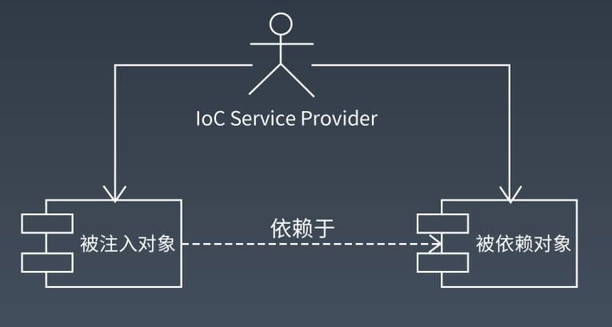
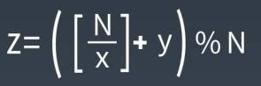
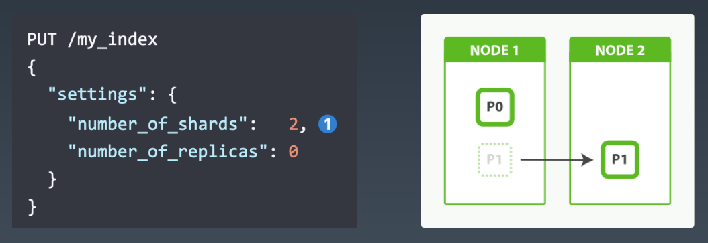
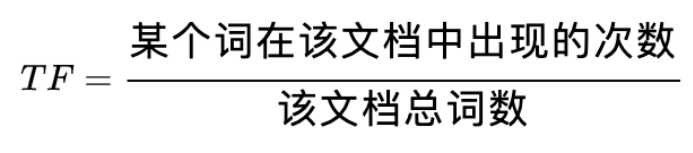
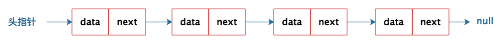
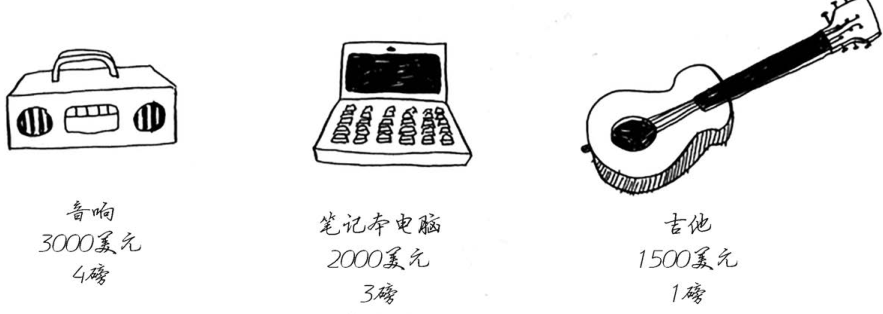
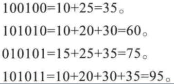
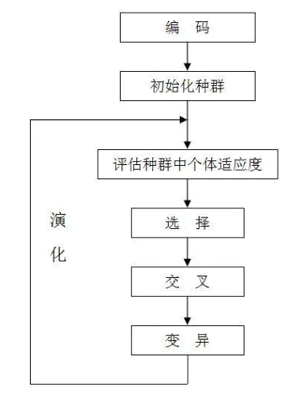
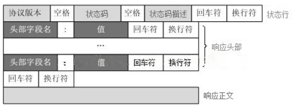

# Architecture Advanced

## 架构师岗位职责

负责产品及项目的整体架构设计，开发系统核心模块

规划业务架构的合理演进，能够制定合理的开发工作计划并实施

制定相关技术开发规范，对通用技术进行整理，提高技术复用

优化现有架构，提出合理可行的重构方案

对新技术保持非常高的敏感度，同时有能力进行评估并合理引入


## 讲师：李智慧

前阿里 & Intel 架构师，《大型网站技术架构》作者

李智慧老师现任某大厂首席架构师，他是 Apache Spark 源码贡献者，长期从事大型网站架构、大数据的研发工作，曾担任阿里巴巴技术专家、Intel 亚太研发中心架构师、WiFi 万能钥匙 CTO ，著有畅销书《大型网站技术架构：核心原理与案例分析》。

李智慧老师不仅实战经验丰富，并且还很会讲课，有超过 6 年的线下咨询、企业架构内训经验，曾经作为外聘教师为浙江大学硕士研究生开展《面向对象高级编程》课程，备受好评。老师出品了极客时间《从 0 开始学大数据》《后端技术面试 38 讲》，目前已有 2w+ 学员加入。


## 课程大纲

### **Week 1：架构方法：架构师如何做架**

#### **教学目标：**

1. 了解架构训练营的课程设计思路及内容综述。
2. 对架构师以及架构工作有一个深入透彻的理解。
3. 学习软件架构建模的一般方法和工具
4. 学习软件架构设计文档的写作模式

#### **架构工作中的痛点：**

1. 缺乏全局性思维能力
2. 缺乏超越普通开发者的视野和格局
3. 缺乏知识的全面性
4. 对软件开发本质和挑战缺乏理解
5. 缺乏做一个完整的软件架构的方法，不知道该从何下手做架构设计。
6. 缺乏软件建模的能力与技巧，不会灵活应用 UML 进行软件设计。
7. 无法通过设计文档清晰阐述自己的设计思想和方案。
8. 不清楚技术架构和技术团队管理的关系。

#### **通过学习掌握的核心能力：**

1. 对架构工作有一个正确、透彻的理解，开拓视野。
2. 使用UML进行软件设计与建模的能力。
3. 软件设计文档的写法与应用。

#### **详细内容：**

1. 架构师职责：架构工作中都要面临哪些方面的难题？

- 1. 架构师不同的职责划分，以及它们之间的联系。
  2. 训练营的课程内容综述
  3. 形形色色的架构师们

2. 架构师面试：大厂Offer该如何获取？

- 1. 互联网大厂JD解读
  2. 职责要求
  3. 技能要求
  4. 软实力要求
  5. 训练营内容与大厂JD对应关系以及学习重点
  6. 架构师技术面试套路分析

3. 架构概论：你能描述清楚软件架构与架构吗？

- 1. 对软件架构与架构师的一般误解有哪些？
  2. 什么是架构？什么是软件架构？
  3. 架构的一般方法是什么？
  4. 如何做架构？

4. 4+1视图模型：软件开发的本质是什么？如何进行软件架构设计？

- 1. 什么是软件建模？
  2. 为什么要进行软件建模？
  3. 软件建模的方法论
  4. 软件架构设计的成果和产出是什么？

5. 软件建模语言：如何使用UML进行软件架构设计与建模？

- 1. UML建模方法概述
  2. UML静态建模
  3. UML动态建模

6. 软件设计文档：架构师应该如何输出自己的架构设计？

- 1. 如何输出一份有干货的软件设计文档？
  2. 软件设计文档模板

7. 案例：我如何利用UML成为软件架构师？


### **Week 2：框架设计：开发框架是架构师实现自己架构目标的主要手段**

#### **教学目标：**

1. 掌握软件设计的基本原则。
2. 了解框架、工具、组件等概念的区别于应用方式。
3. 掌握开发框架的一般思路与方法。

#### **架构工作中的痛点：**

1. 架构师如何建立自己的技术威信，让技术人员都听他的。
2. 架构师如何掌控软件的架构，保证几十、数百人共同开发的软件不会陷入混乱。

#### **通过学习掌握的核心能力：**

1. 开发一个软件框架的方法、思想、步骤和技巧。
2. 软件设计原则的理解与应用能力。

#### **详细内容：**

1. 软件开发简史：你还在用面向对象编程语言写面向过程的代码吗？

- 1. 计算机与软件编程的历史
  2. 面向对象编程范式的本质分析

2. 框架概述：什么是软件框架，如何开发一个软件框架？

- 1. 软件框架的基本概念，框架与工具的区别。
  2. 如何通过框架掌控软件开发过程。
  3. 开发软件框架的基本方法和原则。

3. 开闭原则：如何不修改代码却能实现需求变更？

- 1. 什么是开闭原则？
  2. 违反开闭原则的代码分析
  3. 策略模式实现开闭原则
  4. 适配器模式实现开闭原则
  5. 观察者模式实现开闭原则

4. 依赖倒置原则：如何不调用代码却能复用代码的功能？

- 1. 什么是依赖倒置原则
  2. 为什么说框架必须遵循依赖倒置原则
  3. 实现依赖倒置原则的代码案例分析

5. 其他软件设计原则：如何用好多态特性设计优雅的软件架构？

- 1. 里氏替换原则
  2. 单一职责原则
  3. 接口隔离原则

6. 案例：反应式编程框架Flower的设计案例分析

- 1. 什么是反应式编程，反应式编程解决什么问题
  2. 反应式编程框架Flower的设计原理分析


### **Week 3：代码重构：代码重构能力是架构师最基本的能力**

#### **教学目标：**

1. 掌握常用软件设计模式
2. 了解常用开源软件中的设计模式

#### **架构工作中的痛点：**

1. 架构师应该写什么样的代码？
2. 架构师如何指导工程师开发优雅的代码？
3. 什么样的情况下该进行代码重构了？
4. 架构师如何如何组织研发团队进行代码重构？

#### **通过学习掌握的核心能力：**

1. 灵活应用设计模式的能力
2. 利用设计模式重构代码的能力

#### **详细内容：**

1. 代码腐坏：糟糕的代码会带来什么样的烦恼？

- 1. 一个代码因需求变更而逐渐腐坏的例子
  2. 糟糕的代码有哪些特点？
  3. 优雅的代码应该是什么样子？

2. 设计模式基础：如何使用设计模式优化代码？

- 1. 设计模式在软件开发中的地位
  2. 用工厂模式实现开闭原则
  3. 建造模式
  4. 原型模式
  5. 单例模式
  6. 适配器模式

3. 案例：JUnit 的设计模式分析：为什么说 JUnit 是设计模式样本？

- 1. 单元测试需求分析
  2. JUnit 中的模板方法模式
  3. JUnit 中的策略模式
  4. JUnit 中的装饰器模式
  5. JUnit 中的组合模式
  6. 实现依赖倒置原则的代码案例分析

4. 案例：我在Intel开发的大数据仓库引擎Panthera设计模式分析：设计模式如何拯救我的工作？

- 1. 大数据仓库架构设计分析
  2. Panthera中的组合模式分析
  3. Panthera中的装饰器模式分析

 

 

### **Week 4：系统架构：系统架构知识是架构师的常识而不是能力**

#### **教学目标：**

1. 理解高并发系统的历史演化过程
2. 理解高并发系统的架构模式
3. 理解高并发系统架构的常用技术解决方案

#### **架构工作中的痛点：**

1. 对大规模高并发系统的整体架构缺乏宏观的认知
2. 对大规模高并发系统的技术挑战缺乏直观认知和知识背景

#### **通过学习掌握的核心能力：**

1. 使高并发系统架构知识成为自己的常识，并本能地应用到自己的架构实践中。
2. 训练系统架构设计时平衡选择技术方案的能力。

#### **详细内容：**

1. 系统架构概述：高并发系统架构面临怎样的挑战？

- 1. 高并发挑战
  2. 高可用挑战
  3. 安全性挑战
  4. 快速迭代的挑战
  5. 垂直伸缩与水平伸缩的策略选择

2. 系统架构体系：高并发系统经历了怎样的演化历程？

- 1. 早期互联网系统架构
  2. 高并发系统架构的演化历程
  3. 互联网企业的技术思想是如何形成的

3. 系统架构模式概述：系统架构设计需要关注哪些方面？

- 1. 高性能架构模式
  2. 高可用架构模式
  3. 可伸缩架构模式
  4. 可扩展架构模式
  5. 安全架构模式

4. 分布式技术体系：一个大规模分布式系统架构包含了哪些技术？

- 1. 前端架构技术体系
  2. 服务端架构技术体系
  3. 存储架构技术体系
  4. 监控与运维技术体系
  5. 大数据技术体系

5. 案例：维基百科架构设计案例分析：20人团队如何开发、运维全球第六大互联网站？

- 1. 维基百科业务背景与技术特点分析
  2. 维基百科的整体系统架构分析
  3. 维基百科的高性能架构分析

6. 案例：淘宝架构演化案例分析：为什么说淘宝最初也很low？

- 1. 淘宝业务变迁历史分析
  2. 淘宝早期的几次重要技术架构重构分析

 

 

### **Week 5-6：技术选型：技术选型能力反映了架构师的综合水平**

#### **教学目标：**

1. 掌握常用分布式技术的架构原理
2. 理解各种分布式技术的优缺点
3. 理解常用分布式技术的产品特点与选型依据

#### **架构工作中的痛点：**

1. 对于常用的分布式技术只知道怎么用，却不理解其内部技术原理
2. 每种分布式技术都有很多产品技术方案，不知道该如何选型

#### **通过学习掌握的核心能力：**

1. 针对不同业务场景，选择合适技术方案的能力，以及在技术方案之中，选择合适产品的能力
2. 超越缓存、消息队列、负载均衡、数据分库分片、NoSQL、搜索引擎等各种分布式技术会用的阶段，理解其内部原理，达到可以优化、修改其代码的能力，必要时，可自己开发同类产品的能力

#### **详细内容：**

1. 分布式缓存架构：为什么说缓存是改善性能的杀手锏？

- 1. 缓存的核心原理与应用场景分析
  2. 缓存的分类
  3. CDN缓存原理分析
  4. 反向代理缓存原理分析
  5. 对象缓存原理分析
  6. 分布式对象缓存的访问模型
  7. 分布式对象缓存的应用场景与注意事项
  8. 缓存失效LRU算法分析
  9. 分布式对象缓存集群扩容的挑战与一致性Hash算法
  10. Memcached与Redis对比与技术选型分析

2. 消息队列架构：如何避免系统故障传递？

- 1. 消息队列的应用场景分析
  2. 消息队列的架构方案
  3. 消息队列架构优缺点分析
  4. Kafka、ActiveMQ等常用消息队列产品选型分析

3. 负载均衡架构：如何用十行代码写一个负载均衡服务器？

- 1. 负载均衡架构的技术原理
  2. 负载均衡的HTTP重定向实现技术
  3. 负载均衡的DNS解析实现技术
  4. 负载均衡的反向代理实现技术
  5. 负载均衡的IP路由实现技术
  6. 负载均衡的链路层路由实现技术
  7. 负载均衡的常用路由算法分析

4. 分布式关系数据库架构？数据库分库、分片有什么区别？

- 1. MySQL主从复制实现分布式架构的技术原理
  2. 数据库分库设计
  3. 关系数据库分片技术实现方案
  4. 分布式数据库中间件MyCat实现原理
  5. 分布式数据库复制、分片混合部署架构方案
  6. 分布式数据库集群扩容技术方案

5. NoSQL数据库架构？NoSQL数据库当初是怎么火起来的？

- 1. CAP原理分析
  2. 分布式系统的数据一致性挑战
  3. 应对数据一致性挑战的几种策略
  4. Cassandra实现数据的技术方案
  5. HBase技术架构与应用分析

6. 分布式锁架构：ZooKeeper是如何实现分布式强一致性的？

- 1. 什么是分布式系统脑裂？
  2. CAP原理再分析
  3. ZooKeeper分布式强一致性原理
  4. ZooKeeper应用场景分析

7. 搜索引擎架构：为什么说成功的架构必须要把握住细节？

- 1. 互联网爬虫系统技术原理
  2. 倒排索引技术原理
  3. Elasticsearch技术原理分析

8. 案例：我在阿里巴巴开发NoSQL系统Doris的设计案例分析：在互联网大厂开发基础技术产品是什么体验？

- 1. 开发 Doris 的背景
  2. Doris 架构设计分析


### **Week 7-9：性能优化：性能优化是架构师展现自己技术全面性的时刻**

#### **教学目标：**

1. 理解主要性能指标的意义
2. 了解性能测试的关键过程
3. 掌握一般性能分析方法和性能优化的思考策略
4. 理解基础技术背后的原理及其对性能的影响

#### **架构工作中的痛点：**

1. 遇到性能问题无从下手，无法量化性能问题的严重程度，也无法衡量优化后的效果
2. 解决性能问题没有系统、全面的解决办法，8只能刻舟求剑套用别人有限的技术方案，解决问题主要靠运气
3. 基本功不扎实，操作系统、文件系统、网络通信、数据库各种基础设施对性能的影响一知半解，解决问题的时候各种混乱

#### **通过学习掌握的核心能力：**

1. 全面掌握系统性能度量标准，性能测试方法的能力
2. 全面分析系统性能以及解决对策的能力
3. 融会贯通各种基础技术对性能影响的能力

#### **详细内容：**

1. 系统性能的主要技术指标：什么情况下性能指标好的系统反而感觉更慢？

- 1. 主观性能指标与客观性能指标
  2. 响应时间
  3. 吞吐量
  4. 并发数
  5. 性能计数器

2. 系统性能测试与分析：架构师如何在省钱与不出事之间走钢丝？

- 1. 性能测试的主要方式
  2. 性能测试
  3. 负载测试
  4. 压力测试
  5. 稳定性测试

3. 操作系统与程序运行时性能分析：程序是如何运行又是如何崩溃的？

- 1. 操作系统架构原理
  2. 操作系统多任务运行机制
  3. 操作系统资源消耗与性能相关性分析

4. 数据结构与内存对象访问性能分析：程序中如何选择合适的数据结构？

- 1. 常用数据结构以及内存存储访问原理
  2. Hash表原理与性能分析
  3. 红黑树原理与性能特性

5. 文件 I/O 性能优化与分析：什么办法可以把硬盘的读写速度提高十万倍？

- 1. 机械硬盘与SSD硬盘性能分析
  2. Linux文件系统架构
  3. 独立硬盘冗余阵列 RAID 如何实现文件高性能读写
  4. 分布式文件系统架构原理

6. TCP/IP协议分析与网络 I/O 优化：互联网应用一次请求响应涉及哪些网络通信？

- 1. TCP/IP协议分析
  2. HTTP协议分析
  3. 异步网络 I/O 及 epool 实现原理

7. 数据库原理与SQL性能分析：应用程序提交SQL为什么要用预编译？

- 1. 数据库架构原理
  2. 数据库连接与SQL提交方式对性能的影响
  3. 数据库文件存储原理与索引的性能影响
  4. 常见SQL性能问题分析

8. JVM虚拟机原理与垃圾回收性能分析：Java垃圾回收为什么那么慢？

- 1. JVM组成架构
  2. JVM程序运行机制
  3. JVM垃圾回收机制与不同回收算法性能分析
  4. JVM常用命令与性能分析方法

9. 大规模分布式系统性能优化的7层协议及案例分析：性能优化该从何着手？

- 1. 数据中心性能优化
  2. 硬件性能优化
  3. 操作系统性能优化
  4. 虚拟机性能优化
  5. 中间件性能优化
  6. 系统架构性能优化
  7. 代码性能优化

10. 案例：阿里巴巴秒杀系统架构设计案例分析：架构师如何应对突发的访问高峰？

- 1. 电商秒杀系统的性能挑战
  2. 秒杀架构设计分析
  3. 秒杀系统性能分析与结果验证

 

### **Week 10 模块分解：模块分解能力是架构师最核心的经验与优势**

#### **教学目标：**

1. 了解微服务架构的核心关键和挑战
2. 掌握微服务架构最佳实践方案
3. 掌握微服务框架及RCP框架设计方法
4. 了解领域模型设计方法

#### **架构工作中的痛点：**

1. 想要上微服务，却不知该从何下手
2. 上了微服务，系统变得更加难以维护，不知道哪里出了问题
3. 实现业务就是CRUD，一点技术含量没有，不知道该如何突破和提高

#### **通过学习掌握的核心能力：**

1. 真正掌控微服务架构的设计能力
2. 领域分析和设计的能力
3. 微服务框架、RPC框架设计、开发能力

#### **详细内容：**

1. 微服务架构：为什么现在微服务架构现在遇到这么多的失败和困难

- 1. 我在阿里巴巴经历的微服务架构重构
  2. 微服务架构设计最困难的是模块分解
  3. 微服务架构落地的最佳实践

2. 模块分解的设计原则：模块的边界在哪里？

- 1. 模块化设计的历史溯源
  2. 模块设计的聚合性原则
  3. 模块设计的依赖性原则

3. 微服务框架Dubbo设计原理与RPC实现分析：如何开发自己的微服务框架？

- 1. WebService架构分析
  2. Dubbo架构设计分析
  3. RPC框架分析

4. 领域驱动设计：架构师如何才能越老越吃香？

- 1. 领域模型模式
  2. 充血模型与贫血模型
  3. 领域驱动设计最佳实践

5. ServiceMesh架构、中台架构、事件驱动架构与网关架构：如何实现系统可扩展？

- 1. ServiceMesh架构分析分析
  2. 中台架构分析
  3. 事件驱动架构分析
  4. 网关架构分析


### **Week 11：安全稳定：系统安全稳定高可用是架构师最主要的KPI**

#### **教学目标：**

1. 了解系统高可用的度量标准及故障管理方法
2. 掌握高可用设计的主要方法与实现原理
3. 掌握常见系统攻击手段与防护策略

#### **架构工作中的痛点：**

1. 系统经常出故障、不稳定，不知道是哪里的问题
2. 解决系统可用性问题，东一下、西一下，没有完整的解决思路和方案
3. 不知道该如何保障系统安全性

#### **通过学习掌握的核心能力：**

1. 系统设计时，全面考虑实现高可用的架构能力
2. 系统故障时，全面分析故障原因，并解决可用性问题的能力
3. 安全性架构原理与思路

#### **详细内容：**

1. 高可用系统的度量标准：如何通过KPI提高系统可用性？

- 1. 可用性度量标准
  2. 系统故障响应流程
  3. 技术团队故障考核方案

2. 系统高可用架构方案：架构师如何避免因为系统崩溃而半夜加班？

- 1. 冗余设计与失效转移
  2. 限流、降级
  3. 服务熔断设计
  4. 高可用的事务
  5. 异步架构实现故障隔离
  6. 异地多活多机房架构

3. 系统高可用运维：如何避免系统发布引起故障？

- 1. 代码分支管理
  2. 发布管理
  3. 预发布管理

4. 系统安全架构：架构师如何避免因数据泄密而背锅？

- 1. 网络攻击与防护
  2. 数据加密与解密
  3. 系统安全防火墙


### **Week 12-13：数据应用：会用数据的架构师可以超越开发及架构**

#### **教学目标：**

1. 掌握Hadoop大数据技术原理与应用
2. 掌握Spark技术原理与应用
3. 掌握Flink等大数据流计算原理与应用
4. 掌握Hive等大数据仓库原理与应用的能力
5. 掌握数据分析的原理与应用
6. 掌握数据挖掘与机器学习的原理与应用

#### **架构工作中的痛点：**

1. 对大数据略知一二，不成体系也无法在实践中应用
2. 技术架构成熟的公司环境中，如何寻找个人新的成长点与职业发展机会

#### **通过学习掌握的核心能力：**

1. 大数据开发与应用的能力
2. 利用数据，发现新商业价值的能力

#### **详细内容：**

1. 大数据原理概述：大数据有什么用？

- 1. 大数据技术的核心思想
  2. 大数据技术体系与发展历史
  3. 大数据主要的应用场景分析

2. 分布式文件系统HDFS：如何存储数百T的数据？

- 1. HDFS架构分析
  2. HDFS高可用设计

3. 大数据计算框架MapReduce：架构师应该有能力自己实现MapReduce计算框架

- 1. MapReduce编程模型与案例分析
  2. Hadoop1架构与执行过程分析
  3. 操作系统资源消耗与性能相关性分析

4. 大数据集群资源管理系统Yarn：为什么说Yarn也是一个框架？

- 1. 大数据集群管理和应用的挑战
  2. Yarn架构分析

5. 大数据仓库Hive：SQL如何转化为MapReduce计算？

- 1. SQL生成MapReduce计算逻辑分析
  2. SQL生成MapReduce处理过程分析
  3. Hive架构分析

6. 快速大数据引擎Spark：Spark为什么比MapReduce快那么多？

- 1. Spark生态体系
  2. Spark为什么更快
  3. Spark编程模型案例分析
  4. Spark架构分析

7. 流式大数据Flink、Storm、Spark Streaming：大数据技术是一脉相承的

- 1. Storm架构原理
  2. Flink架构原理
  3. Spark Streaming架构原理

8. 大数据分析：产品运营好不好，数据全知道

- 1. 数据分析常用指标
  2. 数据可视化
  3. AB测试与数据驱动运营

9. 数据挖掘：如何从数据中发现规律？

- 1. 数据分类预测
  2. 数据关联分析
  3. 推荐引擎算法

10. 机器学习：机器学习和数学的关系是什么？

- 1. 机器学习算法原理
  2. 神经网络算法分析

11. 案例：一个利用数据分析发现运营异常的案例分析

- 1. 数据异常监控
  2. 异常原因分析

12. 案例：Spark 源码性能优化分析案例分析

- 1. 性能优化步骤
  2. Spark 源码性能分析与优化

 

 

 

### **Week 14：技术创新：创新让架构师保持职业发展之路长盛不衰**

#### **教学目标：**

1. 了解创新在架构师职业生涯中的重要作用
2. 理解区块链技术架构原理与典型应用场景
3. 理解物联网技术架构原理与典型应用场景
4. 掌握基于大数据的AI平台架构设计方案
5. 了解5G技术原理与应用场景

#### **架构工作中的痛点：**

1. 多年架构师遇到职业发展瓶颈，如何成长与突破
2. 如何在自己的工作中应用区块链、AI、物联网、5G这些新技术，在未来的技术发展中引领潮流

#### **通过学习掌握的核心能力：**

1. 培养自己对新技术的技术敏感性，获得快速学习新技术的技巧和方法论
2. 应用区块链、AI、物联网、5G这些新技术的能力

#### **详细内容：**

1. 大数据与AI平台：大数据的计算结果如何响应给用户？

- 1. 大数据应用在技术架构方面的挑战
  2. 大数据与AI平台架构方案
  3. 案例：BAT大数据平台架构案例分析

2. 云计算：未来只有云计算

- 1. 公有云与私有云
  2. 虚拟化与容器

3. 区块链技术：为什么说区块链将颠覆生产关系？

- 1. 传统金融货币系统的弊端与缺陷
  2. 比特币的技术架构
  3. 以太坊技术架构
  4. 区块链应用场景分析

4. 物联网技术：无限可能的物联网

- 1. 物联网应用场景分析
  2. 物联网技术架构方案

5. 5G技术：5G真的有那么大价值吗？

- 1. 无线通信与5G技术原理
  2. 5G应用场景分析

6. 案例：我在区块链、大数据等方面的一些技术创新案例分享

 

### **Week 15：技术管理：管理也是架构师的职责**

#### **教学目标：**

1. 掌握管理学与组织行为学的一般原理
2. 掌握架构师解决问题的思路和技巧
3. 了解技术成长的一般规律和最佳实践

#### **架构工作中的痛点：**

1. 架构师也需要带团队，但是对管理发憷，心里没底
2. 架构师要跟很多人打交道，协调很多的关系，自己不善沟通，很多事情搞得事与愿违

#### **通过学习掌握的核心能力：**

1. 技术管理的基本技能
2. 人际沟通的核心技巧

#### **详细内容：**

1. 如何成为优秀的架构师：架构师的职业发展路径是什么？

- 1. 技术进化的金字塔结构
  2. 成为技术专家的发展瓶颈
  3. 成为技术专家的方法与最佳实践

2. 成为技术管理者：技术管理者和传统管理者有什么区别？

- 1. 管理的4要素
  2. 组织行为的特点与规律
  3. 德鲁克的管理学经验

3. 技术沟通之道：你真的知道自己要解决的问题是什么吗？

- 1. 发现问题的真正所在
  2. 如何达成自己的任务目标
  3. 不要掉进解决问题的陷阱

4. 案例：我做CTO的一些经验和心得


## 架构基础

### 架构方法： 架构师如何做架构 

#### 如何成为架构师？ 

- JD（简历）
- 架构师面试
- 大厂 Offer 该如何获取？
- 重新思考过往项目经历，重新设计，提高设计能力，包装简历
- 后端架构师
  - SaaS应用等后台业务的产品调研/讨论以及整体的架构设计
  - 业内难点的技术攻坚，主导核心组件/服务的编码和上线
  - 定位系统瓶颈，提高系统性能/稳定性以及业务扩展性
  - 主导扩部门协作和复杂功能的调研、设计、协调、实施和落地
  - 具备海量数据和大规模分布式系统的设计和开发经验
  - 从设计到实现始终对齐业内一流产品水准
- Java 架构师
- Java 架构师（中间件）
- 架构师


#### 架构师面试题？

- 面试题
- 自我介绍；讲一个最有技术含量的项目，面对的难题，解决方案，关键技术，技术点，沟通表达，手绘流程图，手写代码能力。

**如何写一个架构设计文档，文档中应该包含哪些方面的内容？**


**子类 override 父类的方法后，想要修改抛出的异常，那么子类方法抛出的异常类应该是父类方法抛出异常类的子类还是父类？**

答：子类。


**Spring 是如何实现单例的？和设计模式中单例实现方式有什么不同？**

答：在Spring中，bean可以被定义为两种模式：prototype（多例）和singleton（单例）

singleton（单例）：只有一个共享的实例存在，所有对这个bean的请求都会返回这个唯一的实例。

prototype（多例）：对这个bean的每次请求都会创建一个新的bean实例，类似于new。

Spring bean 默认是单例模式。

简单来说，**spring中的单例是通过单例注册表实现的。**

link：https://blog.csdn.net/w1014074794/article/details/88403568


**淘宝这样的大规模分布式互联网应用系统使用了哪些技术方案和手段，主要解决什么问题？**


**什么是 CAP 原理？请描述某个你熟悉的 NoSQL 产品是如何解决CAP问题的。**


**如何进行性能测试，性能测试的流程是什么?性能测试的主要关注指标有哪些?**


**为什么在系统性能测试的时候，随着并发请求数的逐渐增加，错误响应（或者响应超时）的比例快速增加?请从操作系统的线程与进程调度原理以及计算机内部资源使用角度进行分析。**


**为什么支持异步I/O的Web服务器（比如Nginx）要比阻塞式的Web 服务器（比如Apache)性能好很多，前者要比后者可以处理的并发连接请求多几十甚至数百倍?请从异步I/O的线程阻塞特性进行分析。**


**给定一个key，为什么可以在Hash表中快速查找到value?**


**数据库索引是如何存储的?**


**Java虚拟机的垃圾回收原理是什么?**


**你怎么理解领域驱动设计 DDD？**


**DDD 的优缺点是什么？**


**导致系统故障无法正常访问的原因有哪些?保障系统稳定高可用的方案有哪些?请列举并简述。**


**为什么单向散列加密可以保护用户密码安全，请细化 week2的时序图设计，使用单向散列加密保护用户密码。**


**Spark 为什么比 MapReduce快?**

答：Spark 的出现，就是以快著称。使用DAG，有向无环图数据结构，充分利用内存和硬盘的存储，自动根据内存使用情况，动态选择。


**淘宝，头条这些应用会针对不同用户推荐不同的商品和内容，他们是如何做到的?用了哪些算法?**


**Google 搜索结果页面是如何排序的，正好使用户最想看到的页面排在前面?**


**区块链是如何保证数据无法被篡改的?**

答：区块链加密算法，椭圆加密算法。


**什么是边缘计算?**

答：类似于网关进行简单计算，将算力下沉到用户侧。


**如果你觉得系统需要进行重构，但是老板和团队成员都觉得没必要，你如何说服大家?**


**成为架构师以后，如何承担起架构师的职责，如何开展架构设计工作?**


#### 架构师的主要职责

- 编写架构设计文档（week1)
- 开发编程框架（week2)
- 重构软件代码（week3)
- 设计系统架构（week4)
- 进行技术选型，解决技术应用中的问题（ week5-6)
- 优化系统性能（week7-9)
- 模块分解与微服务架构重构（week10)
- 保障系统安全与高可用（ week11)
- 大数据应用（ week12-13)
- 技术创新（week14)
- 沟通管理（week15)


#### 架构师主要能力

- 编程能力
- 基础技术掌握能力
- 常用技术产品的理解与应用能力
- 性能优化与分析故障的能力
- 常用架构模式和框架的理解与应用能力
- 建模以及设计文档的方法和能力
- 业务理解与功能模块及非功能模块拆解能力
- 快速学习能力
- 沟通与领导能力


#### 什么是软件架构?

软件架构，是有关软件整体结构与组件的抽象描述，用于指导大型软件系统各个方面的设计。——维基百科

**架构**表达元素间的关系，动态关系 + 静态关系。

**架构文档**是给人（老板，工程师，业务）做的，给谁看的，给的相关方的是谁？


#### 关于软件开发的几个事实

软件技术的进步使得程序员不需要了解技术细节和原理就能开发出能用的软件。让程序员关注更少的事情有助于提高软件开发效率和质量。


#### 什么是架构师?

架构师是做架构设计、对系统架构负责的那个人。

架构师是一顶帽子，而不是一把椅子;架构师是一个角色而不是一个职位。


#### 如何做软件架构

- 编写架构设计文档（week1)
- 开发编程框架（week2)
- 重构软件代码（week3)
- 设计系统架构（week4)
- 进行技术选型，解决技术应用中的问题（ week5-6)
- 优化系统性能（week7-9)
- 模块分解与微服务架构重构（week10)
- 保障系统安全与高可用（ week11)
- 大数据应用（ week12-13)
- 技术创新（week14)
- 沟通管理（week15)


#### 大家关心的一些问题

架构师与全栈工程师的区别是什么?两者之间是否有联系?

架构师应该怎么成长?哪些人适合做架构师?

技术的广度和深度怎么去选择和平衡?

当您面对一个陌生领域，或者复杂问题时，这种情况就好比您的工作经验比较少的领域，您是如何突破自我，做到驾轻就熟的?

有没有什么好的方式沉淀领域（行业）知识，以便构建个人中台?

学完之后，怎么应聘架构师?

感觉单单靠老师讲课还不够，希望老师推荐一些必备技能的书单，让我们在跟着老师学习过程中还可以有目标的去看一些书。


#### 如何通过训练营提高自己

- 架构师训练营，而不是架构训练营。
  - 架构方法、架构模式、关键知识点可以训练，但是架构一定要实践，一定要关注场景。
- 课程中所有的技术都只是例子，通过学习例子训练架构思维，构建知识体系。
  - 通过例子，总结模式，通过模式，构建知识体系。


### 4+1视图模型：软件开发的本质是什么？如何进行软件架构设计？ 

#### 4+1 架构视图

- 软件架构={元素，形式，关系/约束}
- 单一的视图无法完整的表达架构，因此需要具备完整的视图集。
  - 逻辑视图(Logical View)，设计的对象模型。
  - 过程视图（Process View)，捕捉设计的并发和同步特征。
  - 物理视图（Physical View)，描述了软件到硬件的映射，反映了部署特性。
  - 开发视图（Development View），描述了在开发环境中软件的静态组织结构。
  - 场景视图(scenarios)，描述用例场景。


#### 逻辑视图

相关方:客户，用户，开发组织管理者。

视角:系统的功能元素，以及它们接口，职责，交互。

主要元素:系统，子系统，功能模块，子功能模块，接口。

用途:开发组织划分，成本/进度的评估。


#### 开发视图

相关者:开发相关人员，测试人员。

视角:系统如何开发实现。

主要元素:描述系统的层，分区，包，框架，系统通用服务，业务通用服务，类和接口，系统平台和相关基础框架。

用途:指导开发组织设计和开发实现。


#### 物理视图

相关者:系统集成商，系统运维人员。

视角:系统逻辑组件到物理节点的物理部署和节点之间的物理网络配置。

主要元素:物理节点以及节点的通信。


#### 过程视图

相关者:性能优化，开发相关人员。

视角:系统运行时线程，进程的情况。

主要元素:系统进程，线程以及处理队列等。


#### 场景视图

相关者:用户，设计和开发人员。

视角:概括了架构上最重要的场景（最典型或者最有风险）及其非功能性需求，通过这些场景的实现，阐明了架构的广度或众多架构元素运行的方式。


### 软件建模语言 ~ 如何使用 UML 进行软件架构设计与建模？

#### 什么是模型?

模型是一个系统的完整的**抽象**。人们对某个领域特定问题的求解及解决方案，对它们的理解和认识都蕴涵在模型中。

通常，开发一个计算机系统是为了解决某个领域特定问题，问题的求解过程，就是从领域问题到计算机系统的映射。


#### 为什么要建造模型?

- 建造传统模型的目的
  - 为了证明某件事物能否工作
  - 前提:建造模型的成本远远低于建造实物的成本
    - 造飞机
    - 造高楼
- 建造软件模型的目的
  - 为了与它人沟通
  - 为了保存软件设计的最终成果
  - 前提:除非模型比代码更说明问题


#### 何时、何处画图?

- 何时画图?
  - 讨论、交流时
  - 最终设计文档
    - 只保留少量的、重要的图
    - 避免涉及过多内容和实现细节
- 何处画图?
  - 白板
  - 绘图工具，如: Visio、Aastah、亿图图示(win)、edrawmax(mac)
  - draw.io


#### UML 简介

- 什么是 UML?
  - Unified Modeling Language，或统一建模语言
  - 以图形方式描述软件的概念
- UML可用来描述:
  - 某个问题领域
  - 构思中的软件设计
  - 描述已经完成的软件实现


#### UML 图的分类-静态图

静态图 – 通过描述类、对象和数据结构以及它们之间存在的关系，来描述软件要素中不变的逻辑结构。

- 用例图（Use Case Diagrams)
- 对象图(Object Diagrams)
- 类图(Class Diagrams)
- 组件图（Component Diagrams)
- 包图(Package Diagrams)
- 部署图（Deployment Diagrams)


#### UML 图的分类-动态图

动态图 – 通过描绘执行流程或者实体状态变化的方式，来展示软件实体在执行过程中的变化过程。

- 时序图(Sequence Diagrams)
- 活动图(Activity Diagrams)
- 状态图(State Diagrams)
- 合作图（Collaboration Diagrams)


#### 通用模型元素

可以在图中使用的概念统称为模型元素。

模型元素在图中用其相应的**视图元素**（符号)表示，下图给出了常用的元素符号:类、对象、结点、包和组件等。


模型元素与模型元素之间的**连接关系**也是模型元素，常见的关系有关联（association）、泛化( generalization)、依赖(dependency）和聚合（aggregation)。

- 关联: 连接（connect）模型元素及链接（ link）实例。
- 依赖: 表示一个元素以某种方式依赖于另一种元素。
- 泛化: 表示一般与特殊的关系，即“一般”元素是“特殊”关系的泛化。
- 聚合:表示整体与部分的关系。（每一个小整体组合在一起成为一个大的整体，拆开之后还是一个整体）
- 组合：（每一个零部件组合在一起成为一个新的物品，拆开之后就不是一个整体）
- 继承（继承方法和属性）
- 实现（实现接口，子类 override 父类的方法）

这些关系的图示符号如图所示。


#### 用例建模(用例图)

用例建模技术，用于描述系统的功能需求。在宏观上给出模型的总体轮廓。通过对典型用例的分析，使开发者能够有效地**了解用户的需求**。


用例模型描述的是外部执行者(Actor）所理解的系统功能。它描述了待开发系统的功能需求。

它驱动了需求分析之后各阶段的开发工作,不仅在开发过程中保证了系统所有功能的实现，而且被用于验证和检测所开发的系统，从而影响到开发工作的各个阶段和 UML 的各个模型。

用例模型由若干个用例图构成，用例图中主要描述执行者和用例之间的关系。在UML中，构成用例图的主要元素是用例和执行者及其它们之间的联系。

创建用例模型的工作包括:定义系统、确定执行者和用例、描述用例、定义用例间的关系、确认模型。


##### 执行者(Actor)

执行者是指用户在系统中所扮演的角色。执行者在用例图中是用类似人的图形来表示，但执行者可以是人，也可以是一个外界系统。

注意:用例总是由执行者启动的。

如何确定执行者:

- 谁使用系统的主要功能(主执行者)?
- 谁需要从系统获得对日常工作的支持和服务?
- 需要谁维护管理系统的日常运行（副执行者）?
- 系统需要控制哪些硬件设备?
- 系统需要与其它哪些系统交互?
- 谁需要使用系统产生的结果（值)?


##### 《使用》和《扩展》关系

用例图描述了系统的功能需求，它是从执行者的角度来理解系统，用于捕获系统的需求，规划和控制项目;描述了系统外部的执行者与系统提供的用例之间的某种联系。

图中还有另外两种类型的连接，即《使用》和《扩展》关系，是两种不同形式的泛化关系。

《Use》表示一个用例使用另一个用例。

《Extend》通过向被扩展的用例添加动作来扩展用例。


##### 项目与资源管理系统的Use case图 示例

系统的主要功能是:项目管理，资源管理和系统管理。

项目管理包括项目的增加、删除、更新。资源管理包括对资源和技能的添加、删除和更新。系统管理包括系统的启动和关闭，数据的存储和备份等功能。

- 分析确定系统的执行者（角色)
  - 项目管理员、资源管理员、系统管理员、备份数据系统。
- 确定用例
  - 项目管理，资源管理和系统管理。
- 对用例进行分解，画出下层的Use case图
  - 对上层的用例进行分解,并将执行者分配到各层次的Use case图中。


#### 静态建模

任何建模语言都以静态建模机制为基础,标准建模语言UML也不例外。所谓静态建模是指对象之间通过属性互相联系，而这些关系不随时间而转移。

类和对象的建模，是 UML建模的基础。UML 的静态建模机制包括:

- 用例图(Use case diagram)
- 对象图(Object diagram )
- 类图(Class diagram)
- 包图(Package diagram)
- 组件图(Component diagram)
- 部署图(Deployment diagram)


#### 类与对象(类图与对象图)

面向对象的开发方法的基本任务是建立对象模型，是软件系统开发的基础。

UML 中的类图(Class Diagram）与对象图（Object Diagram）表达了对象模型的静态结构，能够有效地建立专业领域的计算机系统对象模型。


##### 属性（attribute)

属性用来描述类的特征，表示需要处理的数据。

属性定义:

- visibility attribute-name : type = initial-value {property-string}
- 可见性 属性名: 类型=缺省值{约束特性}

其中: 可见性（visibility）表示该属性对类外的元素是否可见。

分为:

- public (+)公有的。
- private (-)私有的。
- protected (#)受保护的。
- 默认（未声明)


##### 操作

对数据的具体处理方法的描述则放在操作部分，操作说明了该类能做些什么工作。操作通常称为函数，它是类的一个组成部分，只能作用于该类的对象上。

操作定义:

- visibility operating-name(parameter-list): return-type {property- string)
- 可见性 操作名（参数表）;返回类型{约束特性}


##### 一个使用 Visio 绘制的类图


#### 包图(包图)

一个最古老的软件方法问题是:怎样将大系统拆分成小系统。解决该问题的思路之一是将许多类集合成一个更高层次的单位，形成一个高内聚、低耦合的类的集合。

UML 中这种分组机制叫包（Package)。引入包是为了降低系统的复杂性。

·


#### 动态建模

动态模型主要描述系统的动态行为和控制结构。动态行为包括系统中对象生存期内可能的状态以及事件发生时状态的转移，对象之间动态合作关系，显示对象之间的交互过程以及交互顺序，同时描述了为满足用例要求所进行的活动以及活动间的约束关系。

在动态模型中,对象间的交互是通过对象间消息的传递来完成的。对象通过相互间的通信(消息传递）进行合作，并在其生命周期中根据通信的结果不断改变自身的状态。


#### 动态模型

动态模型主要描述系统的动态行为和控制结构。

包括四类图:状态图、活动图、时序图、合作图。

- 时序图（sequence diagram)):是一种交互图，主要描述对象之间的动态合作关系以及合作过程中的行为次序，常用来描述一个用例的行为。
- 活动图（activity diagram):着重描述操作实现中完成的工作以及用例实例或对象中的活动，
  活动图是状态图的一个变种。
- 状态图（state diagram):状态图用来描述对象，子系统，系统的生命周期。
- 合作图(collaboration diagram):用于描述相互合作的对象间的交互关系，它描述的交互
  关系是对象间的消息连接关系。


#### UML中的消息

- 简单消息(simple)
  - 表示控制流，描述控制如何从一个对象传递到另一个对象，但不描述通信的细节。
- 同步消息(synchronous)
  - 是一种嵌套的控制流，用操作调用实现。操作的执行者要到消息相应操作执行完并回送一个简单消息后，再继续执行。
- 异步消息（ asynchronous)
  - 是一种异步的控制流，消息的发送者在消息发送后就继续执行，不等待消息的处理。


#### 时序图(时序图)

时序图(Sequence Diagram）用来描述对象之间动态的交互行为,着重体现对象间消息传递的时间顺序。

时序图存在两个轴:

- 水平轴表示一组对象
- 垂直轴表示时间

时序图中的对象用一个带有垂直虚线的矩形框表示，并标有对象名和类名。垂直虚线是对象的生命线,用于表示在某段时间内对象是存在的。

对象间的通信通过在对象的生命线之间消息来表示，消息的箭头类型指明消息的类型。


##### 时序图的形式

有两种使用时序图的方式:一般格式和实例格式。

实例格式详细描述一次可能的交互。没有任何条件和分支或循环，它仅仅显示选定情节(场景)的交互。

而一般格式则描述所有的情节。因此，包括了分支，条件和循环。


#### 活动图(活动图)

活动图（Activity Diagram)的应用非常广泛,它既可用来描述操作（类的方法）的行为，也可以描述用例和对象内部的工作过程,并可用于表示并行过程。

活动图描述了系统中各种活动的执行的顺序。刻化一个方法中所要进行的各项活动的执行流程。

活动图中一个活动结束后将立即进入下一个活动（在状态图中状态的变迁可能需要事件的触发)。


##### 活动图的模型元素

构成活动图的模型元素有: 活动、转移、对象、信号、泳道等。


##### 活动

- 是构成活动图的核心元素，是具有内部动作的状态，由隐含的事件触发活动的转移。
- 活动的解释依赖于作图的目的和抽象层次，在概念层描述中，活动表示要完成的一些任务
- 在说明层和实现层中，活动表示类中的方法。
- 活动用圆角框表示，标注活动名。
- 模型元素有:活动、转移、对象、信号、泳道等。
- 活动还有其它的图符：初态、终态、判断、同步。


##### 转移

- 转移描述活动之间的关系，描述由于隐含事件引起的活动变迁，即转移可以连接各活动及特殊活动（初态、终态、判断、同步线）。
- 转移用带箭头的直线表示，可标注执行该转移的条件，无标注表示顺序执行。


##### 泳道

- 泳道进一步描述完成活动的对象，并聚合一组活动。活动图是另一种描述交互的方式，描述采取何种动作，做什么（对象状态改变)，何时发生（动作序列)，以及在何处发生（泳道)。
- 泳道也是一种分组机制。


##### 对象流

- 活动图中可以出现对象，对象作为活动的输入/输出，用虚箭头表示。


##### 控制图符

- 活动图中可发送和接收信号，发送符号对应于与转移联系在一起的发送短句。接收符号也同转移联系在一起。


#### 状态图(状态图)

状态图(State Diagram）用来描述一个特定对象的所有可能的状态及其引起状态转移的事件。一个状态图包括一系列的状态以及状态之间的转移。

所有对象都具有状态，状态是对象执行了一系列活动的结果。当某个事件发生后,对象的状态将发生变化。状态图中定义的状态有:

- 初态-状态图的起始点，一个状态图只能有一个初态。
- 终态–是状态图的终点，而终态则可以有多个。
- 中间状态–可包括三个区域:名字域、状态变量与活动域。
- 复合状态–可以进一步细化的状态称作复合状态。


#### 合作图(合作图)

合作图（Collaboration Diagram)，也称为协作图，用于描述相互合作的对象间的交互关系和链接（Link）关系。

虽然时序图和合作图都用来描述对象间的交互关系，但侧重点不一样。时序图着重体现交互的时间顺序，合作图则着重体现交互对象间的静态链接关系。


#### 实现模型

实现模型描述了系统实现时的一些特性，又称为物理体系结构建模。包括源代码的静态结构和运行时刻的实现结构。

实现模型包括:

- 组件图(Component diagram）显示代码本身的逻辑结构，它描述系统中存在的软构件以及
  它们之间的依赖关系。
- 部署图(Deployment diagram）描述了系统中硬件和软件的物理配置情况和系统体系结构。
  显示系统运行时刻的结构，部署图中的简单结点是指实际的物理设备以及在该结点上运行构件或对象。部署图还描述结点之间的连接以及通信类型。


#### 组件图(组件图)

组件(component)

组件定义:系统中遵从一组接口且提供其实现的物理的、可替换的部分。对系统的物理方面建模时，它是一个重要的构造块。

组件可以看作包与类对应的物理代码模块，逻辑上与包，类对应，实际上是一个文件，可以有下列几种类型的构件:

- 源代码构件
- 二进制构件
- 可执行构件


组件之间的依赖关系是指结构之间在编译，连接或执行时的依赖关系。用虚线箭头表示组件图符:


#### 部署图(部署图)

部署图用来描述系统硬件的物理拓扑结构以及在此结构上执行的软件，即系统运行时刻的结构。

部署图可以显示计算机结点的拓扑结构和通信路径，结点上执行的组件，特别对于分布式系统，部署图可以清楚的描述系统中硬件设备的配置，通信以及在各硬件设备上各种软构件和对象的配置。

因此，部署图是描述任何基于计算机的应用系统的物理配置或逻辑配置的有力工具，部署图的元素有结点和连接。

部署图中的结点代表某种计算机，通常是某种硬件。同时结点还包括在其上运行的软组件，软件组件代表可执行的物理代码模块。如一个可执行程序。结点的图符是一个立方体。


部署图各结点之间进行交互的通信路径称为连接，连接表示系统中的结点存在着联系，用结点之间的的连线表示连接，在连接的连线上标注通信类型。


#### 产品生命周期 UML 图绘制时机


### 架构设计⽂档模板 

[架构设计⽂档模板.md](./SoftwareDesignDemo.md) 

[架构设计⽂档模板 pdf](./SoftwareDesignDemo.pdf)


### UML 练习 1

食堂就餐卡系统设计

- 系统中每个消费者都有一张卡，在管理中心注册缴费，卡内记着消费者的身份、余额。
- 使用时将卡插入收款机则显示卡上金额，服务员按收款机上数字键，收款机自动计算并显示消费额及余额。
- 管理中心的管理员监视每一笔消费，可打印出消费情况的相关统计数据。

请设计系统用例图，组件图，组件时序图，部署图。


**基于UML的食堂就餐卡系统的设计**：http://www.uml.org.cn/appCase/200701244.asp

用例图：


部署图：


### 架构之美：如何遵循康威定律做出优秀架构？

#### 康威定律

设计系统的架构受限制于产生这些设计的组织的沟通结构。


#### 第一定律

Communication dictates design。

组织沟通方式决定系统设计。

启示：

- 架构设计不仅仅是关于系统的设计，也是关于开发组织方式的设计
- 架构师要关注公司的组织结构，公司的运行方式
- 架构师要关注团队的成员构成，技术水平
- 架构师要对项目计划负责


#### 第二定律

There is never enough time to do something right, but there is always enough time to do it over。

时间再多一件事情也不可能做的完美，但总有时间做完一件事情。

启示：

- 架构是权衡的艺术，没有正确的架构，只有合适的架构;没有完美的架构，但是有灵活的架构。
- 架构师如何面对压力，保守还是激进，目光长远还是只看眼前，将反映在他的架构设计中。
- 真真正正重要的事，只有一件:完成任务。


#### 第三定律

There is a homomorphism from the linear graph of a system to the linear graph of its design organization。

线型系统和线型组织架构间有潜在的异质同态特性。

启示：

- 如果你的团队成员职责混乱，那么你将会设计出一个混乱的系统。
- 每个设计混乱、故障不断的系统背后，都有一个混乱、没有战斗力的团队。重构这样的系统，首先要重构开发团队。
- 架构师不是救世主，在拯救项目之前，先拯救自己。


#### 第四定律

The structures of large systems tend to disintegrate during development, qualitatively more so than with small systems。

大的系统总是比小系统更倾向于分解。

启示

- 随着系统变得更大、更复杂，系统重构拆分是一种必然的冲动。
- 所有能持续发展的系统，都必然变得更大、更复杂。
- 架构师将在系统重构拆分中奠定（失去）自己的技术威望。
- 随着系统发展，微服务架构是一种必然的架构选择，但并不一定是一开始最好的选择。


#### 一个创业公司的技术团队组织结构变迁


#### GPS


#### 都江堰


### 形形色色的架构师

#### 按作用划分架构师

- 设计型架构师
  - 也就是一般意义上的架构师，负责系统架构设计，同时也要负责架构的实施落地、演化发展、推广重构。
- 救火型架构师
  - 充当救火队员的角色，系统出现故障或者“灵异现象”，会请他们出马解决，有时重要而紧急的项目也会
    由此类架构师主持。
  - 他们通常是公司的元老，对系统有全局性的认识，知道“水有多深”。
- 布道型架构师
  - 对某一领域有较深刻的认识，有时候甚至是坚定的技术信仰，乐于同他人分享自己的知识，希望能够推广自己的技术主张，此类架构师通常有较好的个人影响力。
  - 但有时，由于自身的局限或者不能跟上技术潮流的发展，会成为忽悠型的“大师”、偶像派的专家。
- Geek 型架构师
  - 架构师中的Geek，对某些技术问题的研究达到疯狂偏执的境地，精益求精追求完美。
  - 通常由于知识技能不够全面，不符合许多企业对架构师“高大全”的要求，此类架构师常有怀才不遇之惑。


#### 按效果划分架构师

- 夏尔巴人架构师
  - 夏尔巴人生活在喜马拉雅山麓，协助探险队或者登山爱好者攀登那些8000米以上被称为“生命的禁区”的雪山，帮助他们运送给养到突击队营地，以及作为向导带领登山队员登顶。每一次成功对于登山队员是一次自我的超越，而对于夏尔巴人，不过是完成了一个工作。
  - 夏尔巴人架构师通常会开发项目中最具技术难度和挑战性的模块，从而为整个项目的顺利进行铺平道路。
- 斯巴达人架构师
  - 传说在古希腊，城邦之间发生战争，如果有城邦向斯巴达人求援，斯巴达人只会派出一个人去协助，但只要这一个人就可以扭转战局。
  - 不管项目有多么艰难复杂，只要有斯巴达人架构师，大家就会坚信，项目一定能顺利完成。斯巴达人架构师带给项目组的，不只是技术和方法，更重要的是必胜的信念。这种信念是架构师自己积累起来的气场和影响力。
- 达官贵人架构师
  - 此类架构师或者有傲人的学历，或者有辉煌的履历，或仪表堂堂，或口吐莲花，但是公司里如果有个吃人的怪兽，悄悄地把此类架构师都吃光了，也没人会发现。


#### 按职责角色划分架构师

- 产品架构师
  - 负责具体互联网产品的技术架构。当产品业务规划确定后，产品架构师就要开始产品的架构设计了，和运营团队确定PV数、用户数、商品数等产品运营目标、发展规划、非功能指标;和产品经理确定功能需求、模块划分等功能目标;和项目经理确定各种开发资源。获得必要的信息后进行整体架构设计，参与项目开发。产品架构师一般会参与产品的整个生命周期。
- 基础服务架构师
  - 有时候也被称为平台架构师，负责开发基础框架、公共组件、通用服务等平台类产品。
  - 在大型互联网应用中，基础服务承担着海量的数据存储和核心业务处理服务，有许多挑战性的工作。
- 基础设施架构师
  - 负责网络、存储、数据库运维管理的架构师，此类架构师一般有专门的称呼(如DBA等)。
  - 此外，根据具体的职责，在数据挖掘、搜索技术、安全诚信、运维监控等领域也有专门的架构师。


#### 按关注层次划分架构师

- 只关注功能的架构师
  - 架构目标只是完成功能，通常，这不叫架构。
- 关注非功能的架构师
  - 除了产品功能，架构设计也关注性能、伸缩性、安全性、可用性、系统未来的扩展性，以及上线后易于运维管理、监控报警、故障修复等非功能目标。
- 关注团队组织与管理的架构师
  - 架构设计不但关注功能目标和非功能目标，同时还考虑开发团队的成员特点、进度安排、开发过程等，使架构设计和项目管理完美融合。
- 关注产品运营的架构师
  - 架构设计不但关注产品的各项功能、非功能指标和开发过程的可实现性，还关注产品运营是否合理方便，能否达到运营目标，技术架构兼顾产品业务架构。也就是关注技术最终价值的架构师。
- 关注产品和团队未来的架构师
  - 不但关注前面提到的所有方面，还会结合技术发展趋势、公司战略目标、个人及团队发展方向，去思考产品未来的发展前景。
  - 为产品的发展演化符合历史发展趋势而设计并为其奠定一个坚实的基础。


#### 按口碑划分架构师

- 最好的架构师
  - 和团队相处日久，通常情况下团队成员感觉不出他的存在，貌似没有他工作也可以完成得很好，但是如果他真的离开了，大家就会觉得心里空荡荡，没了主心骨。
- 好的架构师
  - 深得团队成员的敬重和信任，承担项目中的重要设计开发工作，团队几乎离不开他。
  - 一般架构师承担了项目中大部分的技术工作，却常常因为团队成员不符合自己的期望而经常雷霆大发。
- 差的架构师
  - 既无技术实力也不善于处理人际关系，常被团队成员鄙视，主要工作是给大家添乱、制造笑话和八卦的谈资。
- 最差的架构师
  - 通过制造压力驱使团队成员努力去完成一些无价值的工作，让每个人都忙碌不堪以使大家都没有注意到他自己其实并不能胜任工作。
  - 这种架构师对组织整体和团队成员的伤害无以复加，却常常因为敬业和努力的形象而得到老板的肯定。


#### 非主流方式划分架构师

- 普通架构师
  - 从问题和需求出发，结合个人经验、组织资源、业界模式进行架构设计，中规中矩，能够切实可行地解决问题满足需求，是架构师中的普通青年。
- 文艺架构师
  - 除了像普通架构师那样在架构设计中解决问题，文艺架构师还会在架构设计中进行一些更前瞻的思考和别出心裁的设计。
  - 此类架构师的设计文档通常会透着文艺青年的小清新范儿，喜欢在文档的开头描述他们与众不同的设计理念和风格。
- 1+1架构师
  - 不包括那些完全不能胜任架构设计工作的架构师，此类架构师喜欢在架构设计中堆砌概念和模式，设计文档宏大而不着调，面面俱到却不解决具体问题，说起来头头是道却不知如何落地。
  - 其根源不是不了解真正的问题就是不掌握正确的方法。有时候也不排除这样一种可能性:做架构设计的目的是为了炫耀自己知道这么多术语。


## 软件开发基础

### 软件开发简史：你还在用面向对象编程语言写面向过程的代码吗？

### 莱布尼茨的奇思怪想

计算机软件编程是个非常新兴的行业，程序员这一职业的出现不过半个多世纪，但是人类从事软件编程的探索却要久远的多，在计算机出现之前，甚至蒸汽机出现之前，人类就开始探索软件编程了。

最早开始编程探索的人是德国人莱布尼兹，早在1700年代，莱布尼兹就期望将各种事物都通过一种逻辑语言进行描述，然后用一种可执行演算规则的机器进行计算，就可以计算出事物的各种结果。这种思想其实和我们现代的软件编程与计算机已经差不多了，莱布尼兹为了实现这个想法，进行了大量的工作，获得了丰硕的成果，其中就包括了微积分和二进制。


### 人类第一位程序媛

莱布尼兹制造可编程计算机的梦想没有成功。又过了100年，法国人雅卡尔发明了一台可编程的织布机，这种织布机读取纸带上的打孔，进而控制织布机织出不同的图案。

于是人们开始尝将打孔纸带用于计算机编程，19世纪中叶，当英国人Ada利用打孔纸带写出人类第一个软件程序的时候，距能够运行这个程序的计算机的发明还有100年的时间，而这个程序已经包含了循环和子程序。

Ada因此被认为是人类第一个程序员，准确的说，是程序媛。科技发明受时代的限制，天才们的想象力和聪明才智却可以超越时代。


### 什么是计算机?什么是程序?

人类发明制造计算机器有非常悠久的历史，但是这些计算机器都是专门进行数值计算的，加减乘除、微分积分等等。

而从莱布尼兹、Ada，到图灵、冯诺依曼，这些现代计算机的开创者们试图创造的是一种通用的计算机，这种计算机不是读取数值进行计算，而是读取数据进行计算，这些数据本身包含着计算的逻辑，这个数据就是程序。


### 现代计算机与现代的程序

当冯诺依曼在 ENIAC 计算机上输入第一个程序的时候，标志着现代计算机的诞生，也意味着软件编程这一新兴的行业即将出现。

最早的计算机编程非常麻烦，程序员需要将电线编来编去，作为输入数据，以控制计算机的执行，这也是编程这个词的由来。不过很快人们就将打孔纸带应用到计算机上，编程的效率极大提升。


### 形形色色的编程语言

#### 汇编语言（以下为6502汇编)

```sh
2000: BMI $2009  ;结果为负数,那么转地址2009
2002: BEQ $200c  ;若=0,转地址200c
2004: CLC        ;这里说明>0
2005: ADC #$01
2007: TAY
2008: RTS
2009: LDY #$01
200B: RTS
200C: LDY #$00
200E: RTS
```

每一种CPU都有独特的机器语言，因而需要不同的汇编语言


#### 早期Basic语言

```sh
10 CLS:J=1:TROFF:KEY OFE:DIM
Z(30),B$ (20,20),c(30),BS (22):BS=0:BS$ (1)="YES":BS$(0)="NO":DIM BU$ (11)，PL(11),DI$ (11),cH (11),sc (11),CH$ (11),P2(11):P2(11)=3

11 FORI=0 TO 7:READ B$(I,10):NEXT I
12 FORI=1 TO4:READ B$(I,8):NEXT I
13 FORI=0 To 7:READ B$(I,12):NEXT I
14 FORI=1 TO 4:READ B$ (I,14) :NEXT I
15 P1=3:QF=1:L$="A":R$="D":U$="w":D$="S":P$="P":Q$="Q":M$="o"
16 FORI=1 TO2:READ B$(I,18） :NEXT I
17 FOR I=1 TO 2:READ B$(I,20):NEXT I:FOR I=1 TO 30:C(I)=2:NEXT I:C(20)=1
20 COLOR 7,0,0 :CLS:DIM NA$ (11):DIM NAM$(40)
21 FOR I=1 TO 11
23 READ P2(I),BU$(I),DI$(I),CH(10), SC (I),NA$(I)
25 NEXTI:PLAY "T500"
```

早期Basic语言虽然号称为“高级语言”，但是保留了汇编语言的特征――地址（即行号)。


#### 结构化的 Basic语言(Quick Basic、Visual Basic等)

```sh
DO
	SCREEN 7, ,APage%, VPage% ' Draw to the active page
							' while showing the visual page.
	CLS 1					' Clear the active page.

	' Rotate the cube "Angle%" degrees :
	DRAw "TA" +STR$(Angle%) + Plot$

	' Angle% is some multiple of 15 degrees:
	Angle% = (Angle% + 15)MOD 360
	
	' Drawing is complete,so make the cube visible in its
	' new position by switching the active and visual pages:
	SWAP APage%, VPage%
	
LOOP WHILE INKEYS = ""		' A keystroke ends the program.
```

结构化的Basic语言仍然兼容传统的Basic，而且提供了更好的集成开发环境。

结构化的编程取消了“地址”和Goto语句，代之以几种程序控制“结构”，如:循环、条件等


#### Perl语言

```perl
package Horse;
@ISA = qw (Animal) ;

sub sound { "neigh" }
sub name {
	my $self = shift;
	$$self;
}
sub named {
	my $class = shift;
	my $name = shift;
	bless \$name,$class;
}

my $talking = Horse->named ( "Mr. Ed");
print $talking->name ;
```

Perl是一种脚本语言，最强大的功能是正则表达式。但Perl的语法比较晦涩难懂。

Perl是一种“伪”的面向对象语言。


#### C语言

```c
#include <stdio.h>
#include <stdlib.h>

int main (void){
	puts ( "Hello world ! ");
    return EXIT_sUCCESS;
}
```

C语言是一个结构化的语言


#### C++语言

```c++
#include <iostream>
using namespace std;

int main ()
{
	cout <<"Hello, world ! " <<endl;
    return 0;
}
```

C++向后兼容C的所有功能，并且提供了面向对象的编程机制。


#### Java语言

```java
package my.test;

public class TestMain {
    public static void main (string[ ] args){
    	system.out.println ("Hello world ! ");
}
```

Java是一个完全面向对象的语言，尤其是在当今的Internet编程领域，占领了绝对的市场。


### 编程语言的实质

编程的目的是:用计算机来解决现实世界的问题。

编程的过程即:在计算机所能理解的“模型”（解空间）和现实世界（问题空间）之间，建立一种联系。

编程语言是一种“抽象”的机制，问题是对“谁”来抽象:


### 问题领域(Problem Domain)

包含与系统所要解决的问题相关的实物和概念的空间。


### 抽象的种类

#### 机器代码和汇编语言

- 对基础机器进行抽象


#### 非结构化的高级语言（如Basic, Fortran 等)

- 对计算处理逻辑抽象


#### 结构化的程序设计

- 开始对问题领域进行一定程度的抽象


#### 面象对象的程序设计

- 直接表达问题空间内的元素


### 编程方法的演进


### 编程的核心要素

- 人
- 客观业务领域
- 计算机


### 什么是面向对象编程?

第一个成功的面向对象的语言Smalltalk描述:

- 万物皆为对象
- 程序是对象的集合，它们通过发送消息来告知彼此所要做的。
- 每个对象都有自己的由其他对象所构成的存储。
- 每个对象都拥有其类型。
- 某一特定类型的所有对象都可以接收同样的消息。

C++和Java等后期的面向对象语言，都是在这个定义的基础上设计的。


### 什么是对象?

Booch 对于对象的描述: 对象具有状态、行为和标识。

- 状态:表明每个对象可以有自己的数据。
- 行为:表明每个对象可以产生行为。
- 标识:表明每个对象都区别于其它的对象。（唯一的地址)


### 面向对象编程(OOP)的三要素（特征)

- 封装性（Encapsulation)
  - 隐藏实现细节（访问控制)
  - 定义接口
- 继承性(Inheritance)
  - IS-A关系
  - HAS-A关系（组合)
- 多态性（Polymorphism)
  - 后期绑定（虚函数)
  - 向上转形（up Casting)


#### No.1:封装性 - 隐藏实现

封装并不是面向对象编程语言独有的。

面向过程的编程语言，比如C语言，也可以实现封装特性，在头文件.h里面定义方法，而在实现文件.c文件里定义具体的结构体和方法实现，从而使依赖.h头文件的外部程序只能够访问头文件里定义过的方法，这样同样实现了变量和函数的封装，以及访问权限的控制。


#### No.2:继承性 - 接口的重用

继承也不是面向对象独有的。

语言也可以实现继承。如果A结构体包含B结构体的定义，那么就可以理解成A继承了B，定义在B结构上的方法可以直接（通过强制类型转换）执行A结构体的数据。


#### No.3:多态性 - 对象互换的魔法

多态也不是面向对象独有的。因为有指向函数的指针，多态事实上在C语言中也可以实现。

但是使用指向函数的指针实现多态是非常危险的，因为这种多态没有语法和编译方面的约束，只能靠程序员之间约定，一旦出现 bug，调试非常痛苦。因此在面向过程语言的开发中，这种多态并不能频繁使用。

而在面向对象的编程语言中，多态非常简单:子类实现父类或者接口的抽象方法，程序使用抽象父类或者接口编程，运行期注入不同的子类，程序就表现出不同的形态，是为多态。


### 面向对象编程与面向对象分析

面向对象编程不是使用面向对象的编程语言进行编程，而是利用多态特性进行编程。

面向对象分析是将客观世界，即编程的业务领域进行对象分析。

- 充血模型与贫血模型
- 领域驱动设计DDD


### 面向对象设计的目的和原则

面向对象设计的目的

- 强内聚、低耦合，从而使系统
  - 易扩展 - 易于增加新的功能
  - 更强壮 - 不容易被粗心的程序员破坏
  - 可移植 - 能够在多样的环境下运行
  - 更简单 - 容易理解、容易维护

面向对象设计的原则

- 为了达到上述设计目标，有人总结出了多种指导原则
- “原则”是独立于编程语言的，甚至也可以用于非面向对象的编程语言中。


### 设计模式(design patterns)

设计模式是用于解决某一种问题的通用的解决方案。

设计模式也是语言中立的。

设计模式贯彻了设计原则。

Gang of Four ,(Erich Gamma, Richard Helm, Ralph Johnson and John Vlissides）提出了三大类23种基本的设计模式:

- 创建模式
- 行为模式
- 结构模式

在更细分的领域当中还可以总结出许多设计模式:

- 并发编程模式
- Java EE模式 
- etc.


### 框架(frameworks)

框架是用来实现某一类应用的结构性的程序，是对某一类架构方案可复用的设计与实现

- 如同框架结构的大厦的框架
- 简化应用开发者的工作
- 实现了多种设计模式，使应用开发者不需要花太大的力气，就能设计出结构良好的程序来

不同领域的框架

- 微软公司为Windows编程开发了MFC框架。
- Java为它的GUI(图形用户界面）开发了AWT框架。
- 还有许多开源的框架:MyBatis,Spring等。
- Web服务器也有框架:Tomcat


### 框架VS工具

- 框架调用应用程序代码
- 应用程序代码调用工具

- 架构师用框架保证架构的落地
- 架构师用工具提高开发效率


## 软件设计原则

### UML 练习 2

设计一个控制电话拨号的软件。

下面是一个“拨打电话”的Use Case描述:

- 我们按下数字按钮，屏幕上显示号码，扬声器发出按键音。
- 我们按下Send 按钮，系统接通无线网络，同时屏幕上显示正在拨号。


#### 类图


#### 合作图


#### 根据 UML 想象程序代码 Button

```java
public class Button {
    public final static int SEND_BUTTON = -99;

    private Dialer dialer;
    private int token;

    public Button(int token, Dialer dialer) {
        this.token = token;
        this.dialer = dialer;
    }
}
```


#### 根据 UML 想象程序代码 press

```java
    public void press() {
        switch (token) {
            case 0:
            case 1:
            case 2:
            case 3:
            case 4:
            case 5:
            case 6:
            case 7:
            case 8:
            case 9:
                dialer.dial();
                break;

            case SEND_BUTTON:
                dialer.dial();
                break;

            default:
                throw new UnsupportedOperationException("unknown button pressed: token =" + token)
        }
    }
```


#### 根据 UML 想象程序代码 Dialer

```java
public class Dialer {
    public void enterDigit(int digit) {
        screen.display(digit);
        speeker.beep(digit);
    }

    public void dial() {
        screen.display("dialing...");
        radio.connect();
    }
}

```


### 软件设计的臭味

软件设计的**最终目的**，是使软件达到“强内聚，松耦合”，从而使软件：

- 易扩展，易于增加新的功能
- 更强壮，不容易被粗心的程序员破坏
- 可移植，能够在多样的环境下运行
- 更简单，容易理解，容易维护

与之相反，一个“不好的”软件，会发出如下**臭味**：

- 僵硬，不易改变
- 脆弱，指向该A，结果B被意外破坏
- 不可抑制，不能适应环境的变化
- 导致误用的陷阱，做错误的事比做正确的事更容易，引诱程序员破坏原有的设计
- 晦涩，代码难以理解
- 过度设计，copy-paste 代码

**僵化性（ Rigidity）** ：很难对系统进行改动，因为每个改动都会迫使许多对系统其他部分的改动。

- 如果单一的改动会导致依赖关系的模块中的连锁改动，那么设计就是僵化的，必须要改动的模块越多，设计就越僵化。

**脆弱性（Fragility）** ：对系统的改动会导致系统中和改动的地方无关的许多地方出现问题。

- 出现新问题的地方与改动的地方没有概念上的关联。要修正这些问题又会引出更多的问题，从而使开发团队就像一只不停追逐自己尾巴的狗一样。

**牢固性（Immobility）** ： 很难解开系统的纠结，使之成为一些可在其他系统中重用的组件。

- 设计中包含了对其他系统有用的部分，而把这些部分从系统中分离出来所需的努力和风险是巨大的。

**粘滞性（Viscosity）** ：做正确的事情比做错误的事情要困难。

- 面临一个改动的时候，开发人员常常会发现会有多种改动的方法。有的方法会保持系统原来的设计，而另外一些则会破坏设计，当那些可以保持系统设计的方法比那些破坏设计的方法更难应用时，就表明设计具有高的粘滞性，作错误的事情就很容易。

**不必要的复杂性（Needless Complexity）** ：设计中包含有不具任何直接好处的基础结构

- 如果设计中包含有当前没有用的组成部分，他就含有不必要的复杂性。当开发人员预测需求的变化，并在软件中放置了处理那些潜在变化的代码时，常常会出现这种情况。

**不必要的重复（ Needless Repetition）** ：设计中包含有重复的结构，而该重复的结构本可以使用单一的抽象进行统-。

- 当copy， cut， paste 编程的时候，这种情况就会发生。

**晦涩性（Opacity）** ：很难阅读、理解。没有很好的表现出意图。

- 代码可以用清晰、富有表现力的方式编写，也可以用晦涩、费解的方式编写。一般说来，随着时间的推移，代码会变得越来越晦涩。


### 一个设计腐化过程的例子

- 编一个从键盘读入字符并输出到打印机的程序


#### copy 程序结构图


#### copy 程序

```java
void copy() {
    int c;
    while ((c = RdKbd()) != EOF) {
        WrtPrt(c);
    }
}
```


#### copy 程序的第一次修改

几个月以后，老板来找你，说希望 copy 程序能从纸带机中读入信息。

```java
boolean ptFlag = false;
// remember to reset this flag

void copy() {
    int c;
    while ((c = (ptFlag ? Rdpt() : RdKbd())) != EOF) {
        WrtPrt(c);
    }
}
```


#### copy 程序的第二次修改

几个月以后，老板来找你，说客户有时候需要输出纸带打印机上。

```java
boolean ptFlag = false;
boolean punchFlag = false;
// remember to reset these flag

void copy() {
    int c;
    while ((c = (ptFlag ? Rdpt() : RdKbd())) != EOF) {
        punchFlag ? WrtPunch(c) : WrtPrt(c);
    }
}
```


#### 一个遵循 OOD 原则的设计

```java
public interface Reader {
    public int read();
}

public class KeyboardReader implements Reader {

    @Override
    public int read() {
        return readKeyboard();
    }
}

Reader reader = new KeyboardReader();
Writer writer = new Printer();

public void copy() {
  int c;
  while ((c = reader.read()) != EOF) {
    writer.write();
  }
}
```


### 回顾 buttone/ Dialer

有什么臭味吗？


- 僵硬 不易增加、修改：
  - 增加一种Button类型，就需要对Button类进行修改；
  - 修改Dialer，可能会影响Button。
- 脆弱- switch case/if else语句是相当脆弱的。
  - 当我想修改Send按钮的功能时，有可能不小心破坏数字按钮；
  - 当这种函数很多时，我很有可能会漏掉某个函数，或其中的某个条件分支。
- 不可移植-设想我们要设计密码锁的按钮，它只需要数字按键，但Button的设计使它必须"附带”一个"Send"类型的按钮。


### OOD原则一：开/闭原则（OCP）

OCP - Open/Closed Principle

- 对于扩展是开放的（Open for extension ）
- 对于更改是封闭的（Closed for modification）
- 简言之：不需要修改软件实体（类、模块、函数等） ，就应该能实现功能的扩展。

传统的扩展模块的方式就是修改模块的源代码。如何实现不修改而扩展呢？

- 关键是抽象！


#### 改进 Button: 方法一 简单继承

- 接口继承出两个类，一个实现 数字按钮，另一个实现发送按钮


#### 改进 Button: 方法二 策略模式 

- 防止过多的重复代码，使用一个 按钮接口


#### 改进 Button: 方法三 适配器模式

- 将写死的按钮匹配，进行动态的分发，可以实现多个Adapter


#### 改进 Button: 方法四：观察者模式

- 当添加按键的声音事件的时候，可以使用 listener 接口实现


#### 想像代码（ButtonListener 接口）

```java
public interface ButtonListener {
    void buttonPressed();
}
```


#### 想像代码（Button 类）

```java
public class Button {
    private List<ButtonListener> listeners;

    public Button() {
        this.listeners = new LinkedList<ButtonListener>();
    }

    public void addListener(ButtonListener listener) {
        assert listener != null;
        listeners.add(listener);
    }

    public void press() {
        for (ButtonListener listener : listeners) {
            listener.buttonPressed();
        }
    }
}
```


#### 想像代码（Phone 类-用来组装）

```java
public class Phone {
    private Dialer dialer;
    private Button[] digitButtons;
    private Button sendButton;

    public Phone() {
        dialer = new Dialer();
        digitButtons = new Button[10];  // 数字按钮

        for (int i = 0; i < digitButtons.length; i++) {
            digitButtons[i] = new Button();

            final int digit = i;

            digitButtons[i].addListener(new ButtonListener() {

                @Override
                public void buttonPressed() {
                    dialer.enterDigit(digit);
                }
            });
        }

        sendButton = new Button();  // 发送按钮
        sendButton.addListener(new ButtonListener() {

            @Override
            public void buttonPressed() {
                dialer.dial();
            }
        });
    }

    public static void main(String[] args) {
        Phone phone = new Phone();

        phone.digitButtons[9].press();
        phone.digitButtons[1].press();
        phone.digitButtons[1].press();

        phone.sendButton.press();

    }

}
```


### OOD原则二：依赖倒置原则(DIP)

DIP - Dependency Inversion Principle

- 高层模块不能依赖低层模块，而是大家都依赖于抽象;
- 抽象不能依赖实现，而是实现依赖抽象。

DIP倒置了什么?

- 模块或包的依赖关系
- 开发顺序和职责

软件的层次化

- 高层决定低层
- 高层被重用


#### 遵循 DIP 的层次依赖关系

- 顶层的策略，依赖于策略服务接口
- 原理层，依赖上层抽象


#### 违反 DIP 案例

- 按钮不应该依赖于灯的开关


- 按钮，应该依赖于按钮服务的接口，下层灯实现上层服务的接口


#### 架构的核心

好莱坞规则：

- Don't call me, I'll call you

倒转的层次依赖关系


#### 找出Button背后的抽象

Button的本质是什么?

- 检测用户的按键指令，并传递给目标对象

用什么机制检测用户的按键?

- 不重要

目标对象是什么?

- 不重要


### OOD原则三：Liskov替换原则(LSP)

在Java/C++这样的静态类型语言中，实现OCP 的关键在于抽象，而抽象的威力在于**多态和继承**。

- 一个正确的继承要符合什么要求呢?
- 答案:Liskov替换原则

1988年，Barbara Liskov描述这个原则:

- 若对每个类型T1的对象o1，都存在一个类型T2的对象 o2，使得在所有针对T2编写的程
  序P中，用o1替换o2后，程序Р的行为功能不变，则T1是T2的子类型。
- 简言之:子类型(subtype）必须能够替换掉它们的基类型(base type)。


#### 举例说明

假设: Horse是WhiteHorse和 BlackHorse的基类

在使用Horse对象的任何场合，我们可以把 WhiteHorse对象传进去，以取代 Horse对象，程序仍然正确。（但是小马 is 马，就不可以在任何场景下取代马了。）


#### LSP的反命题不成立

墨子曾经曰过:《墨子 小取》

- “娣，美人也，爱娣，非爱美人也...


#### 违反 LSP 的案例一

- 一旦在程序中使用if判断，多个的时候，就已经违反了里氏替换原则

```java
    void drawShape(Shape shape) {
        if (shape instanceof Circle) {
            drawCircle((Circle) shape);
        } else if (shape instanceof Square) {
            drawSquare((Square) shape);
        } else {
            // ....
        }
    }
```


#### 违反 LSP 的案例二

不符合IS-A关系的继承，一定不符合LSP

JDK中的错误设计:


#### 违反 LSP 的案例三

下面是一个 长方形 类，接着创建一个 正方形类。

```java
public class Rectangle {
    private double width;
    private double height;

    public void setWidth(double w) {
        width = w;
    }

    public void setHeight(double h) {
        height = h;
    }

    private double getWidth() {
        return this.width;
    }

    private double getHeight() {
        return this.height;
    }
}
```


#### 正方形 IS-A 长方形吗？

Rectangle 包含 width 和 height，但 Square 只需要 side 就可以了。

```java
public class Square extends Rectangle {
    @Override
    public void setWidth(double w) {
        width = height = w;
    }

    @Override
    public void setHeight(double h) {
        height = width = h;
    }
}
```

假如有一个方法：

```java
    void testArea(Rectangle rect) {
        rect.setWidth(3);
        rect.setHeight(4);

        assert 12 == rect.calculatedArea(); // 传入Square，正方形的时候将会断言失败
    }
```


#### 为什么正方形IS-NOT-A长方形呢?

IS-A关系是关于**行为**的。

- 从行为方式来看，正方形和长方形是不同的。

从对象的属性来证明这一论点，对于同一个类，所创建的不同对象，它们的:

- 标识 – 是不同的。
- 状态 – 是不同的。
- 行为 – 是相同的。
- 因此，设计和界定一个类，应该以其行为作为区分。


#### 从“契约”的角度来看LSP

LSP要求，凡是使用基类的地方，一定也适用于其子类。

从Java语法角度看，意味着:

- 子类一定得拥有基类的整个接口。
- 子类的访问控制不能比基类更严格。
  - 例如，Object类中有一个方法:
    - protected Object clone();
  - 子类中可以覆盖(override)之并放松其访问控制:
    - public Object clone();
  - 但反过来是不行的，例如:
    - 覆盖public String tostring()方法，并将其访问控制缩小成private，编译器不可能允许这样的代码通过编译。

从更广泛的意义来看，子类的“契约”不能比基类更“严格”

- 例如，正方形长宽相等，这个契约比长方形要严格，因此正方形不是长方形的子类。
- 例如，Properties的契约比 Hashtable更严格。


#### 如何重构代码，以解决LSP问题?

最简单的办法是，提取共性到基类:


#### 方法2 改成组合


#### 继承vs.组合

继承和组合是OOP的两种扩展手段

继承的优点:

- 比较容易，因为基类的大部分功能可以通过继承直接进入子类。

继承的缺点:

- 继承破坏了封装，因为继承将基类更多的细节暴露给子类。因而继承被称为“白盒复用”。
- 当基类发生改变时，可能会层层影响其下的子类。
- 继承是静态的，无法在运行时改变组合。
- 类数量的爆炸。

应该优先使用组合


#### 何时检测 LSP?

一个模型，如果孤立地看，并不具有真正意义上的有效性。

- 孤立地看，Rectangle和 Square并没有什么问题。

通过它的客户程序才能体现出来

- 从对基类做出合理假设的客户程序的角度来看，Rectangle和Square这个模型就是有问题
  的。

有谁知道设计的使用者会做出什么合理的假设呢?

- 大多数这样的假设都很难预测。
- 避免“过于复杂”或“过度设计”。
- 只预测明显的违反LSP的情况，而推迟其它的预测。


#### 可能违反LSP的征兆

- 派生类中的退化函数

```java
public class Base {
    public void func(){
        /*
        * do something.
        * */
    }
}

public class Derived extends Base{
    @Override
    public void func() {
        // .....
    }
}
```

- 派生类中抛出基类不会产生的异常

```java
public class Derived extends Base {
    @Override
    public void func() {
        throw new UnsupportedOperationException();
    }
}
```


### OOD原则四：单一职责原则(SRP)

SRP - Single Responsibility Principle

- 又被称为“内聚性原则(Cohesion) ”，意为:
  - 一个模块的组成元素之间的功能相关性。
- 将它与引起一个模块改变的作用力相联，就形成了如下描述:
  - 一个类，只能有一个引起它的变化的原因。

什么是职责?

- 单纯谈论职责，每个人都会得出不同的结论
- 因此我们下一个定义∶
  -  一个职责是一个变化的原因。


#### 违反 SRP原则的后果

举例说明:

- Rectangle类包含了两个职责:
  - draw()在GUI上画出自己;
  - area()用来计算自身的面积。
- 有两个应用分别依赖Rectangle:
  - 计算几何应用，利用Rectangle计算面积。
  - 图形应用，利用Rectangle绘制长方形，也需要计算面积。


- 后果
  - 脆弱性 – 把绘图和计算功能耦合在一起，当修改其中一个时，另一个功能可能会意外受损。
  - 不可移植性 – 计算几何应用只需要使用“计算面积”的功能，却不得不包含GUI的依赖。
- 改进


#### 区分类的方法：分清职责

职责 – 变化的原因

- 有时区分一个类包含了几个职责并不明显，例如:

  - ```java
    interface Modem{
        void dial(String pno);
        void hangup();
        
        void send(char c);
        void recv();
    }
    ```

- 假如应用程序连接Modem的方式会发生变化，例如: dial的参数会因此而变化，那么这个设
  计会导致“僵化性”的问题。此时，应该把连接和收发这两个职责分离:

何时分离职责?当变化发生时。


#### 一种常见的违反 SRP 情形

Employee包含了两个职责:

- 业务逻辑
- 持久化逻辑

这两个职责通常不应该混合在一起:

- 业务变化快，持久化逻辑变化慢
- 变化的原因也不同


### OOD原则五：接口分离原则（ISP)

ISP - Interface Segregation Principle

- 不应该强迫客户程序依赖它们不需要的方法。

ISP和 SRP的关系

- ISP和 SRP是相关的，都和“内聚性”有关。
- SRP指出应该如何设计一个类 -- 只能有一种原因才能促使类发生改变。
- ISP指出应该如何设计一个接口 -- 从客户的需要出发，强调不要让客户看到他们不需要的方法。


#### 以前面Modem为例

事实上，要完全做到SRP是困难的，例如在Modem例子中，“连接”环节和“收发数据”环节有内在的关系，可能必须写在一个类中。

但是我们仍然可以把接口分开，这样当“连接”的方法改变时，那些只关心“收发数据”的程序不会受到影响。


#### 胖接口 - 另一个例子

这是一个可定时关闭的门。

在这个例子中，Door类的接口中包含了timeout方法，然而这个方法对不需要timeout机制的门是没有用的。

```java
    interface TimerClient {
        void timeout();
    }

    interface Door extends TimerClient {
        void lock();

        void unlock();

        boolean isDoorOpen();
    }

    class Timer {
        void register(int timeout, TimerClient client) {
            // ....
        }
    }
```


#### 客户对接口的反作用

Timer是 Door的客户;另外还有一些不需要定时功能的Door客户。

当Timer 发生改变时:

```java
    class Timer {
        public void register(int timeout, int timeoutID, TimerClient client) {
            // ....
        }
    }
```

TimerClient 也被迫改变:

```java
    interface TimerClient {
        void timeout(int timeoutID);
    }
```

从而所有不需要定时功能的Door的客户程序都受到影响。


#### 改进：分离 Door 接口和 TimerClient 接口

- 适配器 方式（Adapter）


- 多继承 方法


#### 一个案例

- reBuild 方法，在所有的缓存中，不是必须要的方法，需要分离


### 推荐阅读


### 课后练习

- 请描述什么是依赖倒置原则，为什么有时候依赖倒置原则又被称为好莱坞原则？
- 请描述一个你熟悉的框架，是如何实现依赖倒置原则的。
- 请用接口隔离原则优化 Cache 类的设计，画出优化后的类图。
  - 将 Cache 中的 reBuild() 方法单另提出来，实现一个类 CacheManaged
  - 将两个类：Cache  和 CacheManaged 分别继承 BazzCache
  - 详细内容参见：


### 案例：反应式编程框架 Flower 的设计

#### 程序是如何运行又是如何崩溃的


#### Flower 反应式重构前后性能对比


#### 为什么 Flower  可以显著提升系统性能？


#### Flower 实现异步的基础是Akka的Actor


#### 5分钟上手 Flower  反应式编程


#### Flower 可视化流程编排


#### 兼容 Spring的 Flower Web 开发


#### Flower 异步数据库访问


#### Flower 核心模块设计


#### Flower 的分布式异步微服务解决方案


#### 为什么选择Flower

Flower 与 WebFlux、RxJava的比较优势

- 开发工程师无需学习函数式编程即可开发反应式系统
- 纯消息驱动，可以实现更灵活的扩展（事件溯源、分布式事务，限流)

- 更好的性能与更低的成本
  - 更好的性能意味着用更少的机器就可以满足系统的并发压力
- 更高的可用性
  - 消息驱动天然限流特性使系统在过高并发和部分组件失效的情况下保障系统不会崩溃


#### Flower 开发

- link：https://github.com/zhihuili/flower


## 软件设计模式

### 面向对象的设计模式

#### 设计模式的作用

- 应用程序
- 框架
- 设计模式
  - 创建模式，结构模式，行为模式
- OOD的原则
  - OCP/DIP/LSP/SRP/ISP
- OOD的目标
- 强内聚，低耦合的程序


#### 设计模式的定义

什么是设计模式？

- 每一种模式都描述了一种问题的统一解决方案。这种问题在我们的环境中，不停地出现。
- 设计模式是一种可重复使用的解决方案。

一种设计模式的四个部分：

- 模式的名称 - 由少量的字组成的名称，有助于我们表达我们的设计
- 待解问题 - 描述了合适需要运用这种模式，以及运用模式的环境（上下文）
- 解决方案 - 描述了组成设计的元素（类和对象），它们的关系，职责以及合作，但这种解决方案是抽象的，它不代表具体的实现
- 结论 - 运用这种方案所带来的利与弊，主要是指它对系统的弹性，扩展性，和可移植性的影响


#### 设计模式的分类

从功能分

- 创建模式（Creational Patterns）
  - 对类的实例化过程的抽象
- 结构模式（Structural Patterns）
  - 将类或者对象结合在一起形成更大的结构
- 行为模式（Behavioral Patterns）
  - 对在不同的对象中间划分责任和算法的抽象

从方式分

- 类模式
  - 以继承的方式实现模式，静态的
- 对象模式
  - 以组合的方式实现模式，动态的


### 排序问题 - 如何创建一个对象？


### 利用简单工厂模式

#### 利用简单工厂


#### 简单工厂及Client 程序

```java
public class SorterFactory {
    public static <T> Sorter<T> getSorter() {
        return new BubbleSorter<T>();
    }
}

public class Client {
    public static void main(String[] args) {
        Integer[] array = {5, 4, 9, 7, 6, 3, 8, 1, 0, 2};

        Sorter<Integer> sorter = SorterFactory.getSorter();
        Sortable<Integer> sortable = SorterableFactory.getSortable(array);

        Comparator<Integer> comparator = ComparatorFactory.getComparator();

        sorter.sort(sortable, comparator);
        // ...

    }
}
```


#### 简单工厂的优缺点

优点：

- 使Client不再依赖Sorter的具体实现（如 BubbleSorter）
- 对Client实现OCP - 增加 Sorter 不影响 Client

缺点：

- 对 Factory 未实现 OCP - 增加 Sorter 需要修改 Factory


#### 对简单工厂的改进一

```java
public class SorterFactory_2 {
    @SuppressWarnings("unchecked")
    public static <T> Sorter<T> getSorter(String implClass) {
        try {
            Class impl = Class.forName(implClass);
            return (Sorter<T>) impl.newInstance();
        } catch (Exception e) {
            throw new IllegalArgumentException("Illegal class name: " + implClass, e);
        }
    }
}

public class Client_2 {
    public static void main(String[] args) {
        Integer[] array = {5, 4, 9, 7, 6, 3, 8, 1, 0, 2};

        Sorter<Integer> sorter = SorterFactory_2.getSorter("demo.sort.impl.BubbleSorter");
        Sortable<Integer> sortable = SorterableFactory.getSortable(array);

        Comparator<Integer> comparator = ComparatorFactory.getComparator();

        sorter.sort(sortable, comparator);
        // ...

    }
}
```


#### 改进一所存在的问题

解决了Factory的OCP问题吗？

- 增加 Sorter实现时，不需要修改Factory了
- 但是仍然需要修改 Client

其他问题

- 丧失了编译时的类型安全
  - Client 和 Factory 均类型不安全
- Client 仍然知道 Sorter的实现是什么
- 限制了 Sorter 的实现只能通过 默认构造函数 创建


#### 对简单工厂的改进二

```java
import java.io.IOException;
import java.util.Properties;

public class SorterFactory_3 {
    private final static Properties IMPLS = loadImpls();

    private static Properties loadImpls() {
        Properties defaultImpls = new Properties();
        Properties impls = new Properties(defaultImpls);

        defaultImpls.setProperty("sorter", "demo.sort.impl.BubbleSorter");

        try {
            impls.load(SorterFactory_3.class.getResourceAsStream("sort.properties"));
        } catch (IOException e) {
            throw new RuntimeException(e);
        }

        return impls;
    }

    @SuppressWarnings("unchecked")
    public static <T> Sorter<T> getSorter() {
        String implClassName = IMPLS.getProperty("sorter");

        try {
            Class implClass = Class.forName(implClassName);

            return (Sorter<T>) implClass.newInstance();
        } catch (Exception e) {
            throw new IllegalArgumentException("Illegal class name: " + implClassName, e);
        }
    }
}

public class Client_3 {
    public static void main(String[] args) {
        Integer[] array = {5, 4, 9, 7, 6, 3, 8, 1, 0, 2};

        Sorter<Integer> sorter = SorterFactory_3.getSorter();
        Sortable<Integer> sortable = SorterableFactory.getSortable(array);

        Comparator<Integer> comparator = ComparatorFactory.getComparator();

        sorter.sort(sortable, comparator);
        // ...

    }
}

// 创建 sorter.properties 文件：
sorter=demo.sort.impl.BubbleSorter
```


#### 改进二的优缺点

优点：

- 满足 OCP ？
  - 对 Client 和 Factory 均满足
  - 满足 OCP 方法
    - 抽象
    - 动态编程（即将编译时类型检查转变成运行时检查）

缺点：

- 缺少编译时类型安全
- 限制了 Sorter 的实现，只能通过 默认构造函数 创建
  - 假如需要传递参数？

这种做法其实相当重要

- 简单工厂非常重要，是许多其他模式的基础
- 而该机制解决了简单工厂模式最致命的问题


### Singleton 单例模式

#### 为什么要使用

Single 模式保证产生单一实例，就是说一个类只产生一个实例。

使用Singleton 有两个原因：

- 因为只有一个实例，可以减少实例频繁创建和销毁带来的资源消耗；
- 当多个用户使用这个实例的时候，便于进行统一控制（比如打印机对象）

前者是性能需求，后者是功能需求


#### Singleton实现有两种方式

- 方法一

```java
public class Singleton1 {
    private Singleton1() {

    }

    private static Singleton1 instance = new Singleton1();

    public static Singleton1 getInstance() {
        return instance;
    }

}
```

- 方法二

```java
public class Singleton2 {
    private Singleton2() {

    }

    private static Singleton2 instance = null;

    public static synchronized Singleton2 getInstance() {
        if (instance == null) {
            instance = new Singleton2();
        }
        return instance;
    }
}
```


#### 说明

- 一定要有私有的构造函数，保证类实例只能通过 getInstance() 方法获得。
- 方法2中 getInstance 的修饰符 synchronized 一定要加上，否则可能会穿绳多重实例
- 尽量使用方法1构造单例实例
- 单例中的成员变量是多线程重用的，可能会产生意想不到的结果，因此尽量将单例设计为无状态对象（只提供服务，不保存状态）


### 适配器模式（Adapter）

- 类的适配器
- 对象的适配器


#### 代码示例 - 类的适配器

- 这是一个类的适配器
- 由于原 Sortable 接口 和 ArrayList 不兼容，治好定义一个 newSortable

```java
public class SortableList<T> extends ArrayList<T> implements NewSortable<T> {
    
    @Override
    public T getElement(int i) {
        return get(i);
    }

    @Override
    public void setElement(int i, T o) {
        set(i, o);
    }
}

public interface NewSortable<T> {
    int size();

    T getElement(int i);

    void setElement(int i, T o);
}
```


#### 代码示例 - 对象的适配器

- 这是一个对象的适配器

```java
import java.util.List;

public class ListSortable<T> implements NewSortable<T> {

    private final List<T> list;

    public ListSortable(List<T> list) {
        this.list = list;
    }

    @Override
    public int size() {
        return list.size();
    }

    @Override
    public T getElement(int i) {
        return list.get(i);
    }

    @Override
    public void setElement(int i, T o) {
        list.set(i, o);
    }
}

public interface NewSortable<T> {
    int size();

    T getElement(int i);

    void setElement(int i, T o);
}
```


#### 适配器的作用

系统需要使用现有的类，而这个类的接口与我们所需要的不同

- 例如：我们需要对 List 进行排序，但是我们需要一个 Sortable 接口，原有的 List 接口不能满足要求。


#### 适配器的应用

- Buton 类的适配器模式版本


JDBC Driver

- 是对具体数据库的适配器
- 例如，将Oracle 适配到 JDBC 中

JDBC-ODBC Bridge

- 是将 Windows ODBC 适配到 JDBC 接口中


### JUnit 中的设计模式

#### 如何写单元测试

```java
import junit.framework.TestCase;
import junit.runner.Sorter;

import java.util.Comparator;

public class BubbleSorterTests extends TestCase {
    private Integer[] array;
    private Sorter sorter;

    @Override
    protected void setUp() {
        array = new Integer[]{5, 4, 9, 7, 6, 3, 8, 1, 0, 2};
        sorter = new BubbleSorter();
    }

    public void testSort() {
        Sortable sortable = new ArraySortable(array);
        Comparator comparator = new IntegerComparator();

        sorter.sort(sortable, comparator);

        for (int i = 0; i < 10; i++) {
            assertEquals(i, array[i].intValue());
        }
    }
}
```


#### 实现一个单元测试的步骤

- 创建测试类，从TestCase 派生
- 初始化
  - 覆盖基类的方法： Protected void setUp()
- 清除环境
  - 覆盖基类的方法：Protected void tearDown()
- 书写测试方法
  - 命名规则：public void testXyz()


#### JUint 单元测试是如何执行的？

```java
public abstract class TestCase extends Assert implements Test {
  
    public void runBare() throws Throwable {
      Throwable exception= null;
      setUp();
      try {
        runTest();
      } catch (Throwable running) {
        exception= running;
      }
      finally {
        try {
          tearDown();
        } catch (Throwable tearingDown) {
          if (exception == null) exception= tearingDown;
        }
      }
      if (exception != null) throw exception;
    }
  
  	protected void runTest() throws Throwable {
      // 利用动态机制调用 testXyz()
		}
  
    protected void setUp() throws Exception {
    }

    protected void tearDown() throws Exception {
    }
}
```


#### 在 Eclipse 中运行测试的结果


#### JUint 单元测试的执行


​                       

### 模板方法模式（Template Method）

模板方法模式是扩展功能的最基本模式之一

- 它是一种 类的行为模式

它通过继承的方法来实现扩展

- 基类负责算法的轮廓和骨架
- 子类负责算法的具体实现

组合 vs. 继承

- 基于 继承 的模板方法比组合更容易实现
- 在很多情况下，可以适当使用这种模式


#### 模板方法的形式

- 抽象方法
  - protected abstract void step1();
  - 轻质子类实现该步骤
- 具体方法
  - protected void doSomething(){ ... }
  - 子类不需要覆盖，但也可以覆盖之
  - 如果想明确告诉子类 不要覆盖它，最好标明 final
- 钩子方法
  - protected void setUp(){}
  - 空的实现（缺省适配器模式）
  - 子类可选择性的覆盖之，以便在特定的时机做些事


#### Java Servlet 中的模板方法

- init()  属于初始化模板方法
- service() 中的模板，属于处理不同请求方式的模板


### 策略模式（Strategy）

策略模式是扩展功能的另一种最基本的模式

- 他是一种 对象的行为模式

它是通过组合的方式来实现扩展


#### 什么时候使用策略模式？

- 系统需要在多种算法中选择一个的时候
- 重构系统时，
  - 将条件语句转换成对于策略的多态性调用
- 策略模式的优点（对比模板方法）
  - 将使用策略的人与策略的具体实现分离
  - 策略对象可以自由组合
- 策略模式可能存在的问题
  - 策略模式仅仅封装了 算法的具体实现，方便添加和替换算法
  - 但它并不关心何时使用何种算反，这个必须要游客户端来决定


#### 策略模式和模板方法的结合

- 何时请求调用什么方法，是不知道的


#### 测试 Sortable

```java
import junit.framework.TestCase;

public abstract class SortableTests extends TestCase {
    protected Sortable<Integer> sortable;

    @Override
    protected void setUp() throws Exception {
        Integer[] data = new Integer[10];

        for (int i = 0; i < 10; i++) {
            data[i] = i;
        }

        sortable = createSortable(data);

    }

    protected abstract Sortable<Integer> createSortable(Integer[] data);

    public final void testGet() {
        for (int i = 0; i < 10; i++) {
            assertEquals(i, sortable.get(i).intValue());
        }

        try {
            sortable.get(-1);
            fail();
        } catch (RuntimeException e) {

        }
        try {
            sortable.get(10);
            fail();
        } catch (RuntimeException e) {

        }
    }

    public final void testSet() {
        for (int i = 0; i < 10; i++) {
            sortable.set(i, 100);
            assertEquals(100, sortable.get(i).intValue());
        }

        try {
            sortable.set(-1, 999);
            fail();
        } catch (RuntimeException e) {

        }
        try {
            sortable.set(10, 999);
            fail();
        } catch (RuntimeException e) {

        }
    }

    public final void testSize() {
        assertEquals(10, sortable.size());
    }
}
```


#### 测试 ArraySortable

```java
import java.lang.reflect.Array;
import java.util.List;

public class ArraySortableTests extends SortableTests {

    @Override
    protected Sortable<Integer> createSortable(Integer[] data) {
        List<Integer> list = Array.asList(data);
        return new ListSortable<Integer>(list);
    }
}
```


#### 测试 ListSortable

```java
public class ListSortableTests extends SortableTests {
    @Override
    protected Sortable<Integer> createSortable(Integer[] data) {
        return new ArraySortableTests<Integer>(data);
    }
}
```


#### 测试排序程序


### 组合模式（Composite）

- 组合模式
  - 是一种 对象的结构模式


#### 组合模式的应用

- 文件系统
- AWT控件


#### 参数化的单元测试

```java
import junit.framework.TestCase;

import java.util.Comparator;

public abstract class ComparatorTests<T> extends TestCase {
    protected T o1;
    protected T o2;
    protected boolean ascending;
    protected boolean isBefore;

    public ComparatorTests(T o1, T o2, boolean ascending, boolean isBefore) {
        super("testIsBefore");

        this.o1 = o1;
        this.o2 = o2;
        this.ascending = ascending;
        this.isBefore = isBefore;
    }

    public void testIsBefore() {
        assertEquals(isBefore, createComparator(ascending).isBefore(o1, o2));
    }

    protected abstract Comparator<T> createComparator(boolean ascending);

}

import junit.framework.Test;
import junit.framework.TestSuite;

import java.util.Comparator;

public class IntegerComparatorTests extends ComparatorTests<Integer> {

    public static Test suite() {
        TestSuite suite = new TestSuite("IntegerComparatorTests");

        suite.addTest(new IntegerComparatorTests(1, 1, true, false));
        suite.addTest(new IntegerComparatorTests(1, 2, true, true));
        suite.addTest(new IntegerComparatorTests(2, 1, true, false));

        suite.addTest(new IntegerComparatorTests(1, 1, false, false));
        suite.addTest(new IntegerComparatorTests(1, 2, false, false));
        suite.addTest(new IntegerComparatorTests(2, 1, false, true));

        return suite;
    }

    public IntegerComparatorTests(Integer o1, Integer o2, boolean ascending, boolean isBefore) {
        super(o1, o2, ascending, isBefore);
    }

    @Override
    protected Comparator<Integer> createComparator(boolean ascending) {
        return new IntegerCoparator(ascending);
    }
}
```


#### 测试包（Test Suite）

- 上述代码生成一个 测试包


#### 生成更复杂的测试包

```java
import junit.framework.Test;
import junit.framework.TestSuite;

public class AllTests {
    public static Test suite() {
        TestSuite suite = new TestSuite("sort");

        suite.addTestSuite(BubbleSorterTests.class);
        suite.addTestSuite(InsertionSorterTests.class);

        suite.addTestSuite(ArraySortableTests.class);
        suite.addTestSuite(ListSortableTests.class);

        suite.addTest(IntegerComparatorTests.suite());
        suite.addTest(ComparableComparatorTests.suite());

        return suite;
    }
}
```


#### 从组合设计模式看Go语⾔的多态特性

Go语言没有关于对象的关键词，没有class，没有extends，没有implements，但是Go语言依然是一种完整的面向对象编程语言，拥有面向对象编程语言的三大特性：封装、继承、多态。

传统的面向对象编程语言通过override和overwrite实现多态，特别是对接口的override，使面向对象编程呈现出迷人的特性：针对接口编程，运行期注入实现，使程序呈现多态的特性。

面向对象设计模式中最让人困惑，最引人入胜的就是那些灵活应用对象多态特性的模式。

而Go语言的多态更加灵活，在传统的面向对象编程中，关于组合还是继承总有许多争论，不良继承又带来诸多问题。

Go语言中组合就是继承（extends），struct中包含另一个struct，就拥有了另一个 struct的成员和方法。

```go
//树的中间节点
type node struct {
   *list.List //（匿名）组合即继承，node拥有了list的特性
   name       string
}
```

Go语言定义就是实现（implements），go语言可以定义接口（interface），也可以定义struct上的方法，但是方法不需要显式实现接口，只要方法签名一致就可以，如果一个struct上定义的方法实现了interface上定义的所有方法，那么就认为该struct实现了该接口。

```go
//接⼝，关于树的遍历操作都在这⾥
type tree interface {
   do()
}

func (l leaf) do() { //定义即实现，leaf实现了tree接⼝
   fmt.Println(l.name + " leaf do something.")
}
```

一个完整的关于树的遍历的go语言实现如下，利用go的多态特性，不需要递归。

```go
package main

import (
   "container/list"
   "fmt"
)

//接⼝，关于树的遍历操作都在这⾥
type tree interface {
   do()
}

//树的中间节点
type node struct {
   *list.List //（匿名）组合即继承，node拥有了list的特性
   name       string
}

//树的叶⼦
type leaf struct {
   name string
}

func (n node) do() {                             //定义即实现,node实现了tree接⼝
   for e := n.Front(); e != nil; e = e.Next() { //node拥有了list的特性
      e.Value.(tree).do()
   }
   fmt.Println(n.name + " node do something.")  // 写下面是深度优先遍历
}
func (n node) addSub(sub tree) {
   n.PushBack(sub)
}
func (l leaf) do() { //定义即实现，leaf实现了tree接⼝
   fmt.Println(l.name + " leaf do something.")
}

func main() {
   //定义树的节点
   n1 := node{list.New(), "n1"}
   n2 := node{list.New(), "n2"}
   l1 := leaf{"l1"}
   l2 := leaf{"l2"}
   //构造树的结构
   n2.addSub(l2)
   n1.addSub(n2)
   n1.addSub(l1)
   //遍历树
   n1.do()
}
```

以上为树的深度优先遍历，如果想改为广度优先遍历，只需要调整一行代码

```go
package main

import (
   "container/list"
   "fmt"
)

//接⼝，关于树的遍历操作都在这⾥
type tree interface {
   do()
}

//树的中间节点
type node struct {
   *list.List //（匿名）组合即继承，node拥有了list的特性
   name       string
}

//树的叶⼦
type leaf struct {
   name string
}

func (n node) do() { //定义即实现，node实现了tree接⼝
   fmt.Println(n.name + " node do something.")  // 写上面是广度优先遍历
   for e := n.Front(); e != nil; e = e.Next() { //node拥有了list的特性
      e.Value.(tree).do()
   }
}

func (n node) addSub(sub tree) {
   n.PushBack(sub)
}
func (l leaf) do() { //定义即实现，leaf实现了tree接⼝
   fmt.Println(l.name + " leaf do something.")
}

func main() {
   //定义树的节点
   n1 := node{list.New(), "n1"}
   n2 := node{list.New(), "n2"}
   l1 := leaf{"l1"}
   l2 := leaf{"l2"}
   //构造树的结构
   n2.addSub(l2)
   n1.addSub(n2)
   n1.addSub(l1)
   //遍历树
   n1.do()
}
```

​	


### 装饰器模式（Decorator）

#### 测试排序程序的性能

冒泡排序和插入排序，谁更快？

- 这种测试必须重复多次（如10000次），才能比较准确的计算出性能
- 如何让 BubbleSorterTests 和 InsertionSorterTests 重复运行多次，而不需要修改他们的代码？
- 如何计算时间？

运用 JUnit 扩展包中的辅助类：

- junit.extensions.TestSetup
- Junit.extensions.RepeatedSetup


#### 性能测试程序

```java
import junit.extensions.RepeatedTest;
import junit.extensions.TestSetup;
import junit.framework.Test;
import junit.framework.TestSuite;
import org.copydays.rmliu.JUnit.BubbleSorterTests;

public class PerformanceTests extends TestSetup {

    private long start;
    private int repeat;

    public PerformanceTests(Test test, int repeat) {
        super(new RepeatedTest(test, repeat));

        this.repeat = repeat;
    }

    protected void setUp() {
        start = System.currentTimeMillis();
    }

    protected void tearDown() {
        long duration = System.currentTimeMillis() - start;

        System.out.printf("%s repeated , %d times, takes %d ms \n", getTest(), repeat, duration);
    }

    public static Test suite() {
        TestSuite suite = new TestSuite("performance");

        Test bubbleTests = new TestSuite(BubbleSorterTests.class);
        Test insertionTests = new TestSuite(InsertionSorterTests.class);

        suite.addTest(new PerformanceTests(bubbleTests, 10000));
        suite.addTest(new PerformanceTests(insertionTests, 10000));

        return suite;
    }
}

import junit.framework.Assert;
import junit.framework.Test;
import junit.framework.TestResult;

public class TestDecorator extends Assert implements Test {

    protected Test fTest;

    public TestDecorator(Test fTest) {
        this.fTest = fTest;
    }

    @Override
    public int countTestCases() {
        return 0;
    }

    @Override
    public void run(TestResult result) {
        for (int i = 0; i < fTimesRepeat; i++) {
            if (result.shouldStop()) {
                beak;
            }
            super.run(result);
        }
    }
}
```


#### 装饰器模式（Decorator）

装饰器模式

- 是一种 对象的结构模式

装饰器的作用

- 在不改变对客户端的接口的前提下（对客户端透明）
- 扩展现有对象的功能
- 思考 PerformanceTests 的客户端是指谁？


#### 装饰器模式示例

```java
public interface AnyThing {
    void exe();
}

public class Dream implements AnyThing {
    private AnyThing a;

    public Dream(AnyThing a) {
        this.a = a;
    }

    @Override
    public void exe() {
        System.out.print("梦装饰了");
        a.exe();
    }
}

public class Moon implements AnyThing {

    private AnyThing a;

    public Moon(AnyThing a) {
        this.a = a;
    }

    @Override
    public void exe() {
        System.out.print("明月装饰了");
        a.exe();
    }
}

public class You implements AnyThing{
    private AnyThing a;

    public You(AnyThing a) {
        this.a = a;
    }

    @Override
    public void exe() {
        System.out.print("你\n");
    }
}

public class DecoratorMain {
    public static void main(String[] args) {
        AnyThing t1 = new Moon(new Dream(new You(null)));
        t1.exe();
//        明月装饰了梦装饰了你

        AnyThing t2 = new Dream(new Moon(new You(null)));
        t2.exe();
//        梦装饰了明月装饰了你
    }
}
```


#### 装饰器模式

装饰器模式，也被笼统的称为 包装器（Wrapper）

- 适配器也被称作 包装器，区别在于适配器是转换成另一个接口，而装饰器是保持接口不变
- 包装器形成一条 链


#### 装饰器的优缺点

装饰器和模板方法、策略模式的比较

- 装饰器保持对象的功能不变，扩展其外围的功能
- 模板方法和策略模式则保持算法的框架不变，而扩展其内部的实现

装饰器和继承的比较

- 都可以用来扩展对象的功能
- 但装饰器是动态的，继承是静态的
- 装饰器可以任意组合
  - 但这也使装饰器更复杂，有可能会组合出荒谬的结果


#### 装饰器的应用

- Java Servlet中的应用
  - HttpServletRequest/HttpServletRequestWrapper
  - HttpServletResponse/HttpServletResponseWrapper
- 同步化装饰器
  - Collections. synchronizedList（list）
  - 取代原先的Vector、Hashtable等同步类。
- Java I/O类库简介
  - 核心-流，即数据的有序排列，将数据从源送达目的地。
  - 流的种类
    - InputStream、 OutputStream -代表byte流（八位字节流）
    - Reader、Writer -代表char流（Unicode 字符流）
  - 流的对称性
    - 输入-输出对称
    - Byte-Char对称
    - 因此我们只要学习任意一种流，就可以基本了解其它所有的流。


### 作业实践

#### 作业题

请用组合设计模式编写程序，打印输出图1的窗口，窗口组件的树结构如图2所示。

打印输出示例参考图3。

- 图1: 窗口图例


- 图2：窗口组件树结构


- 图3：程序输出示例


#### 答案

- [答案](DesignPatterns/src/main/java/org/copydays/rmliu/homework/Main.java)

```java
import org.copydays.rmliu.homework.component.*;

public class Main {
    public static void main(String[] args) {
        WinForm winForm = new WinForm("Window 窗口");

        winForm.addComponent(new PictureComponent("logo图片"));
        winForm.addComponent(new ButtonComponent("登录"));
        winForm.addComponent(new ButtonComponent("注册"));

        Container frame = new FrameComponent("frame1");
        frame.addComponent(new LableComponent("用户名"));
        frame.addComponent(new TextBoxComponent("文本框"));
        frame.addComponent(new LableComponent("密码"));
        frame.addComponent(new PasswordBoxComponent("密码框"));
        frame.addComponent(new CheckBoxComponent("复选框"));
        frame.addComponent(new TextBoxComponent("记住用户名"));
        frame.addComponent(new LinkLableComponent("记住密码"));
        winForm.addComponent(frame);

        winForm.print();
    }
}
```


### Spring 中的设计模式

#### 依赖注入 DI 与控制反转 IoC




#### Spring DI 示例

```java
public class Client {
    private UserService userService;

    public void setUserService(UserService userService) {
        this.userService = userService;
    }
}

<?xml version="1.0" encoding="UTF-8"?>
<beans
        xmlns="http://www.springframework.org/schema/beans"
        xmlns:context="http://www.springframework.org/schema/context"
        xmlns:xsi="http://www.w3.org/2001/XMLSchema-instance"
        xsi:schemaLocation="http://www.springframework.org/schema/beans
        https://www.springframework.org/schema/beans/spring-beans.xsd
        http://www.springframework.org/schema/context
        https://www.springframework.org/schema/context/spring-context.xsd">

    <bean id="userService" class="org.copydays.rmliu.UserDaoImpl">
        <property name="userDao" ref="userDao"/>
    </bean>

    <bean id="client" class="org.copydays.rmliu.Client">
        <property name="userService" ref="userService"/>
    </bean>

</beans>
```


#### Spring DI 示例-xm解析流程

- org.springframework.beans.factory.xml.BeanDefinitionParserDelegate#parseBeanDefinitionElement(org.w3c.dom.Element, org.springframework.beans.factory.config.BeanDefinition)

```java
private static void parseBeanElement(Element beanElement) throws Exception {
    String id = beanElement.getAttribute("id");
    String clsName = beanElement.getAttribute("class");

    // 获取 class 对象
    Class<?> cls = Class.forName(clsName);
    // 直接调用无参构造函数，实例化一个对象
    Object beanObj = cls.getDeclaredConstructor().newInstance();

    beanMap.put(id, beanObj);  // 使用 map 存储所有的beans

    // 获取属性结点，并调用 setter 方法设置属性
    List<Element> subElemList = beanElement.elements();

    for (Element subElem : subElemList) {
        // 获取属性名称
        String name = subElem.getAttribute("name");
        // 获取属性值
        String ref = subElem.getAttribute("ref");

        Object refObj = beanMap.get(ref);
        // 根据属性名称构造 setter 方法名：set + 属性首字母大写 + 属性其他字符，例：setUserDao
        String methodName = "set" + (char) (name.charAt(0) - 32) + name.substring(1);
        // 获取Method 对象
        Method method = cls.getDeclaredMethod(methodName, refObj.getClass().getInterfaces()[0]);
        // 调用setter 方法，设置对象属性
        method.invoke(beanObj, refObj);
    }
}
```


#### Spring 中的单例模式

```java
import java.util.HashMap;
import java.util.Map;

import static sun.tools.jconsole.inspector.XObject.NULL_OBJECT;

public class SingletonDemo {
    private final Map singletonObjects = new HashMap();

    protected Object getSingleton(String beanName) {
        Object singletinObjet = this.singletonObjects.get(beanName); // 检查缓存中是否存在实例

        if (singletinObjet == null) {
            synchronized (this.singletonObjects) {  // 如果为空，则锁定全局变量并进行处理
                singletinObjet = singletonFactory.getObjet(); // 调用工厂的 getObject 方法
                this.earlySingletonObjects.put(beanName, singletinObjet); // 纪录在缓存中
            }
        }
        return (singletinObjet != NULL_OBJECT ? singletinObjet : null);
    }
}
```


#### Spring MVC 模式


```java
import org.springframework.beans.factory.annotation.Autowired;
import org.springframework.web.bind.annotation.RequestMapping;
import org.springframework.web.bind.annotation.RestController;

import javax.servlet.ServletRequest;
import javax.servlet.http.HttpServletRequest;

@RestController
@RequestMapping("/user/")
public class QueryUserController extends FlowerController {

    @Autowired
    OrderNoService orderNoService;

    @RequestMapping(value = "query")
    public void hello(String userid) {
        logger.info("收到请求： {}", userid);
        doProcess(userid);
    }

    public boolean handler(ServletRequest req, ServlertResponse res) {
        String uri = ((HttpServletRequest) req).getRequestURI();

        Object[] parameters = new Object[args.length];

        for (int i = 0; i < args.length; i++) {
            parameters[i] = req.getParameter(args[i]);
        }

        Object ctl = controller.newInstance(uri);
        Object response = method.invoke(ctl, parameters);
        res.getWriter().println(response.toString());

        return true;
    }
}
```


### Panthera 代码解析

- link: https://github.com/zhihuili/project-panthera-ase
- 初始实验动态语法树代码(几千行代码)参见：[HiveASTGenerator.java](Data/HiveASTGenerator.java)
- 在Hadoop中实现标准SQL 运行的分享 PPT 参见，[Beyond Hive-Standard SQL on Hadoop.pdf](Data/Beyond Hive-Standard SQL on Hadoop.pdf)

阅读步骤

- 打开SQL代码页：https://github.com/zhihuili/project-panthera-ase/tree/master/ql/src/java/org/apache/hadoop/hive/ql/parse/sql

- 点击文件 SqlASTTranslator.java

  - https://github.com/zhihuili/project-panthera-ase/blob/master/ql/src/java/org/apache/hadoop/hive/ql/parse/sql/SqlASTTranslator.java

  - 重点代码：

  - ```java
    // ...    
    if (transformer == null) {
      transformer = TransformerBuilder.buildTransformer();
    }
    transformer.transformAST(sqlASTRoot, context);
    
    // ...
    HiveASTGenerator generator = GeneratorFactory.getGenerator(sqlASTRoot);
    ASTNode hiveTopNode = new ASTNode();
    
    // long b = System.currentTimeMillis();
    // for (int i = 0; i < 1000; i++) {
    generator.generateHiveAST(hiveTopNode, sqlASTRoot, hiveTopNode, sqlASTRoot, context);
    // }
    // long e = System.currentTimeMillis();
    // System.out.println("--------"+(e-b));
    
    ret = (ASTNode) hiveTopNode.getChild(0);
    
    // ...
    ```

- 进入文件夹 transformer

  - https://github.com/zhihuili/project-panthera-ase/tree/master/ql/src/java/org/apache/hadoop/hive/ql/parse/sql/transformer
  - 看到的全部是 各种转换器

- 进入文件 TransformerBuilder.java

  - https://github.com/zhihuili/project-panthera-ase/blob/master/ql/src/java/org/apache/hadoop/hive/ql/parse/sql/transformer/TransformerBuilder.java
  - 可以看到，这个 TransformerBuilder.java ，使用了装饰器模式，一个包一个，直接变成了大粽子

- 进入文件 SqlASTTransformer.java

  - https://github.com/zhihuili/project-panthera-ase/blob/master/ql/src/java/org/apache/hadoop/hive/ql/parse/sql/transformer/SqlASTTransformer.java
  - 可以看到，这个 SqlASTTransformer.java，是一个sql 抽象语法树 转换器 接口

- 进入文件 UnionTransformer.java

  - https://github.com/zhihuili/project-panthera-ase/blob/master/ql/src/java/org/apache/hadoop/hive/ql/parse/sql/transformer/UnionTransformer.java
  - 可以看到，UnionTransformer.java 内部，使用组合模式，使用 SqlASTTransformer tf; 作为一个注入对象

- 进入文件夹 generator

  - https://github.com/zhihuili/project-panthera-ase/tree/master/ql/src/java/org/apache/hadoop/hive/ql/parse/sql/generator
  - 可以看到，generator 全部是 生成器

- 进入文件 BaseHiveASTGenerator.java

  - https://github.com/zhihuili/project-panthera-ase/blob/master/ql/src/java/org/apache/hadoop/hive/ql/parse/sql/generator/BaseHiveASTGenerator.java
  - 内部实现了，HiveASTGenerator 接口，
    - https://github.com/zhihuili/project-panthera-ase/blob/master/ql/src/java/org/apache/hadoop/hive/ql/parse/sql/generator/HiveASTGenerator.java
  - generateHiveAST()方法 实现，在动态语法树中，对 Hive 的查询语句转换

- 进入文件 LikeGenerator.java

  - https://github.com/zhihuili/project-panthera-ase/blob/master/ql/src/java/org/apache/hadoop/hive/ql/parse/sql/generator/LikeGenerator.java
  - 实现 like 语法的 转换
  - 并且，继承了 BaseHiveASTGenerator，继承父类的 baseProcess() 方法

- 进入文件 HavingGenerator.java

  - https://github.com/zhihuili/project-panthera-ase/blob/master/ql/src/java/org/apache/hadoop/hive/ql/parse/sql/generator/HavingGenerator.java
  - 实现 have 语法的转换
  - 并且，使用装饰器模式。覆写与继承了 BaseHiveASTGenerator，继承父类的 generate() 方法

- 至此，整个实现思路就很明确了，

  - 通过将 SQL 语句 通过每一个 关键组，在抽象语法树中进行解析，替换为转换后的关键字与语法


## 互联网系统架构

### 系统架构概述：互联网系统面临怎么样的挑战？

#### 高并发，大流量

需要面对高并发用户，大流量访问。

- Google 日均 PV 数 35亿，日均 IP 访问数 3亿
- 微信在线用户数 10亿
- 天猫双十一活动一天交易额3000亿


#### 高可用

系统 7 x 24 小时不间断服务。

大型互联网站的宕机事件通常会成为新闻焦点。


#### 海量数据

需要存储、管理海量数据。

- Facebook 每周上传的照片数目接近10亿
- 百度收录的网页数目有数百亿
- Google 有近百万台服务器为全球用户提供服务（200万台左右）


#### 用户分布广泛，网络情况复杂

许多大型互联网都是为全球用户提供服务的，用户分布范围广，各地网络情况千差万别。

在国内，有各个运营商网络互通难的问题。

而中美光缆的数次故障，也让一些对国外用户依赖较大的网站不得不考虑在海外建立数据中心。


#### 安全环境恶劣

由于互联网的开放性，使得互联网更容易受到攻击，大型网站几乎每天都会遇到黑客攻击情况。

2011年国内多个重要网站泄漏用户密码，让普通用户也直面一次互联网安全问题。


#### 需求快速变更，发布频繁

和传统软件的版本发布频率不同，互联网产品为快速适应市场，满足用户需求，其产品发布频率也是极高的。

Office 的产品版本以年为单位发布，而一般大型网站的产品每周都有新版本发布上线，至于中小型网站的发布就更频繁了，有时候一天会发布几十次。


#### 渐进式发展

不同于传统软件产品或者企业应用系统，一开始就规划好全部的功能和非功能需求，几乎所有的大型互联网站都是从一个小网站开始，渐进的发展起来的。

- Facebook是伯克扎克同学在哈佛大学的宿舍里开发的；
- Google的第一台服务器部署在斯坦福大学的实验室里；
- 阿里巴巴则是在马云家的客厅里诞生的。

好的互联网产品都是慢慢运营出来的，不是一开始就开发好的。那些刚建立就投入巨资，有巨大背景的网站，后来发展都很惨淡。


### 应对高并发挑战的两个技术方向

#### 垂直伸缩

通过升级硬件和网络吞吐能力可以实现垂直伸缩。由于不需要改变应用架构，所以通常被认为是最简单的短期伸缩性方案。

- 通过使用RAID （独立冗余磁盘阵列）增加I/O吞吐能力。
- 通过切换到SSD （固态硬盘）改善I/O 访问速度。
- 通过增加内存减少I/O 操作
- 通过升级网络接口或者增加网络接口提高网络吞吐能力。
- 更新服务器使用更多处理器或者更多超线程。


#### 垂直伸缩的缺点

- 达到某个程度后，增加计算能力需要的更多的花费
- 垂直伸缩有物理极限
- 操作系统的设计或者应用程序自身制约着垂直伸缩，最多只能达到某个点


#### 水平伸缩

水平伸缩是指通过增加服务器提升计算能力的一类架构方法。

水平伸缩被认为是伸缩性的圣杯，水平伸缩可以克服垂直伸缩带来的单位计算成本随计算能力增加而迅速飙升的问题。

另外，水平伸缩总是可以增加更多服务器，这样，就不会像垂直伸缩那样遭遇到单台服务器的极限。


#### 水平伸缩的优点


### 互联网架构演化

#### 第零阶段：最简单的互联网应用架构


#### 第一阶段：应用与数据分离


#### 第二阶段：使用缓存改善系统性能

- 本地缓存
- 远程分布式缓存


#### 第三阶段：使用应用服务器集群改善系统的并发处理能力


#### 第四阶段：数据库读写分离


#### 第五阶段：使用反向代理和CDN加速网站响应

- 在网络运营商机房，本地部署CDN服务器
- 直接返回图片，文件等静态资源


#### 第六阶段：使用分布式文件系统和分布式数据库系统


#### 第七阶段：使用NoSQL和搜索引擎

- 使用键值对方式缓存与存储数据，加速查找


#### 第八阶段：业务拆分

- 垂直拆分数据表，根据业务领域划分多个服务


#### 第九阶段：微服务及中台化

- 数据库太大，水平拆分数据表，进行分片处理，sharding


#### 第十阶段：大数据与智能化


### 互联网架构模式

#### 架构模式

每一个模式描述了一个在我们周围不断重复发生的问题以及该问题解决方案的核心。这样，你就能一次又一次的使用该方案而不必做重复工作。

模式的关键在于模式的可重复性，问题与场景的可重复性带来解决方案的可重复使用。

互联网架构模式就是试图去描述那些为解决互联网系统高性能、高可用、易扩展、可伸缩、安全等目标，被很多互联网应用重复使用的一些解决方案，这些解决方案是互联网软件系统的重要组成部分。


#### 分层

分层是企业应用系统中最常见的一种架构模式，将系统在横向维度上切分成几个部分，每一个部分负责一部分相对比较单一的职责，然后通过上层对下层依赖和调用组成一个完整的系统。


#### 分割

如果说分层是将软件在横向方面进行切分，那么分割就是在纵向方面对软件进行切分。

系统越大，功能越复杂，服务和数据处理的种类也越多，将这些不同的功能和服务分割开来，包装成高内聚，低耦合的模块单元。

一方面有助于软件的开发和维护，另一方面，便于不同模块的分布式部署，提高网站的并发处理能力和功能扩展能力。


#### 分布式

对于大型网站，分层和分割的一个主要目的是为了切分后的模块便于分布式部署，即将不同模块部署在不同的服务器上，通过远程调用协调工作。

分布式意味着解决同样的问题可以使用更多的计算机，计算机越多，CPU，内存，存储资源也就越多，能够处理的并发访问和数据库量就越大。

- 分布式应用和服务
- 分布式静态资源
- 分布式数据和存储
- 分布式计算


#### 集群

使用分布式虽然已经将分层和分割后的模块独立部署，但是对于用户访问集中的模块，比如网站的首页，还需要独立部署的服务器集群化，即多态服务器部署相同应用构成一个集群，通过负载均衡设备共同对外提供服务。


#### 缓存

缓存就是将数据存放在距离计算最近的位置以加快处理速度。

缓存是改善软件性能的第一手段，现代CPU越来越快的一个重要因素就是使用了更多的缓存，在复杂的软件设计中，缓存几乎无处不在。

大型网站架构设计在很多方面都使用了缓存设计。

- CDN
- 反向代理
- 本地缓存
- 远程缓存


#### 异步

计算机软件发展的一个重要目标和驱动力是降低软件耦合性。

事物之间越少直接关系，那么就越少被彼此影响，越可以独立发展。

大型网站架构中，系统解耦合的手段除了前面提到的分层、分割、分布等手段，还有一个重要手段是异步，就是将一一个业务操作分成多个阶段，每个阶段之间通过共享数据而不是直接调用的方法进行协作。

- 提高系统可用性
- 加快网站响应速度
- 消除并发访问高峰


#### 冗余

互联网应用需要 7x 24 小时连续运行，但是服务器总有可能会出现故障，特别是服务规模比较大的时候，服务器宕机是必然事件。

要想保证服务器宕机的情况下网站依然可以继续服务，数据不会丢失，就需要一定程度的服务器冗余运行，数据冗余备份。


#### 自动化

在无人值守的情况下，网站可以正常运行，一切都可以自动化是网站的理想状态。

目前互联网的自动化架构设计主要集中在运维方面。


#### 安全

互联网的开放特性使得其从诞生起就面对巨大的安全挑战，网站在安全架构方面也积累了许多模式：

- 通过密码和手机校验码进行身份认证；
- 登录、交易等操作需要对网络通讯进行加密，网站服务器上存储的敏感数据如用户信息等也进行加密处理；
- 为了防止机器人程序滥用网络资源供给网站，网站使用验证码进行识别；
- 对于常见的用于攻击网站的XSS攻击，SQL注入，进行编码转换等相应处理；
- 对于垃圾信息、敏感信息进行过滤；
- 对转账交易等重要操作根据交易模式和交易信息进行风险控制。


### 互联网系统架构核心要素：如何衡量一个系统的架构设计

#### 高性能

性能是互联网的一个重要指标,除非是没得选择,否则用户无法忍受一个响应缓慢的应 用。

一个打开缓慢应用会导致严重的用户流失,很多时候系统性能问题是系统架构升级优化的触发器。可以说性能是互联网系统架构设计的一个重要方面,任何架构设计方案都必须考虑可能会带来的性能问题。        

也正是因为性能问题几乎无处不在,所以优化网站性能的手段也非常多,从用户端到数据库,从代码到机房部署,影响用户请求的所有环节都可以进行性能优化。


#### 高可用

因为互联网分布式系统使用的服务器硬件通常是普通的商用服务器，这些服务器的设计目标本身并不保证高可用，也就是说，很有可能会出现服务器硬件故障，也就是俗称的服务器宕机。

大型互联网系统通常都会有上万台服务器，每天都必定会有一些服务器宕机，因此系统高可用架构设计的前提是必然会出现服务器宕机，而高可用设计的目标就是当服务器宕机的时候，服务或者应用依然可用。

系统高可用的主要手段是冗余，应用部署在多台服务器上同时提供访问，数据存储在多台服务器上互相备份，任何一台服务器宕机都不会影响应用的整体可用，也不会导致数据丢失。


#### 可伸缩

大型互联网应用通过集群的方式将多台服务器组成一个整体共同提供服务。

所谓伸缩性是指通过不断向集群中加入服务器的手段来缓解不断上升的用户并发访问压力和不断增长的数据存储需求。        

衡量架构伸缩性的主要标准就是是否可以用多台服务器构建集群,是否容易向集群中添加新的服务器。加入新的服务器后是否可以提供和原来的服务器无差别的服务。集群中可容纳的总的服务器数量是否有限制。


#### 可扩展

不同于其他架构要素主要关注非功能性需求，扩展性架构直接关注系统的功能需求。互联网应用快速发展，功能不断扩展，如何设计系统的架构使其能够快速响应需求变化，是系统可扩展架构主要的目的。

衡量系统架构扩展性好坏的主要标准就是在系统增加新的业务产品时，是否可以实现对现有产品透明无影响，不需要任何改动或者很少改动既有业务功能就可以上线新产品。不同产品之间是否很少耦合，一个产品改动对其他产品无影响，其他产品和功能不需要受牵连进行改动。

可扩展架构的主要手段是事件驱动架构和分布式服务。


#### 安全

互联网是开放的,任何人在任何地方都可以访问系统。系统的安全架构就是保护系统不受恶意访问和攻击,保护网站的重要数据不被窃取。        

衡量系统安全架构的标准就是针对现存和潜在的各种攻击与窃密手段,是否有可靠的应对策略。


### 互联网架构技术一览


#### 前端架构

- App 及 Web 开发技术
- 浏览器及HTTP优化技术
- CDN
- 动静分离
- 图片服务
- 反向代理
- DNS


#### 网关及应用层架构

- 网关架构
- 负载均衡
- 动态页面静态化
- 业务拆分


#### 服务层架构

- 微服务框架
- 分布式消息队列
- 分布式缓存
- 分布式一致性（锁）服务


#### 存储层架构

- 分布式文件
- 分布式关系数据库
- NoSQL数据库


#### 后台架构

- 大数据平台
- 搜索引擎
- 推荐引擎
- 数据仓库


#### 运维与安全

- 数据采集与展示
- 数据监控与报警
- 攻击与防护
- 数据加密与解密


### 推荐书籍

- 大型网站技术架构


### 维基百科技术架构

- https://zh.wikipedia.org/wiki/Wikipedia:%E9%A6%96%E9%A1%B5
- https://en.wikipedia.org/wiki/Main_Page


### 淘宝业务发展及技术架构

参考：[淘宝业务发展及技术架构](Data/taobao.pdf)


### 宅米网技术变迁 - 橱窗互联网公司的技术发展之路

参考：[宅米网技术变迁](Data/zhaimiNet.pdf)


### 微博架构与平台安全

参考：[微博架构与平台安全](Data/weibo.pdf)


### 课后练习

一个典型的大型互联网应用系统使用了哪些技术方案和手段，主要解决什么问题？请列举描述。


## 分布式技术选型

### 分布式缓存架构

#### 什么是缓存 Cache

缓存: 存储在计算机上的一个原始数据复制集,以便于访问  -- 维基百科        

缓存是介于数据访问者和数据源之间的一种高速存储, 当数据需要多次读取的时候,用于加快读取的速度。        

缓存( Cache)和缓冲(Buffer)的分别?

> 缓冲是两种数据传输速率不同的时候，防止高速率等待低速率的操作，一般使用缓冲保证总体传输速率的性能。


#### 无处不在的缓存        

- CPU缓存    
- 操作系统缓存    
- 数据库缓存    
- JVM编译缓存       

- CDN缓存    
- 代理与反向代理缓存    
- 前端缓存    
- 应用程序缓存    
- 分布式对象缓存


#### 缓存数据存储（Hash表）

- 哈希表，一般使用数组随机访问的时间复杂度为O(1)的特性，作为底层存储结构


#### 缓存的关键指标        

##### 缓存命中率

- 缓存是否有效依赖于能多少次重用同一个缓存响应业务请求,这个度量指标被称作缓存命中率 。
- 如果查询一个缓存,十次查询九次能够得到正确结果,那么它的命中率是90%


#### 影响缓存命中率的主要指标

- 缓存键集合大小
- 缓存可使用内存空间
- 缓存对象生存时间


##### 缓存键集合大小        

缓存中的每个对象使用缓存键进行识别,定位一个对象的唯一方式就是对缓存键执行精确匹配。

例如,如果想为每个商品缓存在线商品信息,你需要使用商品ID作为缓存键。  

换句话说,缓存键空间是你的应用能够生成的所有键的数量。从统计数字上看,应用生成的唯一键越多,重用的机会越小。

例如,如果想基于客户IP地址缓存天气数据,则可能有多达40亿个键(这是所有可能的IP地址的数量)。如果要基于客户来源国家缓存天气数据,则可能仅需几百个缓存键(世界上所国家的数量)。

一定要想办法减少可能的缓存键数量。键数量越少,缓存的效率越高。


##### 缓存可使用内存空间        

缓存可使用内存空间直接决定了缓存对象的平均大小和缓存对象数量。

因为缓存通常存储在内存中,缓存对象可用空间受到严格限制且相对昂贵。如果想缓存更多的对象,就需要先删除老的对象,再添加新的对象。替换(清除)对象会降低缓存命中率,因为缓存对象被删除后,将来的请求就无法命中了。

物理上能缓存的对象越多,缓存命中率就越高。


##### 缓存对象生存时间        

缓存对象生存时间称为TTL( Time To Live)。

在某些场景中,例如,缓存天气预报数据15分钟没问题。在这个场景下,你可以设置缓存对象预定义TTL为15分钟。

在其他场景中,你可能不能冒险使用过于陈旧的数据。例如,在一个电子商务系统中,店铺管理员可能在任何时刻修改商品价格,如果这些价格需要准确地展示在整个网站中。在这个场景下,你需要在每次商品价格修改时让缓存失效。

简单讲,对象缓存的时间越长,  缓存对象被重用的可能性就越高。


#### 代理缓存

- 存在用户端


#### 反向代理缓存

- 存在服务端


#### 多重反向代理缓存

- 添加前端 Web 缓存 和 Web服务缓存


#### 内容分发网络（CDN）

- 缓存静态资源等内容
- 中国早期，蓝汛，CDN厂商，ChinaCache


#### CDN同时配置静态文件和动态内容


#### 通读缓存（read-through)

- 代理缓存，反向代理缓存，CDN缓存都是通读缓存。
- 通读缓存给客户端返回缓存资源，并在请求未命中缓存时获取实际数据。
- 客户端连接的是通读缓存而不是生成响应的原始服务器。


#### 旁路缓存（cache-aside）

- 对象缓存是一种旁路缓存,旁路缓存通常是一个独立的键值对(key- -value)存储。    
- 应用代码通常会询问对象缓存需要的对象是否存在,如果存在,它会获取并使用缓存的对象,如果不存在或已过期,应用会连接主数据源来组装对象,并将其保存回对象缓存中以便将来使用。


#### 浏览器对象缓存

```javascript
// 在 WebStorage 中缓存对象的 JavaScript 代码
var preferences = { /* data object to be stored */}
localStorage.setItem('preferences', JSON.stringify(preferences));

// 访问对象缓存对象的 JavaScript 代码
var cachedData = localStorage.getItem('preference');
var preferenced = JSPN.parse(cachedData);
```


#### 本地对象缓存

- 对象直接缓存在应用程序内存中。  
- 对象存储在共享内存,同一台机器的多个进程可以访问它们。    
- 缓存服务器作为独立应用和应用程序部署在同一个服务器上。


##### 本地对象缓存构建分布式集群

- 注意：这种方式构建的集群，由于会同步所有应用服务器之间的数据，必然会造成缓存的效率不高，并且应用服务器的性能也会受到影响。


#### 远程分布式对象缓存

- 直接将缓存单另为一个服务器，不会影响应用服务器


#### Memcached 分布式对象缓存

```php
// PHP客户端访问 Memcached集群    
$m = new Memcached();

// 添加服务器集群    
$cache -> add Servers(array(
  array(cache1.example.com, 11211),  
  array(cache2.example.com, 11211),
  array(cache3.example.com, 11211)
));
  
// 写缓存,失效时间5分钟    
$m -> set(userCount, 123, 600);
```


#### Memcached 分布式缓存访问模型

- Memcached 老一代的缓存技术
- 直接部署的是Memcached的服务器，会配有对应的客户端SDK
- 只需要调用SDK的API就可以，剩下的全部交给 Memcached 客户端和服务端完成


#### 一致性 hash 算法

##### 什么是一致性 hash 算法？

- 解决分布式缓存系统中缓存集群扩容，产生的数据一致性问题
- 建立一个 2^32 的环，把服务器结点的虚拟节点的hash值，放到环上；把要缓存的数据的key值的hash值，也放到环上；
- 从这个环上，顺时针查找距离key值的hash值的最近的服务器节点。


##### 分布式对象缓存的一致性 hash 算法

- int 类型的正整数为 2^32-1个
- hash 的数值，也在这个int的范围内
- 可以避免直接进行取模，分片数据带来的，添加服务器，缓存失效问题


##### 一致性Hash节点扩容

- 扩容的时候，会出现影响范围较小的效果
- 但是，对于整个缓存的负载分担并不均匀，随机性太强


##### 基于虚拟节点的一致性 Hash 算法

- 将一个服务器虚拟成为固定数量的虚拟节点
- 将虚拟节点随机分配到整个hash链上，可以解决负载分担不均匀的问题


#### 各种介质数据访问延迟

- 跨越大西洋一来回需要 300 ms 的时候


#### 技术栈各个层次的缓存

- 越靠近客户端效果越好
- 对于视频，直播类网站，CDN是不可或缺的缓存方案


#### 缓存为什么能显著提升性能

- 缓存数据通常来自内存,比磁盘上的数据有更快的访问速度。        
- 缓存存储数据的最终结果形态,不需要中间计算,减少CPU资源的消耗。        
- 缓存降低数据库、磁盘、网络的负载压力,使这些设备获得更好的响应特性。


#### 缓存是系统性能优化的大杀器

- 技术简单
- 性能提升显著
- 应用场景多


#### 合理使用缓存

使用缓存对提高系统性能有很多好处,但是不合理的使用缓存可能非但不能提高系统的性能,还会成为系统的累赘,甚至风险。

实践中, 缓存滥用的情景屡见不鲜一一过分依赖缓存、不合适的数据访问特性等

- 频繁修改的数据:
  - 这种数据如果缓存起来,由于频繁修改,应用还来不及读取就已失效或更新,徒增系统负担。
  - 一般说来,数据的读写比在2:1以上,缓存才有意义。
- 没有热点的访问:
  - 缓存使用内存作为存储,内存资源宝贵而有限,不能将所有数据都缓存起来,如果应用系统访问数据没有热点,不遵循二八定律,
  - 即大部分数据访问不是集中在小部分数据上,那么缓存就没有意义,
  - 因为大部分数据还没有被再次访问就已经被挤出缓存了。
  - LRU 
    - Least Recently Used
    - 最近最少使用算法
    - 
- 数据不一致与脏读:
  - 一般会对缓存的数据设置失效时间,一旦超过失效时间,就要从数据库中重新加载。
  - 因此应用要容忍一定时间的数据不一致,
  - 如卖家已经编辑了商品属性,  但是需要过一段时间才能被买家看到。在互联网应用中,这种延迟通常是可以接受的,  但是具体应用仍需慎重对待。
  - 还有一种策略是数据更新时立即更新缓存,不过也会带来更多系统开销和事务一致性的问题。
  - 因此数据更新时通知缓存失效,删除该缓存数据,  是一种更加稳妥的做法。
  - “计算机科学中只有三件事最困难：缓存失效,命名事物,计数错误。”    --Phil Karlton
- 缓存雪崩:
  - 缓存是为了提高数据读取性能的,缓存数据丢失或者缓存不可用不会影响到应用程序的处 一一 它可以从数据库直接获取数据。
  - 但是随着业务的发展,缓存会承担大部分的数据访问压力,数据库已经习惯了有缓存的日子,所以当缓存服务崩溃的时候,  数据库会因为完全不能承受如此大的压力而宕机,进而导致整个网站不可用。
  - 这种情况,  被称作缓存雪崩,发生这种故障,甚至不能简单的重启缓存服务器和数据库服务器来恢复网站访问。
- 缓存预热：
  - 缓存中存放的是热点数据，热点数据又是缓存系统利用LRU（最近最久未用）算法对不断访问的数据筛选淘汰出来的，这个过程需要花费较长的时间，
  - 在这段时间，系统的性能和数据库负载都不太好，那么最好在缓存系统启动的时候就把热点数据加载好，这个缓存预加载手段叫做缓存预热（warm up）。
  - 对于一些元数据如城市地名列表类目信息，可以启动时加载数据库中全部数据到缓存进行预热。
- 缓存穿透:
  - 如果不恰当的业务、或者恶意攻击持续高并发的请求某个不存在的数据,因为缓存没有保存该数据,所有的请求都会落到数据库上,会对数据库造成很大的压力,  甚至崩溃。
  - 一个简单的对策是将不存在的数据也缓存起来(其 value值为null),并设定一个较短的失效时间。


#### Redis vs Memcached

- Redis支持复杂的数据结构    
- Reds支持多路复用异步高性能  
- Redis支持主从复制高可用  
- Redis原生集群与 share nothing集群模式


#### Redis集群

- Redis集群预分好16384个桶，当需要在Redis 集群中放置一个key-value时，根据CRC16(key)mod 16384的值，决定将一个key放到哪个桶中。
- redis-cluster 把所有的物理节点映射到[0-16383]slot上(不一定是平均分配），
- cluster 负责维护slot与服务器的映射关系。
- 客户端与Redis节点直连，客户端不需要连接集群所有节点，连接集群中任何一个可用节点即可。
- 所有的Redis 节点彼此互联。


### 作业与实践

- 用你熟悉的编程语言实现一致性 hash 算法
- 编写测试用例测试这个算法，测试 100万 KV 数据，10个服务器节点的情况下，计算这些 KV 数据在服务器上分布数量的标准差，以评估算法的存储负载不均衡性。
- 示例程序：

```java
SortedMap<Integer, Node> hashCircle = new TreeMap<Integer, Node>();

// 初始化一致性 hash 环
for (Node node : nodes) {
    for (int i = 0; i < virtualNums; i++) {
        hashCircle.put(hash(node.toString() + i), node);
    }
}

// 计算key 对应的服务器node
int hash = getHash(key);  // 计算 key 的hash值
if (!hashCircle.containsKey(hash)) {  // key 的 hash 值是否和虚拟节点的hash相同
    SortedMap<Integer, Node> tailMap = hashCircle.tailMap(hash);  // key 的右子树
    hash = tailMap.isEmpty() ? hashCircle.firstKey() : tailMap.firstKey();
}

return hashCircle.get(hash);
```

- 一个比一致性 hash 算法还快的分区路由算法
- 基于虚拟节点的一致性 Hash 算法
- https://github.com/itisaid/Doris/tree/master/common/doris.common/doris.algorithm/src/main/java/com/alibaba/doris/algorithm/vpm


### 消息队列与异步架构

#### 同步调用 vs 异步调用

##### 同步调用

- 需要发送一个邮件，会花费比较长的时间


##### 多个耗时操作同步调用

- 不仅仅发送邮件，还需要更新数据库，花费时间更多


##### 异步调用

- 使用队列 Queue 实现，操作的异步化，
- 保证请求快速返回


##### 有回调的异步调用

- 异步调用成功或者失败之后，会通知 callback ，处理的结果


##### 多次异步调用

- 不阻塞应用线程
- 分别调用邮件服务和数据库服务


#### 消息队列构建异步调用架构

- 消息队列主要解决，请求的写操作（缓存主要解决，请求的读操作）
- 消息生产者
- 消息队列
- 消息消费者


##### 点对点模型

- 消息队列，隔开了 生产者和消费者
- 使得两者互不关心对方的状态
- 典型的一对一操作


##### 发布订阅模型

- 使用订阅主题这一操作，保证可以一条消息，对个订阅者消费
- 典型的一对多操作


#### 消息队列的好处

##### 提升处理性能

- 实现异步处理，提升处理性能
- 异步明显快于同步


##### 更好的伸缩性

- 可以随时添加后端的工作者
- 一个图片文件渲染的例子


##### 削峰填谷

- 消息队列类似于水库一样，防止旱涝（系统压力与负载过大）
- 保证系统以一定的处理能力工作，而不是一下冲垮


##### 失败隔离和自我修复

因为发布者不直接依赖消费者，所以消息系统可以将消费者系统错误与生产者系统组件隔离。

生产者和消费者互相不受对方失败的影响。

这意味着任何时刻，我们都可以对后端服务器执行维护和发布操作。我们可以重启，添加或删除服务器，而不影响生产者的可用性，这样简化了部署和服务器管理的难度。


##### 解耦

- 生产者和消费者互不关心


#### 事件驱动架构 EDA

- 基于消息队列，可以将一个用户注册服务，拆分成多个事件
- 并且可以根据不同的事件，进行发布订阅模式设计


#### 主要 MQ 产品比较

- RabbitMQ的主要特点是性能好，社区活跃，但是 RabbitMQ用 Erlang 开发，对不熟悉 Erlang的同学而言不便于二次开发和维护。（49M）
- ActiveMQ影响比较广泛，可以跨平台，使用Java开发，对Java比较友好。（27M）
- RocketMQ是阿里推出的一个开源产品，也是使用Java开发，性能比较好，可靠性也比较高。（35M）
- Kafka， Linkedln出品的，Scala开发，专门针对分布式场景进行了优化，因此分布式的伸缩性会比较好。（63M）
- 注：可以根据搜索引擎的搜索结果个数，确定一个社区的活跃度，进而选择合适的技术栈。


### 负载均衡架构

#### 负载均衡架构

- 核心工作：将一个用户的请求，根据某种策略，分发到不同的服务器上，保证每一个服务器的负载相对均衡。


#### HTTP 重定向负载均衡

- 直接给一个 301或者302 的跳转，请求带上转发后的服务器IP地址


#### DNS负载均衡

- 直接购买 DNS 资源，直接返回不同的服务器IP
- 一般返回的IP 不是真实应用服务器的IP，因为这样子不安全，
- 所以返回的IP服务器,一般是应用负载均衡服务器


#### 反向代理负载均衡

- 根据一定策略,直接转发用户的请求到某一台服务器
- 是的服务器集群中的压力相对均衡


#### IP 负载均衡

- 通过修改IP地址，实现数据中心的服务器集群负载均衡
- 按照一定策略，修改请求中的目的IP，是保证集群负载均衡的关键
- 当后端应用服务器数量过大的时候，修改IP的方式，不适用，由于HTTP请求的包比较大,每一次的


#### 数据链路层负载均衡

- 请求三角形
- 直接修改请求中的mac地址，由于集群使用的都是同一个公网IP，可以复用同一个TCP连接
- 请求的返回，不需要经过负载均衡服务器


#### 负载均衡算法

- 轮询： 所有请求被依次分发到每个应用服务器上，适合于所有服务器硬件都相同的场景。
- 加权轮询：根据应用服务器硬件性能的情况，在轮询的基础上，按照配置的权重将请求分发到每个服务器，高性能的服务器分配更多请求。
- 随机：请求被随机分配到各个应用服务器，在许多场合下，这种方案都很简单实用，因为好的随机数本身就很均衡。如果应用服务器硬件配置不同，也可以很容易的使用加权随机算法。
- 最少连接：记录每个应用服务器正在处理的连接数（请求数），将新到的请求分发到最少连接的服务器上，应该说，这是最符合负载均衡定义的算法。
- 源地址散列：根据请求来源的IP地址进行Hash计算，得到应用服务器，该算法可以保证同一个来源的请求总在同一个服务器上处理，实现会话粘滞。


#### 应用服务器集群的Session管理

应用服务器的高可用架构设计主要基于服务无状态这一特性，但是事实上，业务总是有状态的，

- 在交易类的电子商务网站，需要有购物车记录用户的购买信息，用户每次购买请求都是向购物车中增加商品；
- 在社交类的网站中，需要记录用户的当前登录状态、最新发布的消息等以便及时将这些信息通知给他的好友。

Web应用中将这些状态信息称作会话（Session），单机情况下， Session 可交给Web容器管理，在使用负载均衡的集
解不境中、Session 管理主要有以下几种手般。


#### Session复制

- 类似于本地缓存复制
- 复制一时爽，本地崩溃来的更快


#### Session绑定

- 对用户请求，进行服务器的绑定
- 不利于应用升级和维护，用户一直都请求者服务器，基本上无法进行关机操作


#### 利用Cookie记录Session

- 在Session消息不大的时候，可以使用
- 当session 比较大的时候，传输中的网络带宽就比较大了


#### Session服务器

- 使用 Redis 作为 Session 服务器，应用服务器无状态，直接调用Session服务
- 最终解决方案


### 分布式数据库

#### MySQL复制

##### MySQL主从复制

- 使用 MySQL的 binlog ，实现数据的复制
- 从库执行 relaylog，保证数据的一致性


##### MySQL一主多从复制

- 使用多个从库，同步主库的数据
- 从库主要是保证数据的读操作，不进行写


##### 一主多从复制的优点

- 分摊负载
- 专机专用
- 便于冷备
- 高可用


##### MySQL主主复制

- 类似于做了一个镜像操作
- 同样使用的是 binlog  和 relaylog


##### MySQL主主失效恢复

- 当一个主失效的时候，直接切换到另一台主上
- 属于数据库冗余部署


##### MySQL主主失效的维护过程

- 一般MySQL主失效的时序图
- 只要检测到故障的时间足够短，就可以保证服务的高可用，
- 可以使用IP飘逸技术，实现感知故障并立即切换


##### MySQL复制注意事项

- 主主复制的两个数据库不能并发写入
- 复制只是增加了数据的读并发处理能力，没有增加写并发能力和存储能力
- 更新表结构会导致巨大的同步延迟


#### 数据分片

- 分片目标
- 分片特点
- 分片原理


##### 硬编码实现数据分片

- 根据 ID 值，将数据直接取模分片，连接不同的服务器
- 需要应用程序参与


##### 映射表外部存储实现数据分片

- 提供一个数据与服务器的映射存储表，请求数据的时候，需要查表
- 需要应用程序参与


##### 数据分片的挑战

- 需要大量的额外代码，处理逻辑因此变得更加复杂
- 无法执行多分片的联合查询
- 无法使用数据库的事务
- 随着数据的增长，如何增加更多的服务器


#### 分布式数据库中间件

- Mycat 中间件产品
- 支持根据省份，进行不同数据库的分片查询


##### Amoeba/Cobar 架构

- 直接进行中间件的服务器集群部署


##### Cobar 系统组件模型

- 可以在 SQL解析的过程中，进行省份的划分，去相应的数据库获取数据


##### 路由配置示例

- 根据取模运算，访问不同的数据库实例


##### 如何做集群的伸缩

- 首先，根据主从复制，复制需要迁移数据库的实例的数据
- 然后，进行数据库路由配置的变更，访问新数据库
- 此时会有几秒的数据问题，需要人工干预
- 或者，直接根据主服务器的binlog，进行从数据库的增量备份，后期停机一定的时间，一般是停机的时间，只需要复制后续24小时的数据到从库就可以，然后进行数据块切换。


##### 实践中的扩容策略

- 在一个服务器中，部署多个数据库实例
- 数据迁移，扩容的时候，只需要迁移某一个数据库实例，先进行主从复制，后续进行配置变更即可


#### 数据库部署方案

##### 单一服务与单一数据库

- 业务刚开始的时候，请求少，数据少的方案


##### 主从复制实现伸缩

- 主从复制方案


##### 两个Web服务及两个数据库

- 进行服务的拆分，对应的数据库表也会垂直拆分
- 此时的整个系统的负载降低很多


##### 综合部署

- 由于用户数据库访问压力大，实现数据分片
- 即，进行用户表的水平拆分，实现更高的性能


### NoSQL

#### CAP原理

- 一致性
- 可用性
- 分区耐受性


##### 一致性 Consistency

一致性是说，每次读取的数据都应该是最近写入的数据或者返回一个错误（Every read receives the most recent write or an error），而不是过去数据，也就是说，数据是一致的。


##### 可用性 Availability

可用性是说，每次请求都应该得到一个响应，而不是返回一个错误或者失去响应，不过这个响应不需要保证数据是最近写入的（ Every request receives a （ non-error） response , without the guarantee that it contains the most recent write ），也就是说系统需要一直都是可以正常使用的，不会引起调用者的异常，但是并不保证响应的数据是最新的。


##### 分区耐受性 Partition tolerance

分区耐受性说，即使因为网络原因，部分服务器节点之间消息丢失或者延迟了，系统依然应该是可以操作的（The system continues to operate despite an arbitrary number of messages being dropped (or delayd) by the network between nodes）。


##### CAP 原理

当网络分区失效发生的时候，我们要么取消操作，这样数据就是一致的，但是系统却不可用；要么我们继续写入数据，但是数据的一致性就得不到保证。

对于一个分布式系统而言，网络失效一定会发生，也就是说，分区耐受性是必须要保证的，那么在可用性和一致性上就必须二选一。

当网络分区失效，也就是网络不可用的时候，如果选择了一致性，系统就可能返回一个错误码或者干脆超时，即系统不可用。如果选择了可用性，那么系统总是可以返回一个数据，但是并不能保证这个数据是最新的。

所以，关于 CAP 原理，更准确的说法是，在分布式系统必须要满足分区耐受性的前提下，可用性和一致性无法同时满足。


#### CAP原理与数据一致性冲突

- 当数据中心之间的通信失败的时候，网络抖动等，客户端得到的数据是不一致的


##### 最终一致性

- 将实时一致性放宽松至最终一致性
- 只需要数据最终是正确的就行，不管当时的返回响应数据是否一致


##### 最终一致写冲突

简单冲突处理策略：根据时间戳，最后写入覆盖

地区不一样，时间戳也会不一致。


##### 客户端冲突解决

- 对于两次数据的修改进行读合并，展示出最终一致性的内容


##### 投票解决冲突（Cassandra）

- 同时从三个数节点中读数据，取出这三个节点中最新的数据，进行返回


#### Cassandra 分布式解决方案

- Cassandra 集群内部会进行计算，选择节点写入数据，
- 为了保证数据的一致性，并不需要全部都写好才返回，只要写入两个就可以返回
- 并且写入数据连接的节点，也是随机选择一个都可以，没有主从的区分


#### Hbase 架构

- Hbase 中，数据的最终存储是在Hadoop中，使用分布式 HDFS 进行存储
- 每一个数据写入 HFile ，Hadoop会进行自动的数据备份存储，缺省是三分冗余
- 通过Hmaster 访问数据对应的 HregionServer，进行数据的访问
- 一旦HregionServer宕机的时候，数据库就不能保证可用性，但是数据的一致性保证很好


#### Log Structed Merge Tree(LSM树)

- 根据数据的key，进行排序，组成一个顺序树，
- 当内存中的树变大之后，通过与硬盘中的树合并，成为更大的树，通过顺序的写入方式，实现机械硬盘也可以高效的数据跌入


#### ACID 与 BASE

##### ACID

- ACID 是相对于关系型数据库的，对于数据库事务而言的

- 原子性( Atomicity): 事务要么全部完成,要全部取消。如果事务崩溃,状态回到事务之前(事务回滚）。    
- 隔离性( Isolation): 如果2个事务T1和T2同时运行,事务T1和T2最终的结果是相同的,不管T1和T2谁先结束,隔离性主要依靠锁实现。
- 持久性( Durability): 一旦事务提交,不管发生什么(崩溃或者出错),数据要保存在数据库中。
- 一致性( Consistency): 只有合法的数据(依照系约束和函数约束)才能写入数据库。


##### BASE  

- 基本可用( Basically Available) 系统在出现不可预知故障时,允许损失部分可用性,如响应时间上的损失或功能上的损失。    
- Soft state(弱状态)软状态, 指允许系统的二数据存在中间状态,并认为该中间状态的存在不会影响系统的整体可用性,即允许系统在不同节点的数据副本之间进行数据同步的过程存在延时。  
- Eventually consistent(最终一致性) 指系统中所有的数据副本,在经过一段时间的同步后,最终能够达到一个一致的状态,因此最终一致性的本质是需要系统保证数据能够达到一致,而不需要实时保证系统数据的强一致性。


### Doris – 海量 KV Engine

#### 当前现状

网站关键业务有许多海量KV数据存储和访问需求。

**站UDAS使用。

- 存在问题：扩容困难、写性能较低、实时性低等

网站有多套KV方案，接口不统一，运维成本高。

- **站 UDAS - BDB
- **站：TT

飞天 KV Engine（Aspara）问题。

- 使用复杂
- 性能较低


#### 产品需求

产品定位：海量分布式透明化 KV 存储引擎

解决问题：

- 替换 UDAS：解决扩容迁移复杂，维护困难的问题。
- **站海量KV数据存储
  - Global SEO，1亿 Product，2.4T 数据量
  - 2011年底：3.1
- **站
  - WholeSale Global SEO
  - Product 数：1600 w， 2.8T
  - 2011年底：3400w，5.8T
- **站
  - 风控用户行为日志：每月2亿，40G，增长很快


#### 产品目标

功能目标          

- KV存储 Engine  
- 逻辑管理: Namespace  
- 二级索引 

非功能目标:                          

- 海量存储:透明集群管理,存储可替换  
- 伸缩性:线性伸缩,平滑扩容  
- 高可用:自动容错和故障转移  
- 高性能:低响应时间,高并发  
- 扩展性:灵活扩展新功能 
-  低运维成本
  - 易管理  
  - 可监控

约束

- 一致性:最终一致性


#### 技术指标


#### 逻辑架构

二层架构 - Client、DataServer + Store

四个核心组件 - Client、DataServer 、 Store、Administration


#### KV Storage 概念模型

- Machine: 物理机
- Node: 分区单元，一台 Machine 可运行多个 Node
- Namespace: 数据的逻辑划分 Tag，Client 可识别。数据管理无需识别。


#### 关键技术 - 数据分区

- 解决海量数据存储    
- 客户端计算分区    
- 分区算法(Partition Policy)    
- Client向 Config Server抓取分区配置


##### 基于虚拟节点的分区算法

均衡性：数据分布均衡

波动性：X（M+X），优于一致性Hash的X/M。


##### 物理节点由2个扩充到3个，映射关系变化

每个虚拟节点对应两个对等物理节点，Primary节点公式：



Secondary节点：  S=N+1-P

- z: 虚拟节点下标
- N: 虚拟节点总数
- x: 物理节点下标（一维下标）
- y: 物理节点对应虚拟节点下标（二维下标）


##### 基本访问架构

对等Node 访问

双写保证可用性（W=2，R=1）

基于分区算法查找两个 Node

- Copy 1 Node
- Copy  2 Node

数据恢复和数据同步

- Redo Log
- Update Log


#### 集群管理 - 健康检查和配置抓取

检查1: ConfigServer 对 DataServer心跳检查    

检查2: Client 访问时Fail报告

其他 Client定时配置抓取


#### 关键技术 - 可用性关键场景

瞬时失效    

临时失效              

- 服务端升级或者网络暂时不可用  
- 失效机器在短时内可恢复(例如:2小时内)  
- 恢复后数据和失效前一致

永久失效

- 机器下线


#### 关键技术 - 临时失效的 fail over

物理节点2临时失效,并在可接受时间内恢复    

物理节点x:备用节点,临时存放失效的物理节点2的数据,物理节点2恢复后迁移回物理节点2    

物理节点2临时失效及恢复期间物理节点1承担所有read操作(虽然有点冒险，但是需要赌一把物理节点1不会宕机)


#### 关键技术 - 永久失效的 fail over

每份 Data 写两份保证高可用：Copy1, Copy2

一致性处理： version(timestamp)

- Conflict Check & Merge


#### 关键技术 - 扩容实施数据迁移

##### 基本原理

集群扩容,新增 Node X.    

旧路由算法: Route1(key1)={pn1,pn2}    

新路由算法: Route2(key1)={pn1,pnx}    

新旧算法有一个Node相同,因此只需要迁移一个Node

Pn2 数据迁移到 pnx，client 不再对pn2 数据操作

- R 操作 只在 pn1上
- W/R操作指向 {pn1,pnx}    

Client 对等结点中的一个pn1不变（路由算法保证）


##### 迁移过程

基本原理:基于遍历的路由对比迁移(描述见备注)

- 迁移时,计算两个 Route算法。不相同则迁移。
- 采用改进的分区路由算法,减少迁移量:X(M+X)


#### 数据可识别功能 - 逻辑数据结构

Namespace: 一个业务实体数据的集合

Data  Definition

- Namespace 的 MetaData 数据结构定义，满足“数据定义可描述”的需求。


#### 产品规划

##### Doris 和平台产品关系


##### 产品规划（功能和版本）


#### Doris Q2研发计划 

##### 功能需求

数据模型        

- Key- Value结构  
- Namespace支持      

数据访问

- 基本KV AP规范
- KV Client:抽象AP, 调用框架  
- 高性能通信


##### 非功能需求

非功能需求      

- 分区和线性伸缩:改进的分区路由算法    
- 可用性:对等Node,写2, Failover  
- 透明集群管理和配置抓取  
- 实时平滑扩容  
- 存储可替换和BDB实现

管理和运维

- 集群管理  
- 基本集群监控(接入 Dragoon)


#### Doris 0.1.0项目计划

- DEV: 3+2
- QA: 2


#### 实时计划 Q3 - Q4

*站** (Product多语言)

- 业务范围: Product,产品摘要,产品描述,产品属性, Company    
- 当前UDAS支持情况      
  - 数据量:2.4T, Product数1亿,机器:10台
  - 商业pV:800w, KV PV:1.08亿,14ms-100ms, tps:250  
- 2011年底:产品数和存储量+30%,3.1T

*站**  

- Product数:1600w
- 存储量:2.8    
- 2011年底: Product3400w,5.8T
                          


#### Q/A

- 进行项目的问答环节


#### Doris 项目申请专利

- 路由信息更新方法及装置
- 一种分布式存储系统的数据迁移方法、设备和系统
- 分布式存储系统管理装置及方法


#### 算法

- 基于虚拟节点的一致性 Hash 算法
- https://github.com/itisaid/Doris/tree/master/common/doris.common/doris.algorithm/src/main/java/com/alibaba/doris/algorithm/vpm
- Doris/common/doris.common/doris.algorithm/src/main/java/com/alibaba/doris/algorithm/vpm/VpmRouterAlgorithm.java


### 作业与实践

下面两题，至少选做一题：

1. 请简述 CAP 原理

2. 针对 Doris 案例，请用 UML 时序图描述 Doris 临时失效的处理过程（包括判断系统进入临时失效状态，临时失效中的读写过程，失效恢复过程）

   参考资料：[海量分布式存储系统Doris 的高可用架构设计分析](Data/海量分布式存储系统Doris的高可用架构设计分析.pdf)

   参考软件：https://app.diagrams.net/


### 分布式一致 Zookeeper

#### 分布式系统脑裂

在一个分布式系统中,不同服务器获得了互相冲突的数据信息或者执行指令,导致整个集群陷入混乱,数据损坏,被称作分布式系统脑裂。


#### 数据库主主备份

- 使用主主备份，保证一旦某个主故障，可以直接顶上去


#### 分布式一致性算法 Paxos

三个角色：

- Proposer
- Acceptor
- Learner


第一阶段: Prepare阶段。 Proposer向 Acceptors发出 Prepare请求, Acceptors针对收到的 Prepare请求进行 Promise承诺。    

第二阶段: Accept阶段。 Proposer收到多数 Acceptors承诺的 Promise后,向  Acceptors发出 Propose请求, Acceptors针对收到的 Propose请求进行 Accept 处理。    

第三阶段: Learn阶段。 Proposer在收到多数 Acceptors的 Accept之后,标志着本次 Accept成功,决议形成,将形成的决议发送给所有 Learners。


Proposer 生成全局唯一且递增的Proposal ID（可使用时间戳加Server ID)，向所有Acceptors 发送Prepare 请求，这里无需携带提案内容，只携带 Proposal ID即可。

Acceptors 收到Prepare和Propose 请求后

- 不再接受Proposal ID小于等于当前请求的Prepare请求。
- 不再接受Proposal ID小于当前请求的Propose 请求。


#### Zookeeper 架构

- 所有的 server 有一个 Leader


#### Zab 协议

- 一个 Leader 有多个 Follower


#### Zookeeper 的树状记录结构


#### Zookeeper API

- String create(path,data,acl,flags)
- void delete(path,expectedVersion)
- Stat setData(path,data,expectedVersion)
- (data,Stat)getData(path,watch)
- Stat exists(path,watch)
- Stringl] getChildren(path,watch)
- void sync(path)
- List multi(ops)


#### 配置管理

Administrator

- setData（"/config/param1”,"value",-1)

Consumer

- getData(（"/config/param1",true)


#### 选 master

1.getdata("/servers/leader",true)
2.if successful follow the leader described in the data and exit
3.create("/servers/leader",hostname,EPHEMERAL)
4.if successful lead and exit
5.goto step1


#### 选 master(python)

```python
# zookeeper 选主 Python 示例代码
handle = zookeeper.init("localhost:2181", my_connection_watcher, 10000, 0)

(data, stat) = zookeeper.get(handle, "/app/leader", True)

if stat is None:
    path = zookeeper.create(handle, "/app/leader", hostname:info, [ZOO_OPEN_ACL_UNSAFE], zookeeper.EPHEMERAL)

    if path is None:
        (data, stat) = zookeeper.get(handle, "/app/leader", True)
        # someone else is the leader
        # parse the string path that contains the leader address
    else:
    # we are the leader continue leading

else:
    # someone else is the leader
    # parse the string path that contains the leader address
```


#### 集群管理（负载均衡）

Monitoring process:
1.Watch on /nodes
2.On watch trigger do getChildren(/nodes,true)
3.Track which nodes have gone away

Each Node:
1.Create /nodes/node-\${i}) as ephemeral nodes 
2.Keep updating /nodes/node-\${i}periodically for node status changes(status updates could be load/iostat/cpu/others)


#### Zookeeper 性能

- 随着 server 的增加，写多的时候，请求变慢，是由于需要更多的server统一
- 读多的时候，请求飞起，由于提供了更多的server提供读


### 搜索引擎

#### 互联网搜索引擎整体架构


#### 爬虫系统架构


#### 爬虫禁爬协议


#### 文档矩阵与倒排索引


#### 文档与倒排索引


#### 带词频的倒排索引


#### 带词频与位置的倒排索引


#### Lucene 架构


#### Lucene 倒排索引


#### Lucene 索引文件准实时更新

索引有更新，就需要重新全量创建一个索引来替换原来的索引。这种方式在数据量很大时效率很低，并且由于创建一次索引的成本很高，性能也很差。

Lucene 中引入了**段**的概念，将一个索引文件拆分为多个子文件，每个子文件叫做段，每个段都是一个独立的可被搜索的数据集，索引的修改针对段进行操作。

- 新增：当有新的数据需要创建索引时，原来的段不变，选择新建一个段来存储新增的数据。
- 删除：当需要删除数据时，在索引文件新增一个.del的文件，用来专门存储被删除的数据ID。当查询时，被删除的数据还是可以被查到的，只是在进行文档链表合并时，才把已经删除的数据过滤掉。被删除的数据在进行段合并时才会被真正被移除。
- 更新：更新的操作其实就是删除和新增的组合，先在.del文件中记录旧数据，再在新段中添加一条更新后的数据。

为了控制索引里段的数量，我们必须定期进行段合并操作


#### ElasticSearch 架构

- 索引分片，实现分布式
- 索引备份，实现高可用
- API更简单，更高级


#### ES 分片预分配与集群扩容

- shard = hash（routing）% number_of_primary_shards




#### 网页排名算法 PageRank

PageRank，网页排名，又称为网页级别，Google 左侧排名或佩奇排名，是一种由搜索引擎根据网页之间相互的超链接计算的技术，而作为网页排名的要素之一，以Google公司创始人 拉里·佩奇（Larry Page）之姓来命名。


#### PageRank 让链接来投票

PageRank 通过网络浩瀚的超链接关系来确定一个页面的等级。

Google 把从A页面到B页面的链接解释为A页面给B页面投票， Google根据投票来源（甚至来源的来源，即链接到A页面的页面）和投票目标的等级来决定新的等级。简单的说，一个高等级的页面可以使其他低等级页面的等级提升。

一个页面的「得票数」由所有链向它的页面的重要性來决定，到一个页面的超链接相当于对该页投一票。一个页面的 PageRank是由所有链向它的页面（「链入页面」）的重要性经过递归算法得到的。一个有较多链入的页面会有较高的等级，相反如果一个页面没有任何链入页面，那么它没有等级。


#### PageRank 算法

假设一个 由4个页面组成的小团体：A，B，C和D。如果所有页面都链向A，那么A的PR（PageRank）值将是 B，C和D的 PageRank 总和。


继续假设B也有链接到C,并且D也有链接到包括A的3个页面。一个页面不能投票2  次。所以B给每个页面半票。以同样的逻辑,D投出的票只有三分之一算到了A的  PageRank上。


换句话说，根据链出总数平分一个页面的 PR 值。


互联网中一个网页只有对自己的出链，或者几个网页的出链形成一个循环圈。那么在不断地迭代过程中，这一个或几个网页的PR值将只增不减，显然不合理。

如下图中的C网页，就是刚刚说的是有对自己的出链的网页。


为了解决这个问题。我们想象一个随机浏览网页的人,假定他有一个确定的概率会输入网址直接跳转到一个随机的网页,并且跳转到每个网页的概率是一样的。于是则此图中A  的PR值可表示为：


PageRank 计算公式：


PageRank值是一个特殊矩阵中的特征向量。这个特征向量为：


#### 一个电影搜索引擎案例

- 豆瓣：https://www.douban.com/


##### 文档文件 subject.dat


##### 倒排索引文件


#### 加权词频排序算法




##### 源码

https://github.com/itisaid/sokeeper Web 应用
https://github.com/itisaid/cmdb 爬虫，倒排索引构建


#### 汉语处理组件包（汉语分词）

https://github.com/hankcs/HanLP


#### 一个智能助理机器人案例

- https://github.com/zhihuili/robot


## 分布式系统性能优化

### 性能测试

#### 性能测试

性能测试是性能优化的前提和基础，也是性能优化结果的检查和度量标准。不同视角下的网站性能有不同的标准，也有不同的优化手段。

主观视角：用户感受到的性能（打开一个网页，是等所有数据全部到达后显示，还是到了的数据先展示，用户的感受是不同的）

客观视角：性能指标衡量的性能


#### 性能测试指标

不同视角下有不同的性能标准,不同的标准有不同的性能测试指标, 网站性能测试的主要指标有响应时间、并发数、吞吐量、性能计数器等。


##### 响应时间

响应时间: 指应用系统从发出请求开始到收到最后响应数据所需要的时间。

响应时间是系统最重要的性能指标,直观的反映了系统的“快慢”。


##### 并发数        

并发数: 系统能够同时处理请求的数目,这个数字也反映了系统的负载特性。

对于网站而言,并发数即系统并发用户数,指同时提交请求的用户数目,于此相对应,还有在线用户数(当前登录系统的用户数)和系统用户数(可能访问系统的总用户数)。


##### 吞吐量        

吞吐量: 指单位时间内系统处理的请求的数量,体现件系统的处理能力。

对于网站,可以用“请求数/秒”或是“页面数/秒”来衡量,也可以用“访问人数/天”或是“处理的业务数/小时”等来衡量    

TPS(每秒事务数)也是吞吐量的一个指标,此外还有HPS(每秒HTTP请求数)  QPS(每秒查询数)等

吞吐量 = （1000 / 响应时间ms）x 并发数


##### 性能计数器        

性能计数器: 是描述服务器或操作系统性能一些数据指标。

包括 System Load、对象与线程数、内存使用、CPU使用、磁盘与网络I/O等指标。这些指标也是系统监控的重要参数,对这些指标设置报警阀值,当监控系统发现性能计数器超过阀值的时候,就向运维和开发人员报警,及时发现处理系统异常。


#### 性能测试方法

性能测试时一个总称，具体可细分为性能测试，负载测试，压力测试，稳定性测试。


##### 性能测试        

性能测试: 以系统设计初期规划的性能指标为预期目标,对系统不断施加压力,验证系统在资源可接受范围内,是否能达到性能预期。


##### 负载测试

负载测试：对系统不断地增加并发请求以增加系统压力，直到系统的某项或多项性能指标达到安全临界值，如某种资源已经呈饱和状态，这时候继续对系统施加压力，系统的处理能力不但不能提高，反而会下降。


##### 压力测试        

压力测试: 超过安全负载的情况下,对系统继续施加压力,直到系统崩溃或不能再处理任何请求,以此获得系统最大压力承受能力。


##### 稳定性测试       

稳定性测试: 被测试系统在特定硬件、软件、网络环境条件下,给系统加载一定业务压力,使系统运行一段较长时间,以此检测系统是否稳定。

在生产环境,请求压力是不均匀的,呈波浪特性,因此为了更好地模拟生产环境,稳定性测试也应不均匀地对系统施加压力。


##### 性能测试示例

- TPS 与并发数关系


- 响应时间 与并发数关系


- 性能测试表格


#### 基于Flower的应用重构性能测试


#### 性能测试压测可用性

- 重构前，由于网关转发请求到服务器1上，因为慢查询导致网关的所有线程全部占用，不能为服务2提供工作，引发雪崩效应
- 重构后，异步网关执行，服务1的慢查询，不会影响服务2 的请求


### 全链路压测（天猫双十一）

#### 全链路压测的目的

全链路压测其实指的就是在特定的业务场景下,将相关的链路完整的串联起来同时施压,  尽可能模拟出真实的用户行为,当系统整站流量都被打上来的时候,必定会暴露出性能瓶颈,才能够探测出系统整体的真实处理能力,以及有指导的在大促前进行容量规划和性能优化,这便是线上实施全链路压测的真正目的。


#### 全链路压测的挑战

- 压测相关的业务系统上众多,并且牵涉到整条链路上所有的基础设施和中间件,如何确保压测流量能够通畅无阻,没有死角?压测的数据怎么构造(亿万级的商品和用  户),数据模型如何与真实贴近?   
- 全链路压测直接在线上的真实环境进行模拟,怎么样来保障对线上无影响?    
- 大型促销活动所带来的巨大流量要怎么样制作出来?


#### 数据构造


#### 数据隔离

- 逻辑隔离,直接把测试数据和正常数据写到一起,通过特殊的标识能够区分开        
  - 可能污染线上数据,破坏线上数据安全性
- 虚拟隔离,在所有写数据的地方做mock,并不真正的写进去   
  - 这个方案不会对线上产生污染,但是mock对测结果的准确性会产生干扰     
- 物理隔离,所有写数据的地方对压测流量进行识别,判断一旦是压测流量的写,就写到隔离的位置,包括存储、缓存、搜索引擎等等。


#### 流量构造

天猫双十一全链路压测的流量平台是一个典型的 master+ slave结构, master作为压测管控台管理 着上千个slave节点; slave节点 作为压测引擎,负责具体的请求 发送。 

Master作为整个压测平台的大脑,负责的整个平台的运转 控制、命令发送、数据收集、决 策等。 slave节点部署在全球各地的cdn节点上,从而模拟从全球各地过来的用户请求。

整套全链路压测的流量平台在压测过程当中平稳输出1000w+/s的用户请求、同时保持过亿的无线用户长链接。


#### 全链路压测平台化


### 性能优化

#### 软件性能优化的两个基本原则

- 你不能优化一个没有测试的软件
- 你不能优化一个你不了解的软件


#### 性能测试的主要指标

- 响应时间:完成一次任务花费的时间       
- 并发数:同时处理的任务数        
- 吞吐量:单位时间完成的任务数       
- 性能计数器: System Load,线程数,进程数,CPU、内存、磁盘、网络使用率


#### Spark 应用性能测试

- Task-Time，CPU，网路，内存，磁盘

 


#### 性能优化的一般方法

- 性能测试，获得性能指标
- 指标分析，发现性能与资源瓶颈点
- 架构与代码分析，寻找性能与戏院瓶颈关键所在
- 架构与代码优化，优化关键技术点，平衡资源利用
- 性能测试，进入性能优化闭环


#### 系统性能优化的分层思想

- 机房与骨干网络性能优化    
- 服务器与硬件性能优化    
- 操作系统性能优化    
- 虚拟机性能优化    
- 基础组件性能优化    
- 软件架构性能优化    
- 软件代码性能优化


#### 机房与骨干网络性能优化  

- 异地多活 的多机房架构
- 专线网络与自主CDN建设


#### 服务器与硬件性能优化

使用更优的CPU，硬盘，内存，网卡，对软件的性能优化可能是数量级的，有时候远远超过代码和架构的性能优化。


#### 硬件性能优化案例

Spark 作业过程需要传输大量数据，进行资源瓶颈分析，发现大量时间消耗在网络传输上（网络负载打满，打平）。

优化方案，升级网卡，10G网卡代替1G网卡


#### 操作系统性能优化案例

资源利用分析，发现大量CPU操作为sys类型，消耗大量计算资源（资源都被系统消耗了）。

调查发现，起因是部分 Linux 版本缺省情况打开 transparent huge page（运行时动态分配内存资源） 导致。

优化方案：关闭  transparent huge page。


#### 虚拟机性能优化

- 串行，并行，CMS，G1
- 都会有短暂的 STW，stop the world.


#### 基础组件性能优化

- 阿里巴巴应用服务器升级项目


#### 软件架构性能优化三板斧

- 缓存
- 异步
- 集群


##### 缓存

- 从内存获取数据,减少响应时间    
- 减少数据库访问,降低存储设备负载压力    
- 缓存结果对象,而不是原始数据,减少CPU计算    
- 缓存主要优化读操作


##### 异步

- 即时响应，更好的用户体验
- 控制消费速度，合适的负载压力
- 异步主要优化写操作


##### 集群

古老谚语:如果一匹马拉不动车,无需换一匹更强的马,而是用两匹马拉车。    

互联网技术的发展路径就是: 更多的用户访问需要消耗更多的计算资源,单一服务器计算资源的增加是有极限的,所以需要增加更多的服务器。关键是如何利用起来这些服务器。    

集群的技术目标只有一个:如何使很多台服务器对使用者而言看起像一台服务器。


#### 软件代码性能优化

遵循面向对象的设计原则与设计模式编程,很多时候程序性能不好不是因为性能上有什么技术挑战,仅仅就是因为代码太烂了。    

并发编程,多线程与锁

资源复用,线程池与对象池    

异步编程,生产者消费者    

数据结构,数组、链表、hash表、树


#### 代码优化案例

Spark 任务文件初始化调优

- 资源分析，发现第一个 stage 时间特别长，耗时长达 14s，CPU和网络通信都有一定开销，不符合应用代码逻辑


- 打开Spark作业log，分析这段时间的Spark 运行状况。
- 根据log分析结果，阅读Spark 相关源码。
- 发现Spark在任务初始化加载应用代码的时候，每个Executor都加载一次应用代码，当时每台服务器最多可启动48个 Executor，每个应用代码包17M大小，导致加载开销巨大。
- 优化方案：Executor 加载应用程序包启用本地文件缓存模式。[SPARK-2713]
- 优化效果：Stage1运行时间从14s下降到不到1s。


### 作业与实践

以下两题，至少选做一题

1.性能压测的时候，随着并发压力的增加，系统响应时间和吞吐量如何变化，为什么？

2.用你熟悉的编程语言写一个web性能压测工具，

- 输入参数： URL，请求总次数，并发数。
- 输出参数：平均响应时间，95%响应时间。
- 用这个测试工具以10并发、100次请求压测 www.baidu.com
- 示例程序：[PressureTest.](Data/PressureTest.java)


### 操作系统

#### 程序运行时架构

- 程序是静态的
- 程序运行起来以后，被称为进程。


#### 操作系统多任务运行环境

计算机的CPU核心数是有限的。但是,服务器可以同时处理数以百计甚至数以千计的并发用户请求。        

那么,计算机如何做到的? 

- 进程分时执行


#### 进程的运行期状态

运行:当一个进程在CPU上运行时,则称该进程处于运行状态。处于运行状态的进程的  数目小于等于CPU的数目。        

就绪:当一个进程获得了除CPU以外的一切需资源,只要得到CPU即可运行,则称此进程处于就绪状态,就绪状态有时候也被称为等待运行状态。        

阻塞:也称为等待或睡眠状态,当一个进程正在等待某一事件发生(例如等待I/0完成,  等待锁…而暂时停止运行,这时即使把CPU分配给进程也无法运行,故称该进程处于阻塞状态。


#### 进程 VS 线程

不同进程轮流在CPU上执行,每次都要进行进程间CPU切换,代价非常大。因此服务器应用通常是单进程多线程。        

进程从操作系统获得基本的内存空间,所有的线程共享着进程的内存地址空间。而每个线程也会拥有自己私有的内存地址范围,其他线程不能访问。


#### 线程栈

```java
void f(){
  int x = g(1);
  x++;  // g 函数返回，当前堆栈顶部为 f 函数栈帧，在当前栈帧继续执行 f 函数的代码
}

int g(int x){
  return x + 1;
}
```


#### Java Web 应用多线程运行时视图

- 物理服务器
- 操作系统
- JVM进程
- Tomcat容器
- 应用程序


#### 线程安全

当某些代码修改内存堆（进程共享内存）里的数据的时候，如果有多个线程在同时执行，就可能会出现同时修改数据的情况。

比如，两个线程同时对一个堆中的数据执行+1操作，最终这个数据只会被加一次，这就是人们常说的线程安全问题，实际上线程的结果应该是依次加一，即最终的结果应该是+2。


#### 临界区

多个线程访问共享资源的这段代码被称为临界区,解决线程安全问题的主要方法是使用锁,将临界区的代码加锁,只有获得锁的线程才能执行临界区代码。

```java
lock.lock();  // 线程获得锁
i++;  // 临界区代码，i位于堆中
lock.unlock();  // 线程释放锁
```


#### 阻塞导致高并发系统崩溃

锁（IO）会引起线程阻塞。

阻塞导致线程既不能继续执行，也不能释放资源。进而导致资源耗尽，最终导致系统崩溃。


#### 避免阻塞引起的崩溃

限流:控制进入计算机的请求数,进而减少创建的线程数。        

降级:关闭部分功能程序的执行,尽早释放线程。        

反应式:异步;无临界区(Actor模型)


### 锁

#### 锁原语 CAS

CAS(V, E, N)         

-  V表示要更新的变量  
- E表示预期值  
- N表示新值

如果V值等于E值,则将V的值设为N,若值和E值不同,什么都不做。        

CAS是一种系统原语,原语的执行必须是连续的,在执行过程中不允许被中断。


#### Java通过CAS原语在对象头中修改Mark Word实现加锁

- 正常
- 偏向锁
- 轻量级锁
- 重量级锁


#### 偏向锁、轻量级锁、重量级锁

偏向锁：指一段同步代码一直被一个线程所访问，那么该线程会自动获取锁，降低获取锁的代价

轻量级锁：指当锁是偏向锁时，被另一个线程所访问，偏向锁就会升级为轻量级锁，其他线程会通过自旋的形式尝试获取锁，不会阻塞，提高性能

重量级锁：指当锁是轻量级锁时，另一个线程虽然自旋，但自旋不会一直持续下去，当自旋到一定次数时，还没获取到锁，就会进入阻塞，该锁膨胀为重量级锁，重量级锁会让其他申请的线程进入阻塞，性能降低


#### 多CPU情况下的锁

- 缓存一致性协议，总线锁机制


#### 总线锁与缓存锁

总线锁：使用处理器的LOCK#信号，当一个处理器在内存总线上输出此信号的时候，其他处理器的请求将被阻塞，该处理器独占内存。

缓存锁：是指内存区域如果被缓存在处理器的缓存行中，并且在Lock操作期间被锁定，那么当它执行锁操作回写到内存时，处理器不在总线上声言LOCK#信号，而是修改内部的内存地址，并允许它的缓存一致性机制来保证操作的原子性，因为缓存一致性机制会阻止同时修改由两个以上处理器缓存的内存区域数据，当其他处理器回写已被锁定的缓存行数据时，会使缓存行无效。


#### 公平锁、非公平锁

公平锁就是多个线程按照申请锁的顺序来获得锁的。

非公平锁就是多个线程获取锁的顺序并不是按照申请锁的顺序，有可能后申请的线程比先申请的线程优先获取锁，可能会造成饥饿现象。


#### 可重入锁

可重如就是说某一个线程已经获得某个锁，可以再次获取锁而不会出现死锁。


#### 独享锁/互斥锁、共享锁、读写锁

独享锁/互斥锁：该锁一次只能被一个线程所持有

共享锁：该锁可以被多个线程锁持有

读写锁：多个读线程之间并不互斥，而写线程则要求与任何线程互斥


#### 乐观锁、悲观锁

悲观锁认为对于同一个数据的并发操作，一定是会发生修改的，哪怕没有修改，也会认为修改。因此对于同一个数据的并发操作，悲观锁采取加锁的形式。悲观的认为，不加锁的并发操作一定会出问题。

乐观锁则认为对于同一个数据的并发操作，是不会发生修改的。在更新数据的时候，检查是否已经被修改过，如果修改过，就放弃。


#### 分段锁

分段锁的设计目的是细化锁的粒度，当操作不需要更新整个数组的时候，就仅仅针对数组的一段进行加锁操作。

JDK ConcurrentHashMap 是通过分段锁的形式来实现高效并发操作的。


#### 自旋锁

自旋锁是指尝试获取锁的线程不会立即阻塞，而是采用循环的方式去尝试获取锁，这样的好处是减少线程上下文切换的消耗，缺点是循环会消耗CPU。


### 异步并发分布式编程框架akka

#### Akka's vision

Simpler concurrency (scale up)

Simpler distribution (scale out)

Simpler fault-tolerance (self healing)

All of that with a single unified programming model


#### The Akka toolkit

Akka runs on the JVM

Akka can be used from java and acala

Akka can be integrated with common infrastructure, e.g. Spring, etc.


#### Core concept: Actor

Carl Hewitt (1973): Fundamental unit of computation

- Behavior - react on messages it receives
- State - shielded from the rest of the world, no need for synchronization
- Communication - interact with other actors exclusively via mesages


#### The Akka Actor


#### Receive message

- One at a time

```java
public class Hello extends UntypedActor {
  
    @Override
    public void onReceive(Object message) {
        System.out.println("Hello, world!");
    }
}
```


#### Send message

- Asynchronous and nonblocking

```java
ActorRef hello = ...;

hello.tell("Hi!");
```


#### ActorRef path

Local

- Akka: //Master/user/master

Remote

- Akka.tcp: //Master@sr148:2054/user/master


#### The Akka ActorSystem


#### Create an actor system

```java
ActorSystem system = ActorSystem.create("hello");
```


#### Create a top-level actor

```java
ActorRef hello = system.actorOf(new Props(new hello()));
```


#### Create a child actor

```java
ActorRef child = context().actorOf(new Props(new Child()));
```


#### Router for cluster

```java
val router = system.actorOf(Props[SomeActor].withRouter(RoundRobinRouter(nrOfInstances = 5)));
```


#### Enbrace failure

Let it crash!

Supervision: Like in real life, parents supervise their children (manage children's failures)

Depending on the parents supervisor strategy, failing actors can get stopped, restarted or resumed

```java
private SupervisorStrategy strategy = new OneForStrategy(
		10,
    Duration.parse("1 minute"),
    new Function<Throwable, Directive>() {
        @Override
        public Directive apply(Throwable t) {
            if (t instanceof ArithmeticException) return resume();
            else if (t instanceof NullPointerException)  return restart();
            else  return escalate();
        }
    }
);

@Override
public SupervisorStrategy supervisorStrategy() {
    return strategy;
}
```


#### The HakkyHour bar

Our drinks: Ajjarita, MaiPlay, PinaScalada

Our actors: guests, waiters, head waiter, barkeepers

Our messages: Order, drink served, complaint, etc

Our failure: Guest drunk, waiter frustrated


#### HakkyHour message


#### Benefits of using Akka actors

You don't have to deal with concurrency details

You can manage failures easily

Distribute is just a deployment decision (not convered here)

```properties
akka {
	actor {
		deployment {
			"/creationActor/*" {
				remote = "akka.tcp://CalculatorWorkerSystem@127.0.0.1:2552"
			}
		}
	}
}
```


#### Akka 在金融借贷领域的应用


### 文件与硬盘I/O

#### 机械硬盘


#### 固态硬盘


#### B+树


#### LSM 树

- Log Structed Merge Tree(LSM树)


#### 文件控制块

文件系统将硬盘空间以块为单位进行划分，每个文件占据若干个块，然后再通过一个文件控制块 FCB 记录每个文件占据的硬盘数据块。


#### Linux INode 文件控制块

- inode 中记录着文件权限、所有者、修改时间和文件大小等文件属性信息，以及文件数据块硬盘地址索引。
- inode是固定结构的，能够记录的硬盘地址索引数也是固定的，只有 15个索引。
- 每个inode最多可以存储12+256+256*256+256*256*256个数据块，如果每个数据块的大小为4k，也就是单个文件最大不超过70G。


#### RAID 独立硬盘冗余阵列

- RAID 0
- RAID 1
- RAID 10
- RAID 5 （常用）
- RAID 6


#### 分布式文件系统 HDFS

- NameNode
- DataNode


### 作业与实践

#### 第一题

有两个单向链表（链表长度分别为m, n），这两个单项链表有可能在某个元素合并，如下图所示的这样，也可能不合并。

现在给定两个链表的头指针，在不修改链表的情况下，如何快速地判断这两个链表是否合并？如果合并，找到合并的元素，也就是图中的X元素。

请用（伪）代码描述算法，并给出时间复杂度和空间复杂度。


参考答案：

- [answer1](Data/linkedlist1.1.md)
- [answer2](Data/linkedlist1.2.md)


#### 第二题

请画出 DataNode 服务器节点宕机的时候，HDFS的处理程序时序图。


### 数据结构与算法

#### 时间复杂度与空间复杂度

时间复杂度

- 并不是计算程序具体运行的时间，而是算法执行语句的次数
- O(2^n) 表示对n数据处理需要进行 2^n 次计算
- O(1)，O(log(n))，O(n^a) 多项式时间复杂度
- O(a^n) 和 O(n!) 非多项式时间复杂度

空间复杂度

- 一个算法在运行过程中临时占用存储空间大小的量度
- O(n) 表示需要临时存储 n 个数据


#### NP 问题

P问题：能在多项式时间复杂度内解决的问题

NP问题：能在多项式时间复杂度内验证答案正确与否的问题。

NP？=P

NP-hard问题：比NP问题更难的问题（NP问题的解法可以规约到NP-hard问题的解法）

NP完全问题：是一个NP-hard问题，也是一个NP问题


#### 数组

创建数组必须要内存中一块连续的空间。

数组中必须存放相同的数据类型。

随机快速读写是数组的一个重要特性，根据数组的下标访问数据，时间复杂度为O(1)。


#### 链表

链表可以使用零散的内存空间存储数据。

所以链表中的每个数据元素都必须包含一个纸箱下一个数据元素的内存地址指针。

要想在链表中查找一个数据，只能遍历链表，所以链表的朝招复杂度总是O(N)。




##### 链表中增删数据要比数组性能好的多

- 链表只需要接入新的节点之后，将原来结点指向新的结点即可


数组链表结合，实现快速查找和快速增删


#### Hash 表

如何既快速访问数据，又快速增删数据？

Hash  表本质在数组中，存储的是一个内存地址，指向的是一个链表。


##### Hash 冲突

- 当 key 相同，或者 Hash 的结果相同的时候，就使用链表进行存储


#### 栈

数组和链表都被称为线性表。

栈就是在线性表的基础上加了这样的操作限制条件：后面添加的数据，再删除的时候必须先删除，即通常所说的“后进先出”。

线程运行时专有内存为什么被称为线程栈？


##### 线程调用栈

```java
void f(){
  int x = g(1);
  x++;  // g 函数返回，当前堆栈顶部为 f 函数栈帧，在当前栈帧继续执行 f 函数的代码
}

int g(int x){
  return x + 1;
}
```


#### 队列

队列也是一种操作受限的线性表，栈是后进先出，而队列式先进先出。

典型应用场景：生产者消费者，阻塞等待的线程被放入队列。


##### 用队列搜索好友中关系最近的有钱人

- 你的微信朋友圈的朋友就是马云


##### 用队列搜索最短路径

- 类似于广度搜索


#### 树


##### 二叉搜索树

左子数上所有结点的值，均小于或等于它的根节点的值。

右子数上所有结点的值，均大于或等于它的根节点的值。

左，右子树也分别为二叉排序树。


##### 不平衡的二叉排序树

- 树退化为链表


##### 平衡二叉（排序）树

从任何一个结点出发，左右子树深度之差的结对之不超过1。

左右子树仍然为平衡二叉树。


##### 旋转二叉树恢复平衡

插入时，最多只需要两次旋转就会重新恢复平衡。

删除时，需要维护从被删节点到根节点这条路径上所有节点的平衡性，时间复杂度O（logN）


##### 红黑（排序）树

每个节点只有两种颜色：红色和黑色。

根节点是黑色的。

每个叶子节点 （NIL）都是黑色的空节点。

从根节点到叶子节点，不会出现两个连续的红色节点。

从任何一个节点出发，到叶子节点，这条路径上都有相同数目的黑色节点。


增删节点的时候，红黑树通过染色和旋转，保持红黑树满足定义


##### 红黑树 VS 平衡二叉树

红黑树最多只需3次旋转就会重新达成红黑平衡，时间复杂度 O(1)。

在大量增删的情况下，红黑树的效率更高。

红黑树的平衡性不如平衡二叉树，查找效率更差一些。


#### 跳表


#### 常用算法

- 穷举算法
- 递归算法
- 贪心算法
- 动态规划


##### 递归算法（快速排序算法）

时间复杂度：n* log(n)


##### 贪心算法

背包问题：小偷背了一个 4 磅背包去商城偷东西，将那些商品装入背包才能受益最大化。




##### 改进贪心算法 - 迪杰斯特拉算法（最快路径）

- 迪杰斯特拉算法（最快路径）


1.找出“最便宜”的节点，即可在最短时间内到达的节点。

2.更新该节点的邻居的开销，检查是否有前往它们的更短路径，如果有，就更新其开销。

3.重复这个过程，直到对图中的每个节点都这样做了

4.计算最终路径。


地杰斯特拉算法的核心是找到起点到每个节点的最快路径。


##### 动态规划算法解决背包问题

通过找到合适的角度，将所求解的目标值在某（几）个维度上展开，将一个大问题拆解为若干个小问题，从小问题的最优解，寻找大问题的最优解。


每个动态规划算法都从一个网格开始，背包问题的网格如下


#### 遗传算法解决背包问题

遗传算法（Genetic Algorithm， GA）是模拟达尔文生物进化论的自然选择和遗传学机理的生物进化过程的计算模型，是一种通过模拟自然进化过程搜索最优解的方法。

遗传算法以一种群体中的所有个体为对象，并利用随机化技术指导对一个被编码的参数空间进行高效搜索。其中，选择、交叉和变异构成了遗传算法的遗传操作；参数编码、初始群体的设定、适应度函数的设计、遗传操作设计、控制参数设定五个要素组成了遗传算法的核心内容。

80 公斤背包装哪些物品价值最大？


##### 基因编码与染色体

物品基因编码


基因组合：染色体

选择初始染色体：随机产生（也可以人为或者算法选择）


##### 适应函数与控制参数

选择适应度函数，这里为商品总价值


选择控制参数，这里为重量



染色体 101011超重，淘汰


##### 选择算法

在剩下的染色体中选择可以被遗产下去的染色体以及繁殖次数


选择算法

- 轮盘赌选择( Roulette Wheel Selection:是一种回放式随机采样方法。每个染色体进入下一代的概率等于它的适应度值与整体适应度值和的比例。    
- 随机竞争选择(Stochastic Tournament):每次按轮盘赌选择一对个体,然后让这两个个体进行竞争,适应度高的被选中,如此反复,直到选满为止。    
- 均匀排序:对群体中的所有个体按期适应度大小进行排序,基于这个排序来分配各个  个体被选中的概率。


##### 交叉遗传

选择结果：101010 和 010101 各翻番至两次

生产下一代：染色体交叉遗传


循环迭代，如果连续几代遗传都没有出现更强的染色体（价值总和更大），那么算法收敛，当前最大价值的染色体为最终解。

有时候会在遗传过程中进行基因突变，得到基因突变染色体。


##### 遗传算法得到的不是最优解

遗传算法过程




### 网络通信协议

#### Web 请求的一次网络通信历程


#### OSI 七层模型和 TCP/IP 四层模型

- 应用层（HTTP）
- 表示层
- 会话层
- 传输层（TCP，UDP）
- 网络层（IP）
- 数据链路层（mac）
- 物理层


#### 网络数据包格式


#### 物理层

物理层负责数据的物理传输,计算机输入输出的只能是01这样的二进制数据,但是在真正的通信线路里有光纤、电缆、无线各种设备。

光信号和电信号,以及无线电磁信号在物理上是完全不同的,如何让这些不同的设备能够理解、处理相同的二进制数据,这就是物理层要解决的问题。


#### 链路层

链路层就是将数据进行封装后交给物理层进行传输,主要就是将数据封装成数据帧,以帧为单位通过物理层进行通信,有了帧,就可以在帧上进行数据校验,进行流量控制。        

链路层会定义帧的大小,这个大小也被称为最大传输单元。

像HTTP要在传输的数据上添加一个HTTP头一样,数据链路层也会将封装好的帧添加一个帧头,帧头里记录的一个重要信息就是发送者和接受者的MAC地址。MAC地址是网卡的设备标识符,是唯一 的,数据帧通过这个信息确保数据送达到正确的目标机器。


##### 数据链路层负载均衡


#### 网络层

网络层IP协议使得互联网应用根据IP地址就能访问到目标服务器，请求离开App后，到达运营服务商的交换机，交换机会根据这个IP地址进行路由转发，可能中间会经过很多个转发节点，最后数据到达目标服务器。

网络层的数据需要交给链路层进行处理，而链路层帧的大小定义了最大传输单元，网络层的IP数据包必须要小于最大传输单元才能进行网络传输，这个数据包也有一个IP头，主要包括的就是发送者和接受者的IP地址。


##### IP 负载均衡


#### 传输层（TCP协议）

IP 协议不是一个可靠的通信协议，不会建立稳定的通信链路，并不会确保数据一定送达。要保证通信的稳定可靠，需要传输层协议 TCP。

TCP协议是一种面向连接的、可靠的、基于字节流的传输层协议。TCP作为一个比较基础的通讯协议，有很多重要的机制保证了TCP协议的可靠性和强壮性：

- 使用序号，对收到的TCP报文段进行排序和检测重复的数据
- 无错传输，使用校验和检测报文段的错误
- 使用确认和计时器来检测和纠正丢包或者延时
- 流量控制，避免主机分组发送得过快而使接收方来不及完全收下
- 拥塞控制，发送方根据网络承载情况控制分组的发送量，以获得高性能同时避免拥塞崩溃丢失包的重传

TCP建立连接的3次握手过程

- 1.App先发送SYN=1,Seq=X的报文,表示请求建立连接,是一个随机数;   
- 2.服务器收到这个报文后,应答SYN=1,  ACK=X+1,Seq=Y的报文,表示同意建立  连接;       
- 3.App收到这个报文后,检查ACK的值为自己发送的Seq值+1,确认建立连接,并发送ACK=Y+1的报文给服务器;
- 服务器收到这个报文后检查ACK值为自己发送的Seq 值+1,确认建立连接。
- 至此,App和服务器  建立起TCP连接,就可以进行数据传输了。


TCP关闭连接4次挥手

- 客户端向服务器端发送一个FIN,请求关闭数据传输。
- 当服务器接收到客户端的FIN时,向客户端发送一个ACK,其中ACK的值等于FIN+SEQ。
- 然后服务器向客户端发送一个FIN，告诉客户端应用程序关闭。      
- 当客户端收到服务器端的FIN时,回复一个ACK给服务器端。其中ACK 的值等于FIN+SEQ。


#### 应用层 HTTP 协议

而互联网应用需要在全球范围为用户提供服务，将全球的应用和全球的用户联系在一起，需要一个统一的应用层协议，这个协议就是 HTTP 协议。


##### HTTP 请求的7中方法

- Get:只读请求,请求处理过程不应该产生副作用,即web应用不应该因为get请求而发生任何状态改变。 
- Head:和get方法一样,但是只返回响应头。    
- Post:提交请求。    
- Put:上传请求。    
- Delete:删除URL标识的资源。    
- Trace:回显服务器收到的请求,用以测试或者诊断。    
- options: 请求服务器返回支持的所有HTTP请求方法,测试服务器是否正常。


##### HTTP 响应的5种状态

- 1xx消息一请求已被服务器接收,继续处理  
- 2xx成功一请求已成功被服务器接收、理解、并接受    
- 3xx重定向一需要后续操作才能完成这一请求  
- 4x请求错误一一请求含有词法错误或者无法被执行    
- 5x服务器错误一一服务器在处理某个正确请求时发生错误




##### HTTP 协议版本

1996 年发布了 HTTP/1.0，在HTTP/1.0 中，客户端和服务器之间交换的每个请求/响应都会创建一个新的 TCP 连接，这意味着所有请求之前都需要进行TCP握手连接，因此所有请求都会产生延时。


HTTP/1.1试图引入保持连接的概念来解决这些问题，它允许客户端复用 TCP连接，从而分摊了建立初始连接和针对多个请求缓慢启动的成本。但任意时刻上每个连接只能执行一次请求/响应交换。

随着网络的发展，网站所需资源（CSS、JavaScript 和图像等）不断增长，浏览器在获取和呈现网页时需要越来越多的并发性。但由于HTTP/1.1只允许客户端同时进行一次HTTP请求/响应交换，因此在网络层上获得并发能力的唯一方法是并行使用多个 TCP连接。


HTTP/2引入了HTTP“流”的概念，允许将不同的HTTP并发地复用到同一TCP连接上，使浏览器更高效地复用TCP连接。

HTTP/2解决了单个TCP连接的使用效率低的问题，现在可以通过同一连接同时传输多个请求/响应。但是，TCP并不理解HTTP流，当多个HTTP请求复用一个TCP连接，如果前面的请求/响应没有处理完，后面的请求/响应也无法处理，也就是会出现队头堵塞现象。


HTTP/3不是使用TCP作为会话的传输层而是使用QUIC(一种新的互联网传输协议)。

该协议在传输层将流作为一等公民引入。多个QUIC流共享相同的QUIC连接，因此不需要额外的握手和慢启动来创建新的QUIC流。但QUIC流是独立的,因此在大  多数情况下,只影响一个流的丢包不会影响其他流,这是因为QUIC数据包封装在UDP 数据包。


### 非阻塞网络 I/O

#### 计算机之间如何进行网络请求？

- Socket，端口


#### 服务器 - 客户端


#### 多线程服务器 - 客户端


#### 线程池服务器


#### BIO Blocking I/O 阻塞 I/O

阻塞 I/O：进行 I/O 操作时，用户线程会一直阻塞，直到读操作或者写操作完成。


#### Socket 接收数据，系统内核的处理过程

- socket 缓冲区这个概念


#### 非阻塞I/O（Non-Blocking I/O）

非阻塞I/O: I/O操作立即返回发起线程不会阻塞等待。    

非阻塞read操作:    

- Socket接收缓冲区有数据,读n个(不保证数据被读完整,因此有可能需要多次读)。    
- Socket接收缓冲区没数据,则返回失败(不会等待)。

非阻塞 write:

- Socket发送缓冲区满,返回失败(不会等待)  
- Socket发送缓冲区不满,写n个数据(不保证一次性全部写入,因此可能需要多次写)


#### Java NIO (New I/O)

- Selector(选择器)
- Buffer(缓存)
- SelectableChannel(通道)
- SelectionKey


#### Java IO 与 NIO 比较

```java
// java IO

ServerSocket serverSocket = new ServerSocket(port);

while (true) {
    final Socket socket = serverSocket.accept();

    new Thread(new Runnable() {
        @Override
        public void run() {
            InputStream in = socket.getInputStream();
            OutputStream out = socket.getOutputStream();

            byte[] content = new byte[1024];
            int len;
            StringBuilder sb = new StringBuilder();

            while ((len = in.read(content)) != -1) {
                sb.append(content, 0, len);
            }
            out.write("Receive Success!\n".getBytes(StandardCharsets.UTF_8));
            out.flush();
            socket.shutdownOutput();

            // ...
        }
    }).start();
    
}
```

```java
// java NIO

InetSocketAddress address = new InetSocketAddress(8888);
ServerSocketChannel server = ServerSocketChannel.open();
server.bind(address);
server.configureBlocking(false);

Selector selector = Selector.open();
server.register(selector, SelectionKey.OP_ACCEPT);

while (true) {
    selector.select();
    Iterator<SelectionKey> keys = selector.selectedKeys().iterator();

    while (keys.hasNext()) {
        SelectionKey key = keys.next();
        ByteBuffer buffer = ByteBuffer.allocate(1024);

        if (key.isAcceptable()) {
            ServerSocketChannel serverSocketChannel = (ServerSocketChannel) key.channel();
            SocketChannel channel = serverSocketChannel.accept();
            channel.configureBlocking(false);
            channel.register(selector, SelectionKey.OP_READ);
        }

        if (key.isReadable()) {
            SocketChannel channel = (SocketChannel) key.channel();
            channel.read(buffer);
            // ...
            channel.register(selector, SelectionKey.OP_WRITE);
        }

        if (key.isWritable()) {
            SocketChannel channel = (SocketChannel) key.channel();
            channel.write(buffer);
            // ...
            channel.register(selector, SelectionKey.OP_READ);
        }

        keys.remove();
    }
}
```


#### 系统 I/O 复用方式：select, poll, epoll


##### Select（poll）管理下的read过程


##### epoll 管理下的read过程


#### 无活动连接时，Selector.select 方法被阻塞


### 数据库架构原理

#### PreparedStatement 预编译

```java
statement.executeUpdate("UPDATE Users SET stateus 2 WHERE userlD=233");     

PreparedStatement updateUser = con.prepareStatement("UPDATE Users SET stateus=? WHERE userlD=233");    
updateUser.setInt(1, 2);    
updateUser.executeUpdate();
```


#### 数据库架构

- 连接器
- 语法分析器
- 语义分析与优化器
- 执行引擎


#### 连接器

数据库连接器会为每个连接请求分配一块专用的内存空间用于会话上下文管理。

建立连接对数据库而言相对比较重,需要花费一定的时间,因此应用程序启动的时候,通常会初始化建立一些数据库连接放在连接池里,这样当处理外部请求执行SQL操作的时候,  就不需要花费时间建立连接了。


#### 语法分析器

```sql
select s_grade from staff where s_city not in (select p_city from proj where s_empname=p_pname)
```


```sh
mysql> explain select* from users whee id=1;    

ERROR 1064(42000): You have an error in your SQL syntax; check the manual that  corresponds to your MySQL server version for the right syntax to use near 'id 1'at line 1
```


#### 语义分析与优化器

语义分析与优化器就是要将各种复杂嵌套的SQL进行语义等价转化,得到有限几种关系  代数计算结构,并利用索引等信息进一步进行优化。                       

```sql
select f.id from orders f join users u on f.user_id=u.id;
-- 相互等价
select f.id from orders f where f user_id =(select id from users);
```


#### 执行计划

> 使用 explain 加 SQL语句，可以看到执行计划。

Key: 索引类型，NULL无索引

Rows: 需要处理的行数

Possible_keys：潜在可以利用的索引


#### 为什么PrepareStatement更好

PrepareStatement 会预先提交带占位符的 SQL到数据库进行预处理，提前生成执行计划，当给定占位符参数，真正执行SQL的时候，执行引擎可以直接执行，效率更好一点。

PrepareStatement 可以防止 SQL注入攻击。

- select * from users where username = 'Frank'；
- Frank'；drop table users；--
- select * from users where username = 'Frank'；drop table users；--'；
- select * from users where username = ？；


#### B+ 树

- 所有的数据都存储在叶子节点


#### 聚簇索引

聚簇索引：聚簇索引的数据库记录和索引存储在一起。

MySQL数据库的主键就是聚簇索引，主键ID和所在的记录行存储在一个B+树中。


#### 非聚簇索引

非聚簇索引在叶子节点记录的就不是数据行记录，而是聚簇索引，也就是主键。

通过非聚簇索引找到主键索引，再通过主键索引找到行记录的过程也被称作回表。


#### 添加必要的索引优化SQL查询性能

在几百行的数据库中查找一个记录，如果没有索引，就需要全表扫描，检索所有的行记录，才能找到需要的记录。


#### 合理使用索引

不要盲目添加索引，尤其在生产环境中

- 添加索引的 alter 操作会消耗较长的时间（分钟级）
- alter操作器件，所有数据库的增删改操作全部阻塞，对应用而言，因为连接不能释放，事实上，查询也被阻塞。

删除不用的索引，避免不必要的增删开销。

使用更小的数据类型创建索引

- int 4 字节，bigint 8字节
- Timestamp 4 字节，Datetime  8 字节


#### 数据库事务

事务特性ACID

- 原子性( Atomicity):事务要么全部完成,要么全部取消。如果事务崩溃,状态回到事务之前(事务回滚)。      
- 隔离性( Ilsolation):如果2个事务T1和T2同时运行,事务T1和T2最终的结果是相同的,不管T1和T2谁先结束,隔离性主要依靠锁实现。      
- 持久性( Durability):一旦事务提交,不管发生什么(崩溃或者出错),数据要保存在数据库中。      
- 一致性( Consistency):只有合法的数据(依照关系约束和函数约束)才能写入数据库。

```sql
begin;  -- 开始一个事务
update table set A = A - 1 亿;  -- 伪sql, 仅作为示意
update table set B = B + 1 亿;
-- 其他读写操作
commit;  -- 提交事务
```


#### 数据库事务日志

进行事务操作时,事务日志文件会记录更新前的数据记录,然后再更新数据库中的记录,  如果全部记录都更新成功,那么事务正常结束,如果过程中某条记录更新失败,那么整个事务全部回滚,已经更新的记录根据事务日志中记录的数据进行恢复, 这样全部数据都恢复到事务提交前的状态,仍然保持数据一致性

- LSN:一个按时间顺序分配的唯一事务记录日志序列号。  
- TransID:产生操作的事务ID。  
- PageID:被修改的数据在磁盘上的位置。  
- PreVLSN:同一个事务产生的上一条日志记录的指针  
- UNDO:取消本次操作的方法,按照此方法回滚。  
- REDO:重复本次操作的方法。


### JVM 虚拟机

#### JVM 组成架构

Java 是一种跨平台的语言，JVM屏蔽了底层系统的不同。为Java字节码文件构造了一个统一的运行环境。

- java org.apache.catalina.startup.Bootstrap "$@" start


#### Java字节码文件

Java如何实现在不同操作系统、不同硬件平台上，都可以不用修改代码就能顺畅地执行？

计算机领域的任何问题都可以通过增加个中间层（虚拟层）来解决

Java 所有的指令有200个左右，一个字节（8位）可以存储256种不同的指令信息，一个这样的字节称为**字节码**（Bytecode）。

在代码的执行过程中，JVM将字节码解释执行，屏蔽对底层操作系统的依赖，JVM也可以将字节码编译执行，如果是热点代码，会通过JIT动态地编译为机器码，提高执行效率。

- 字节码的标志魔术数字是：cafe babe


#### 字节码执行流程

- 注意：方法调用计数器加1，表示的是一个方法的调用次数，进行编译和解释执行的判断依据。


#### Java字节码文件编译过程

- 词法解析
- 语法分析
- 生成字节码


#### 类加载器的双亲委托模型        

低层次的当前类加载器,不能覆盖更高层次类加载器已经加载的类。如果低层次的类加载器想加载一个未知类,需要上级类加载器确认,只有当上级类加载器没有加载过这个类,也允许加载的时候,才让当前类加载器加载这个未知类。


#### 自定义类加载器

- 隔离加载类：同一个JVM中不同组件加载同一个类的不同版本。
- 扩展加载源：从网络、数据库等处加载字节码。
- 字节码加密：加载自定义的加密字节码，在ClassLoader中解密。

```java
public class CustomClassLoader extends ClassLoader {

    @Override
    protected Class<?> findClass(String name) throws ClassNotFoundException {
        try {
            byte[] result = getClassFromCustomPath(name);

            if (result == null) {
                throw new FileNotFoundException();
            } else {
                return defineClass(name, result, 0, result.length);
            }

        } catch (Exception e) {
            e.printStackTrace();
        }
        throw new ClassNotFoundException(name);
    }

    private byte[] getClassFromCustomPath(String name) {
        // 从自定义路径中加载指定类
        return new byte[0];
    }

    public static void main(String[] args) {
        CustomClassLoader customClassLoader = new CustomClassLoader();
        try {
            Class<?> clazz = Class.forName("one", true, customClassLoader);
            Object obj = clazz.newInstance();
            System.out.println(obj.getClass().getClassLoader());
        } catch (Exception e) {
            e.printStackTrace();
        }
    }
    
}
```


#### 堆 & 栈

堆：每个JVM实例唯一对应一个堆。应用程序在运行中所创建的所有类实例或数组都放在这个堆中，并由应用所有的线程共享。

堆栈：JVM为每个新创建的线程都分配一个堆栈。也就是说，对于一个Java程序来说，它的运行就是通过对堆栈的操作来完成的。

Java中所有对象的存储空间都是在堆中分配的，但是这个对象的引用却是在堆栈中分配，也就是说在建立一个对象时从两个地方都分配内存，在堆中分配的内存实际建立这个对象，而在堆栈中分配的内存只是一个指向这个堆对象的引用而已。


#### 方法区 & 程序计数器        

方法区主要存放从磁盘加载进来的类字节码,而在程序运行过程中创建的类实例则存放在堆里。

程序运行的时候,实际上是以线程为单位运行的,当JVM进入启动类的main 方法的时候,就会为应用程序创建一个主线程,main方法里的代码就会被这个主线程执行,每个线程有自己的Java栈,栈里存放着方法运行期的局部变量。而当前线程执行 到哪一行字节码指令,这个信息则被存放在程序计数寄存器。


#### Java （线程）栈

所有在方法内定义的基本类型变量，都会被每个运行这个方法的线程放入自己的栈中，线程的栈彼此隔离，所以这些变量一定是线程安全的。


#### 线程工作内存 & volatile

Java内存模型规定在多线程情况下，线程操作主内存变量，需要通过线程独有的工作内存拷贝主内存变量副本来进行。

一个共享变量（类的成员变量、类的静态成员变量）被volatile修饰之后，保证了不同线程对这个变量进行操作时的可见性，即一个线程修改了某个变量的值，这新值对其他线程来说是立即可见的。


#### Java 运行环境


#### JVM 的垃圾收

JVM垃圾回收就是将JVM堆中的已经不再被使用的对象清理掉，释放宝贵的内存资源。

JVM通过一种**可达性分析算法**进行垃圾对象的识别，具体过程是：从线程栈帧中的局部变量，或者是方法区的静态变量出发，将这些变量引用的对象进行标记，然后看这些被标记的对象是否引用了其他对象，继续进行标记，所有被标记过的对象都是被使用的对象，而那些没有被标记的对象就是可回收的垃圾对象了。

进行完标记以后，JVM就会对垃圾对象占用的内存进行回收，回收主要有三种方法

- 清理：将垃圾对象占据的内存清理掉，其实JVM并不会真的将这些垃圾内存进行清理，而是将这些垃圾对象占用的内存空间标记为空闲，记录在一个空闲列表里，当应用程序需要创建新对象的时候，就从空闲列表中找一段空闲内存分配给这个新对象。
- 压缩：从堆空间的头部开始，将存活的对象拷贝放在一段连续的内存空间中，那么其余的空间就是连续的空闲空间。
- 复制：将堆空间分成两部分，只在其中一部分创建对象，当这个部分空间用完的时候，将标记过的可用对象复制到另一个空间中。


#### JVM 分代垃圾回收

- 新生代：（Eden 区 、From 区，To 区）
- 老年代


#### JVM 垃圾回收器算法

- 串行（单核时代）
- 并行
- CMS
- G1
- ZGC


#### G1 垃圾回收内存管理机制

将整个内存区域分成不同的块，对于每一个块进行垃圾回收。


#### Java 启动参数

标准参数,所有的JVM实现都必须实现这些参数的功能,而且向后兼容       

-  运行模式- server, -client  
- 类加载路径-cp,- classpath  
- 运行调试- verbose  
- 系统变量-D

非标准参数,默认jvm实现这些参数,但不保证所有jvm实现都实现,且不保证向后兼容                  

- -Xms初始堆大小 
-  Xmx最大堆大小  
- Xmn新生代大小  
- Xss线程堆栈大小

非 Stable参数,此类参数各个jm实现会有所不同,将来可能会随时取消

- -xx: Use ConcMarkSweepGC  启用CMS垃圾回收                                                       


#### JVM 性能诊断工具

基本工具： JPS, JSTAT, JMAP, JSTACK

集成工具：JConsole, JVisualVM


#### JPS        

JPS用来查看host上运行的所有java进程的id ( jvmid), 一般情况下使用这个工具的目的 只是为了找出运行的jvm进程id,即 jvmid,然后可以进一步使用其它的工具来     监控和分析JVM。

常用的几个参数:

- -l 输出java应用程序的 main class的完整包  
- -q 仅显示pid,不显示其它任何相关信息          
- -m 输出传递给main方法的参数
- -v 输出传递给JVM的参数。在诊断JVM相关问题的时候,这个参数可以查看JVM相关参数的设置


#### JSTAT        

JSTAT(“Java Virtual Machine statistics monitoring tool”) 是JDK自带的一个轻量级小工具。

主要对Java应用程序的资源和性能进行实时的命令行的监控,包括了对Heap  size和垃圾回收状况的监控。    

语法结构如下: jstat[Options] vmid [interval] [count]

- Options --选项,我们一般使用 -gcutil 查看gc情况  
- vmid --VM的进程号,即当前运行的java进程号  
- interval --间隔时间,单位为毫秒  
- count --打印次数,如果缺省则打印无数次

```sh
$ jstat -gcutil 7784 1000 10                                              
  S0     S1     E      O      M     CCS    YGC     YGCT    FGC    FGCT     GCT
  0.00  92.05   4.15  43.64  95.82  91.93      7    0.039     2    0.070    0.109
  0.00  92.05   4.15  43.64  95.82  91.93      7    0.039     2    0.070    0.109
  0.00  92.05   4.24  43.64  95.82  91.93      7    0.039     2    0.070    0.109
  0.00  92.05   4.38  43.64  95.82  91.93      7    0.039     2    0.070    0.109
  0.00  92.05   4.47  43.64  95.82  91.93      7    0.039     2    0.070    0.109
  0.00  92.05   4.51  43.64  95.82  91.93      7    0.039     2    0.070    0.109
  0.00  92.05   4.60  43.64  95.82  91.93      7    0.039     2    0.070    0.109
  0.00  92.05   4.65  43.64  95.82  91.93      7    0.039     2    0.070    0.109
  0.00  92.05   4.74  43.64  95.82  91.93      7    0.039     2    0.070    0.109
  0.00  92.05   4.87  43.64  95.82  91.93      7    0.039     2    0.070    0.109
```

- S0 -- Heap上的 Survivor space 0 区已使用空间的百分比  
- S1 -- Heap上的 Survivor space 1区已使用空间的百分比 
- E  -- Heap上的 Eden space区已使用空间的百分比  
- O -- Heap上的 Old space区已使用空间的百分比  
- YGC -- 从应用程序启动到采样时发生 Young GC的次数  
- YGT -- 从应用程序启动到采样时 Young GC所用的时间(单位秒)  
- FGC -- 从应用程序启动到采样时发生 Full GC的次数  
- FGCT -- 从应用程序启动到采样时 Full GC所用的时间(单位秒)  
- GCT--从应用程序启动到采样时用于垃圾回收的总时间(单位秒)


#### JMAP

JMAP是一个可以输出所有内存中对象的工具,甚至可以将JVM中的heap,以二进制输出成文本。        

使用方法

- jmap -histo pid>a.log 可以将其保存到文本中去,在一段时间后,使用文本对比工具,可以对比出GC回收了哪些对象。 
- jmap -dump:formatb,file=f1 PID 可以将该 PID 进程的内存 heap输出出来到f1文件里。
                                 


#### JSTACK

Jstack 可以查看 jvm 内的线程堆栈信息

```sh
$ jps                                                                          ─╯
7459 RemoteMavenServer36
7285
8054 Launcher
8055 MainFm
7335 RemoteMavenServer36
8087 Jps

$ jstack -l 8055                                                               ─╯
2021-01-19 20:05:52
Full thread dump Java HotSpot(TM) 64-Bit Server VM (25.231-b11 mixed mode):

"Prism Font Disposer" #24 daemon prio=10 os_prio=31 tid=0x00007ff57c957000 nid=0x11533 in Object.wait() [0x000070000618a000]
   java.lang.Thread.State: WAITING (on object monitor)
	at java.lang.Object.wait(Native Method)
	at java.lang.ref.ReferenceQueue.remove(ReferenceQueue.java:144)
	- locked <0x00000007406f70c8> (a java.lang.ref.ReferenceQueue$Lock)
	at java.lang.ref.ReferenceQueue.remove(ReferenceQueue.java:165)
	at com.sun.javafx.font.Disposer.run(Disposer.java:93)
	at java.lang.Thread.run(Thread.java:748)

   Locked ownable synchronizers:
	- None
```


#### JConsole


#### JVisualVM


### Java 代码优化

#### 合理并谨慎使用多线程        

使用场景(1O阻塞,多CPU并发)    

资源争用与同步问题    

java.util.concurrent      

**启动线程数** = [任务执行时间/(任务执行时间 - IO等待时间) * CPU内核数

- 最佳启动线程数和CPU内核数量成正比,和IO阻塞时间成反比。
- 如果任务都是CPU计算型任务,那么线程数最多不超过CPU内核数,因为启动再多线程,CPU也来不及调度;
- 相反如果是任务需要等待磁盘操作,网络响应,那么多启动线程有助于提高任务并发度,提高系统吞吐能力,改善系统性能。


#### 竞态条件与临界区        

在同一程序中运行多个线程本身不会导致问题,问题在于多个线程访问了相同的资源。    

当两个线程竞争同一资源时,如果对资源的访问顺序敏感,就称存在竞态条件。导致竞态条件发生的代码区称作临界区。    

在临界区中使用适当的同步就可以避免竞态条件。


#### Java 线程安全

允许被多个线程安全执行的代码称作线程安全的代码    

方法局部变量          

- 局部变量存储在线程自己的栈中。
- 也就是说,局部变量永远也不会被多个线程共享。所以,  基础类型的局部变量是线程安全的

方法局部的对象引用     

- 如果在某个方法中创建的对象不会逃逸出该方法,那么它就是线程安全的 

对象成员变量

- 对象成员存储在堆上。如果两个线程同时更新同个对象的同一个成员,那这个代码就不是程安全的


#### 面试问题

Java Web 应用的多线程从哪儿来的？（Tomcat容器的）

Servlet 是线程安全的吗？（本身是安全的，实现的方法不是安全的，因为存在局部变量，存储在方法区）


#### ThreadLocal

创建一个ThreadLocal 变量（X类静态成员变量）：

- public static ThreadLocal my ThreadLocal=new ThreadLocal()；

存储此对象的值（A类a方法）：

- X.myThreadLocal.set("A thread local value")；

读取一个ThreadLocal对象的值（B类b方法）：

- String threadLocalValue=(String)X.my ThreadLocal.get()；

```java
public class CustomThreadLocal {
    public void set(T value) {
        Thread t = Thread.currentThread();
        ThreadLocalMap map = getMap(t);

        if (map != null) {
            map.set(this, value);
        } else {
            createMap(t, value);
        }
    }

    void createMap(Thread t, T firstValue) {
        t.threadLocals = new ThreadLocal.ThreadLocalMap(this, firstValue);
    }

    void getMap(Thread t) {
        return t.threadLocals;
    }
}
```


#### Java 内存泄漏

Java 内存泄漏是由于开发人员的错误引起的。

如果程序保留对永远不再使用的对象的引用，这些对象将会被占用并耗尽内存。

- 长生命周期对象
- 静态容器
- 缓存


#### 代码优化建议

合理使用线程池和对象池

- 复用线程或对象资源,避免在程序的生命期中创建和删除大量对象 
- 池管理算法(记录哪些对象是空闲的,哪些对象正在使用)  
- 对象内容清除( Thread Local的清空)

使用合适的JDK容器类(顺序表,链表,Hash)

- LinkList和 ArrayList的区别及适用场景  
- HashMap的算法实现及应用场景  
- 使用 concurrent包, ConcurrentHashMap和 HashMap的线程安全特性有什么不同?

缩短对象生命周期,加速垃圾回收

- 减少对象驻留内存的时间  
- 在使用时创建对象,用完释放  
- 创建对象的步骤(静态代码段-静态成员变量-父类构造函数-子类构造函数)

```java
public class StaticClass {
    static {
        A a = new A();
    }
  
  public static void cc() {
      System.out.println("cc");
  }
}
```

使用 I/O buffer 及 NIO

- 延迟写与提前读策略
- 异步无阻塞 IO 通信

优先使用组合代替继承

- 减少对象耦合
- 避免太深的继承层次带来的对象创建性能损失

合理使用单例模式

- 无状态对象
- 线程安全

计算机的任何问题都可以通过虚拟层（或者中间层）解决

- 面向接口编程
- 7层网络协议
- JVM
- 编程框架
- 一致性 hash 算法的虚拟化实现


### 作业与实践

请简述 JVM 垃圾回收原理。

设计一个秒杀系统，主要的挑战和问题有哪些？核心的架构方案或者思路有哪些？


### 秒杀

#### XXXX 性能现状

XXXX网站的正常流量情况

- 并发（单台），高峰期<10；
- 吞吐量（TPS，单台）高峰期，<60；
- CPU负载Load高峰期，<2，大部分服务器<1；
- CPU使用率，一般只占1颗核，平均60%左右；
- 服务器平均响应时间高峰期，<150ms；(150 = (1/60) x 1000 x 10)
- 图片总流量带宽1.8G（各网站总合）。

高并发下的风险

- 网络带宽耗尽
- 服务器Load飙高，停止响应。
- 数据库瘫痪

高并发下的事故

- 事故：网站运营推广页面弹出1兆大图片导致带宽耗尽
  - 增加审核机制：运营推广增加的图片流量不能超过现有流量的30%
- 合作媒体推广：迅雷，暴风影音浮出广告，导致ZZ集群 Crash。

秒杀

- XXXX.com开业88小时不间断秒杀活动


#### 高并发对网站性能的影响

- 注意并发数是指数上升，所以与线性的并发数，绘图不一致


#### 高并发实例：XXX.com 开业秒杀活动

商业需求            

- 为庆祝xxxx.com开业推出88小时不间断秒杀活动。
- 每小时整点推出8款商品
- 每款商品共168件,每人限批3件,成交人数56人。
- CCTV黄金广告时间,各种网络,平面媒体轰炸,总广告费:1.5亿。  
- 接到运营通知,距秒杀开始仅仅5天时间。

技术挑战

- 瞬间高并发      
  - 8000并发:预估秒杀在线人数可达8000人  
  - 风险:带宽耗尽。  
  - 服务器:崩溃,可以理解成自己给自己准备的D.D.O.S攻击
- 秒杀器
  - 第一种:秒杀前不断刷新秒杀页面,直到秒杀开始,抢着下单。  
  - 第二种:跳过秒杀页面,直接进入下单页面,下单。

技术解决

- 站出来
- 重新开发一个系统，应对秒杀活动


#### XXX.com 秒杀系统：服务器和网络准备

服务器准备(距秒杀开始仅五天时间来不及采购)            

- style 服务器(Lighttpd集群): 5台  
- 图片服务器(Nginx集群): 5台  
- 静态服务器(Apache集群):10台  
- 交易服务器(JBoss动态集群):10台

带宽准备

- 图片出口带宽上限: 2.5G(出口带宽支持10G,但图片服务器集群的处理能力:图片服务集群最大并发处理能力网站平均图片大小=2.5G)
- CDN准备: Chinacache沟通;借用 CCCC CDN


#### XXX.com 秒杀系统：架构目标

1.图片网络带宽:1.0G            

- 新增图片带宽:必须控制在1.0G左右    
- 每件商品秒杀页面的图片总大小不得超过： 1000000/(1000*8) = 125K/每商品

2.网站并发:

- 单件商品并发:1000【来自运营的预估】    
- 总并发: 8(件商品)X1000(人商品)=8000


#### XXX.com 秒杀系统：组成

简单系统：

- 三个页面组成：秒杀商品列表，秒杀商品介绍，下单
- 下单成功后，进入支付系统，走支付流程


#### XXX.com 秒杀系统：设计原则

静态化        

- 采用JS自动更新技术将动态页面转化为静态页面

并发控制,防秒杀器        

- 设置阀门,只放最前面的一部分人进入秒杀系统

简化流程          

- 砍掉不重要的分支流程,如下单页面的所有数据库查询    
- 以下单成功作为秒杀成功标志。支付流程只要在1天内完成即可。

前端优化

- 采用 YSLOW原则提升页面响应速度


#### XXX.com 秒杀系统：静态化

秒杀商品 list 和 Detail 是静态 HTML 页面


秒杀商品列表 / 秒杀商品介绍页面，如何判断秒杀开始否

- 答案：valid-offer.js

- ```js
  var valid_offerIds = 2233322, 2235322, 2237322, 2238322, 2233392
  ```


#### 三道阀门的设计

阀门： 基于 TT 的计时器

| 序号 | 阀门上限               |
| ---- | ---------------------- |
| 1    | 限制进入秒杀页面，1000 |
| 2    | 限制进入下单页面，100  |
| 3    | 限制进入支付系统，56   |


#### 秒杀器的预防

秒杀 Detail 页面

- URL: 随机
- 秒杀前2秒放出，脚本生成，秒杀亲
- 1000次访问上限控制，每件商品只能放入1000人浏览

下单页面

- 订单ID 随机
- 不能直接跳过秒杀 Detail 页面进入
- 每个秒杀商品，携带预先生成的随机 Token 作 URL 参数
- 如果秒杀过，直接跳到秒杀结束页面
- 100次 访问上限控制，每件商品只能放入1000人下单

```xml
SetEnvIfNoCase Referee "^http://1688\.com" local_ref=1

<FilesMatch "\.(html|htm)">
		Order Allow, Deny
  	Allow from env=local_ref
</FilesMatch>
```


#### Web Server 调优 - Apache调优

- KeepAlive 相关参数调优
- 其他参数调优
  - HostnameLookups 设为off，对allowfromdomain 等后的域名不进行正向和反向的 dns 解析。
- 关闭cookies-log日志
- 打开Linux sendfile（)
- 关闭无用的module
  - mod_Gzip
  - （秒杀页面，非图片HTML文本所占流量比重可忽略不计，zip意义不大）
  - mod_Beacon
  - mod_hummock（等待反应过来，秒杀已经 over了）

```xml
Timeout 30
KeepAlive On
MaxKeepAliveRequests 1000
KeepAliveTimeout 30

<IfModule worker.c>
    StartServers  5
    MaxClients  1024
    MinSpareThreads  25
    MaxSpareThreads  250
    ThreadsPerChild  64
    ThreadLimit  128
    ServerLimit  16
</IfModule>

# Assume no memory leaks at all MaxRequestsPerChild  20000
```


#### Web Server 调优 - JBoss调优

Mod-jk worker 调优


JBoss AJP Connector


Tomcat APR 设定


#### 秒杀静态页面优化

图片合并       

- 8张图片合并成1张,CSS偏移展示。
- 减少HTTP请求数,减少请求等待数。  
- 减少发送 Cookies的量。

HTML内容压缩    

图片压缩:图片 Bytes<长X宽/2250    

HTML Header Cache-Control 设置    

CSS,JS精简

- CSS,JS精简到极致,部分直接写在页面中，减少 HTTP 请求次数


#### 下单页面优化

 数据库操作:全部砍掉   

-  原下单页面要访问8次数据库,全部砍掉。

秒杀流程精简    

- 砍掉填写或选择收货地址,放在秒杀成功后填写
- 砍掉调用是否开通支付接口,秒杀首页文案提示必须开通。

采用内存缓存

- 秒杀 Offer数据,支付相关信息,缓存


#### 交易系统性能优化

- 交易系统调优目标

|                    | 并发 | TPS  |
| ------------------ | ---- | ---- |
| 下单页面（优化前） | 20   | 100  |
| 下单页面（优化后） | 40   | 400  |

- 关闭 KeepAlive (分析交易系统 accesslog, 用户短时间内连续点击概率很低)
- JVM 优化
- 优化 CMS 垃圾回收器的参数
- 消灭 Top 10  Bottlenecks
  - Velocity 参数调优
  - 采用 DBCP 1.4 替换 C3P0
  - Offer 产品参数的 XML 解析


#### 二跳页面的优化

xxxx.com其他页面   

-  前端优化: Yslow规则调优      
  - 减少HTTP请求,合并JS,CSS,图片,充分利用浏览器缓存。
- 图片压缩,公式  
- 避免发送 Cookies 

交易系统优化

- 普通订单管理列表和XXXX秒批订单管理列表分离  
- 禁止用模糊查询功能


#### 应急预案

- 域名分离，独立域名，不影响XXXX原有业务。
  - Style集群：style.XXXX.china.XXXX.com
  - 图片服务器集群：img.XXXX.china.XXXX.com
  - 静态页面集群：page.XXXX.china.XXXX.com
  - 出问题直接把XXXX相关域名卡掉，所有请求跳到万能出错页面。
- 机动服务器10台，备用。
- 拆东墙补西墙战略
  - 5天时间来不及采购服务器，因此SA待命，随时准备将非核心应用集群的冗余服务器下线，加入到秒杀集群。
- 壁虎断尾策略
  - 所有办法均失效的情况下，例如流量耗尽。
  - 非核心应用集群统统停止服务，如资讯，论坛，博客等社区系统。
  - 保住首页，Offer Detail，旺铺页面等核心应用的可用性。
- 万能出错页面：秒杀活动已经结束
  - 任何出错都302跳转到此页面
  - 位于另外集群
- 万幸：最终所有的预案都没有用上


#### 秒杀活动结果

88小时秒杀，坚守阵地，大获成功

秒杀还是被秒杀？终于有了答案

三道阀门设计非常有效，拦住了秒杀器


#### 改进一：采用更轻量/快速的服务器

采用 Lighttpd 替代 Apache 杀手锏（AIO）


Lighttpd 1.5 VS Apache 2.2.4

小页面性能（100K）

- http_load -verbose -timeout 40 -parallel 100 -fetches 500 http-load.10M.urls-100M


大页面性能（10M）


性能关键：Web Server 的高性能 I/O


升级软件版本，进行应用服务器升级


#### 改进二：前端优化自动化

- XXXX服务器响应时间<150ms，但Offer Detail 页面用户等待时间5s，大部分时间耗在路上（资源请求和网络传输）
- 图片自动压缩（CMS自动压缩）
- Cookies 服务化（控制Cookies的大小）
- XXXX前端延迟加载框架 SmartLoad（只加载首屏数据）
- Google module_pagespeed module
  - 自动压缩图片，静态资源，智能浏览器缓存技术
- Google Diffable (增量下载静态资源技术）


#### 改进三：架设镜像站组建山寨CDN

XXXX 青岛镜像站项目


#### 改进四：采用反向代理加速核心页面

在 Offer 集群前部署 Aquid 反向代理集群


#### 改进五：海量数据的透明垂直切分

XXXX 性能优化领域立项中


### 高并发营销活动

#### 场景

我们公司最近业务系统要做一个活动，在我们APP上要做一个比赛，活动时间大概2个小时，同时会有80W的用户同时在线，也就是说这些用户会集中在这两个小时登录、和访问APP首页其他功能。


#### 问题

因为我没有经历过这个级别的在线用户系统，所以想请教一下这两个小时有80W用户活跃的情况会有哪些问题需要考虑，还有这种活跃的程度的系统需要支撑的并发、带宽、服务器集群节点怎么去估算。


#### 现阶段系统情况

1、项目结构：nginx =》网关=》具体服务
2、做了服务的拆分，但是基本上都还是两个节点的集群。
3、数据库：1主2从，还没做读写分离。
4、做了部分redis缓存，redis单节点。
5、部分业务用了队列削峰，ActiveMQ单节点。


#### 我现在的思路

1、读写分离：数据库方面，先把读写分离做了。
2、缓存、异步：因为活动阶段必须要经过的流程是登录、首页、资讯、应用这些模块，所以这些流程内查询的请求全部走缓存，插入的请求全部异步处理。
3、降级：准备把请求的URL进行等级分类，活动的时候后台配置允许重要等级的URL进入应用，非重要的直接拦截（准备在网关里做拦截）
4、限流：在应用里加限流策略。


#### 我的疑问

1、因为没有这方面的经验，想知道用什么方式去估算80W用户同时活跃的并发量、然后估算对应的服务器带宽可能需要多少，支撑这个级别的并发请求应用服务器需要几个集群的节点（比如说网关服务器、用户登录的服务器）。
2、缓存redis、MQ都是单节点能不能抗住这个量级的流量。
3、还有其他我可能都没想到的问题，希望老师提醒下。


#### 解答

先具体沟通这个项目的技术指标，做出响应的判断。


### 宅米网性能优化实践

参考：[宅米网性能优化实践](Data/宅米网性能优化实践.pdf)


### 网购秒杀系统架构设计案例分析

参考：[网购秒杀系统架构设计案例分析](Data/网购秒杀系统架构设计案例分析.pdf)


### HiMeter-Performance Analysis Framework for big Data

参考：[HiMeter-Performance Analysis Framework for big Data](Data/HiMeter-Performance Analysis Framework for big Data.pdf)


### 基于akka开发的大数据集群性能监控与优化系统Dew

参见：[基于akka开发的大数据集群性能监控与优化系统Dew](Data/基于akka开发的大数据集群性能监控与优化系统Dew.pdf)

网址：https://github.com/zhihuili/Dew


## 微服务架构

### 阿里早期微服务架构重构

#### 巨无霸应用系统模块


#### 巨无霸应用系统带来的问题

编译、部署困难:

> 对于网站开发工程师而言,打包构建一个巨型应用是一件痛苦的事情。  
>
> 也许只是修改了一行代码,输入 build命令后抽完一支烟,回来一看,还在 building  又去喝了一杯水,回来一看,还在 building;又去了一次厕所,回来一看,还在 building  好不容易 build结束,一看编译失败,还得重来
>
> 想砸了显示器有木有?

代码分支管理困难:

> 复用的代码模块由多个团队共同维护修改代码 merge的时候总会发生冲突。
>
> 代码 merge  一般在网站发布的时候,和发布等问题互相纠结在一起,顾此失彼,每次发布都要半夜三更。

数据库连接耗尽:

> 巨型的应用、大量的访问,必然需要将这个应用部署在一个大规模的服务器集群上,应用与数据库的连接通常使用数据库连接池,以每个应用10个连接计,一个数百台服务器集群的应用将需要在数据库上创建数千个连接,
>
> 数据库服务器上,每个连接都会占用一些昂贵的系统资源,  以至于数据库缺乏足够的系统资源进行一般的数据操作。

新增业务困难:

> 想要在一个已经如乱麻般系统中增加新业务,维护旧功能,难度可想而知      
>
> 一脚踩进去,发现全都是雷,什么都不敢碰。许多新工程师来公司半年了,还是不能接手业务,因为不知道水有多深。  
>
> 于是就出现这种怪现象: 熟悉网站产品的“老人”忙得要死,加班加点干活;不熟悉网站产品的新人一帮忙就出乱,跟着加班加点;    
>
> 整个公司热火朝天,加班加点,却还是经常出故障,新产品迟迟不能上线。

解决方案: 就是拆分,将模块独立部署,降低系统耦合性

> 纵向拆分:将一个大应用拆分为多个小应用,如果新增业务较为独立,那么就直接将其设计部署为一个独立的Web应用系统  
>
> 横向拆分:将复用的业务拆分出来,独立部署微服务,新增业务只需要调用这些微服务即可快速搭建一个应用系统。


#### 拆分后的应用系统


### 微服务框架

#### Web Service 与企业级分布式服务

服务提供者通过 WSDL (Web服务描述语言, Web Services Description Language)  向注册中心( Service Broker)描述自身提供的服务接口属性,注册中心使用UDDI (Universal Description, Discovery, and Integration,统一描述、发现和集成) 发布服务提供者提供的服务, 服务请求者从注册中心检索到服务信息后,通过SOAP (Simple Object Access Protocol,简单对象访问协议) 和服务提供者通信,使用相关服务。

Web Service虽然有着成熟的技术规范和产品实现,以及在企业应用领域有许多成功的案例,但是也具有一些固有的缺点:                      

- 臃肿的注册与发现机制    
- 低效的XML序列化手段      
- 开销相对较高的HTTP远程通信
- 复杂的部署与维护手段

这些问题导致 Web Service难以满足大型网站对系统高性能、高可用、易部署、易维护  的要求。


#### 微服务框架需求

对于大型互联网系统，除了Web Service 所规范的服务注册与发现，服务调用等标准功能，还需要微服务框架能够支持。

失效转移（Fail Over)：

- 对于大型网站的微服务而言，即使是很少访问的简单服务，也需要集群部署，同时微服务框架还需要支持服务提供者的失效转移机制，以实现服务高可用。

负载均衡：

- 对于集群部署的服务提供者，服务请求者可以使用加权轮询等手段访问，使服务提供者集群实现负载均衡。

高效的远程通信：

- 对于大型网站，核心服务每天的调用次数会达到数以亿计，如果没有高效的远程通信手段，服务调用可能会成为整个系统性能的瓶颈。

对应用最少侵入：

- 网站技术是为业务服务的，是否使用微服务需要根据业务发展规划，微服务也需要渐进式的演化，
- 甚至会出现反复，即使用了微服务后又退回到集中式部署，微服务框架需要支持这种渐进式演化和反复。
- 当然服务模块本身需要支持可集中式部署，也可分布式部署。

版本管理：

- 为了应对快速变化的需求，服务版本升级不可避免，如果仅仅是服务实现升级，那么这种升级对服务请求者而言是透明的，无需关注。
- 但是如果服务的访问接口发生变化，就需要服务请求者和服务提供者同时升级才不会导致服务调用失败。
- 企业应用系统可以申请停机维护，同时升级接口，而网站服务不可能中断，需要服务提供者先升级接口，并同时提供历史版本的服务供请求者调用，当请求者访问接口升级后才可以关闭历史版本服务。


#### 微服务框架（Dubbo）架构

- 服务消费者服务器
- 服务提供者服务器
- 服务注册中心


#### Service Mesh 服务网格

Service Mesh 是一个基础设施层，用于处理服务间的通信，通常变现为一组轻量级网络代理，他们与应用程序部署在一起，而对应用程序透明。


#### Service Mesh 的 Sidecar 模式

- Sidecar，边车，可以形成网格


### 微服务架构实践

#### 微服务架构落地

- 业务先行,先理顺业务边界和依赖,技术是手段而不是目的。        
- 先有独立的模块,后有分布式的服务。        
- 业务耦合严重,逻辑复杂多变的系统进行微服务重构要谨慎。       
- 要搞清楚实施微服务的目的是什么,业务复用?开发边界清晰?分布式集群提升性能?


#### 命令与查询职责隔离（CQRS）

在服务接口层面将查询(读操作)与命令(写操作）隔离，实现服务层的读写分离。

- 更清晰的领域模型  
- 针对读写分别优化,实现更好的性能  
- 查询服务不会修改数据,更好地保护数据


#### 事件溯源

将用户请求处理过程中的每次状态变化都记录到事件日志中，并按时间序列进行持久化存储。

- 利用事件溯源，可以精确复现任何用户状态，进行复核审计。
- 利用事件溯源，可以有效监控用户状态变化，并在此基础上实现分布式事务。


#### 断路器

当某个服务出现故障,响应延迟或者失败率增加,继续调用这个服务会导致调用者请求阻塞,资源消耗增加,进而出现服务级联失效,这种情况下使用断路器阻断对故障服务 的调用。

断路器三种状态:关闭,打开,半开


#### 服务重试及调用超时

上游调用者超时时间要大于下游调用者超时时间之和。


#### 最重要的是需求

- 需求
- 价值
- 原则
- 实践
- 工具


