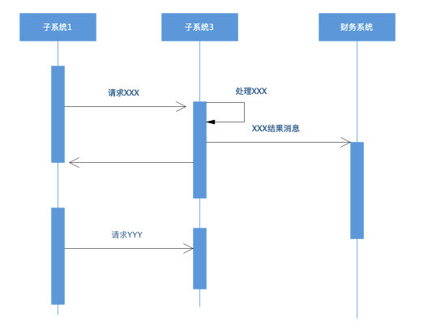
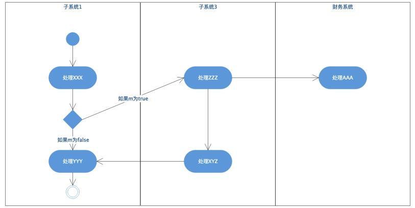
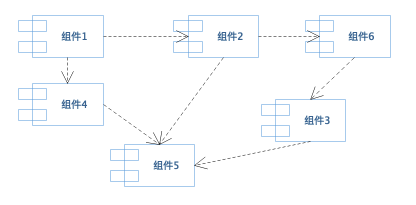
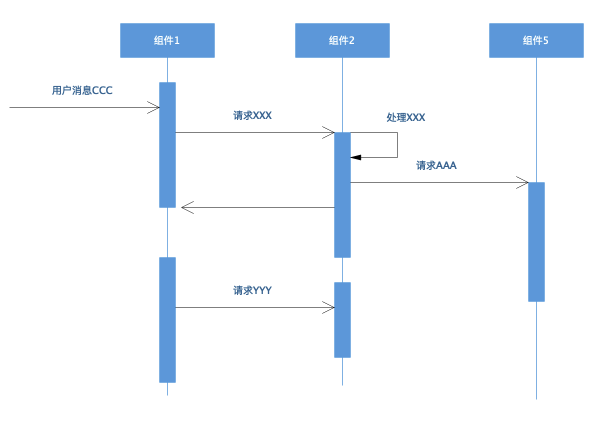
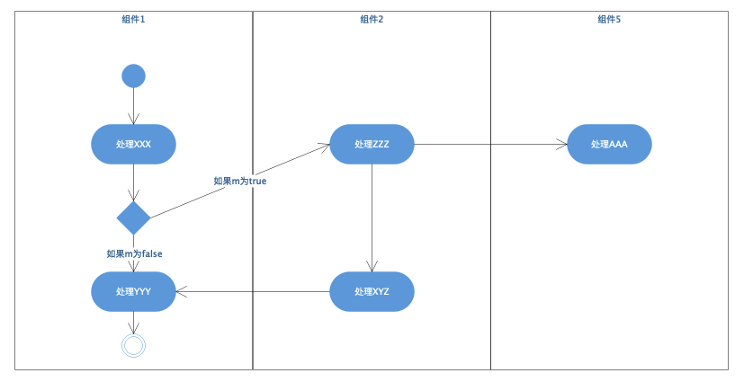
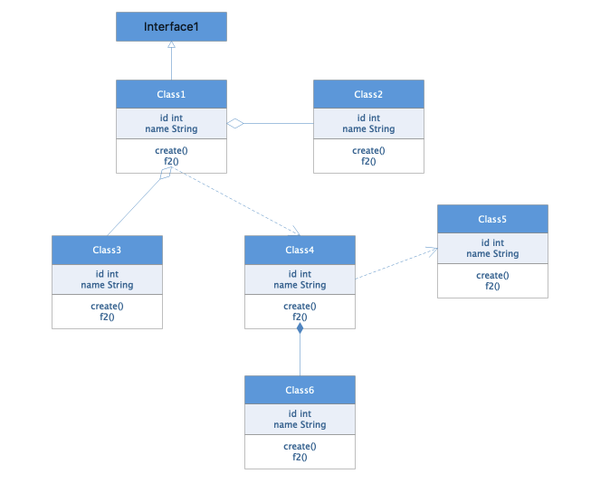
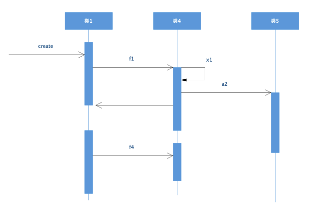
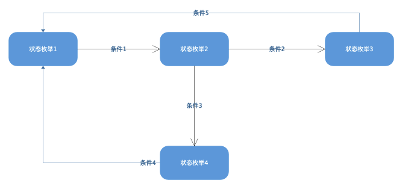

# 软件设计文档模板(Software Design Demo)

## 1 设计概述 

……系统是一个……的系统，是公司……战略的核心系统，承担着公司……的目标任务。 

### 1.1 功能概述 

系统主要功能包括……，使用者包括……。 

### 1.2 非功能约束

……系统未来预计一年用户量达到……，日订单量达到……，日 PV 达到……，图片数量达到……。 

1. 查询性能目标：平均响应时间 <300ms，95% 响应时间 <500ms，单机 TPS>100；
2. 下单性能目标：平均响应时间 <800ms，95% 响应时间 <1000ms，单机 TPS>30；
3. ……性能目标：平均响应时间 <800ms，95% 响应时间 <1000ms，单机 TPS>30；
4. 系统核心功能可用性目标：>99.97%； 
5. 系统安全性目标：系统可拦截…… 、……、……攻击，密码数据散列加密，客户端数据
   HTTPS 加密，外部系统间通信对称加密；
6. 数据持久化目标：>99.99999% 

## 2 系统部署图与整体设计

系统上线时预计部署……台物理机，……个子系统，和公司……系统交互，和外部第三方……个系统交互。

### 2.1 系统部署图 

子系统 1 的功能职责为……，部署……台服务器，依赖……和……子系统，实现 ……功能。

子系统 2 参照子系统 1 来写。 

### 2.2 下单场景子系统序列图 

1.下单时，子系统先发送……消息到子系统 3，子系统 3 需要执行……完成……处理，然后发送……消息到财务系统，消息中包含……数据。

2.收到……的处理结果……后，子系统 1 发送……消息到……子系统 2……。 

### 2.3 退款场景子系统序列图 

1.退款子系统先发送……消息到子系统 3，子系统 3 需要执行……完成……处理，然后发送……消息到财务系统，消息中包含……数据。

2.收到……的处理结果……后，子系统 1 发送……消息到……子系统 2……。 

### 2.4 退款场景子系统活动图 

如图所示：

1.退款开始时，子系统 1 处理 XXX，然后判断 m 的状态，如果 m 为真，请求子系统 3 处
理 ZZZ，如果 m 为假，子系统继续处理 ZZZ 并结束。

2.子系统 3 处理 ZZZ 后，一方面继续处理 XYZ，一方面将……消息发送给财务通进行
AAA 处理。

3.子系统在处理完 XYZ 后，返回子系统继续梳理 YYY，然后退款处理结束 

## 3 子系统 1 设计

子系统 1 的主要功能职责是……，其中主要包含了……组件。

### 3.1 子系统 1 组件图 

子系统 1 包含 6 个组件：

组件 1 的功能主要是……，需要依赖组件 2 完成……，是子系统 1 的核心组件，用户……请求主要通过组件 1 完成。

同样的，组件 2 也可以参照组件 1 来这样写。

#### 3.1.1 场景 A 组件序列图 

对于场景 A，首先组件 1 收到用户消息 CCC，然后组件 1 调用组件 2 的 XXX 方法……。

#### 3.1.2 场景 B 组件活动图 

在场景 B 中，首先组件收到……消息，开始处理……，然后判断……，如果为 true，那么……，如果为 false，那么……。

### 3.2 组件 1 设计

组件 1 的主要功能职责是……，其中主要包含了……类。

#### 3.2.1 组件 1 类图 

Class1 实现接口 Interface1，主要功能是……，Class1 聚合了 Class2 和 Class3，共同对外提供……服务，Class1 依赖 Class4 实现……功能，Class4……。

#### 3.2.2 场景 A 类序列图 

在场景 A 中，当外部应用调用类 1 的 create 方法时，类 1……。

#### 3.2.3 对象 1 状态图 

对象 1 运行时有 4 种状态，初始状态是状态 1，当条件 1 满足是，状态 1 转换为状态 2，当条件 3 满足时，状态 2 转换为状态 4……。

### 3.3 组件 2 设计

重复上面的格式。

## 4 子系统 2 设计

重复上面的格式。 

